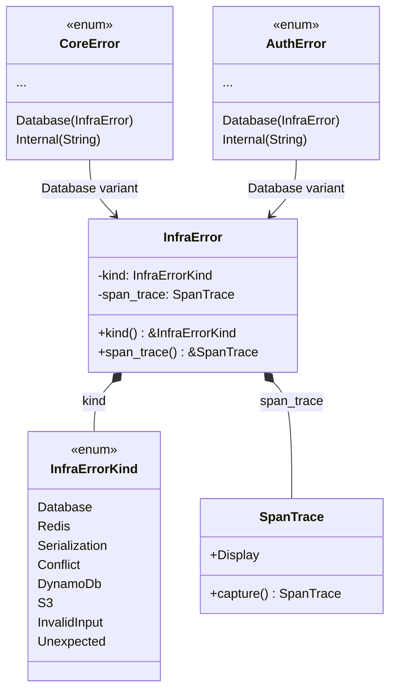
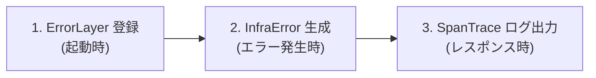
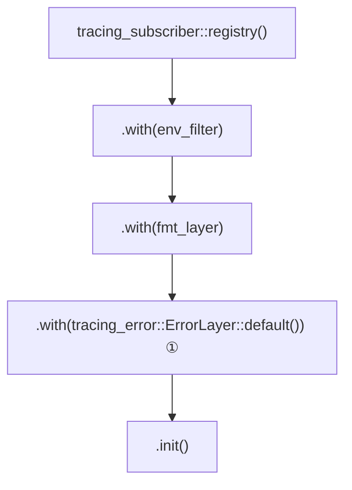
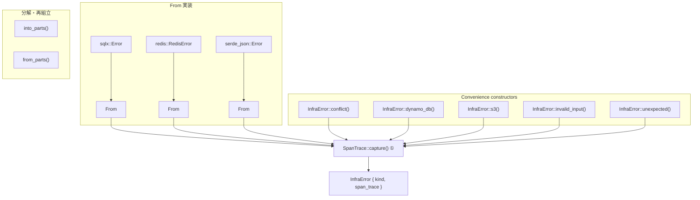
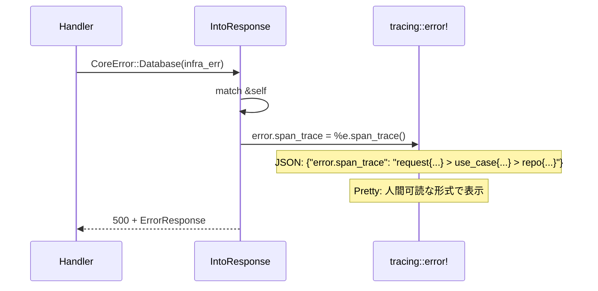
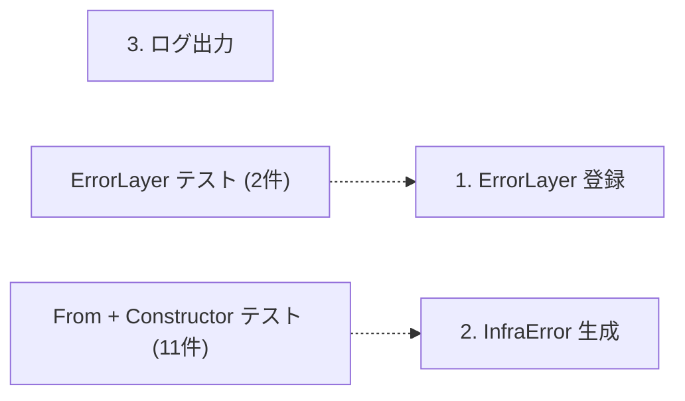

# SpanTrace 導入 - コード解説

対応 PR: #974
対応 Issue: #972

## 主要な型・関数

| 型/関数 | ファイル | 責務 |
|--------|---------|------|
| `InfraError` | [`backend/crates/infra/src/error.rs:42`](../../../backend/crates/infra/src/error.rs) | エラー種別と SpanTrace を保持する struct |
| `InfraErrorKind` | [`backend/crates/infra/src/error.rs:52`](../../../backend/crates/infra/src/error.rs) | エラーの具体的な種別を表す enum |
| `init_tracing()` | [`backend/crates/shared/src/observability.rs:89`](../../../backend/crates/shared/src/observability.rs) | ErrorLayer を含む tracing subscriber の初期化 |
| `CoreError::into_response()` | [`backend/apps/core-service/src/error.rs:41`](../../../backend/apps/core-service/src/error.rs) | SpanTrace をログ出力する IntoResponse 実装 |
| `AuthError::into_response()` | [`backend/apps/auth-service/src/error.rs:33`](../../../backend/apps/auth-service/src/error.rs) | SpanTrace をログ出力する IntoResponse 実装 |

### 型の関係



## コードフロー

コードをライフサイクル順に追う。アプリケーション起動時の ErrorLayer 登録から、エラー発生時の SpanTrace キャプチャ、最終的なログ出力まで。



### 1. ErrorLayer の登録（アプリケーション起動時）

`init_tracing()` で tracing subscriber に `ErrorLayer` を登録する。これが `SpanTrace::capture()` の前提条件。



```rust
// backend/crates/shared/src/observability.rs:106-111
tracing_subscriber::registry()
    .with(env_filter)
    .with(fmt_layer)
    .with(tracing_error::ErrorLayer::default())  // ①
    .init();
```

注目ポイント:

- ① `ErrorLayer` は subscriber のレイヤーとして登録する。これにより、各スパンの enter/exit イベントが `ErrorLayer` にも通知され、`SpanTrace::capture()` 呼び出し時にアクティブなスパン一覧を取得できるようになる

### 2. InfraError の生成（エラー発生時）

エラー生成の全経路で `SpanTrace::capture()` を自動実行する。3 つの経路がある。



```rust
// backend/crates/infra/src/error.rs:218-224
// From 実装の例（sqlx::Error）
impl From<sqlx::Error> for InfraError {
    fn from(source: sqlx::Error) -> Self {
        Self {
            kind:       InfraErrorKind::Database(source),
            span_trace: SpanTrace::capture(),  // ①
        }
    }
}
```

```rust
// backend/crates/infra/src/error.rs:150-158
// Convenience constructor の例（conflict）
pub fn conflict(entity: impl Into<String>, id: impl Into<String>) -> Self {
    Self {
        kind:       InfraErrorKind::Conflict {
            entity: entity.into(),
            id:     id.into(),
        },
        span_trace: SpanTrace::capture(),  // ①
    }
}
```

注目ポイント:

- ① `SpanTrace::capture()` はエラー生成の瞬間に呼ばれ、その時点でアクティブな全スパンを記録する。リポジトリメソッドが `#[instrument]` で計装されていれば、`request > use_case > repository` というスパンチェーンが記録される

### 3. SpanTrace のログ出力（レスポンス変換時）

`IntoResponse` 実装で、Database/Internal バリアントのエラーログに `error.span_trace` フィールドを追加する。



```rust
// backend/apps/core-service/src/error.rs:57-69
CoreError::Database(e) => {
    tracing::error!(
        error.category = "infrastructure",
        error.kind = "database",
        error.span_trace = %e.span_trace(),  // ①
        "データベースエラー: {}",
        e
    );
    (
        StatusCode::INTERNAL_SERVER_ERROR,
        ErrorResponse::internal_error(),
    )
}
```

```rust
// backend/apps/core-service/src/error.rs:70-83
CoreError::Internal(msg) => {
    let span_trace = tracing_error::SpanTrace::capture();  // ②
    tracing::error!(
        error.category = "infrastructure",
        error.kind = "internal",
        error.span_trace = %span_trace,
        "内部エラー: {}",
        msg
    );
    // ...
}
```

注目ポイント:

- ① `Database` バリアントは `InfraError` が既に SpanTrace を保持しているため、`e.span_trace()` で取得
- ② `Internal` バリアントは `String` のみを保持するため、`IntoResponse` 呼び出し時点で `SpanTrace::capture()` を実行。これにより Handler レベルのスパン情報は取得できる（ただし InfraError ほど深いスパンチェーンにはならない）

## テスト

各テストがコードフローのどのステップを検証しているかを示す。



| テスト | 検証対象のステップ | 検証内容 |
|-------|------------------|---------|
| `test_error_layer登録後にspan_traceがスパンを捕捉する` | 1 | ErrorLayer があれば SpanTrace がスパン名を含む |
| `test_error_layerなしでspan_traceが空トレースを返す` | 1 | ErrorLayer なしでは SpanTrace が空 |
| `test_from_sqlx_errorでspan_traceがキャプチャされる` | 2 | From<sqlx::Error> で SpanTrace が自動キャプチャ |
| `test_from_serde_json_errorでspan_traceがキャプチャされる` | 2 | From<serde_json::Error> で SpanTrace が自動キャプチャ |
| `test_conflictでspan_traceがキャプチャされる` | 2 | conflict() で SpanTrace が自動キャプチャ |
| `test_dynamo_dbでspan_traceがキャプチャされる` | 2 | dynamo_db() で SpanTrace が自動キャプチャ |
| `test_s3でspan_traceがキャプチャされる` | 2 | s3() constructor のテスト |
| `test_invalid_inputでspan_traceがキャプチャされる` | 2 | invalid_input() constructor のテスト |
| `test_unexpectedでspan_traceがキャプチャされる` | 2 | unexpected() constructor のテスト |
| `test_displayがinfra_error_kindのメッセージを出力する` | 2 | Display が InfraErrorKind に委譲 |
| `test_sourceがinfra_error_kindに委譲する` | 2 | Error::source() が InfraErrorKind に委譲 |
| `test_kindでinfra_error_kindにアクセスできる` | 2 | kind() メソッドの動作確認 |
| `test_as_conflictでconflictの情報を取得できる` | 2 | as_conflict() ヘルパーの動作確認 |

### 実行方法

```bash
# InfraError のテスト
cargo test -p ringiflow-infra --lib error::tests

# ErrorLayer のテスト
cargo test -p ringiflow-shared --lib observability::tests::test_error_layer
```

## 依存関係

| クレート | バージョン | 追加理由 |
|---------|-----------|---------|
| `tracing-error` | `0.2.1` | `ErrorLayer` と `SpanTrace` を提供 |

## 設計解説

コード実装レベルの判断を記載する。機能・仕組みレベルの判断は[機能解説](./01_SpanTrace導入_機能解説.md#設計判断)を参照。

### 1. struct wrapper パターンの採用

場所: `backend/crates/infra/src/error.rs:42-45`

```rust
pub struct InfraError {
    kind:       InfraErrorKind,
    span_trace: SpanTrace,
}
```

なぜこの実装か:
`std::io::Error` と同じパターンで、エラー種別（enum）とメタデータ（SpanTrace）を分離する。thiserror の `#[from]` は enum バリアントにのみ機能するため、struct wrapper を使い手動の `From` 実装で `SpanTrace::capture()` を組み込む。

代替案:

| 案 | メリット | デメリット | 判断 |
|----|---------|-----------|------|
| struct wrapper（`std::io::Error` パターン） | SpanTrace を全バリアントに統一的に付与、標準ライブラリの実績あるパターン | パターンマッチが `err.kind()` 経由に変更 | 採用 |
| enum の各バリアントに SpanTrace フィールド追加 | 既存のパターンマッチがそのまま使える | 全バリアントに SpanTrace フィールドを追加する冗長性、thiserror の `#[from]` が使えない | 見送り |

### 2. パターンマッチの移行方式

場所: ユースケース層の全 `match` 式

```rust
// Before
match err {
    InfraError::Conflict { entity, id } => { /* ... */ }
    _ => { /* ... */ }
}

// After
match err.kind() {
    InfraErrorKind::Conflict { entity, id } => { /* ... */ }
    _ => { /* ... */ }
}
```

なぜこの実装か:
`kind()` は `&InfraErrorKind` を返すため、パターンマッチで borrow しつつ、別の arm で `err` の所有権を move できる。`as_conflict()` ヘルパーは、`kind()` で borrow → 別 arm で `self` を move する際の所有権の競合を回避するために追加した。

### 3. Internal バリアントの SpanTrace キャプチャ方式

場所: `backend/apps/core-service/src/error.rs:70-83`

```rust
CoreError::Internal(msg) => {
    let span_trace = tracing_error::SpanTrace::capture();
    tracing::error!(error.span_trace = %span_trace, "内部エラー: {}", msg);
}
```

なぜこの実装か:
`CoreError::Internal(String)` は `InfraError` を経由しないため、SpanTrace を保持していない。`IntoResponse` 呼び出し時点で `SpanTrace::capture()` を実行することで、Handler レベルまでのスパン情報を取得する。infra 層のスパンは含まれないが、「どのハンドラで発生したか」は特定可能。

## 関連ドキュメント

- [機能解説](./01_SpanTrace導入_機能解説.md)
- [Observability 設計](../../03_詳細設計書/14_Observability設計.md)
- [Observability 構造的担保](../PR697_Observability構造的担保/)
