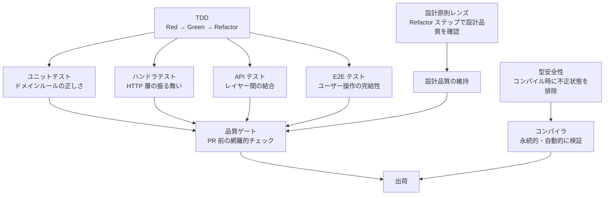

# 開発哲学

このドキュメントは、ringiflow の開発で何を考え、なぜそう判断しているかを伝えるものである。個別のルールや設計判断の根底にある考え方をまとめた。

## 出発点: 職業倫理としてのトレードオフの追求

商用ソフトウェアを作る以上、その品質に責任を持つ。これは職業倫理の問題である。

ここでいう品質への責任とは、トレードオフを真剣に分析し、合理的な選択をすることを指す。どの手段がどのコストで何を防ぐのかを理解し、最も効率の良い組み合わせを選ぶ — その判断の質に責任を持つということである。

ringiflow にはもう一つの理念として「学習効果の最大化」がある（[コア要件 CORE-02](01_コア要件.md#core-02-プロジェクト概要)）。こちらは個人の動機であり、職業倫理とは独立した出発点である。

## トレードオフ分析: バグ防止のコスト構造

トレードオフ分析の第一歩として、バグ防止の手段ごとのコスト構造を整理する。

| 手段 | 初期コスト | 維持コスト | 検証の持続性 |
|------|-----------|-----------|------------|
| 型安全性 | 型設計のコスト | ほぼゼロ（コンパイラが自動検証） | コードが存在する限り永続 |
| テスト | テスト記述のコスト | 継続的（保守、壊れたら修正、リファクタリング追従） | テストを維持する限り |
| コードレビュー | レビュアーの時間 | 毎回（人間の注意力に依存） | その場限り |

型は一度定義すれば、コンパイラが永続的に検証し続ける。テストは書き、維持し、壊れたら直すコストが継続的にかかる。レビューは人間の注意力に依存し、スケールしない。

型安全性はバグ防止手段の中で、維持コストが最も低い。

## トレードオフ分析: 保守コストの構造

バグ防止は品質の一面にすぎない。ソフトウェアの総コストの大部分は初期開発ではなく保守に費やされる。コードは書く時間より読む時間のほうが圧倒的に長い。

保守コストを左右する要因:

| 要因 | コストが高い状態 | コストが低い状態 |
|------|----------------|----------------|
| 読みやすさ | 意図を読み取るのに推測が必要 | コードが意図を語る |
| 変更容易性 | 1 箇所の変更が広範囲に波及する | 変更の影響が局所に閉じる |
| 責務の明確さ | どこを変えればいいかわからない | 変更箇所が自明 |
| 判断の記録 | 過去の判断理由が不明で再議論が起きる | ADR を読めば経緯がわかる |

設計品質への投資は、バグ防止と同じく**初期コストで継続的なリターンを得る**構造を持つ。責務を分離しておけば、変更のたびに全体を理解し直す必要がない。命名を正確にしておけば、読むたびにコメントや git blame を辿る必要がない。

バグ防止（守りの品質）と設計品質（攻めの品質）は独立した投資ではない。責務が明確なコードはバグが入りにくく、型安全なコードは変更時の影響範囲が明確になる。両者は相互に強化し合う。

## なぜ型安全性か

### 状態管理での威力

型安全性の価値が最も顕著に現れるのは状態管理である。

状態管理は組み合わせが爆発する。「ステータスが A のときだけフィールド X が有効」「状態 B では操作 Y を許可しない」— こうした制約をテストで網羅するのは現実的でない。

型安全ステートマシン（[ADR-054](../70_ADR/054_型安全ステートマシンパターンの標準化.md)）を使えば、不正な状態をコンパイル時に排除できる。不正な状態遷移がコード上**表現不可能**になる。

### 強い型システムを選んだなら

ringiflow はバックエンドに Rust、フロントエンドに Elm を採用している。どちらも強力な型システムを持つ言語である。

強い型システムの言語を選んだなら、その力を使い切るのが合理的である。Newtype で意味のある型を定義し（[ADR-016](../70_ADR/016_プリミティブ型のNewtype化方針.md)）、型安全ステートマシンで状態遷移を制約し、`Option` / `Maybe` の意味を型で明確にする — これらは言語が提供する能力を自然に使っているだけである。

### 型だけでは防げないもの

型安全性は万能ではない。以下は型だけでは防げない:

- ビジネスルールの正しさ（「承認者は申請者と異なる人物でなければならない」）
- レイヤー間のデータフローの整合性
- 外部システムとの統合の正しさ
- UI 操作の完結性

これらを補完するのがテスト戦略（[テスト戦略概要](../50_テスト/00_テスト戦略概要.md)）であり、品質ゲート（[品質チェックリスト](../../.claude/rules/dev-flow-issue.md#62-品質チェックリスト)）である。型・テスト・レビューは排他的な選択肢ではなく、それぞれが異なる領域をカバーする防御層である。

## 「及第点」の定義

ringiflow が目指す品質水準を「及第点」と呼んでいる。商用アプリケーションとして当然必要な品質水準であり、トレードオフ分析に基づいて選択した具体的な内容は以下の通りである。

守りの品質（バグ防止）:
- 型で防げるバグは型で防ぐ — Newtype、型安全ステートマシン、構造的強制
- テストで防ぐべきバグはテストで防ぐ — テストピラミッドの各層で責務を分担

攻めの品質（保守性）:
- コードの意図を明確にする — 命名、責務分離、依存方向の制御
- 設計判断は記録する — ADR で選択肢・理由・トレードオフを残す

両者を支えるプロセス:
- 品質プロセスは体系的に運用する — TDD、設計原則レンズ、品質ゲート、ギャップ発見の観点

これらはトレードオフ分析の結果として選択した、商用品質を維持するための投資である。

## 品質プロセスの全体像

各プロセスは独立した儀式ではなく、守りの品質（バグ防止）と攻めの品質（保守性）の両方を実現するために連携している。

| プロセス | 守り（バグ防止） | 攻め（保守性） | コスト特性 |
|---------|----------------|---------------|-----------|
| 型安全性 | 不正な状態、型の不整合 | 変更時の影響範囲の明確化 | 初期のみ。以降はコンパイラが自動検証 |
| TDD | ロジックの誤り、仕様との乖離 | テストが仕様のドキュメントになる | 継続的。だが仕様変更の検知手段にもなる |
| 設計原則レンズ | — | 設計の劣化、責務の混在を検出 | Refactor ステップに組み込まれており追加コストは小さい |
| 品質ゲート | 見落とし、チェック漏れ | 守りと攻めの両面を網羅的に確認 | PR ごと。チェックリストで体系的に実施 |

## 設計原則

以下の原則は、守りと攻めの両面から保守コストを最小化するために導かれる。

| 原則 | 守り（バグ防止） | 攻め（保守性） |
|------|----------------|---------------|
| シンプルさを保つ（KISS） | 複雑さはバグの温床 | 読む・変更する際の認知コストを下げる |
| 型で表現できるものは型で表現する | 不正な状態を排除 | 変更時にコンパイラが影響範囲を教える |
| 責務を明確に分離する | バグの影響範囲を限定 | 変更箇所が自明になる |
| 依存関係の方向を意識する | 依存方向の違反がバグを生む | 変更の波及を構造的に制御する |
| 過度な抽象化を避ける | 誤った抽象化がバグを誘発 | 不要な間接層は読みにくさの原因 |

## 技術選定との一貫性

| 選定 | 守り（バグ防止） | 攻め（保守性） |
|------|----------------|---------------|
| Rust | 型安全性 + メモリ安全性。コンパイラが多くのバグを防ぐ | 所有権システムがリソース管理の正しさを構造的に保証する |
| Elm | ランタイムエラーが原理的に発生しない | TEA パターンで状態管理が一元化され、変更の影響を追いやすい |
| TDD | テストが先にあることで、仕様とコードの乖離を構造的に防ぐ | Refactor ステップが設計品質を継続的に改善する機会を作る |
| ADR | 過去に却下した選択肢の再採用を防ぐ | 判断の経緯が残り、変更時の意思決定コストを下げる |

技術選定から開発プロセスまで、守りと攻めの両面で「どの手段が最もコスト効率よく品質を担保するか」というトレードオフ分析の結果として選択している。

---

## 変更履歴

| 日付 | 変更内容 |
|------|---------|
| 2026-03-05 | 初版作成 |
