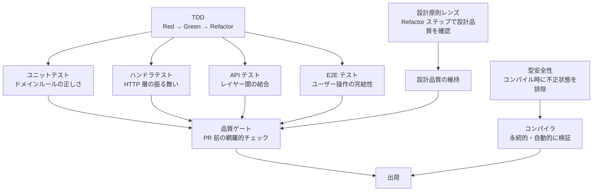

# 開発哲学

このドキュメントは、ringiflow の開発で何を考え、なぜそう判断しているかを伝えるものである。個別のルールや設計判断の根底にある考え方をまとめた。

## 出発点: 職業倫理としてのトレードオフの追求

商用ソフトウェアを作る以上、その品質に責任を持つ。これは職業倫理の問題である。

ここでいう品質への責任とは、「バグをゼロにする」ことではない。トレードオフを真剣に分析し、合理的な選択をすることを指す。どの手段がどのコストで何を防ぐのかを理解し、最も効率の良い組み合わせを選ぶ — その判断の質に責任を持つということである。

ringiflow にはもう一つの理念として「学習効果の最大化」がある（[コア要件 CORE-02](01_コア要件.md#core-02-プロジェクト概要)）。こちらは個人の動機であり、職業倫理とは独立した出発点である。品質の追求は職業倫理から、学習効果の最大化は個人の動機から。両者はこのプロジェクトを駆動する二つの独立した力である。

## トレードオフ分析: バグ防止のコスト構造

トレードオフ分析の第一歩として、バグ防止の手段ごとのコスト構造を整理する。

| 手段 | 初期コスト | 維持コスト | 検証の持続性 |
|------|-----------|-----------|------------|
| 型安全性 | 型設計のコスト | ほぼゼロ（コンパイラが自動検証） | コードが存在する限り永続 |
| テスト | テスト記述のコスト | 継続的（保守、壊れたら修正、リファクタリング追従） | テストを維持する限り |
| コードレビュー | レビュアーの時間 | 毎回（人間の注意力に依存） | その場限り |

型は一度定義すれば、コンパイラが永続的に検証し続ける。テストは書き、維持し、壊れたら直すコストが継続的にかかる。レビューは人間の注意力に依存し、スケールしない。

型安全性はバグ防止手段の中で、維持コストが最も低い。

## なぜ型安全性か

### 状態管理での威力

型安全性の価値が最も顕著に現れるのは状態管理である。

状態管理は組み合わせが爆発する。「ステータスが A のときだけフィールド X が有効」「状態 B では操作 Y を許可しない」— こうした制約をテストで網羅するのは現実的でない。

型安全ステートマシン（[ADR-054](../70_ADR/054_型安全ステートマシンパターンの標準化.md)）を使えば、不正な状態をコンパイル時に排除できる。テストを 1 行も書かずに、不正な状態遷移が**存在しえない**コードになる。

### 強い型システムを選んだなら

ringiflow はバックエンドに Rust、フロントエンドに Elm を採用している。どちらも強力な型システムを持つ言語である。

強い型システムの言語を選び、型を活かさないのは機会損失でしかない。Newtype で意味のある型を定義し（[ADR-016](../70_ADR/016_プリミティブ型のNewtype化方針.md)）、型安全ステートマシンで状態遷移を制約し、`Option` / `Maybe` の意味を型で明確にする — これらは言語が提供する能力を自然に使っているだけである。

### 型だけでは防げないもの

型安全性は万能ではない。以下は型だけでは防げない:

- ビジネスルールの正しさ（「承認者は申請者と異なる人物でなければならない」）
- レイヤー間のデータフローの整合性
- 外部システムとの統合の正しさ
- UI 操作の完結性

これらを補完するのがテスト戦略（[テスト戦略概要](../50_テスト/00_テスト戦略概要.md)）であり、品質ゲート（[品質チェックリスト](../../.claude/rules/dev-flow-issue.md#62-品質チェックリスト)）である。型・テスト・レビューは排他的な選択肢ではなく、それぞれが異なる領域をカバーする防御層である。

## 「及第点」の定義

ringiflow の品質水準は「最高品質」ではなく「及第点」を目指している。ここでの「及第点」とは、商用アプリケーションとして当然必要な品質水準を指す。

具体的には:

- **型で防げるバグは型で防ぐ** — Newtype、型安全ステートマシン、構造的強制
- **テストで防ぐべきバグはテストで防ぐ** — テストピラミッドの各層で責務を分担
- **設計判断は記録する** — ADR で選択肢・理由・トレードオフを残す
- **品質プロセスは体系的に運用する** — TDD、品質ゲート、ギャップ発見の観点

これらは「やりすぎ」ではなく、商用品質を維持するための合理的な投資である。

## 品質プロセスの全体像

各プロセスは独立した儀式ではなく、バグ防止という目的のもとに連携している。

| プロセス | 防ぐもの | コスト特性 |
|---------|---------|-----------|
| 型安全性 | 不正な状態、型の不整合 | 初期のみ。以降はコンパイラが自動検証 |
| TDD | ロジックの誤り、仕様との乖離 | 継続的。だがテストは仕様のドキュメントにもなる |
| 設計原則レンズ | 設計の劣化、責務の混在 | Refactor ステップに組み込まれており追加コストは小さい |
| 品質ゲート | 見落とし、チェック漏れ | PR ごと。チェックリストで体系的に実施 |

## 設計原則

以下の原則は、上記の哲学から自然に導かれる。

- **シンプルさを保つ（KISS）** — 複雑さはバグの温床。必要十分な複雑さに留める
- **型で表現できるものは型で表現する** — 不正な状態を表現不可能にする。最もコスト効率が良い
- **責務を明確に分離する** — 責務が混在するとバグの影響範囲が広がる
- **依存関係の方向を意識する** — 詳細が抽象に依存する構造で変更の波及を制御する
- **過度な抽象化を避ける** — 3 回繰り返すまでは重複を許容する。早すぎる抽象化は誤った抽象化

## 技術選定との一貫性

| 選定 | 理由 |
|------|------|
| Rust | 型安全性 + メモリ安全性。コンパイラが多くのバグを防ぐ |
| Elm | ランタイムエラーが原理的に発生しない。型で UI の状態管理を制御できる |
| TDD | テストが先にあることで、仕様とコードの乖離を構造的に防ぐ |
| ADR | 判断の記録が、同じ失敗の繰り返しを防ぐ |

技術選定から開発プロセスまで、「どの手段が最もコスト効率よく品質を担保するか」というトレードオフ分析の結果として選択している。

---

## 変更履歴

| 日付 | 変更内容 |
|------|---------|
| 2026-03-05 | 初版作成 |
