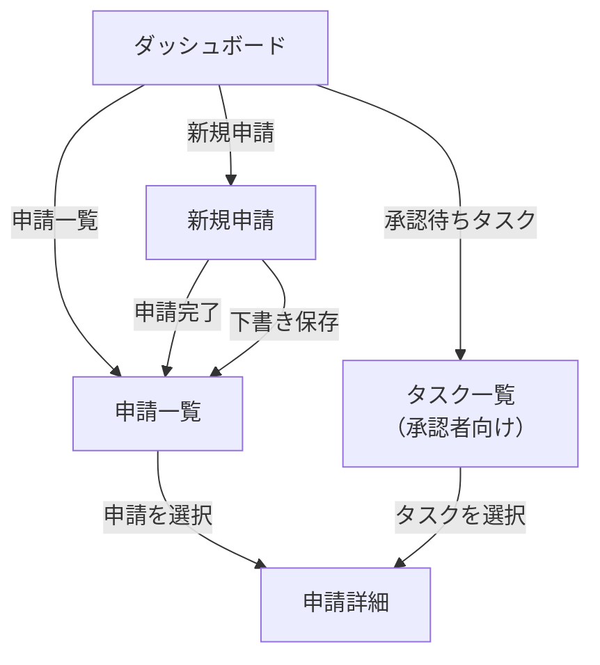
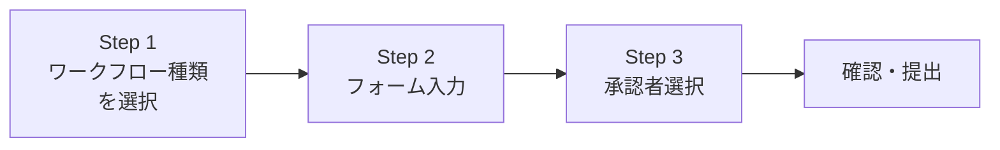
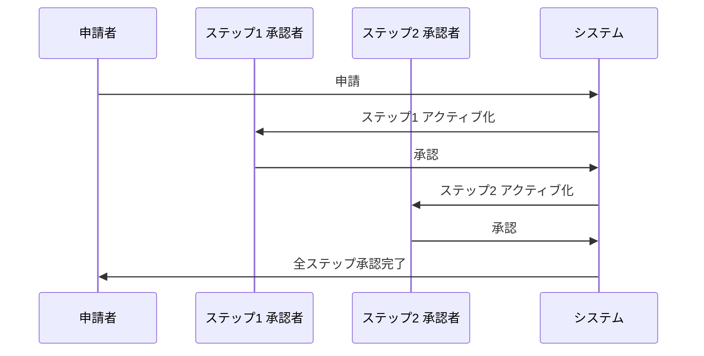
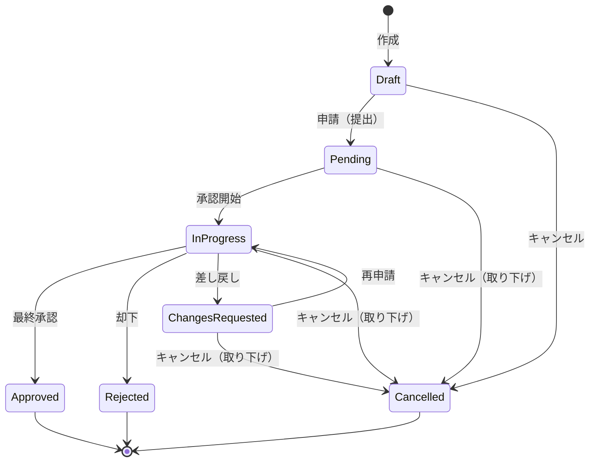
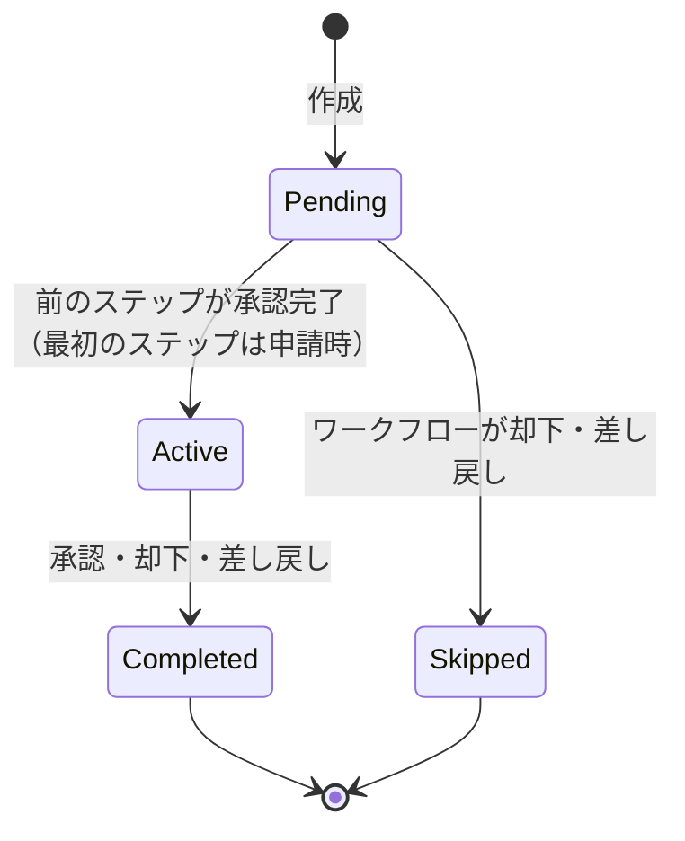
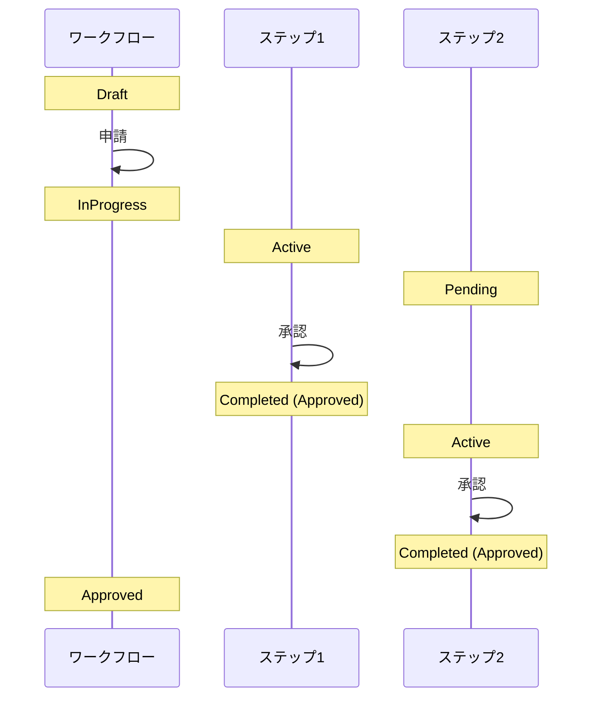
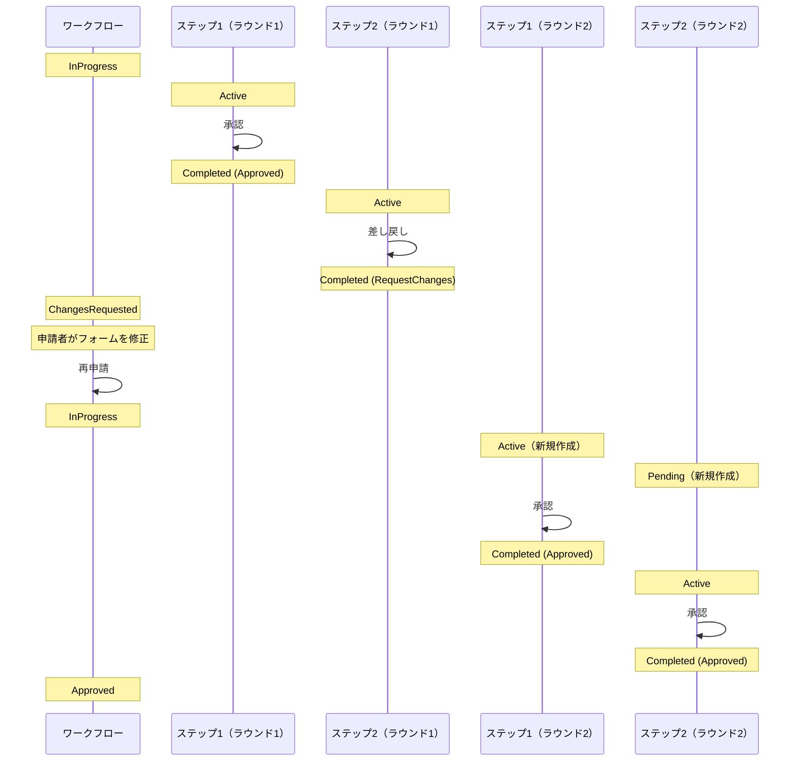

# ワークフロー管理 機能仕様書

## 1. 概要

ワークフロー管理は、RingiFlow の中核機能である。ユーザーは業務上の申請（経費精算、休暇申請、稟議など）をシステム上で作成・提出し、定められた承認フローに沿って処理を進める。

### 目的

- 申請者: 業務申請をオンラインで作成・提出し、進捗を確認できる
- 承認者: 自分に割り当てられた申請を承認・却下・差し戻しできる
- 管理者: ワークフローのテンプレートを定義・管理できる

### 対象ユーザー

| ロール | この機能での役割 |
|--------|---------------|
| 一般ユーザー（申請者） | 申請の作成・提出・取り下げ、進捗確認、差し戻し後の修正・再申請 |
| 一般ユーザー（承認者） | 承認・却下・差し戻し、コメント投稿 |
| テナント管理者 | ワークフロー定義の作成・管理 |

### 関連する機能要件

`[SECTION_ID: CORE-04]` 4.2 ワークフロー管理機能（WF-001〜WF-006, WF-101〜WF-106）

## 2. シナリオ

### シナリオ 1: 経費精算の申請（申請者: 田中さん）

田中さんは営業部の社員で、先週の出張の交通費を精算したい。

1. ダッシュボードの「新規申請」ボタンをクリックする
2. ワークフロー種類の一覧が表示される。「経費精算申請」を選択する
3. 申請フォームが表示される。タイトル「出張交通費（大阪→東京）」を入力し、金額（15,000円）、発生日、経費種別（交通費）、説明を入力する
4. 承認者として直属の上長・鈴木さんを検索・選択する
5. 内容を確認し、「申請する」ボタンをクリックする
6. 「申請が完了しました」というメッセージが表示される
7. 申請一覧で、自分の申請が「承認中」ステータスで表示されていることを確認する

### シナリオ 2: 申請の承認（承認者: 鈴木さん）

鈴木さんは田中さんの上長で、経費精算の承認権限を持っている。

1. ダッシュボードに「承認待ちタスク: 1件」と表示されている
2. タスク一覧を開くと、田中さんの「出張交通費（大阪→東京）」が表示される
3. 詳細を開くと、申請内容（金額、日付、説明）とフォームデータが確認できる
4. 内容に問題がないので、コメント欄に「確認しました」と入力し、「承認」ボタンをクリックする
5. ワークフローのステータスが「承認済み」に変わる

### シナリオ 3: 申請の却下と再申請（承認者: 鈴木さん、申請者: 田中さん）

1. 鈴木さんが田中さんの経費申請を確認したところ、領収書が添付されていない
2. コメント「領収書を添付してください」を入力し、「却下」ボタンをクリックする
3. 田中さんに却下通知が届く
4. 田中さんは却下された申請の詳細を確認し、却下理由を読む
5. 新しい申請を作成し、今度は領収書を添付して再申請する

### シナリオ 4: 下書き保存（申請者: 田中さん）

1. 田中さんは経費精算の申請フォームに入力を始めたが、領収書の金額を確認する必要がある
2. 途中まで入力した内容を「下書き保存」する
3. 翌日、申請一覧から「下書き」ステータスの申請を開き、入力を再開する
4. 金額を修正し、「申請する」ボタンで提出する

### シナリオ 5: 2段階承認の高額経費精算（申請者: 田中さん、1次承認者: 鈴木さん、2次承認者: 山田部長）

田中さんが高額な経費精算（50万円）を申請する。この申請は金額が大きいため、直属上長の鈴木さんと部長の山田さんの2段階承認が必要。

1. 田中さんがワークフロー種類「高額経費精算申請」を選択する
2. 申請フォームに金額（500,000円）と内容を入力する
3. ワークフロー定義に基づき、承認ステップが自動で2段階に設定される（1次: 鈴木さん、2次: 山田部長）
4. 「申請する」ボタンをクリックする
5. 鈴木さんのタスク一覧に承認待ちタスクが表示される
6. 鈴木さんが内容を確認し「承認」をクリックする。ステータスは引き続き「承認中」
7. 山田部長のタスク一覧に承認待ちタスクが表示される
8. 山田部長が内容を確認し「承認」をクリックする
9. 全ステップが承認完了し、ワークフロー全体が「承認済み」になる
10. 田中さんの申請一覧で「承認済み」と表示される

### シナリオ 6: 差し戻しと再申請（2次承認者: 山田部長、申請者: 田中さん）

シナリオ 5 の続き。山田部長が1次承認済みの申請を確認したところ、内容に不備がある。

1. 山田部長が申請詳細を確認し、金額の内訳が不明確だと判断する
2. コメント「内訳の詳細を追記してください」を入力し、「差し戻し」ボタンをクリックする
3. ワークフローのステータスが「要修正」に変わる
4. 田中さんの申請一覧に「要修正」ステータスの申請が表示される
5. 田中さんが申請を開くと、差し戻しコメント「内訳の詳細を追記してください」が表示される
6. 田中さんがフォームデータを修正し、「再申請する」ボタンをクリックする
7. 承認フローがステップ1（鈴木さん）から再開される
8. 鈴木さんが再度承認し、山田部長が再度承認すると「承認済み」になる

### シナリオ 7: コメントでのやり取り（承認者: 鈴木さん、申請者: 田中さん）

承認プロセス中に、承認者と申請者がコメントで質問・回答のやり取りを行う。

1. 鈴木さんが田中さんの申請詳細を開く
2. 承認前に確認したいことがあり、コメント欄に「交通手段はタクシーですか？」と入力して「コメント投稿」をクリックする
3. 田中さんが申請詳細を開くと、鈴木さんのコメントが表示される
4. 田中さんがコメント欄に「電車です。領収書を添付しています」と入力して投稿する
5. 鈴木さんが田中さんの回答を確認し、問題ないので「承認」をクリックする

## 3. 画面・操作フロー

### 全体フロー

### 新規申請フォームの操作ステップ

1. ワークフロー種類の選択 — テナントで定義済みのワークフロー一覧から選択
2. フォーム入力 — 選択したワークフロー種類に応じた動的フォームに入力
3. 承認者選択 — ワークフロー定義に基づき、各承認ステップの承認者を指定する。1段階承認なら1名、多段階承認なら各ステップに1名ずつ選択する
4. 確認・提出 — 内容を確認し、下書き保存または申請

## 4. 機能詳細

### 4.1 ワークフロー申請

#### 新規申請の作成

ユーザーは新規申請を作成できる。申請フォームはワークフロー定義（テンプレート）に基づいて動的に生成される。

入力項目:

| 項目 | 必須 | 制約 | 説明 |
|------|------|------|------|
| ワークフロー種類 | はい | テナントで定義済みの種類から選択 | 選択に応じてフォームが切り替わる |
| タイトル | はい | 1〜200 文字 | 申請の件名 |
| フォームフィールド | 定義による | ワークフロー定義で指定 | 後述「動的フォームフィールド」参照 |
| 承認者 | はい | テナント内のユーザーから選択 | 各承認ステップに1名ずつ指定。検索で絞り込み可能 |

#### 動的フォームフィールド

ワークフロー定義に基づき、以下のフィールドタイプが動的に表示される。

| フィールドタイプ | 表示 | バリデーション |
|----------------|------|--------------|
| テキスト（text） | テキスト入力欄 | 最小/最大文字数 |
| 複数行テキスト（textarea） | テキストエリア | 最大文字数 |
| 数値（number） | 数値入力欄 | 最小値/最大値 |
| 選択（select） | ドロップダウン | 選択肢から1つ |
| ラジオボタン（radio） | ラジオグループ | 選択肢から1つ |
| チェックボックス（checkbox） | チェックボックスグループ | 複数選択可 |
| 日付（date） | 日付ピッカー | 日付範囲 |
| 日時（datetime） | 日時ピッカー | 日時範囲 |
| ファイル（file） | ファイル選択 | ファイル形式、最大サイズ |

各フィールドの必須/任意はワークフロー定義で指定される。必須フィールドにはラベルに「*」マークが付く。

#### バリデーションとエラーメッセージ

バリデーションは申請ボタン押下時に実行される。エラーがある場合はフィールドの直下に赤字でメッセージが表示される。

| 状況 | エラーメッセージ |
|------|----------------|
| 必須フィールドが空 | 「必須項目です」 |
| テキストが最小文字数未満 | 「最低 N 文字必要です」 |
| テキストが最大文字数超過 | 「最大 N 文字までです」 |
| 数値が範囲外 | 「N 以上 M 以下で入力してください」 |
| ファイルサイズ超過 | 「ファイルサイズは N MB 以下にしてください」 |
| ファイル形式不正 | 「許可されたファイル形式: [形式一覧]」 |

注意: 下書き保存時は、タイトルのみ必須。フォームフィールドのバリデーションは申請時にのみ実行される。

### 4.2 申請一覧

自分が作成した申請の一覧を表示する。

表示項目:

| カラム | 説明 |
|--------|------|
| タイトル | 申請の件名（リンク: 詳細画面へ遷移） |
| ステータス | 現在の状態（色分けバッジで表示） |
| 申請日 | 申請（提出）した日時。下書きの場合は作成日 |

フィルタ:

| フィルタ | 選択肢 |
|---------|--------|
| ステータス | すべて / 下書き / 承認中 / 要修正 / 承認済み / 却下 / キャンセル |

#### ステータスバッジの表示

| ステータス | 日本語表示 | バッジの色 |
|-----------|-----------|----------|
| Draft | 下書き | グレー |
| Pending | 申請待ち | 黄色 |
| InProgress | 承認中 | 青 |
| ChangesRequested | 要修正 | オレンジ |
| Approved | 承認済み | 緑 |
| Rejected | 却下 | 赤 |
| Cancelled | キャンセル | グレー |

### 4.3 申請詳細

申請の詳細情報を表示する。

表示セクション:

1. 基本情報 — タイトル、ステータス、申請者、申請日、作成日、更新日
2. フォームデータ — 入力されたフォームの内容（フィールドラベルと値をペアで表示）
3. 承認ステップ — 各ステップの承認者、ステータス、判定（承認/却下/差し戻し）、コメント。現在のアクティブステップが視覚的に強調される
4. コメント — ワークフローに対するコメントスレッド（時系列表示）

承認者向けアクション（自分がアクティブなステップの承認者の場合）:

| アクション | ボタン表示 | 説明 |
|-----------|----------|------|
| 承認 | 「承認」 | このステップを承認する。最終ステップの場合はワークフロー全体が承認完了 |
| 却下 | 「却下」 | このステップを却下する。ワークフロー全体が却下される |
| 差し戻し | 「差し戻し」 | 申請者に差し戻す。申請者が内容を修正して再申請できる |

承認・却下・差し戻し時にはコメント（任意、最大 1,000 文字）を入力できる。

申請者向けアクション（ステータスが「要修正」で、自分が申請者の場合）:

| アクション | ボタン表示 | 説明 |
|-----------|----------|------|
| フォーム修正 | フォームフィールドが編集可能になる | 差し戻しコメントを踏まえて内容を修正する |
| 再申請 | 「再申請する」 | 修正した内容で承認フローをステップ1から再開する |

### 4.4 下書き管理

下書きとして保存された申請は、後から編集・提出できる。

| 操作 | 説明 |
|------|------|
| 下書き保存 | 申請フォームの入力途中の内容を保存する |
| 下書きの編集 | 申請一覧から下書きを開き、入力を再開する |
| 下書きの申請 | 編集後に「申請する」で提出する |

### 4.5 承認・却下

承認者は、自分に割り当てられたアクティブなステップに対して承認または却下を行う。

前提条件:
- ワークフローのステータスが「承認中（InProgress）」である
- 承認ステップのステータスが「アクティブ（Active）」である
- 操作者がそのステップの承認者として割り当てられている

#### 承認時の動作

1. 現在のステップが「完了」になる（判定: 承認）
2. 次のステップがある場合: 次のステップが「アクティブ」になり、次の承認者にタスクが割り当てられる
3. 最終ステップの場合: ワークフロー全体が「承認済み」になる

#### 却下時の動作

1. 現在のステップが「完了」になる（判定: 却下）
2. 残りの未処理ステップが「スキップ」になる
3. ワークフロー全体が「却下」になる

#### 多段階承認の進行

多段階承認では、ステップが定義された順序で順次実行される。

各ステップの承認者は、前のステップが承認されるまでアクションを取れない。

#### 競合時の動作

複数の操作が同時に行われた場合（例: 申請者が取り下げ中に承認者が承認）、先に処理された操作が優先される。後発の操作には以下のエラーが表示される:

> このワークフローは既に更新されています。最新の状態を取得してください。

「再読み込み」ボタンで最新の状態を取得できる。

### 4.6 差し戻し

承認者は、承認・却下の代わりに申請を差し戻すことができる。差し戻しにより、申請者が内容を修正して再申請できる。

#### 差し戻し時の動作

1. 現在のステップが「完了」になる（判定: 差し戻し）
2. 残りの未処理ステップが「スキップ」になる
3. ワークフロー全体のステータスが「要修正（ChangesRequested）」になる
4. 申請者の申請一覧で「要修正」ステータスが表示される

#### 再申請の動作

1. 申請者が「要修正」ステータスの申請を開く
2. 差し戻しコメントを確認する
3. フォームデータを修正する
4. 「再申請する」ボタンをクリックする
5. 新しい承認ステップが作成され、ステップ1から承認フローが再開される。前回の承認ステップは履歴として保持される
6. ワークフローのステータスが「承認中（InProgress）」に戻る

#### 差し戻しと却下の使い分け

| 操作 | 意味 | ワークフローの状態 | 申請者のアクション |
|------|------|-----------------|-----------------|
| 却下 | この申請は受理できない | Rejected（終了状態） | 新しい申請を作成する |
| 差し戻し | 修正すれば受理可能 | ChangesRequested（修正可能） | 同じ申請を修正して再申請する |

### 4.7 コメント機能

ワークフローに対してコメントを投稿できる。承認プロセス中の質問・回答や補足情報の共有に使用する。

#### コメントの投稿

ワークフローに関与するユーザー（申請者、各ステップの承認者）がコメントを投稿できる。

| 項目 | 制約 |
|------|------|
| コメント本文 | 1〜2,000 文字 |
| 投稿者 | 申請者または承認者（関与者のみ） |

#### コメントの表示

申請詳細画面のコメントセクションに、時系列（古い順）で表示される。

表示項目:
- 投稿者名
- 投稿日時
- コメント本文

注意: 承認・却下・差し戻し時に入力するコメントは、ステップの判定コメントであり、ここで言うコメントとは別のものである。ステップの判定コメントは承認ステップセクションに表示され、ワークフローコメントはコメントセクションに表示される。

## 5. 状態遷移

### ワークフローインスタンスの状態遷移

| 遷移 | トリガー | 条件 |
|------|---------|------|
| → Draft | 新規作成 | — |
| Draft → Pending | 申請者が「申請する」をクリック | 全バリデーション通過、承認者が選択済み |
| Pending → InProgress | 承認プロセス開始（最初のステップがアクティブ化） | — |
| InProgress → Approved | 承認者が「承認」をクリック | 全ステップが承認完了 |
| InProgress → Rejected | 承認者が「却下」をクリック | — |
| InProgress → ChangesRequested | 承認者が「差し戻し」をクリック | — |
| ChangesRequested → InProgress | 申請者が「再申請する」をクリック | フォーム修正済み |
| Draft → Cancelled | 申請者が下書きを削除 | — |
| Pending → Cancelled | 申請者が申請を取り下げ | — |
| InProgress → Cancelled | 申請者が申請を取り下げ | — |
| ChangesRequested → Cancelled | 申請者が申請を取り下げ | — |

### 承認ステップの状態遷移

| ステップステータス | 説明 |
|------------------|------|
| Pending | 作成済みだがまだアクティブでない。前のステップの完了を待っている |
| Active | 承認者がアクションを取れる状態 |
| Completed | 承認・却下・差し戻しが完了。判定（decision）に結果が記録される |
| Skipped | ワークフローの却下・差し戻しにより、このステップは実行されなかった |

### 多段階承認の状態遷移例（2段階承認）

### 差し戻し時の状態遷移例

再申請時は新しいステップインスタンスが作成される。前回のステップは履歴として保持され、差し戻しの経緯が追跡可能。

## 6. 権限

### ロール別アクセス制御

| 操作 | 一般ユーザー（申請者） | 一般ユーザー（承認者） | テナント管理者 |
|------|:---:|:---:|:---:|
| 申請の作成 | ○ | ○ | ○ |
| 自分の申請一覧の閲覧 | ○ | ○ | ○ |
| 自分の申請の詳細閲覧 | ○ | ○ | ○ |
| 下書きの編集・削除 | ○（自分のもの） | ○（自分のもの） | ○（自分のもの） |
| 申請の取り下げ | ○（自分のもの） | ○（自分のもの） | ○（自分のもの） |
| 承認・却下 | — | ○（割り当てられたもの） | ○ |
| 差し戻し | — | ○（割り当てられたもの） | ○ |
| 差し戻し後のフォーム修正・再申請 | ○（自分のもの） | — | — |
| コメント投稿 | ○（自分の申請） | ○（割り当てられた申請） | ○ |
| 全申請の閲覧 | — | — | ○ |
| ワークフロー定義の管理 | — | — | ○ |

補足:
- 「承認者」は固有のロールではなく、ワークフローステップに割り当てられたユーザーを指す
- テナント管理者はテナント内の全申請を閲覧できる
- 他テナントのデータには一切アクセスできない（テナント分離）
- コメント投稿はワークフローに「関与」しているユーザー（申請者または承認者として割り当てられたユーザー）に限定される

## 7. 非ゴール（対象外）

以下の機能は本仕様書の対象外とする。

| 機能 | 理由 | 関連機能 ID |
|------|------|-----------|
| 代理承認 | 並行更新の学習テーマとして別途実装 | WF-104 |
| 一括承認 | 並行更新の学習テーマとして別途実装 | WF-105 |
| 条件分岐（金額による承認ルート変更等） | Phase 3 で対応 | WF-003 |
| 並列承認 | Phase 3 で対応。Phase 2-3 では順次承認のみ | WF-002 |
| SLA 設定（期限とエスカレーション） | Phase 3 で対応 | WF-005 |
| ワークフローデザイナー（GUI） | Phase 2-4 で対応 | WF-001 |
| 通知機能の詳細 | 別途「通知機能」仕様書で定義。Phase 2-5 で対応 | NOTIFY-001〜006 |
| 保留（OnHold）ステータス | コア要件で定義されているが未実装 | — |
| ステップ間の差し戻し | Phase 2-3 では申請者への直接差し戻しのみ。ステップ2→ステップ1への差し戻しは将来対応 | WF-103 |
| コメントの編集・削除 | 監査証跡の観点から投稿後の変更は不可 | TASK-005 |

注: コア要件の状態遷移図では `Completed` が使われているが、実装では承認完了を `Approved` として命名している。これは意図的な設計判断であり、承認結果を明確に区別するためである。

## 8. 未解決事項

| # | 事項 | 影響範囲 | ステータス |
|---|------|---------|-----------|
| 1 | 下書きの有効期限（自動削除するか） | 下書き管理 | 未決定 |
| 2 | 取り下げ後の再申請フロー（コピー機能の有無） | 申請フロー | 未決定 |
| 3 | 添付ファイルのプレビュー対応範囲 | 申請詳細 | 未決定 |

## 9. 関連ドキュメント

| ドキュメント | 参照先 |
|-------------|--------|
| コア要件（機能要件） | [01_コア要件.md](../10_要件定義書/01_コア要件.md) CORE-04 4.2 |
| ワークフロー定義スキーマ | [01_コア要件.md](../10_要件定義書/01_コア要件.md) CORE-11 |
| ワークフロー申請フォーム UI 設計 | [40_詳細設計書/10_ワークフロー申請フォームUI設計.md](../40_詳細設計書/10_ワークフロー申請フォームUI設計.md) |
| ワークフロー承認却下機能設計 | [40_詳細設計書/11_ワークフロー承認却下機能設計.md](../40_詳細設計書/11_ワークフロー承認却下機能設計.md) |
| 用語集 | [02_用語集.md](../10_要件定義書/02_用語集.md) |

---

## 変更履歴

| 日付 | 変更内容 |
|------|---------|
| 2026-02-12 | Phase 2-3 対応: 多段階承認、差し戻し、コメント機能のシナリオ・仕様を追加。状態遷移図を拡張。ChangesRequested ステータスを追加 |
| 2026-02-10 | 初版作成 |
