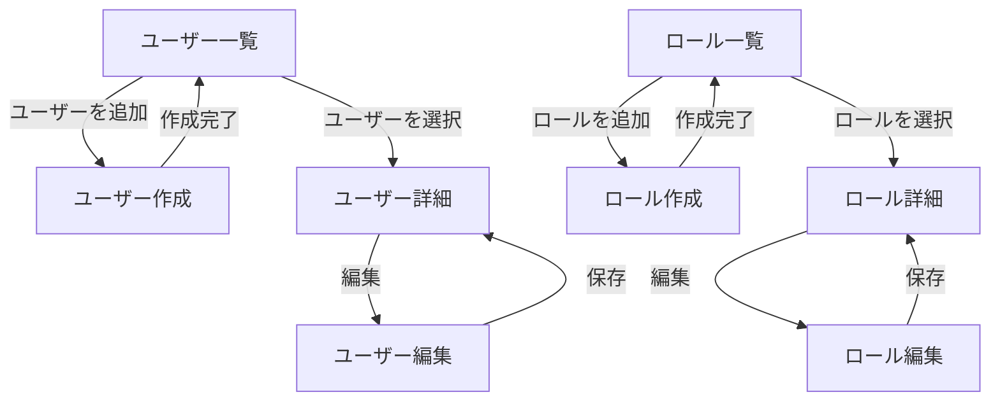
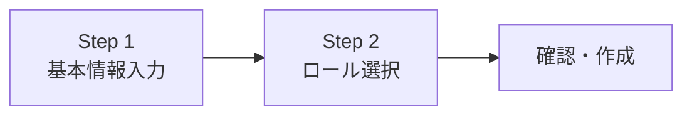

# ユーザー管理 機能仕様書

## 1. 概要

ユーザー管理は、テナント管理者がテナント内のユーザーとロールを管理するための機能である。ユーザーの追加・編集・無効化と、権限ロールの定義・割り当てを行う。

### 目的

- テナント管理者: テナント内のユーザーを作成・編集・無効化し、適切なロールを割り当てる
- テナント管理者: テナント固有のカスタムロールを作成・管理する
- 一般ユーザー: 自分のプロフィール情報を確認する（編集は将来対応）

### 対象ユーザー

| ロール | この機能での役割 |
|--------|---------------|
| テナント管理者 | ユーザー・ロールの管理（全操作） |
| 一般ユーザー | 自分のプロフィール閲覧のみ |

### 関連する機能要件

- `[ADM-002]` ユーザー管理 — ユーザーの CRUD 操作
- `[ADM-003]` ロール管理 — 権限ロールの定義
- `[AUTHZ-001]` RBAC — 役割ベースアクセス制御

## 2. シナリオ

### シナリオ 1: 新しいメンバーを追加する（テナント管理者: 佐藤さん）

佐藤さんは ABC 株式会社のテナント管理者で、新入社員の山田さんをシステムに追加したい。

1. サイドバーの「ユーザー管理」をクリックする
2. ユーザー一覧画面が表示される。右上の「ユーザーを追加」ボタンをクリックする
3. ユーザー作成フォームが表示される。メールアドレス「yamada@abc.co.jp」、表示名「山田太郎」を入力する
4. ロール選択で「一般ユーザー」を選択する
5. 「作成」ボタンをクリックする
6. 「ユーザーを作成しました」というメッセージが表示される
7. ユーザー一覧に山田さんが追加されていることを確認する

注: 初期パスワードの設定・招待メール送信は Phase 2-2 のスコープ外。現時点ではシステムが初期パスワードを自動生成し、管理者に表示する。

### シナリオ 2: ユーザーにロールを変更する（テナント管理者: 佐藤さん）

佐藤さんは、山田さんを承認権限のあるロールに変更したい。

1. ユーザー一覧から山田さんの行をクリックする
2. ユーザー詳細画面が表示される。「編集」ボタンをクリックする
3. ロール選択で現在の「一般ユーザー」を「テナント管理者」に変更する
4. 「保存」ボタンをクリックする
5. 「ユーザー情報を更新しました」というメッセージが表示される

### シナリオ 3: 退職者のアカウントを無効化する（テナント管理者: 佐藤さん）

山田さんが退職することになり、佐藤さんはアカウントを無効化する。

1. ユーザー一覧から山田さんの行をクリックする
2. ユーザー詳細画面で「無効化」ボタンをクリックする
3. 確認ダイアログが表示される。「無効化する」をクリックする
4. ユーザーのステータスが「無効」に変更される
5. 山田さんのセッションは即時無効化され、以降ログインできなくなる

### シナリオ 4: カスタムロールを作成する（テナント管理者: 佐藤さん）

佐藤さんは、ワークフローの閲覧のみ可能な「閲覧者」ロールを作成したい。

1. サイドバーの「ロール管理」をクリックする
2. ロール一覧画面が表示される。システムロール（一般ユーザー、テナント管理者）と、テナント固有のカスタムロールが表示される
3. 「ロールを追加」ボタンをクリックする
4. ロール作成フォームが表示される。名前「閲覧者」、説明「ワークフローの閲覧のみ」を入力する
5. 権限チェックボックスから「ワークフロー: 閲覧」「タスク: 閲覧」を選択する
6. 「作成」ボタンをクリックする
7. ロール一覧に「閲覧者」が追加される

## 3. 画面・操作フロー

### ユーザー管理フロー

### ユーザー作成の操作ステップ

1. 基本情報入力 — メールアドレス、表示名を入力
2. ロール選択 — 割り当てるロールを選択
3. 確認・作成 — 内容を確認して作成

## 4. 機能詳細

### 4.1 ユーザー一覧

テナント内のユーザー一覧を表示する。

表示項目:

| カラム | 説明 |
|--------|------|
| 表示番号 | テナント内の一意な表示用 ID |
| 名前 | ユーザーの表示名 |
| メールアドレス | ログインに使用するメールアドレス |
| ロール | 割り当てられたロール名 |
| ステータス | 現在の状態（色分けバッジで表示） |

フィルタ:

| フィルタ | 選択肢 |
|---------|--------|
| ステータス | すべて / アクティブ / 非アクティブ |
| ロール | すべて / ロール名で絞り込み |

#### ステータスバッジの表示

| ステータス | 日本語表示 | バッジの色 |
|-----------|-----------|----------|
| Active | アクティブ | 緑 |
| Inactive | 非アクティブ | グレー |

注: `Deleted`（論理削除）のユーザーは一覧に表示しない。

### 4.2 ユーザー作成

テナント管理者は新しいユーザーを作成できる。

入力項目:

| 項目 | 必須 | 制約 | 説明 |
|------|------|------|------|
| メールアドレス | はい | テナント内で一意、最大 255 文字 | ログインに使用 |
| 表示名 | はい | 1〜100 文字 | ユーザーの表示名 |
| ロール | はい | テナントでアクセス可能なロールから選択 | システムロール + カスタムロール |

作成時の動作:
1. 入力バリデーションを実行する
2. ユーザーを作成する（ステータス: Active）
3. 初期パスワードを自動生成し、Auth Service に認証情報を作成する
4. 表示用連番（display_number）が自動採番される
5. 指定されたロールがユーザーに割り当てられる

#### バリデーションとエラーメッセージ

| 状況 | エラーメッセージ |
|------|----------------|
| メールアドレスが空 | 「メールアドレスは必須です」 |
| メールアドレスの形式不正 | 「メールアドレスの形式が不正です」 |
| メールアドレスが既に使用中 | 「このメールアドレスは既に登録されています」 |
| 表示名が空 | 「表示名は必須です」 |
| 表示名が 100 文字超過 | 「表示名は 100 文字以内で入力してください」 |
| ロールが未選択 | 「ロールを選択してください」 |

### 4.3 ユーザー詳細

ユーザーの詳細情報を表示する。

表示セクション:

1. 基本情報 — 表示番号、名前、メールアドレス、ステータス、作成日、更新日
2. ロール情報 — 割り当てられたロールとその権限

アクション:

| アクション | ボタン表示 | 条件 |
|-----------|----------|------|
| 編集 | 「編集」 | ユーザーが Active または Inactive |
| 無効化 | 「無効化」 | ユーザーが Active |
| 有効化 | 「有効化」 | ユーザーが Inactive |

### 4.4 ユーザー編集

テナント管理者はユーザーの情報を編集できる。

編集可能な項目:

| 項目 | 制約 | 説明 |
|------|------|------|
| 表示名 | 1〜100 文字 | ユーザーの表示名 |
| ロール | テナントでアクセス可能なロールから選択 | ロールの変更 |

注: メールアドレスは変更不可。変更が必要な場合は新しいユーザーを作成し、旧ユーザーを無効化する。

### 4.5 ユーザーの無効化と有効化

#### 無効化

テナント管理者はユーザーを無効化できる。無効化されたユーザーはログインできなくなる。

無効化時の動作:
1. 確認ダイアログを表示する
2. ユーザーのステータスを Inactive に変更する
3. 対象ユーザーのアクティブなセッションを即時無効化する

#### 有効化

テナント管理者は無効化されたユーザーを再度有効化できる。

有効化時の動作:
1. ユーザーのステータスを Active に変更する
2. 次回ログインから利用可能になる

#### 自己無効化の防止

テナント管理者は自分自身を無効化できない。これは、テナント内に管理者が不在になることを防ぐためである。

### 4.6 ロール一覧

テナントでアクセス可能なロール一覧を表示する。

表示項目:

| カラム | 説明 |
|--------|------|
| ロール名 | ロールの名前 |
| 説明 | ロールの説明文 |
| 種別 | システムロール / カスタムロール |
| ユーザー数 | このロールが割り当てられたユーザー数 |

システムロールとカスタムロールはセクション分けして表示する。

#### システムロール（変更不可）

| ロール名 | 説明 | 権限 |
|---------|------|------|
| テナント管理者 | テナントの全操作権限 | `tenant:*`, `user:*`, `workflow:*`, `task:*` |
| 一般ユーザー | 基本的な操作権限 | `workflow:read`, `workflow:create`, `task:read`, `task:update` |

注: `system_admin`（システム管理者）はテナント管理画面には表示しない。システム全体の管理者であり、テナントのコンテキストでは不要。

### 4.7 ロール作成

テナント管理者はテナント固有のカスタムロールを作成できる。

入力項目:

| 項目 | 必須 | 制約 | 説明 |
|------|------|------|------|
| ロール名 | はい | テナント内で一意、1〜100 文字 | ロールの表示名 |
| 説明 | いいえ | 最大 500 文字 | ロールの説明 |
| 権限 | はい | 1 つ以上選択 | 付与する権限のリスト |

#### 権限の選択 UI

権限はリソース × アクションのマトリクスで選択する。

| リソース | 閲覧 (read) | 作成 (create) | 更新 (update) | 削除 (delete) |
|---------|:-----------:|:------------:|:------------:|:------------:|
| ワークフロー | ☐ | ☐ | ☐ | ☐ |
| タスク | ☐ | ☐ | ☐ | ☐ |

将来のリソース追加（ドキュメント、通知等）に伴い、行が追加される。

「すべて選択」チェックボックスで、リソースごとの全アクションを一括選択できる（`resource:*` に対応）。

#### バリデーションとエラーメッセージ

| 状況 | エラーメッセージ |
|------|----------------|
| ロール名が空 | 「ロール名は必須です」 |
| ロール名が既に使用中 | 「このロール名は既に使用されています」 |
| 権限が未選択 | 「1 つ以上の権限を選択してください」 |

### 4.8 ロール編集

テナント管理者はカスタムロールを編集できる。

編集可能な項目:

| 項目 | 制約 |
|------|------|
| ロール名 | テナント内で一意、1〜100 文字 |
| 説明 | 最大 500 文字 |
| 権限 | 1 つ以上選択 |

注: システムロールは編集不可。

### 4.9 ロール削除

テナント管理者はカスタムロールを削除できる。

削除時の動作:
1. ロールが割り当てられたユーザーがいないことを確認する
2. 確認ダイアログを表示する
3. ロールを削除する

#### 制約

| 状況 | エラーメッセージ |
|------|----------------|
| システムロールを削除しようとした | 「システムロールは削除できません」 |
| ロールが割り当てられたユーザーがいる | 「このロールは N 人のユーザーに割り当てられています。先にロールを変更してください」 |

## 5. 権限

### ロール別アクセス制御

| 操作 | テナント管理者 | 一般ユーザー |
|------|:---:|:---:|
| ユーザー一覧の閲覧 | ○ | — |
| ユーザーの作成 | ○ | — |
| ユーザーの編集 | ○ | — |
| ユーザーの無効化・有効化 | ○ | — |
| 自分のプロフィール閲覧 | ○ | ○ |
| ロール一覧の閲覧 | ○ | — |
| カスタムロールの作成 | ○ | — |
| カスタムロールの編集 | ○ | — |
| カスタムロールの削除 | ○ | — |

補足:
- 全操作はテナント内に閉じる（他テナントのユーザー・ロールは一切参照・操作不可）
- テナント管理者の権限チェックは RBAC ミドルウェアで実施する（`user:*` 権限が必要）

## 6. 非ゴール（対象外）

| 機能 | 理由 | 関連要件 |
|------|------|---------|
| グループ管理 | 別機能として将来対応 | ADM-004 |
| ABAC（属性ベースアクセス制御） | RBAC で十分な段階 | AUTHZ-002 |
| 招待メールの送信 | 通知基盤は Phase 2-5 | NOTIFY-* |
| パスワードリセット | Auth Service の機能拡張として別途対応 | AUTH-* |
| プロフィール編集（一般ユーザー） | 将来対応 | — |
| ユーザーの物理削除 | テナント退会時の一括削除で対応 | — |
| ユーザー一覧のソート | 将来対応。初期実装では作成日時順 | — |
| ユーザー一覧のページネーション | テナント内ユーザー数が少ない初期段階では不要。増加時に対応 | — |

## 7. 未解決事項

| # | 事項 | 影響範囲 | ステータス |
|---|------|---------|-----------|
| 1 | 初期パスワードの表示方法（画面表示のみ or クリップボードコピー） | ユーザー作成 | 未決定 |
| 2 | ロール変更時の即時反映（次回リクエストから or セッション再作成） | ユーザー編集 | 未決定 |
| 3 | カスタムロールの上限数 | ロール作成 | 未決定 |

## 8. 関連ドキュメント

| ドキュメント | 参照先 |
|-------------|--------|
| コア要件（システム管理機能） | [01_コア要件.md](../10_要件定義書/01_コア要件.md) ADM-002, ADM-003 |
| コア要件（認可機能） | [01_コア要件.md](../10_要件定義書/01_コア要件.md) AUTHZ-001 |
| セキュリティ要件 | [01_コア要件.md](../10_要件定義書/01_コア要件.md) 5.4 セキュリティ要件 |
| アーキテクチャ設計（ユーザー区分） | [01_アーキテクチャ設計.md](../30_基本設計書/01_アーキテクチャ設計.md) |
| DB 設計（users, roles, user_roles） | [02_データベース設計.md](../40_詳細設計書/02_データベース設計.md) |
| 用語集 | [02_用語集.md](../10_要件定義書/02_用語集.md) |

---

## 変更履歴

| 日付 | 変更内容 |
|------|---------|
| 2026-02-11 | 初版作成 |
