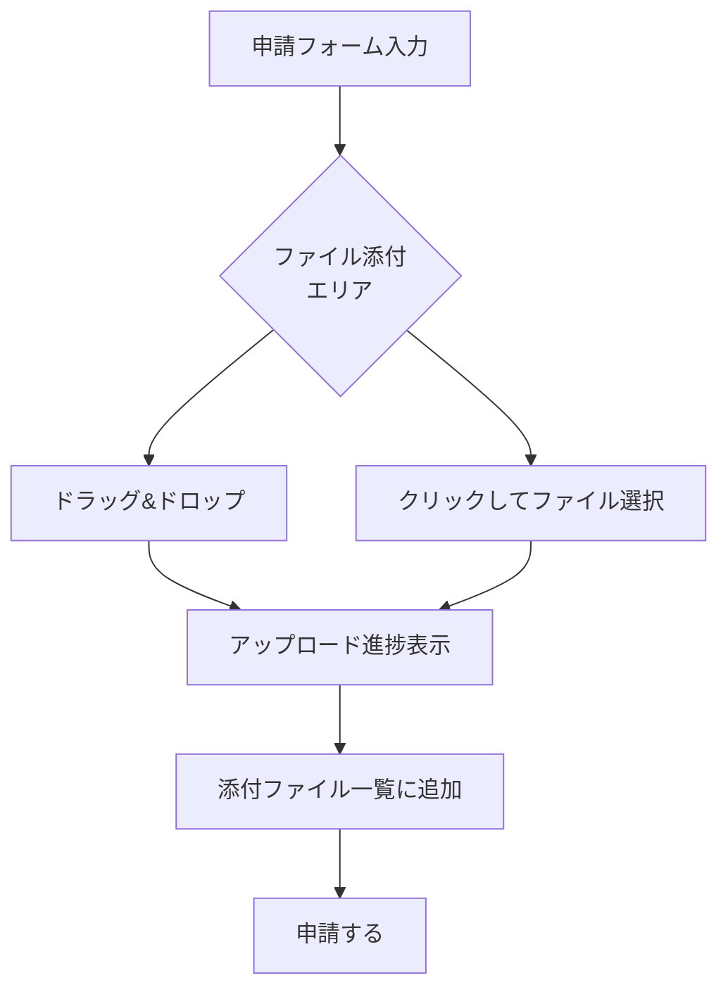

# ドキュメント管理 機能仕様書

> **実装状態**: 未実装（Phase 2-5 で実装予定）

## 1. 概要

ドキュメント管理機能は、ワークフロー申請へのファイル添付と、テナント内でのドキュメントのフォルダ管理を提供する機能である。申請者がワークフロー申請時にファイルを添付し、承認者がそのファイルを確認できる。また、テナント管理者がフォルダ構造を作成してドキュメントを整理できる。

### 目的

- ワークフロー申請に証憑や関連資料を添付できるようにする
- 承認者が申請内容とともに添付ファイルを確認できるようにする
- テナント内のドキュメントをフォルダで整理・管理できるようにする

### 対象ユーザー

| ロール | この機能での役割 |
|--------|---------------|
| 申請者 | ワークフロー申請へのファイル添付、自分のファイルの管理 |
| 承認者 | 添付ファイルのダウンロード・確認 |
| テナント管理者 | フォルダの作成・管理、テナント内ドキュメントの管理 |

### 関連する機能要件

`[SECTION_ID: CORE-04]` 4.4 ドキュメント管理機能（DOC-001, DOC-003）

## 2. シナリオ

### シナリオ 1: ワークフロー申請へのファイル添付（申請者: 田中さん）

田中さんが経費精算を申請する際に、領収書の PDF を添付する。

1. 田中さんが「経費精算申請」ワークフローの申請フォームを開く
2. フォームの各項目を入力する
3. 「ファイルを添付」エリアに領収書の PDF をドラッグ&ドロップする
4. アップロード進捗バーが表示され、アップロードが完了する
5. 添付ファイル一覧に「領収書.pdf（1.2 MB）」が表示される
6. さらにもう 1 つ、見積書の画像ファイルを添付する
7. 「申請する」ボタンをクリックしてワークフローを申請する
8. 承認者の鈴木さんがワークフロー詳細画面を開くと、添付ファイル一覧が表示される
9. 鈴木さんが「領収書.pdf」をクリックするとファイルがダウンロードされる

### シナリオ 2: フォルダの作成とファイル整理（テナント管理者: 佐藤さん）

佐藤さんがテナントのドキュメントをフォルダで整理する。

1. 佐藤さんがサイドメニューから「ドキュメント管理」画面を開く
2. 「新しいフォルダ」ボタンをクリックする
3. フォルダ名に「2026年度」と入力して「作成」をクリックする
4. 「2026年度」フォルダの中に移動する
5. サブフォルダ「経費精算」と「休暇申請」を作成する
6. ドキュメント一覧に戻ると、フォルダツリーに「2026年度 > 経費精算」「2026年度 > 休暇申請」が表示される

### シナリオ 3: 添付ファイルのダウンロード（承認者: 鈴木さん）

鈴木さんが承認対象のワークフローに添付されたファイルをダウンロードする。

1. 鈴木さんがタスク一覧から経費精算申請のタスクを開く
2. ワークフロー詳細画面の「添付ファイル」セクションにファイル一覧が表示される
3. 各ファイルにはファイル名、サイズ、アップロード日時が表示される
4. 「領収書.pdf」のダウンロードアイコンをクリックする
5. ブラウザのダウンロードが開始され、ファイルが保存される

### シナリオ 4: ファイルの削除（申請者: 田中さん）

田中さんが下書き申請に添付した不要なファイルを削除する。

1. 田中さんが下書き状態のワークフロー申請フォームを開く
2. 添付ファイル一覧で「古い見積書.pdf」の削除ボタンをクリックする
3. 確認ダイアログが表示される:「このファイルを削除しますか？この操作は取り消せません」
4. 「削除する」をクリックするとファイルが削除される
5. 添付ファイル一覧から「古い見積書.pdf」が消える

## 3. 画面・操作フロー

### 全体フロー

### ドキュメント管理画面のレイアウト

| エリア | 位置 | 内容 |
|--------|------|------|
| ツールバー | 上部 | フォルダ作成、ファイルアップロードボタン |
| フォルダツリー | 左サイドバー | フォルダ階層のツリー表示。クリックで移動 |
| ファイル一覧 | 中央メイン | 選択中フォルダ内のファイル一覧（名前、サイズ、更新日時、操作ボタン） |

### ワークフロー申請フォームのファイル添付 UI

## 4. 機能詳細

### 4.1 ファイルアップロード（DOC-001）

#### 対応ファイル形式

| カテゴリ | 拡張子 | Content-Type |
|---------|--------|-------------|
| ドキュメント | pdf | application/pdf |
| ドキュメント | doc, docx | application/msword, application/vnd.openxmlformats-officedocument.wordprocessingml.document |
| スプレッドシート | xls, xlsx | application/vnd.ms-excel, application/vnd.openxmlformats-officedocument.spreadsheetml.sheet |
| テキスト | txt, csv | text/plain, text/csv |
| 画像 | png, jpg, jpeg, gif | image/png, image/jpeg, image/gif |

#### ファイルサイズ制限

| 制限 | 値 |
|------|-----|
| 1 ファイルあたりの上限 | 20 MB |
| 1 申請あたりの合計上限 | 100 MB |
| 1 申請あたりのファイル数上限 | 10 件 |

#### アップロードフロー

1. ユーザーがファイルを選択（ドラッグ&ドロップまたはファイル選択ダイアログ）
2. クライアント側でファイル形式・サイズのバリデーションを実行
3. バリデーション通過後、サーバーにアップロード URL（署名付き URL）を要求
4. 署名付き URL を使ってブラウザから直接ストレージにアップロード
5. アップロード完了後、サーバーにアップロード完了を通知
6. サーバーがファイルメタデータを保存し、添付ファイル一覧に反映

#### バリデーション

| ルール | エラーメッセージ |
|--------|---------------|
| 非対応のファイル形式 | 「このファイル形式はサポートされていません。対応形式: PDF, Word, Excel, テキスト, 画像」 |
| ファイルサイズ超過（20 MB） | 「ファイルサイズが上限（20 MB）を超えています」 |
| 合計サイズ超過（100 MB） | 「添付ファイルの合計サイズが上限（100 MB）を超えています」 |
| ファイル数超過（10 件） | 「添付ファイル数が上限（10 件）を超えています」 |
| ファイル名が空 | 「ファイル名が無効です」 |

### 4.2 フォルダ管理（DOC-003）

#### フォルダの制約

| 制約 | 値 |
|------|-----|
| 階層制限 | 最大 5 階層 |
| フォルダ名の文字数 | 1〜255 文字 |
| フォルダ名に使用不可の文字 | `/`, `\`, `:`, `*`, `?`, `"`, `<`, `>`, `|` |

#### フォルダ操作

| 操作 | 説明 | 制約 |
|------|------|------|
| 作成 | 現在のフォルダ内に新しいサブフォルダを作成する | 同一フォルダ内で名前の重複不可 |
| 名前変更 | フォルダ名を変更する | 同一フォルダ内で名前の重複不可 |
| 移動 | フォルダを別のフォルダに移動する | 移動先の階層制限を超えない |
| 削除 | 空のフォルダを削除する | フォルダ内にファイルまたはサブフォルダがある場合は削除不可 |

#### バリデーション

| ルール | エラーメッセージ |
|--------|---------------|
| フォルダ名が空 | 「フォルダ名を入力してください」 |
| フォルダ名が 255 文字超 | 「フォルダ名は 255 文字以内で入力してください」 |
| フォルダ名に使用不可の文字 | 「フォルダ名に使用できない文字が含まれています」 |
| 同一フォルダ内で名前が重複 | 「同じ名前のフォルダが既に存在します」 |
| 階層制限超過 | 「フォルダの階層が上限（5 階層）を超えています」 |
| 空でないフォルダの削除 | 「フォルダにファイルまたはサブフォルダが含まれているため削除できません」 |

### 4.3 ファイルのダウンロード

ワークフロー詳細画面の添付ファイル一覧、またはドキュメント管理画面のファイル一覧から、ファイルをダウンロードできる。

ダウンロードボタンをクリックすると、署名付きダウンロード URL が発行され、ブラウザのダウンロードが開始される。

### 4.4 ファイルの削除

| 条件 | 削除可否 |
|------|---------|
| 下書き申請の添付ファイル（自分がアップロード） | ✓ 削除可能 |
| 申請済みワークフローの添付ファイル | ✗ 削除不可 |
| ドキュメント管理のファイル（テナント管理者） | ✓ 削除可能 |
| ドキュメント管理のファイル（一般ユーザー・自分がアップロード） | ✓ 削除可能 |

削除時は確認ダイアログを表示する。削除はソフトデリート（ステータスを `deleted` に変更）とし、ストレージ上のファイルは即座には削除しない。

## 5. 状態遷移

### ファイルの状態遷移

| ステータス | 説明 |
|-----------|------|
| Uploading | アップロード中（署名付き URL 発行済み、アップロード完了通知未受信） |
| Active | 利用可能 |
| Deleted | 削除済み（ソフトデリート） |

### フォルダの状態遷移

フォルダの削除はハードデリート（DB から削除）。ただし、フォルダが空でない場合は削除不可。

## 6. 権限

| 操作 | 申請者 | 承認者 | テナント管理者 |
|------|:-----:|:-----:|:------------:|
| ファイルアップロード（申請時） | ✓ | — | ✓ |
| ファイルアップロード（ドキュメント管理） | ✓ | ✓ | ✓ |
| 添付ファイルのダウンロード | ✓（自分の申請） | ✓（割当て分） | ✓ |
| ドキュメント一覧の閲覧 | ✓（テナント内） | ✓（テナント内） | ✓ |
| フォルダ作成・名前変更・移動・削除 | ✗ | ✗ | ✓ |
| ファイル削除（下書き申請の添付） | ✓（自分のもの） | — | ✓ |
| ファイル削除（ドキュメント管理） | ✓（自分のもの） | ✓（自分のもの） | ✓ |

## 7. 非ゴール（対象外）

| 機能 | 理由 | 関連機能ID |
|------|------|-----------|
| バージョン管理 | Phase 3 以降で実装予定 | DOC-002 |
| 全文検索 | Phase 3 以降で実装予定 | DOC-004 |
| ファイル/フォルダ単位のアクセス権限設定 | Phase 3 以降で実装予定 | DOC-005 |
| ブラウザ内ファイルプレビュー | Phase 3 以降で検討 | DOC-006 |
| サムネイル生成 | Phase 3 以降のバッチ処理で対応 | — |
| ドキュメントインデックス作成 | Phase 3 以降のバッチ処理で対応 | — |
| ファイルの一括アップロード | Phase 2-5 では 1 ファイルずつアップロード。一括対応は後続で検討 | — |
| ゴミ箱（復元機能） | Phase 2-5 では削除は取消不可。復元機能は後続で検討 | — |

## 8. 未解決事項

| # | 事項 | 影響範囲 | ステータス |
|---|------|---------|-----------|
| 1 | ワークフロー定義スキーマへのファイル型フィールド追加 | ワークフローデザイナー | Phase 2-5 の実装時にスキーマ拡張が必要。デザイナーのフォームエディタにファイル型を追加する |
| 2 | テナント別ストレージ容量制限 | 課金・プラン設計 | Phase 2-5 では制限なし。プラン設計時に検討 |
| 3 | ソフトデリートされたファイルのストレージ上からの物理削除タイミング | ストレージコスト | バッチ処理で定期的に削除する方針を検討。Phase 2-5 では即座に削除しない |

## 9. 関連ドキュメント

| ドキュメント | 参照先 |
|-------------|--------|
| コア要件（ドキュメント管理機能） | `docs/10_要件定義書/01_コア要件.md` 4.4 節 |
| ワークフロー管理 機能仕様書 | `docs/20_機能仕様書/01_ワークフロー管理.md` |
| ワークフローデザイナー 機能仕様書（ファイル型フィールド） | `docs/20_機能仕様書/04_ワークフローデザイナー.md` |
| テナント退会時データ削除設計（S3 削除） | `docs/40_詳細設計書/06_テナント退会時データ削除設計.md` |
| 実装ロードマップ（Phase 2-5） | `docs/40_詳細設計書/00_実装ロードマップ.md` |
| ドキュメント管理 詳細設計書 | `docs/40_詳細設計書/17_ドキュメント管理設計.md` |

---

## 変更履歴

| 日付 | 変更内容 |
|------|---------|
| 2026-02-24 | 初版作成（#846） |
