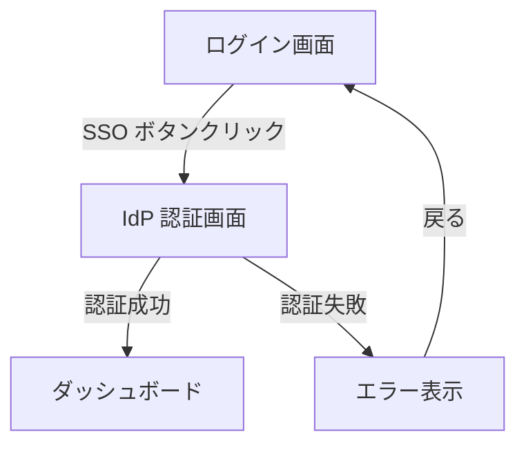
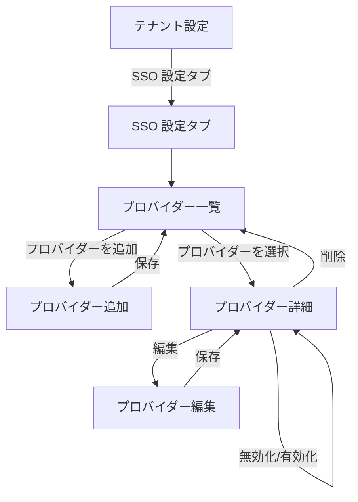
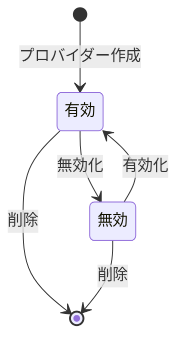

# SSO 認証 機能仕様書

> **実装状態**: 未実装（Phase 3-1 で実装予定）

## 1. 概要

SSO（シングルサインオン）認証は、外部の IdP（Identity Provider: 認証を担当する外部サービス。例: Okta, Azure AD, Google Workspace）を利用して、ユーザーが既存の企業アカウントで RingiFlow にログインできる機能である。OIDC（OpenID Connect: OAuth 2.0 ベースの認証プロトコル）+ PKCE（Proof Key for Code Exchange: 認可コード横取り攻撃を防ぐ仕組み）による認証連携を実装する。

### 目的

- 一般ユーザー: 企業の既存アカウント（Okta, Azure AD 等）で RingiFlow にログインする。パスワードの個別管理が不要になる
- テナント管理者: テナントに対して OIDC プロバイダーを設定し、SSO ログインを有効化する
- セキュリティ管理者: 認証を IdP に集約し、企業のセキュリティポリシー（パスワードポリシー、MFA 等）を統一的に適用する

### 対象ユーザー

| ロール | この機能での役割 |
|--------|---------------|
| テナント管理者 | OIDC プロバイダーの設定・管理 |
| 一般ユーザー | SSO ログインの利用 |

### 対象プラン

SSO 機能は Professional プラン以上で利用可能（要件定義書 CORE-07 準拠）。

| プラン | SSO |
|--------|-----|
| Free | - |
| Standard | - |
| Professional | ✓ |
| Enterprise | ✓ |

### 関連する機能要件

- `[AUTH-003]` SSO 連携（OIDC） — OpenID Connect + PKCE による認証連携
- `[AUTH-010]` トークン秘匿（BFF） — ブラウザにアクセストークンを保持しない

## 2. シナリオ

### シナリオ 1: SSO でログインする（一般ユーザー: 山田さん）

山田さんは ABC 株式会社の社員で、テナント管理者が Okta を SSO プロバイダーとして設定済みである。山田さんは初めて SSO で RingiFlow にログインする。

1. ログイン画面を開く。メール/パスワード入力欄の下に「Okta でログイン」ボタンが表示されている
2. 「Okta でログイン」ボタンをクリックする
3. Okta のログイン画面にリダイレクトされる
4. Okta で企業アカウントの認証情報を入力し、ログインする（企業の MFA が設定されていれば、ここで MFA も求められる）
5. 認証成功後、RingiFlow のダッシュボードにリダイレクトされる
6. 初回 SSO ログインのため、ユーザーアカウントが自動作成される（JIT プロビジョニング）。「一般ユーザー」ロールが割り当てられる

### シナリオ 2: 2 回目以降の SSO ログイン（一般ユーザー: 山田さん）

山田さんは既に SSO でアカウントが作成済みである。

1. ログイン画面で「Okta でログイン」ボタンをクリックする
2. Okta で認証する（Okta のセッションが有効なら、認証画面をスキップできる場合がある）
3. RingiFlow のダッシュボードにリダイレクトされる

### シナリオ 3: OIDC プロバイダーを設定する（テナント管理者: 佐藤さん）

佐藤さんは ABC 株式会社のテナント管理者で、Okta を SSO プロバイダーとして設定する。

1. テナント設定画面を開く
2. 「SSO 設定」タブを選択する
3. 「OIDC プロバイダーを追加」ボタンをクリックする
4. 設定フォームが表示される。以下を入力する:
   - 表示名: 「Okta」
   - Issuer URL: `https://abc-corp.okta.com`
   - Client ID: Okta で発行された Client ID
   - Client Secret: Okta で発行された Client Secret
5. 「保存」ボタンをクリックする
6. 「OIDC プロバイダーを追加しました」というメッセージが表示される
7. プロバイダー一覧に「Okta」が「有効」ステータスで表示される

### シナリオ 4: OIDC プロバイダーを無効化する（テナント管理者: 佐藤さん）

佐藤さんは、一時的に Okta SSO を無効化したい。

1. テナント設定画面の「SSO 設定」タブを開く
2. プロバイダー一覧から「Okta」を選択する
3. プロバイダー詳細画面で「無効化」ボタンをクリックする
4. 確認ダイアログが表示される。「無効化する」をクリックする
5. ステータスが「無効」に変更される
6. ログイン画面から「Okta でログイン」ボタンが非表示になる

### シナリオ 5: SSO ログインに失敗する（一般ユーザー: 山田さん）

山田さんが SSO ログインを試みるが、IdP で認証に失敗する。

1. ログイン画面で「Okta でログイン」ボタンをクリックする
2. Okta のログイン画面にリダイレクトされる
3. Okta で認証に失敗する（パスワード間違い、アカウントロック等）
4. Okta からエラーを伴って RingiFlow にリダイレクトされる
5. ログイン画面に「SSO 認証に失敗しました。IdP 管理者にお問い合わせください」というエラーメッセージが表示される

### シナリオ 6: メール/パスワードと SSO の両方で認証可能なユーザー（一般ユーザー: 山田さん）

山田さんは以前メール/パスワードで登録済みだが、テナント管理者が SSO を設定した。

1. ログイン画面にはメール/パスワード入力欄と「Okta でログイン」ボタンの両方が表示される
2. 山田さんは「Okta でログイン」を選択する
3. Okta で認証する
4. RingiFlow は Okta から取得したメールアドレスで既存ユーザーを照合し、同一ユーザーとして認識する
5. ダッシュボードにリダイレクトされる。以降、メール/パスワードと SSO のどちらでもログイン可能

## 3. 画面・操作フロー

### SSO ログインフロー

### OIDC プロバイダー設定管理フロー

## 4. 機能詳細

### 4.1 ログイン画面の SSO 対応（SCR-001）

テナントに有効な OIDC プロバイダーが設定されている場合、ログイン画面に SSO ログインボタンを表示する。

#### 表示要素

| 要素 | 条件 | 説明 |
|------|------|------|
| メール/パスワードフォーム | 常に表示 | 既存のログインフォーム |
| SSO ログインボタン | テナントに有効な OIDC プロバイダーがある場合 | プロバイダー名を表示（例: 「Okta でログイン」） |
| セパレーター | SSO ボタンがある場合 | 「または」区切り線 |

#### SSO ボタンの表示ロジック

- テナントの識別にはサブドメインを使用する（例: `abc-corp.ringiflow.example.com`）
- 有効な OIDC プロバイダーが複数ある場合、全てのプロバイダーのボタンを表示する
- プロバイダーが無効化されている場合、ボタンは非表示

### 4.2 OIDC プロバイダー設定画面（SCR-011 内）

テナント設定画面の「SSO 設定」タブで OIDC プロバイダーを管理する。

#### プロバイダー一覧

| 表示項目 | 説明 |
|---------|------|
| 表示名 | プロバイダーの名前（例: Okta, Azure AD） |
| Issuer URL | OIDC 発行者 URL |
| ステータス | 有効 / 無効（バッジ表示） |
| 作成日 | プロバイダーの追加日時 |

#### プロバイダー作成・編集フォーム

| 項目 | 必須 | バリデーション | 説明 |
|------|------|------------|------|
| 表示名 | ✓ | 1〜100 文字 | ログインボタンに表示される名前 |
| Issuer URL | ✓ | 有効な HTTPS URL | OIDC プロバイダーの Issuer URL |
| Client ID | ✓ | 1〜255 文字 | IdP で発行された Client ID |
| Client Secret | ✓ | 1〜500 文字 | IdP で発行された Client Secret（マスク表示） |

注: スコープ（`openid email profile`）とリダイレクト URI は自動設定。ユーザーが個別に設定する必要はない。

#### エラーメッセージ

| 条件 | メッセージ |
|------|----------|
| 必須項目が未入力 | 「{項目名}は必須です」 |
| Issuer URL が無効 | 「有効な HTTPS URL を入力してください」 |
| Client ID/Secret が空 | 「{項目名}を入力してください」 |

### 4.3 JIT プロビジョニング

初回 SSO ログイン時にユーザーアカウントを自動作成する。

| 条件 | 動作 |
|------|------|
| メールアドレスが既存ユーザーと一致しない | 新規ユーザーを作成し、デフォルトロール（一般ユーザー）を割り当てる |
| メールアドレスが既存ユーザー（active）と一致 | 既存ユーザーに OIDC 認証情報を紐付ける |
| メールアドレスが既存ユーザー（inactive）と一致 | ログイン拒否。「アカウントが無効化されています」エラーを表示 |

JIT で作成されるユーザー情報:

| フィールド | 値の取得元 |
|-----------|-----------|
| メールアドレス | ID トークンの `email` クレーム |
| 表示名 | ID トークンの `name` クレーム（なければ `email` を使用） |
| ロール | テナントのデフォルトロール（一般ユーザー） |

## 5. 状態遷移

### OIDC プロバイダーの状態

| 状態 | 説明 | SSO ログインボタン |
|------|------|------------------|
| 有効 | SSO ログインが可能 | 表示される |
| 無効 | SSO ログインが不可 | 非表示 |

## 6. 権限

| 操作 | テナント管理者 | 一般ユーザー |
|------|-------------|------------|
| SSO でログイン | ✓ | ✓ |
| OIDC プロバイダーの追加 | ✓ | - |
| OIDC プロバイダーの編集 | ✓ | - |
| OIDC プロバイダーの無効化/有効化 | ✓ | - |
| OIDC プロバイダーの削除 | ✓ | - |

## 7. 非ゴール（対象外）

| 対象外 | 理由 | 予定 |
|--------|------|------|
| SAML 2.0 連携 | Phase 3 後続サブフェーズ | OIDC パターンを応用 |
| MFA（多要素認証） | Phase 3 後続サブフェーズ | OIDC + MFA 連携は IdP 側で対応 |
| SCIM プロビジョニング | Phase 3 後続 | JIT プロビジョニングで代替 |
| IdP 接続テスト機能 | 実装複雑度 | 将来対応を検討 |
| ソーシャルログイン | AUTH-005 は推奨要件 | 別途検討 |

## 8. 未解決事項

| 項目 | 状態 | 説明 |
|------|------|------|
| テナントごとの最大プロバイダー数 | 未決定 | 初期実装では上限なし。運用実績を見て制限を検討 |

## 9. 関連ドキュメント

- 要件定義書: [`docs/10_要件定義書/01_コア要件.md`](../10_要件定義書/01_コア要件.md) — AUTH-003, AUTH-010, CORE-07
- 認証フロー図: [`docs/10_要件定義書/01_コア要件.md`](../10_要件定義書/01_コア要件.md) 4.1 節
- 認証機能設計（Phase 1）: [`docs/40_詳細設計書/07_認証機能設計.md`](../40_詳細設計書/07_認証機能設計.md)
- Auth Service 設計（Phase 2）: [`docs/40_詳細設計書/08_AuthService設計.md`](../40_詳細設計書/08_AuthService設計.md)
- SSO 認証設計（Phase 3-1）: [`docs/40_詳細設計書/18_SSO認証設計.md`](../40_詳細設計書/18_SSO認証設計.md)
