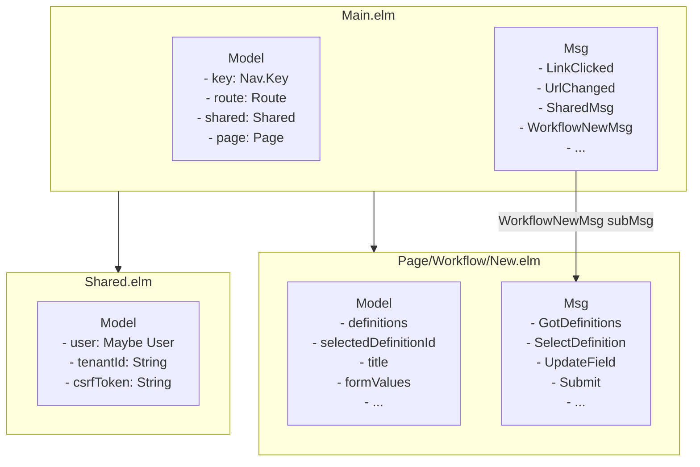
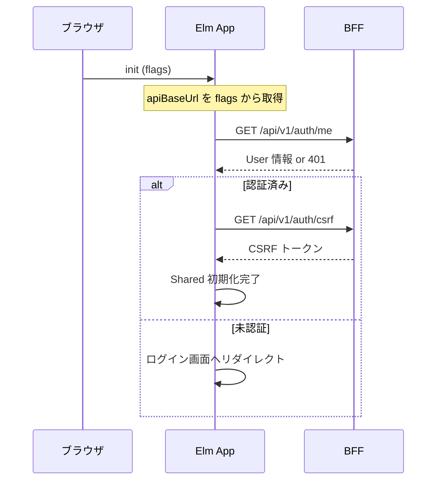
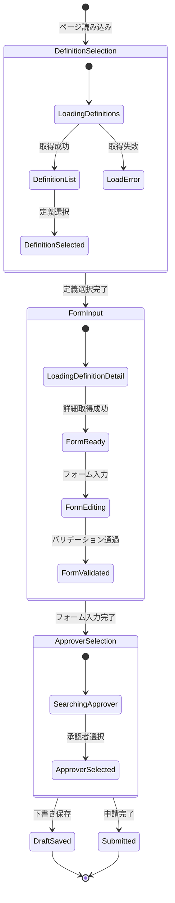
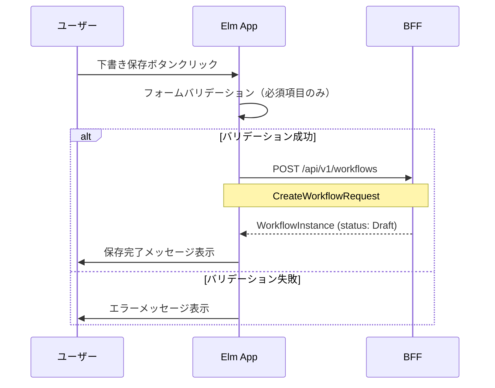
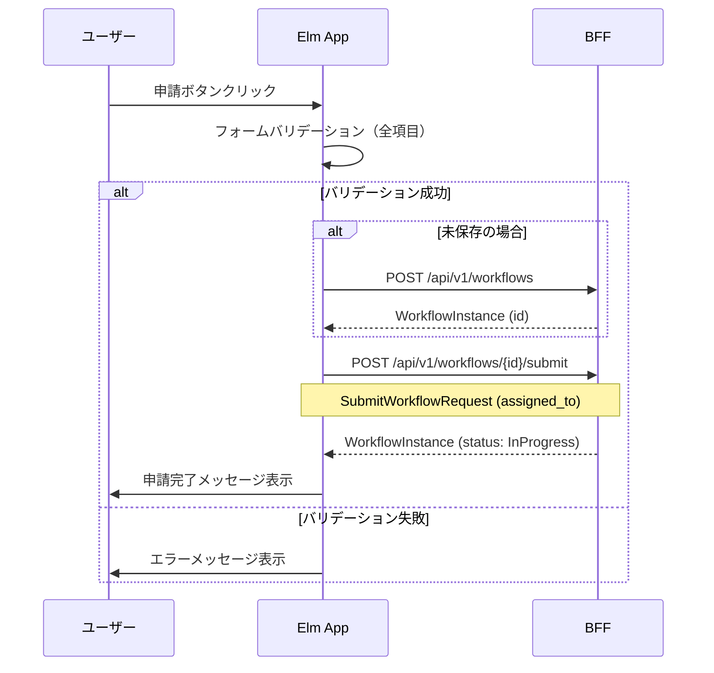

# ワークフロー申請フォーム UI 設計

## 概要

本ドキュメントは、RingiFlow のワークフロー申請フォーム（フロントエンド）の詳細設計を定義する。

### 対象 Issue

[#115 フロントエンド: ワークフロー申請フォーム](https://github.com/ka2kama/ringiflow/issues/115)

### 前提

- バックエンド API は #35 で実装済み
- API クライアント層（Phase 1 / Phase 8）は実装済み
- 本設計書は Phase 2（申請フォーム UI）を対象とする

### スコープ

| 含めるもの | 含めないもの（Phase 3 以降） |
|-----------|---------------------------|
| ワークフロー定義選択 | 申請一覧表示 |
| タイトル入力 | 申請詳細表示 |
| 動的フォーム生成 | ステータス表示 |
| 下書き保存 | コメント機能 |
| 申請（承認者選択 → 提出） | 承認・却下機能 |

---

## アーキテクチャ

### Nested TEA パターン

Elm の大規模 SPA では「ネストされた TEA（Nested TEA）」パターンを採用する。
各ページが独自の `Model`/`Msg`/`update`/`view` を持ち、Main.elm が調整役となる。



### 設計判断: なぜ Nested TEA か

**代替案と不採用理由:**

| 代替案 | 不採用理由 |
|--------|-----------|
| elm-spa（ジェネレータベース） | 学習目的で手動実装を選択 |
| 単一 Model に全状態を保持 | 状態が肥大化し、保守性が低下 |
| Web Components との併用 | Elm の型安全性を活かせない |

**Nested TEA のメリット:**

1. ページ単位での状態分離（保守性向上）
2. 各ページの独立したテスト可能性
3. 将来のページ追加が容易

---

## ディレクトリ構造

### 目標構成

```
frontend/src/
├── Main.elm                    # グローバル TEA + ページ委譲
├── Route.elm                   # ルーティング（拡張）
├── Shared.elm                 # [新規] 共有状態
│
├── Page/
│   ├── Home.elm                # [新規] ホームページモジュール
│   ├── NotFound.elm            # [新規] 404 ページモジュール
│   └── Workflow/
│       └── New.elm             # [新規] 申請フォームページ
│
├── Form/
│   ├── DynamicForm.elm         # [新規] 動的フォーム生成
│   └── Validation.elm          # [新規] フォームバリデーション
│
├── Api/                        # （既存）API クライアント
│   ├── Http.elm
│   ├── Workflow.elm
│   └── WorkflowDefinition.elm
│
├── Data/                       # （既存）データモデル
│   ├── WorkflowDefinition.elm
│   ├── WorkflowInstance.elm
│   └── FormField.elm
│
└── Ports.elm                   # （既存）JavaScript 連携
```

---

## ルーティング設計

### Route 型の拡張

```elm
-- Route.elm

type Route
    = Home
    | WorkflowNew              -- /workflows/new
    | NotFound


parser : Parser (Route -> a) a
parser =
    oneOf
        [ Parser.map Home top
        , Parser.map WorkflowNew (s "workflows" </> s "new")
        ]


toString : Route -> String
toString route =
    case route of
        Home ->
            "/"

        WorkflowNew ->
            "/workflows/new"

        NotFound ->
            "/not-found"
```

### URL 設計

| Route | URL | 画面 |
|-------|-----|------|
| Home | `/` | ホーム |
| WorkflowNew | `/workflows/new` | 新規申請フォーム |
| NotFound | `/not-found` | 404 |

---

## Shared（共有状態）モジュール設計

### 目的

認証情報・テナント情報など、全ページで共有する状態を管理する。

### データ構造

```elm
-- Shared.elm

type alias Shared =
    { user : Maybe User
    , tenantId : String
    , csrfToken : String
    , apiBaseUrl : String
    }


type alias User =
    { id : String
    , email : String
    , name : String
    , roles : List String
    }


{-| API リクエスト設定を生成
-}
toRequestConfig : Shared -> RequestConfig
toRequestConfig shared =
    { baseUrl = shared.apiBaseUrl
    , tenantId = Just shared.tenantId
    , csrfToken = Just shared.csrfToken
    }
```

### 初期化フロー



---

## 申請フォームページ設計

### Page/Workflow/New.elm

#### 状態（Model）

```elm
type alias Model =
    { -- API データ
      definitions : RemoteData ApiError (List WorkflowDefinition)
    , selectedDefinition : Maybe WorkflowDefinition

      -- フォーム状態
    , title : String
    , formValues : Dict String String    -- フィールドID → 入力値
    , validationErrors : Dict String String

      -- 承認者選択
    , approverSearch : String
    , availableApprovers : List User     -- 将来: API から取得
    , selectedApprover : Maybe User

      -- 操作状態
    , submitting : Bool
    , saveResult : Maybe (Result ApiError WorkflowInstance)
    }
```

#### RemoteData パターン

API レスポンスの状態を型で表現する。

```elm
type RemoteData e a
    = NotAsked       -- まだリクエストしていない
    | Loading        -- リクエスト中
    | Failure e      -- エラー
    | Success a      -- 成功
```

**設計判断: なぜ RemoteData か**

| 代替案 | 不採用理由 |
|--------|-----------|
| `Maybe a` | ローディング状態を表現できない |
| `{ loading : Bool, data : Maybe a, error : Maybe e }` | 不正な状態の組み合わせが可能 |

RemoteData は「不正な状態を表現不可能にする」原則に合致。

#### メッセージ（Msg）

```elm
type Msg
    = -- 初期化
      GotDefinitions (Result ApiError (List WorkflowDefinition))

      -- ワークフロー定義選択
    | SelectDefinition String
    | GotDefinitionDetail (Result ApiError WorkflowDefinition)

      -- フォーム入力
    | UpdateTitle String
    | UpdateField String String        -- フィールドID, 値

      -- 承認者選択
    | UpdateApproverSearch String
    | SelectApprover User

      -- 保存・申請
    | SaveDraft
    | Submit
    | GotSaveResult (Result ApiError WorkflowInstance)
    | GotSubmitResult (Result ApiError WorkflowInstance)
```

---

## 画面フロー

### 申請フォームの画面遷移



### ワイヤーフレーム

```
┌─────────────────────────────────────────────────────────────────┐
│  RingiFlow                                                      │
├─────────────────────────────────────────────────────────────────┤
│                                                                 │
│  新規申請                                                        │
│  ═══════                                                        │
│                                                                 │
│  Step 1: ワークフロー種類を選択                                    │
│  ┌─────────────────────────────────────────────────────────┐    │
│  │ ◯ 経費精算申請                                           │    │
│  │   経費の精算を申請します                                   │    │
│  ├─────────────────────────────────────────────────────────┤    │
│  │ ◯ 休暇申請                                               │    │
│  │   有給休暇・特別休暇を申請します                            │    │
│  ├─────────────────────────────────────────────────────────┤    │
│  │ ◯ 稟議申請                                               │    │
│  │   物品購入・契約締結などの稟議を申請します                   │    │
│  └─────────────────────────────────────────────────────────┘    │
│                                                                 │
│  ─────────────────────────────────────────────────────────────  │
│                                                                 │
│  Step 2: フォーム入力                                            │
│                                                                 │
│  タイトル *                                                      │
│  ┌─────────────────────────────────────────────────────────┐    │
│  │                                                         │    │
│  └─────────────────────────────────────────────────────────┘    │
│                                                                 │
│  ── 経費精算申請フォーム ──                                       │
│                                                                 │
│  金額 *                              説明                        │
│  ┌─────────────────────┐            ┌─────────────────────┐    │
│  │                     │ 円         │                     │    │
│  └─────────────────────┘            └─────────────────────┘    │
│                                                                 │
│  日付 *                              カテゴリ                    │
│  ┌─────────────────────┐            ┌─────────────────────┐    │
│  │ 2026/01/27          │            │ 交通費          ▼  │    │
│  └─────────────────────┘            └─────────────────────┘    │
│                                                                 │
│  ─────────────────────────────────────────────────────────────  │
│                                                                 │
│  Step 3: 承認者選択                                              │
│                                                                 │
│  承認者 *                                                        │
│  ┌─────────────────────────────────────────────────────────┐    │
│  │ 検索...                                                 │    │
│  └─────────────────────────────────────────────────────────┘    │
│  選択中: 田中 太郎（tanaka@example.com）                          │
│                                                                 │
│  ─────────────────────────────────────────────────────────────  │
│                                                                 │
│  ┌─────────────────┐                    ┌─────────────────┐    │
│  │   下書き保存    │                    │     申請する    │    │
│  └─────────────────┘                    └─────────────────┘    │
│                                                                 │
├─────────────────────────────────────────────────────────────────┤
│  © 2026 RingiFlow                                               │
└─────────────────────────────────────────────────────────────────┘
```

---

## 動的フォーム設計

### Form/DynamicForm.elm

#### 目的

`WorkflowDefinition.definition` の `form.fields` から動的にフォーム要素を生成する。

#### フォーム定義のパース

```elm
{-| WorkflowDefinition から FormField リストを抽出
-}
extractFormFields : WorkflowDefinition -> Result Decode.Error (List FormField)
extractFormFields definition =
    Decode.decodeValue
        (Decode.at [ "form", "fields" ] FormField.listDecoder)
        definition.definition
```

#### フィールドタイプ別レンダリング

```elm
viewField : FormField -> String -> (String -> msg) -> Html msg
viewField field value onInput =
    div [ class "form-field" ]
        [ label [ for field.id ]
            [ text field.label
            , if field.validation.required then
                span [ class "required" ] [ text " *" ]
              else
                text ""
            ]
        , viewInput field value onInput
        , viewValidationError field
        ]


viewInput : FormField -> String -> (String -> msg) -> Html msg
viewInput field value onInputMsg =
    case field.fieldType of
        Text ->
            input
                [ type_ "text"
                , id field.id
                , Html.Attributes.value value
                , placeholder (Maybe.withDefault "" field.placeholder)
                , onInput onInputMsg
                ]
                []

        Number ->
            input
                [ type_ "number"
                , id field.id
                , Html.Attributes.value value
                , onInput onInputMsg
                ]
                []

        Select options ->
            select [ id field.id, onInput onInputMsg ]
                (option [ Html.Attributes.value "" ] [ text "選択してください" ]
                    :: List.map viewSelectOption options
                )

        Date ->
            input
                [ type_ "date"
                , id field.id
                , Html.Attributes.value value
                , onInput onInputMsg
                ]
                []

        File ->
            -- MVP では簡易実装（ファイル選択のみ、アップロードは Phase 2 以降）
            input
                [ type_ "file"
                , id field.id
                ]
                []
```

---

## バリデーション設計

### Form/Validation.elm

#### バリデーションルール

| ルール | 対象 FieldType | 説明 |
|--------|---------------|------|
| required | 全タイプ | 必須入力チェック |
| minLength | Text | 最小文字数 |
| maxLength | Text | 最大文字数 |
| min | Number | 最小値 |
| max | Number | 最大値 |

#### バリデーション実装

```elm
type alias ValidationResult =
    Result String ()


validateField : FormField -> String -> ValidationResult
validateField field value =
    let
        validation =
            field.validation

        checks =
            [ if validation.required && String.isEmpty value then
                Err "必須項目です"
              else
                Ok ()
            , case ( field.fieldType, validation.minLength ) of
                ( Text, Just min ) ->
                    if String.length value < min then
                        Err ("最低 " ++ String.fromInt min ++ " 文字必要です")
                    else
                        Ok ()

                _ ->
                    Ok ()
            , case ( field.fieldType, validation.maxLength ) of
                ( Text, Just max ) ->
                    if String.length value > max then
                        Err ("最大 " ++ String.fromInt max ++ " 文字までです")
                    else
                        Ok ()

                _ ->
                    Ok ()
            -- ... min, max for Number
            ]
    in
    List.foldl
        (\check acc ->
            case acc of
                Err _ ->
                    acc

                Ok _ ->
                    check
        )
        (Ok ())
        checks


{-| 全フィールドのバリデーション
-}
validateAllFields :
    List FormField
    -> Dict String String
    -> Dict String String  -- エラーメッセージの Dict
validateAllFields fields values =
    fields
        |> List.filterMap
            (\field ->
                let
                    value =
                        Dict.get field.id values |> Maybe.withDefault ""
                in
                case validateField field value of
                    Err msg ->
                        Just ( field.id, msg )

                    Ok _ ->
                        Nothing
            )
        |> Dict.fromList
```

---

## API 連携

### 下書き保存フロー



### 申請フロー



---

## 実装 Phase

### Sub-Phase 構成

| Sub-Phase | 内容 | 新規/変更ファイル |
|-----------|------|------------------|
| **2-1** | Shared（共有状態）モジュール作成 | `Shared.elm` |
| **2-2** | Main.elm リファクタリング（Nested TEA 対応） | `Main.elm` |
| **2-3** | ページモジュール化（Home, NotFound 分離） | `Page/Home.elm`, `Page/NotFound.elm` |
| **2-4** | Route 拡張 + WorkflowNew ページ骨格 | `Route.elm`, `Page/Workflow/New.elm` |
| **2-5** | ワークフロー定義選択 UI | `Page/Workflow/New.elm` |
| **2-6** | 動的フォーム生成 | `Form/DynamicForm.elm` |
| **2-7** | フォームバリデーション | `Form/Validation.elm` |
| **2-8** | 下書き保存機能 | `Page/Workflow/New.elm` |
| **2-9** | 申請機能（承認者選択 + 提出） | `Page/Workflow/New.elm` |

### 依存関係

```mermaid
flowchart LR
    subgraph Phase2-1["2-1: Shared"]
        A1["Shared.elm"]
    end

    subgraph Phase2-2["2-2: Main リファクタ"]
        B1["Main.elm"]
    end

    subgraph Phase2-3["2-3: ページ分離"]
        C1["Page/Home.elm"]
        C2["Page/NotFound.elm"]
    end

    subgraph Phase2-4["2-4: Route + 骨格"]
        D1["Route.elm"]
        D2["Page/Workflow/New.elm"]
    end

    subgraph Phase2-5["2-5: 定義選択"]
        E1["定義選択 UI"]
    end

    subgraph Phase2-6["2-6: 動的フォーム"]
        F1["Form/DynamicForm.elm"]
    end

    subgraph Phase2-7["2-7: バリデーション"]
        G1["Form/Validation.elm"]
    end

    subgraph Phase2-8["2-8: 下書き保存"]
        H1["下書き保存機能"]
    end

    subgraph Phase2-9["2-9: 申請"]
        I1["申請機能"]
    end

    Phase2-1 --> Phase2-2
    Phase2-2 --> Phase2-3
    Phase2-3 --> Phase2-4
    Phase2-4 --> Phase2-5
    Phase2-5 --> Phase2-6
    Phase2-6 --> Phase2-7
    Phase2-7 --> Phase2-8
    Phase2-8 --> Phase2-9
```



---

## テスト計画

### 単体テスト

| 対象 | テストケース |
|------|-------------|
| Route.fromUrl | 各 URL が正しい Route に変換される |
| Route.toString | 各 Route が正しい URL 文字列に変換される |
| FormField.decoder | 各 FieldType が正しくデコードされる |
| Validation.validateField | 各バリデーションルールが正しく機能する |

### 統合テスト（E2E）

Phase 3（申請一覧・詳細）完了後に実施。

| シナリオ | テストケース |
|---------|-------------|
| 新規申請フロー | 定義選択 → フォーム入力 → 申請 → 一覧に表示される |
| 下書き保存フロー | 定義選択 → フォーム入力 → 下書き保存 → 一覧に Draft 状態で表示 |
| バリデーションエラー | 必須項目未入力で申請 → エラーメッセージ表示 |

---

## エラーハンドリング

### エラー表示パターン

| エラー種別 | 表示方法 |
|-----------|---------|
| バリデーションエラー | フィールド直下に赤字で表示 |
| API エラー（400 BadRequest） | フォーム上部にアラートバナー |
| API エラー（401 Unauthorized） | ログイン画面へリダイレクト |
| API エラー（500 ServerError） | フォーム上部にアラートバナー + リトライボタン |
| ネットワークエラー | フォーム上部にアラートバナー + リトライボタン |

### エラーメッセージの国際化

MVP ではハードコードした日本語メッセージを使用。
将来的には `elm-i18n` 等を導入予定。

---

## アクセシビリティ

### 対応項目

| 項目 | 対応 |
|------|------|
| ラベルと入力の関連付け | `for` / `id` 属性を使用 |
| 必須項目の明示 | `*` マークとスクリーンリーダー用テキスト |
| エラーメッセージの関連付け | `aria-describedby` を使用 |
| キーボード操作 | Tab キーでのフォーカス移動を確保 |
| フォーカス表示 | `:focus` スタイルを明確に |

---

## Phase 3: 申請一覧・詳細

### スコープ

| 含めるもの | 含めないもの（将来） |
|-----------|-------------------|
| 自分の申請一覧表示 | 承認待ち一覧（承認者向け） |
| 申請詳細表示 | コメント機能 |
| ステータス表示（6種類） | 承認・却下アクション |
| ステータスフィルタ | 高度なフィルタ・検索 |

---

### ルーティング拡張

#### Route 型

```elm
type Route
    = Home
    | Workflows              -- /workflows（一覧）
    | WorkflowNew            -- /workflows/new（新規作成）
    | WorkflowDetail String  -- /workflows/{id}（詳細）
    | NotFound
```

#### URL パーサー

```elm
parser : Parser (Route -> a) a
parser =
    oneOf
        [ Parser.map Home top
        , Parser.map WorkflowNew (s "workflows" </> s "new")
        , Parser.map WorkflowDetail (s "workflows" </> string)
        , Parser.map Workflows (s "workflows")
        ]
```

注意: `WorkflowNew` を `WorkflowDetail` より先に定義することで、`/workflows/new` が `WorkflowDetail "new"` にマッチするのを防ぐ。

#### URL 設計

| Route | URL | 画面 |
|-------|-----|------|
| Workflows | `/workflows` | 申請一覧 |
| WorkflowNew | `/workflows/new` | 新規申請フォーム |
| WorkflowDetail | `/workflows/{id}` | 申請詳細 |

---

### 申請一覧ページ

#### Page/Workflow/List.elm

##### 状態（Model）

```elm
type alias Model =
    { -- API データ
      workflows : RemoteData ApiError (List WorkflowInstance)

      -- フィルタ状態
    , statusFilter : Maybe Status

      -- UI 状態
    , shared : Shared
    }
```

##### メッセージ（Msg）

```elm
type Msg
    = GotWorkflows (Result ApiError (List WorkflowInstance))
    | SetStatusFilter (Maybe Status)
    | Refresh
```

##### 画面構成

```
┌─────────────────────────────────────────────────────────────────┐
│  RingiFlow                                     [+ 新規申請]     │
├─────────────────────────────────────────────────────────────────┤
│                                                                 │
│  申請一覧                                                        │
│  ═══════                                                        │
│                                                                 │
│  ステータス: [すべて ▼]                                          │
│                                                                 │
│  ┌─────────────────────────────────────────────────────────┐   │
│  │ タイトル                    ステータス     申請日        │   │
│  ├─────────────────────────────────────────────────────────┤   │
│  │ 経費精算: 出張交通費        [承認中]       2026/01/27   │   │
│  │ 休暇申請: 有給休暇          [下書き]       2026/01/26   │   │
│  │ 稟議: 備品購入              [承認済み]     2026/01/25   │   │
│  └─────────────────────────────────────────────────────────┘   │
│                                                                 │
│  全 3 件                                                        │
│                                                                 │
└─────────────────────────────────────────────────────────────────┘
```

##### ステータス表示

| Status | 日本語表示 | 色（CSS クラス） |
|--------|-----------|-----------------|
| Draft | 下書き | `status-draft`（グレー） |
| Pending | 申請待ち | `status-pending`（黄色） |
| InProgress | 承認中 | `status-in-progress`（青） |
| Approved | 承認済み | `status-approved`（緑） |
| Rejected | 却下 | `status-rejected`（赤） |
| Cancelled | キャンセル | `status-cancelled`（グレー） |

---

### 申請詳細ページ

#### Page/Workflow/Detail.elm

##### 状態（Model）

```elm
type alias Model =
    { -- API データ
      workflow : RemoteData ApiError WorkflowInstance
    , definition : RemoteData ApiError WorkflowDefinition

      -- パラメータ
    , workflowId : String

      -- UI 状態
    , shared : Shared
    }
```

##### メッセージ（Msg）

```elm
type Msg
    = GotWorkflow (Result ApiError WorkflowInstance)
    | GotDefinition (Result ApiError WorkflowDefinition)
```

##### 画面構成

```
┌─────────────────────────────────────────────────────────────────┐
│  RingiFlow                                      [← 一覧に戻る] │
├─────────────────────────────────────────────────────────────────┤
│                                                                 │
│  経費精算: 出張交通費                                            │
│  ═══════════════════                                            │
│                                                                 │
│  ステータス: [承認中]                                            │
│                                                                 │
│  ─────────────────────────────────────────────────────────────  │
│                                                                 │
│  基本情報                                                        │
│  ────────                                                       │
│  申請者:    山田 太郎                                            │
│  申請日:    2026/01/27 10:30                                    │
│  作成日:    2026/01/27 10:00                                    │
│  更新日:    2026/01/27 10:30                                    │
│                                                                 │
│  ─────────────────────────────────────────────────────────────  │
│                                                                 │
│  フォームデータ                                                  │
│  ──────────────                                                 │
│  金額:      ¥15,000                                             │
│  日付:      2026/01/25                                          │
│  説明:      東京出張の交通費                                     │
│  カテゴリ:  交通費                                               │
│                                                                 │
└─────────────────────────────────────────────────────────────────┘
```

##### formData の表示

`WorkflowInstance.formData`（JSON）と `WorkflowDefinition.definition.form.fields` を照合して、フィールドラベルと値を表示する。

```elm
viewFormData : WorkflowDefinition -> WorkflowInstance -> Html msg
viewFormData definition instance =
    case extractFormFields definition of
        Ok fields ->
            div [ class "form-data" ]
                (List.map (viewFormField instance.formData) fields)

        Err _ ->
            -- フィールド定義が取得できない場合は JSON をそのまま表示
            viewRawJson instance.formData
```

---

### Main.elm 拡張

#### Page 型

```elm
type Page
    = HomePage
    | WorkflowsPage WorkflowList.Model
    | WorkflowNewPage WorkflowNew.Model
    | WorkflowDetailPage WorkflowDetail.Model
    | NotFoundPage
```

#### Msg 型

```elm
type Msg
    = LinkClicked Browser.UrlRequest
    | UrlChanged Url
    | SharedMsg Shared.Msg
    | WorkflowsMsg WorkflowList.Msg
    | WorkflowNewMsg WorkflowNew.Msg
    | WorkflowDetailMsg WorkflowDetail.Msg
```

#### ルート → ページ変換

```elm
changeRouteTo : Route -> Shared -> ( Page, Cmd Msg )
changeRouteTo route shared =
    case route of
        Route.Workflows ->
            let
                ( model, cmd ) =
                    WorkflowList.init shared
            in
            ( WorkflowsPage model, Cmd.map WorkflowsMsg cmd )

        Route.WorkflowDetail id ->
            let
                ( model, cmd ) =
                    WorkflowDetail.init shared id
            in
            ( WorkflowDetailPage model, Cmd.map WorkflowDetailMsg cmd )

        -- ... 他のルート
```

---

### ディレクトリ構造（Phase 3 完了後）

```
frontend/src/
├── Main.elm
├── Route.elm                    # Workflows, WorkflowDetail 追加
├── Shared.elm
│
├── Page/
│   ├── Home.elm
│   ├── NotFound.elm
│   └── Workflow/
│       ├── List.elm             # [新規] 申請一覧
│       ├── Detail.elm           # [新規] 申請詳細
│       └── New.elm
│
├── Form/
│   ├── DynamicForm.elm
│   └── Validation.elm
│
├── Api/
│   ├── Http.elm
│   ├── Workflow.elm             # listMyWorkflows, getWorkflow 使用
│   └── WorkflowDefinition.elm
│
├── Data/
│   ├── WorkflowDefinition.elm
│   ├── WorkflowInstance.elm     # statusToJapanese 追加
│   └── FormField.elm
│
└── Ports.elm
```

---

### 実装 Sub-Phase

| Sub-Phase | 内容 | 新規/変更ファイル |
|-----------|------|------------------|
| **3-1** | Route 拡張（Workflows, WorkflowDetail） | `Route.elm` |
| **3-2** | WorkflowInstance にステータス表示ヘルパー追加 | `Data/WorkflowInstance.elm` |
| **3-3** | 申請一覧ページ骨格 | `Page/Workflow/List.elm`, `Main.elm` |
| **3-4** | 一覧の API 連携 + ステータスフィルタ | `Page/Workflow/List.elm` |
| **3-5** | 申請詳細ページ骨格 | `Page/Workflow/Detail.elm`, `Main.elm` |
| **3-6** | 詳細の API 連携 + formData 表示 | `Page/Workflow/Detail.elm` |

#### 依存関係

```mermaid
flowchart LR
    subgraph Phase3-1["3-1: Route 拡張"]
        A1["Route.elm"]
    end

    subgraph Phase3-2["3-2: ステータスヘルパー"]
        B1["Data/WorkflowInstance.elm"]
    end

    subgraph Phase3-3["3-3: 一覧ページ骨格"]
        C1["Page/Workflow/List.elm"]
        C2["Main.elm"]
    end

    subgraph Phase3-4["3-4: 一覧 API 連携"]
        D1["API 連携 + フィルタ"]
    end

    subgraph Phase3-5["3-5: 詳細ページ骨格"]
        E1["Page/Workflow/Detail.elm"]
        E2["Main.elm"]
    end

    subgraph Phase3-6["3-6: 詳細 API 連携"]
        F1["API 連携 + formData 表示"]
    end

    Phase3-1 --> Phase3-2
    Phase3-2 --> Phase3-3
    Phase3-3 --> Phase3-4
    Phase3-4 --> Phase3-5
    Phase3-5 --> Phase3-6
```



---

### テスト計画（Phase 3）

#### 単体テスト

| 対象 | テストケース |
|------|-------------|
| Route.fromUrl | `/workflows` → `Workflows` |
| Route.fromUrl | `/workflows/{id}` → `WorkflowDetail id` |
| Route.toString | `Workflows` → `/workflows` |
| Route.toString | `WorkflowDetail id` → `/workflows/{id}` |
| statusToJapanese | 各ステータスが正しい日本語に変換される |

#### 統合テスト

Phase 3 完了後に E2E テストで検証（Playwright 導入時）:

| シナリオ | テストケース |
|---------|-------------|
| 一覧表示 | ページアクセス → API 呼び出し → 一覧表示 |
| 詳細遷移 | 一覧から詳細リンククリック → 詳細ページ表示 |
| ステータスフィルタ | フィルタ選択 → 該当ステータスのみ表示 |

---

## 変更履歴

| 日付 | 変更内容 | 担当 |
|------|---------|------|
| 2026-01-27 | Phase 3（申請一覧・詳細）設計を追加 | - |
| 2026-01-27 | 初版作成 | - |
