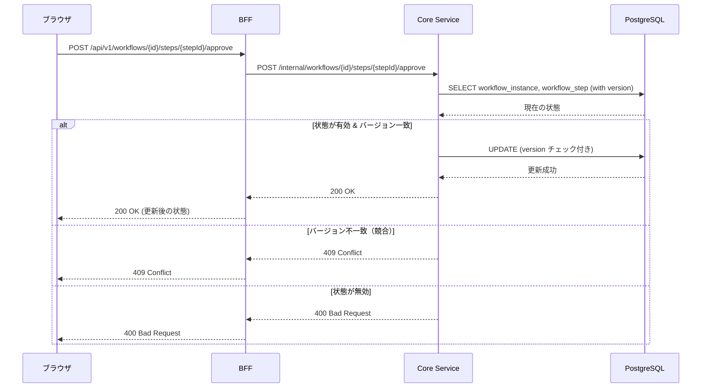
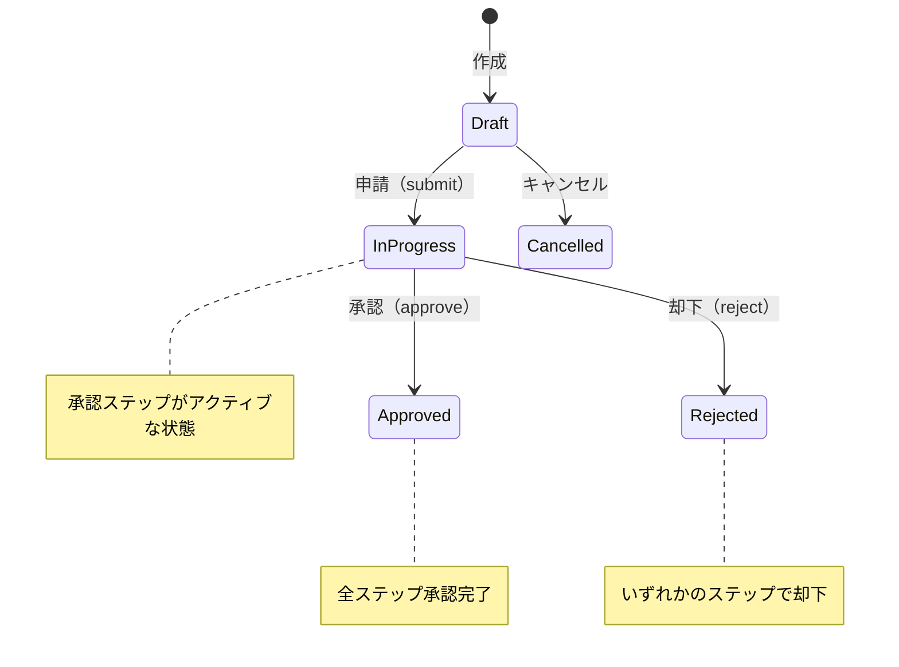

# ワークフロー承認/却下機能設計

## 概要

ワークフローインスタンスの承認/却下機能を実装する。
本機能は、重点学習テーマ「並行更新と状態整合性」を実践的に学ぶ機会として設計する。

## 要件

- **WF-102**: 承認・却下（各ステップでの承認/却下アクション）
- **非機能要件**: 並行更新への対処（楽観的ロック、競合検出）

## アーキテクチャ

### シーケンス図



### 状態遷移図



## API 設計

### エンドポイント

| メソッド | パス | 説明 |
|---------|------|------|
| POST | `/api/v1/workflows/{id}/steps/{stepId}/approve` | ステップを承認 |
| POST | `/api/v1/workflows/{id}/steps/{stepId}/reject` | ステップを却下 |

### リクエスト

```json
{
  "version": 1,
  "comment": "承認します（任意）"
}
```

| フィールド | 型 | 必須 | 説明 |
|-----------|-----|------|------|
| version | integer | ✓ | 楽観的ロック用バージョン番号 |
| comment | string | - | コメント（最大1000文字） |

### レスポンス

#### 成功時（200 OK）

```json
{
  "data": {
    "id": "...",
    "status": "Approved",
    "version": 2,
    "steps": [
      {
        "id": "...",
        "status": "Completed",
        "decision": "Approved",
        "version": 2
      }
    ]
  }
}
```

#### 競合時（409 Conflict）

```json
{
  "type": "https://ringiflow.example.com/errors/conflict",
  "title": "Conflict",
  "status": 409,
  "detail": "このワークフローは既に更新されています。最新の状態を取得してください。",
  "current_version": 2
}
```

## データモデル変更

### WorkflowInstance

```diff
 WorkflowInstance {
     id: WorkflowInstanceId,
     tenant_id: TenantId,
     definition_id: WorkflowDefinitionId,
     definition_version: Version,
     title: String,
     form_data: serde_json::Value,
     status: WorkflowStatus,
+    version: Version,           // 楽観的ロック用
     current_step_id: Option<WorkflowStepId>,
     initiated_by: UserId,
     submitted_at: Option<DateTime<Utc>>,
     completed_at: Option<DateTime<Utc>>,
     created_at: DateTime<Utc>,
     updated_at: DateTime<Utc>,
 }
```

### WorkflowStep

```diff
 WorkflowStep {
     id: WorkflowStepId,
     instance_id: WorkflowInstanceId,
     step_id: String,
     step_name: String,
     step_type: StepType,
     status: StepStatus,
+    version: Version,           // 楽観的ロック用
     assigned_to: Option<UserId>,
     decision: Option<StepDecision>,
     comment: Option<String>,
     due_date: Option<DateTime<Utc>>,
     started_at: Option<DateTime<Utc>>,
     completed_at: Option<DateTime<Utc>>,
     created_at: DateTime<Utc>,
     updated_at: DateTime<Utc>,
 }
```

### マイグレーション

```sql
-- workflow_instances テーブルに version カラムを追加
ALTER TABLE workflow_instances
ADD COLUMN version INTEGER NOT NULL DEFAULT 1;

-- workflow_steps テーブルに version カラムを追加
ALTER TABLE workflow_steps
ADD COLUMN version INTEGER NOT NULL DEFAULT 1;
```

## ドメインロジック

### 承認時の処理

```rust
impl WorkflowStep {
    pub fn approve(&self, comment: Option<String>) -> Result<Self, WorkflowError> {
        // 1. 状態チェック: Active のみ承認可能
        if self.status != StepStatus::Active {
            return Err(WorkflowError::InvalidStepStatus {
                expected: StepStatus::Active,
                actual: self.status,
            });
        }

        // 2. 状態遷移
        Ok(Self {
            status: StepStatus::Completed,
            decision: Some(StepDecision::Approved),
            comment,
            completed_at: Some(Utc::now()),
            version: self.version.next(),
            updated_at: Utc::now(),
            ..self.clone()
        })
    }
}

impl WorkflowInstance {
    pub fn complete_with_approval(&self) -> Result<Self, WorkflowError> {
        // MVP: 1段階承認のため、ステップ承認 = インスタンス承認
        if self.status != WorkflowStatus::InProgress {
            return Err(WorkflowError::InvalidStatus {
                expected: WorkflowStatus::InProgress,
                actual: self.status,
            });
        }

        Ok(Self {
            status: WorkflowStatus::Approved,
            completed_at: Some(Utc::now()),
            version: self.version.next(),
            updated_at: Utc::now(),
            ..self.clone()
        })
    }
}
```

### 却下時の処理

```rust
impl WorkflowStep {
    pub fn reject(&self, comment: Option<String>) -> Result<Self, WorkflowError> {
        if self.status != StepStatus::Active {
            return Err(WorkflowError::InvalidStepStatus {
                expected: StepStatus::Active,
                actual: self.status,
            });
        }

        Ok(Self {
            status: StepStatus::Completed,
            decision: Some(StepDecision::Rejected),
            comment,
            completed_at: Some(Utc::now()),
            version: self.version.next(),
            updated_at: Utc::now(),
            ..self.clone()
        })
    }
}

impl WorkflowInstance {
    pub fn complete_with_rejection(&self) -> Result<Self, WorkflowError> {
        if self.status != WorkflowStatus::InProgress {
            return Err(WorkflowError::InvalidStatus {
                expected: WorkflowStatus::InProgress,
                actual: self.status,
            });
        }

        Ok(Self {
            status: WorkflowStatus::Rejected,
            completed_at: Some(Utc::now()),
            version: self.version.next(),
            updated_at: Utc::now(),
            ..self.clone()
        })
    }
}
```

## 楽観的ロックの実装

### リポジトリ層

```rust
impl WorkflowInstanceRepository {
    pub async fn update_with_version_check(
        &self,
        instance: &WorkflowInstance,
        expected_version: Version,
    ) -> Result<(), RepositoryError> {
        let result = sqlx::query!(
            r#"
            UPDATE workflow_instances
            SET status = $1, version = $2, completed_at = $3, updated_at = $4
            WHERE id = $5 AND version = $6
            "#,
            instance.status.as_str(),
            instance.version.as_i32(),
            instance.completed_at,
            instance.updated_at,
            instance.id.as_uuid(),
            expected_version.as_i32(),
        )
        .execute(&self.pool)
        .await?;

        if result.rows_affected() == 0 {
            return Err(RepositoryError::Conflict {
                entity: "WorkflowInstance",
                id: instance.id.to_string(),
            });
        }

        Ok(())
    }
}
```

## 権限チェック

承認/却下は、該当ステップに割り当てられたユーザーのみ実行可能。

```rust
fn check_authorization(step: &WorkflowStep, user_id: &UserId) -> Result<(), WorkflowError> {
    match &step.assigned_to {
        Some(assigned) if assigned == user_id => Ok(()),
        _ => Err(WorkflowError::NotAssigned {
            step_id: step.id.clone(),
            user_id: user_id.clone(),
        }),
    }
}
```

## 並行更新シナリオ

### シナリオ1: 複数承認者の同時操作

MVP では1段階承認のため、承認者は1人。ただし、将来の拡張（並列承認）に備えて version による競合検出を実装。

### シナリオ2: 承認と取り下げの競合

申請者が取り下げ操作中に承認者が承認操作を実行するケース。

```
Time →
申請者: [GET workflow] ────────────────────── [POST cancel (version=1)] → 409 Conflict
承認者:         [GET workflow] ─ [POST approve (version=1)] → 200 OK (version=2)
```

## エラーコード

| HTTP | エラータイプ | 説明 |
|------|-------------|------|
| 400 | invalid-step-status | ステップが承認/却下可能な状態ではない |
| 403 | not-assigned | このステップの承認権限がない |
| 404 | workflow-not-found | ワークフローが見つからない |
| 404 | step-not-found | ステップが見つからない |
| 409 | conflict | 競合が発生（楽観的ロック失敗） |

## テスト観点

### 正常系

1. 承認権限のあるユーザーが承認できる
2. 承認権限のあるユーザーが却下できる
3. 承認後、ワークフローのステータスが Approved になる
4. 却下後、ワークフローのステータスが Rejected になる
5. コメント付きで承認/却下できる

### 異常系

1. 未割り当てのユーザーは承認/却下できない（403）
2. Active 以外のステップは承認/却下できない（400）
3. InProgress 以外のワークフローは完了できない（400）
4. バージョン不一致の場合は競合エラー（409）

### 競合検出

1. 同時に approve/reject を実行 → 後発が 409
2. approve 直後に cancel → 409

## 変更履歴

| 日付 | 変更内容 |
|------|---------|
| 2026-01-28 | 初版作成 |
