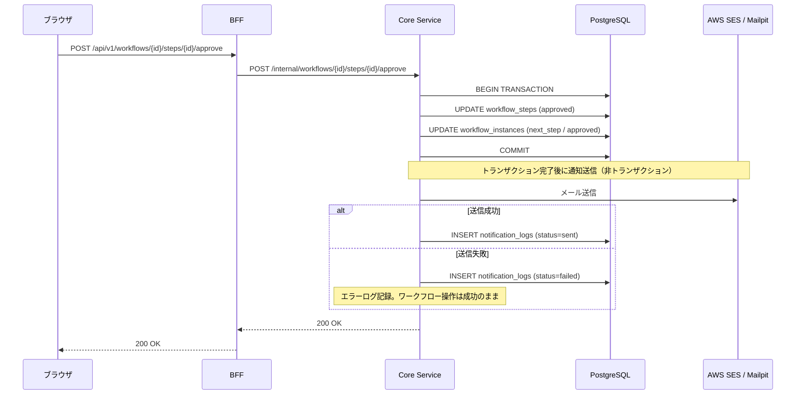
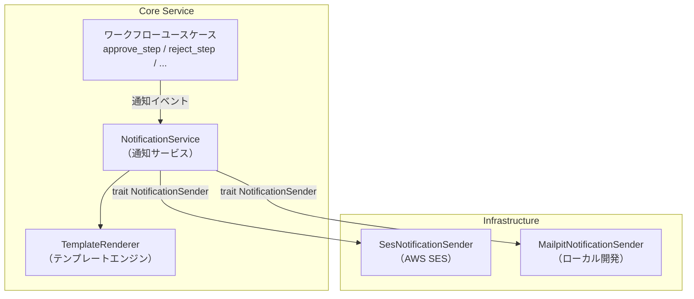

# 通知機能設計

> **実装状態**: 未実装（Phase 2-5 で実装予定）

## 概要

ワークフローの進行状況をメールで関係者に通知する機能の実装設計。Phase 2-5 では AWS SES を使ったメール通知基盤を構築し、承認依頼・承認完了・却下・差し戻しの 4 種類の通知を実装する。

### 要件

- NOTIFY-001: メール通知基盤

→ 機能仕様書: [05_通知機能.md](../20_機能仕様書/05_通知機能.md)

### Phase 2-5 のスコープ

| 対象 | 対象外（Phase 3 以降） |
|------|---------------------|
| メール通知（SES） | Slack / Teams / Webhook 通知 |
| 5 種類の通知イベント | アプリ内通知 |
| 送信ログ（PostgreSQL） | 通知設定 UI |
| Mailpit（ローカル開発） | 送信リトライ / Outbox パターン |

## アーキテクチャ

### シーケンス図（承認操作 → 通知送信）



### コンポーネント構成



### Phase 3 への移行パス

Phase 2-5 では Core Service 内で同期的にメールを送信する。Phase 3 以降、以下の手順で Outbox パターンに移行する:

1. `NotificationSender` trait の実装を SES 直接呼び出しから Outbox テーブル書き込みに変更
2. Lambda で Outbox テーブルをポーリングし、SES / Slack / Teams に送信
3. trait インターフェースが同じため、ユースケース層の変更は不要

## 設計判断

### 1. SES 連携方式

| 選択肢 | 説明 |
|--------|------|
| **直接 API 呼び出し（同期）（採用）** | ユースケースから直接 SES API を呼び出す |
| Outbox パターン（Phase 3） | DB に書き込み、非同期で送信 |
| SNS + Lambda | SNS トピックに通知、Lambda で処理 |

採用理由:
- Phase 2-5 のテナント規模（10 社程度）では直接呼び出しで十分
- trait 抽象化により、Phase 3 で Outbox パターンへの移行が可能
- 実装が最もシンプル

### 2. メールテンプレート管理

| 選択肢 | 説明 |
|--------|------|
| **アプリ側テンプレート（採用）** | Rust のテンプレートエンジンでレンダリング |
| SES テンプレート | SES のテンプレート機能を使用 |

採用理由:
- コードでバージョン管理が完結する
- ローカル開発（Mailpit）でもテンプレートが動作する
- テンプレートエンジンは tera（Jinja2 互換）を使用

### 3. 通知イベントモデル

| 選択肢 | 説明 |
|--------|------|
| **ユースケース呼び出し（採用）** | ユースケースから直接 NotificationService を呼び出す |
| ドメインイベント + ハンドラ | ドメインイベントを発行し、ハンドラが通知を処理 |

採用理由:
- Phase 2-5 では呼び出し元が明確（5 箇所のみ）で、イベントシステムは過剰
- Phase 3 でイベント駆動に移行する際は、ユースケースからの呼び出しをイベント発行に置き換える

### 4. ローカル開発環境（メール確認）

| 選択肢 | 説明 |
|--------|------|
| **Mailpit（採用）** | メール受信 + Web UI |
| MailHog | 同様の機能だがメンテナンス停滞 |
| コンソール出力 | メール内容をログに出力 |

採用理由:
- MailHog はメンテナンスが停滞（2020 年以降更新なし）。Mailpit が後継として活発に開発されている
- Web UI でメールの見た目を確認できる
- SMTP インターフェースで SES と互換

### 5. 通知ログ格納先

| 選択肢 | 説明 |
|--------|------|
| **PostgreSQL notification_logs（採用）** | RLS 対応、CASCADE 削除 |
| DynamoDB notifications | 基本設計の既存テーブル |

採用理由:
- DynamoDB の `notifications` テーブルは PK=user_id で Phase 3 のアプリ内通知（ユーザー別通知一覧）向け
- Phase 2-5 の送信ログは tenant_id ベースで RLS・CASCADE 削除の恩恵を受ける PostgreSQL が適切

## ローカル開発環境

### Mailpit（Docker Compose 追加）

`infra/docker/docker-compose.yaml` に以下を追加する:

```yaml
  # Mailpit（ローカルメール確認）
  # 本番環境: AWS SES
  # SMTP でメールを受信し、Web UI で確認できる
  mailpit:
    image: axllent/mailpit:latest
    ports:
      - "${MAILPIT_SMTP_PORT}:1025"   # SMTP
      - "${MAILPIT_UI_PORT}:8025"     # Web UI
    healthcheck:
      test: ["CMD-SHELL", "wget -qO- http://localhost:8025/api/v1/info || exit 1"]
      interval: 5s
      timeout: 5s
      retries: 5
      start_period: 5s
    restart: unless-stopped
```

環境変数のデフォルト値:

| 変数名 | デフォルト値 | 用途 |
|--------|------------|------|
| `MAILPIT_SMTP_PORT` | 11025 | SMTP ポート |
| `MAILPIT_UI_PORT` | 18025 | Web UI ポート |

API テスト用の `infra/docker/docker-compose.api-test.yaml` にも同様の設定を追加する。

### 環境切替

| 環境 | NotificationSender 実装 | 接続先 |
|------|------------------------|--------|
| ローカル開発 | `SmtpNotificationSender` | Mailpit（SMTP） |
| API テスト | `SmtpNotificationSender` | Mailpit（SMTP） |
| 本番 | `SesNotificationSender` | AWS SES API |

環境変数で切替:

```
# ローカル / API テスト
NOTIFICATION_BACKEND=smtp
SMTP_HOST=localhost
SMTP_PORT=11025

# 本番
NOTIFICATION_BACKEND=ses
AWS_REGION=ap-northeast-1
SES_FROM_ADDRESS=noreply@ringiflow.example.com
```

## API 設計

Phase 2-5 では通知専用の外部 API エンドポイントは提供しない。通知はワークフロー操作（承認・却下・差し戻し・申請）の副作用として送信される。

将来の API（Phase 3 以降）:

| メソッド | パス | 説明 |
|---------|------|------|
| GET | `/api/v1/notifications` | 通知一覧取得 |
| PUT | `/api/v1/notifications/{id}/read` | 既読にする |
| PUT | `/api/v1/notifications/read-all` | 全て既読にする |
| GET | `/api/v1/notifications/unread-count` | 未読件数取得 |

## データモデル

### notification_logs テーブル

ワークフロー操作に伴うメール通知の送信記録を保存する。

```sql
CREATE TABLE notification_logs (
    id                    UUID PRIMARY KEY DEFAULT gen_random_uuid(),
    tenant_id             UUID NOT NULL REFERENCES tenants(id) ON DELETE CASCADE,
    -- 通知イベント情報
    event_type            VARCHAR(50) NOT NULL,  -- approval_request, step_approved, approved, rejected, changes_requested
    -- ワークフロー情報
    workflow_instance_id  UUID NOT NULL REFERENCES workflow_instances(id) ON DELETE CASCADE,
    workflow_title        VARCHAR(255) NOT NULL,
    workflow_display_id   VARCHAR(50) NOT NULL,
    -- 送信情報
    recipient_user_id     UUID NOT NULL,
    recipient_email       VARCHAR(255) NOT NULL,
    subject               VARCHAR(500) NOT NULL,
    -- 送信結果
    status                VARCHAR(20) NOT NULL,  -- sent, failed
    error_message         TEXT,
    -- メタデータ
    sent_at               TIMESTAMPTZ NOT NULL DEFAULT NOW()
);

-- RLS ポリシー
ALTER TABLE notification_logs ENABLE ROW LEVEL SECURITY;

CREATE POLICY notification_logs_tenant_isolation ON notification_logs
    USING (tenant_id = current_setting('app.current_tenant_id')::UUID);

-- インデックス
CREATE INDEX idx_notification_logs_tenant_id ON notification_logs (tenant_id);
CREATE INDEX idx_notification_logs_workflow_instance_id ON notification_logs (workflow_instance_id);
CREATE INDEX idx_notification_logs_sent_at ON notification_logs (sent_at DESC);
```

| カラム | 型 | 説明 |
|--------|-----|------|
| id | UUID (v7) | 主キー |
| tenant_id | UUID | テナント ID（CASCADE 削除） |
| event_type | VARCHAR(50) | 通知イベント種別 |
| workflow_instance_id | UUID | 対象ワークフロー |
| workflow_title | VARCHAR(255) | ワークフロータイトル（送信時点のスナップショット） |
| workflow_display_id | VARCHAR(50) | 表示用 ID（WF-0042 等） |
| recipient_user_id | UUID | 受信者ユーザー ID |
| recipient_email | VARCHAR(255) | 送信先メールアドレス |
| subject | VARCHAR(500) | メール件名 |
| status | VARCHAR(20) | 送信結果（sent / failed） |
| error_message | TEXT | エラーメッセージ（失敗時のみ） |
| sent_at | TIMESTAMPTZ | 送信日時 |

### event_type の値

| event_type | 説明 | トリガー |
|------------|------|---------|
| `approval_request` | 承認依頼 | ステップが active になったとき |
| `step_approved` | ステップ承認（中間） | 中間ステップが承認されたとき |
| `approved` | 承認完了 | 最終ステップ承認でインスタンスが Approved |
| `rejected` | 却下 | ステップ却下でインスタンスが Rejected |
| `changes_requested` | 差し戻し | ステップ差し戻しでインスタンスが ChangesRequested |

## ドメインロジック

### NotificationSender trait

```rust
/// 通知送信の抽象化
///
/// Phase 2-5: SES / SMTP（Mailpit）直接送信
/// Phase 3: Outbox パターンに移行可能
#[async_trait]
pub trait NotificationSender: Send + Sync {
    async fn send_email(&self, email: &EmailMessage) -> Result<(), NotificationError>;
}

/// メールメッセージ
pub struct EmailMessage {
    pub to: String,            // 送信先メールアドレス
    pub subject: String,       // 件名
    pub html_body: String,     // HTML 本文
    pub text_body: String,     // プレーンテキスト本文
}

/// 通知送信エラー
pub enum NotificationError {
    /// メール送信に失敗
    SendFailed(String),
    /// テンプレートレンダリングに失敗
    TemplateFailed(String),
}
```

### WorkflowNotification enum

```rust
/// ワークフロー通知イベント
///
/// 各バリアントが機能仕様書の通知イベント（5 種類）に対応する
pub enum WorkflowNotification {
    /// 承認依頼: ステップが active になったとき → 承認者に送信
    ApprovalRequest {
        workflow_title: String,
        workflow_display_id: String,
        applicant_name: String,
        step_name: String,
        approver_email: String,
        approver_user_id: UserId,
    },
    /// ステップ承認（中間）: 多段階承認の中間ステップ承認 → 申請者に送信
    StepApproved {
        workflow_title: String,
        workflow_display_id: String,
        step_name: String,
        approver_name: String,
        applicant_email: String,
        applicant_user_id: UserId,
    },
    /// 承認完了: 最終ステップ承認でインスタンスが Approved → 申請者に送信
    Approved {
        workflow_title: String,
        workflow_display_id: String,
        applicant_email: String,
        applicant_user_id: UserId,
    },
    /// 却下: ステップ却下でインスタンスが Rejected → 申請者に送信
    Rejected {
        workflow_title: String,
        workflow_display_id: String,
        comment: Option<String>,
        applicant_email: String,
        applicant_user_id: UserId,
    },
    /// 差し戻し: ステップ差し戻しでインスタンスが ChangesRequested → 申請者に送信
    ChangesRequested {
        workflow_title: String,
        workflow_display_id: String,
        comment: Option<String>,
        applicant_email: String,
        applicant_user_id: UserId,
    },
}
```

### NotificationService

```rust
/// 通知サービス
///
/// ワークフロー通知イベントを受け取り、テンプレートでメールを生成して送信する。
/// 送信結果は notification_logs テーブルに記録する。
pub struct NotificationService {
    sender: Arc<dyn NotificationSender>,
    template_renderer: TemplateRenderer,
    log_repo: Arc<dyn NotificationLogRepository>,
    base_url: String,  // メール内リンクのベース URL
}

impl NotificationService {
    /// 通知を送信し、結果をログに記録する
    ///
    /// 送信に失敗してもエラーを返さない（ログに記録するのみ）。
    /// ワークフロー操作を通知失敗でロールバックしないための設計。
    pub async fn notify(
        &self,
        notification: WorkflowNotification,
        tenant_id: &TenantId,
        workflow_instance_id: &WorkflowInstanceId,
    ) {
        let email = self.template_renderer.render(&notification, &self.base_url);

        match &email {
            Ok(email_message) => {
                match self.sender.send_email(email_message).await {
                    Ok(()) => {
                        self.log_notification(
                            tenant_id, workflow_instance_id, &notification,
                            email_message, "sent", None,
                        ).await;
                    }
                    Err(e) => {
                        tracing::error!(
                            error.category = "notification",
                            error.kind = "send_failed",
                            "通知送信に失敗: {}", e
                        );
                        self.log_notification(
                            tenant_id, workflow_instance_id, &notification,
                            email_message, "failed", Some(&e.to_string()),
                        ).await;
                    }
                }
            }
            Err(e) => {
                tracing::error!(
                    error.category = "notification",
                    error.kind = "template_failed",
                    "テンプレートレンダリングに失敗: {}", e
                );
            }
        }
    }
}
```

### TemplateRenderer

```rust
/// メールテンプレートレンダリング
///
/// tera（Jinja2 互換）テンプレートエンジンを使用して、
/// HTML 形式とプレーンテキスト形式の両方を生成する。
pub struct TemplateRenderer {
    engine: tera::Tera,
}

impl TemplateRenderer {
    pub fn new() -> Result<Self, NotificationError> {
        let mut engine = tera::Tera::default();
        // テンプレートファイルを登録
        // templates/notifications/*.html, templates/notifications/*.txt
        engine.add_raw_templates(vec![
            ("approval_request.html", include_str!("../templates/notifications/approval_request.html")),
            ("approval_request.txt", include_str!("../templates/notifications/approval_request.txt")),
            // ... 各通知種別のテンプレート
        ])?;
        Ok(Self { engine })
    }

    pub fn render(
        &self,
        notification: &WorkflowNotification,
        base_url: &str,
    ) -> Result<EmailMessage, NotificationError> {
        let (template_name, subject, context) = match notification {
            WorkflowNotification::ApprovalRequest { workflow_title, workflow_display_id, .. } => {
                (
                    "approval_request",
                    format!("[RingiFlow] 承認依頼: {} {}", workflow_title, workflow_display_id),
                    // tera::Context にフィールドを設定
                    build_context(notification, base_url),
                )
            }
            // ... 他の通知種別
        };

        let html_body = self.engine.render(&format!("{}.html", template_name), &context)?;
        let text_body = self.engine.render(&format!("{}.txt", template_name), &context)?;

        Ok(EmailMessage {
            to: notification.recipient_email().to_string(),
            subject,
            html_body,
            text_body,
        })
    }
}
```

### メール件名パターン

| 通知イベント | 件名 |
|------------|------|
| 承認依頼 | `[RingiFlow] 承認依頼: {title} {display_id}` |
| ステップ承認（中間） | `[RingiFlow] ステップ承認: {title} {display_id}` |
| 承認完了 | `[RingiFlow] 承認完了: {title} {display_id}` |
| 却下 | `[RingiFlow] 却下: {title} {display_id}` |
| 差し戻し | `[RingiFlow] 要修正: {title} {display_id}` |

### メール送信元

| 項目 | 値 |
|------|-----|
| From アドレス | `noreply@ringiflow.example.com`（環境変数 `SES_FROM_ADDRESS` で設定） |
| From 名 | `RingiFlow` |
| Reply-To | 設定しない |

## ユースケース統合

既存のワークフローユースケースに `NotificationService` を注入し、トランザクション完了後に通知を送信する。

### 通知送信タイミング

| ユースケース | ファイル | 通知イベント |
|-------------|--------|-------------|
| `submit_workflow` | `command/lifecycle.rs` | `ApprovalRequest`（最初のステップの承認者へ） |
| `approve_step`（中間） | `command/decision/approve.rs` | `StepApproved`（申請者へ） + `ApprovalRequest`（次の承認者へ） |
| `approve_step`（最終） | `command/decision/approve.rs` | `Approved`（申請者へ） |
| `reject_step` | `command/decision/reject.rs` | `Rejected`（申請者へ） |
| `request_changes` | `command/decision/request_changes.rs` | `ChangesRequested`（申請者へ） |
| `resubmit_workflow` | `command/lifecycle.rs` | `ApprovalRequest`（最初のステップの承認者へ） |

### 統合パターン

```rust
// approve_step の通知統合例（トランザクション完了後）
pub async fn approve_step(
    &self,
    input: ApproveRejectInput,
    step_id: WorkflowStepId,
    tenant_id: TenantId,
    user_id: UserId,
) -> Result<WorkflowWithSteps, CoreError> {
    // ... 既存のトランザクション処理 ...

    // トランザクション完了後に通知送信
    // 通知失敗はエラーを返さない（fire-and-forget）
    if is_final_step {
        self.notification_service.notify(
            WorkflowNotification::Approved { /* ... */ },
            &tenant_id,
            instance.id(),
        ).await;
    } else {
        // 中間ステップ: 申請者にステップ承認通知 + 次の承認者に承認依頼通知
        self.notification_service.notify(
            WorkflowNotification::StepApproved { /* ... */ },
            &tenant_id,
            instance.id(),
        ).await;
        self.notification_service.notify(
            WorkflowNotification::ApprovalRequest { /* ... */ },
            &tenant_id,
            instance.id(),
        ).await;
    }

    Ok(WorkflowWithSteps { instance, steps })
}
```

### WorkflowUseCaseImpl への NotificationService 追加

```rust
pub struct WorkflowUseCaseImpl {
    // ... 既存フィールド ...
    notification_service: Arc<NotificationService>,
}
```

## フロントエンド

Phase 2-5 ではフロントエンドの変更はない。通知はバックエンドからメールとして送信され、ユーザーはメールクライアントで確認する。

Phase 3 以降で以下を追加予定:
- 通知ベルアイコン（ヘッダー）
- 通知ドロップダウン
- 通知一覧ページ

## テスト観点

### ドメイン（ユニットテスト）

- `WorkflowNotification` の各バリアントからメール件名・本文が正しく生成される
- `TemplateRenderer` が HTML とプレーンテキストの両方を生成する
- テンプレート内の変数（タイトル、表示用 ID、コメント等）が正しく展開される
- `NotificationService.notify()` が送信失敗時にエラーを返さない

### ハンドラテスト

- `approve_step` の正常系で通知が送信される（mock NotificationSender で検証）
- `reject_step`, `request_changes` で正しい通知イベントが生成される
- 通知送信失敗時にワークフロー操作が成功する

### 統合テスト（Mailpit）

- ワークフロー申請 → Mailpit に承認依頼メールが届く
- 承認完了 → Mailpit に承認完了メールが届く
- メールの件名・本文が仕様通りか Mailpit API で検証

### E2E テスト

Phase 2-5 では E2E テストでのメール受信確認は行わない。ユースケースの統合テスト（Mailpit API）でカバーする。

## テナント退会削除対応

`notification_logs` テーブルはテナント退会時に CASCADE で自動削除される。

追加対応:
1. `notification_logs` を [テナント退会時データ削除設計](06_テナント退会時データ削除設計.md) の削除対象一覧に追加
2. 削除レジストリに `PostgresNotificationLogDeleter` を登録
3. `DeletionManifest.DataCounts` に `postgres_notification_logs` を追加

## イベントログ統合

`event_log.rs` に通知関連の定数を追加する:

```rust
pub mod category {
    pub const NOTIFICATION: &str = "notification";
}

pub mod action {
    pub const NOTIFICATION_SENT: &str = "notification.sent";
    pub const NOTIFICATION_FAILED: &str = "notification.failed";
}

pub mod entity_type {
    pub const NOTIFICATION_LOG: &str = "notification_log";
}
```

## 関連ドキュメント

- [機能仕様書: 通知機能](../20_機能仕様書/05_通知機能.md)
- [コア要件（通知機能）](../10_要件定義書/01_コア要件.md) 4.5 節
- [アーキテクチャ設計 BATCH-203](../30_基本設計書/01_アーキテクチャ設計.md)
- [テナント退会時データ削除設計](06_テナント退会時データ削除設計.md)
- [ワークフロー承認却下機能設計](11_ワークフロー承認却下機能設計.md)

## 変更履歴

| 日付 | 変更内容 |
|------|---------|
| 2026-02-24 | 初版作成（#846） |
