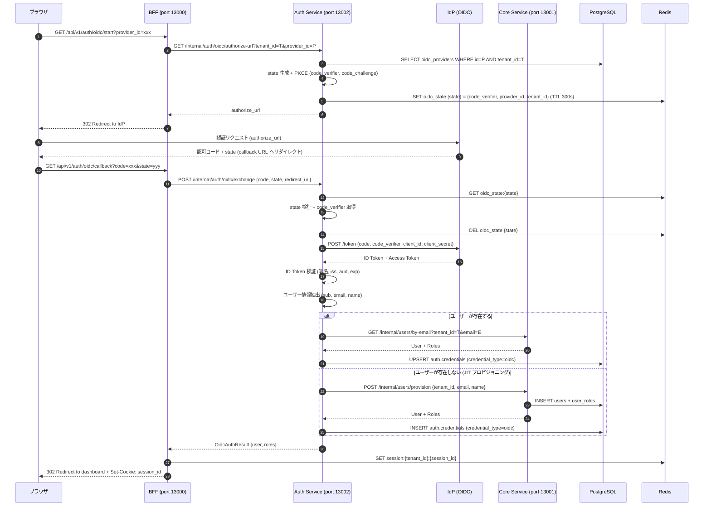
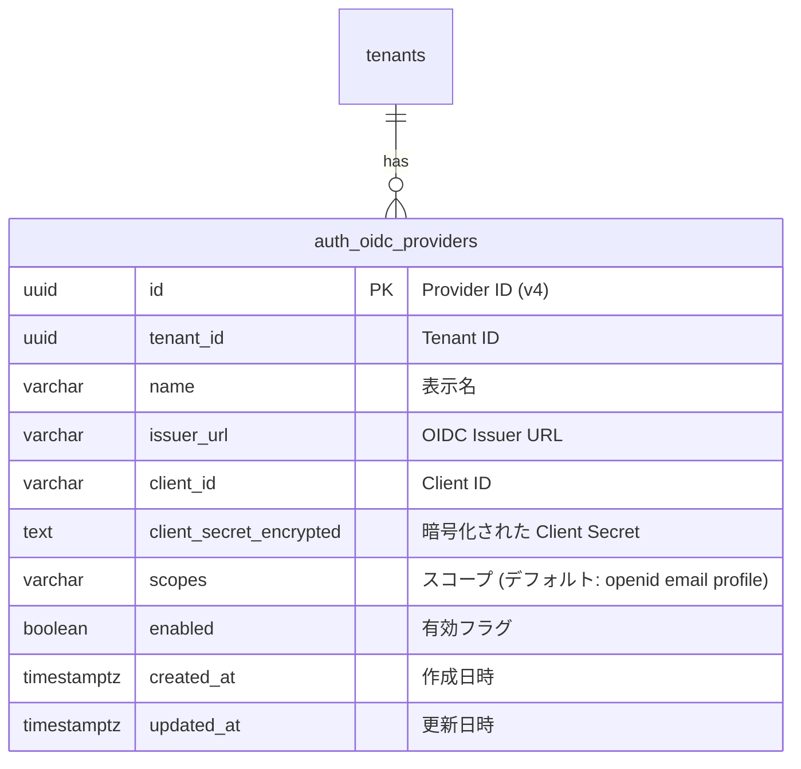
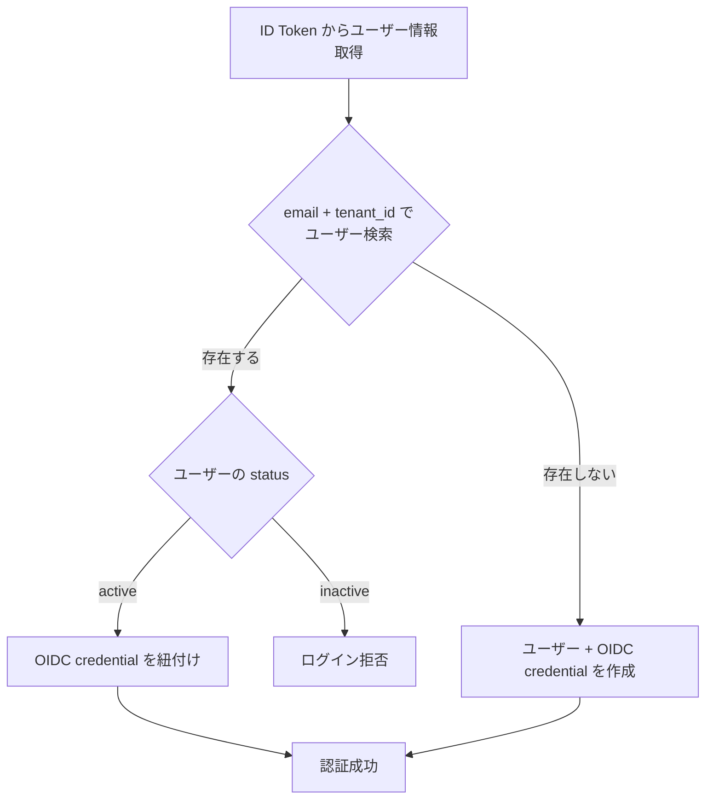
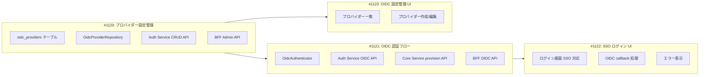

# SSO（OIDC）認証設計

> **実装状態**: 未実装（Phase 3-1 で実装予定）

## 概要

本ドキュメントは、RingiFlow Phase 3-1 の SSO（OIDC）認証機能の詳細設計を定義する。

### 対象要件

| 要件 ID | 要件名 | 説明 |
|---------|--------|------|
| AUTH-003 | SSO 連携（OIDC） | OpenID Connect + PKCE による認証連携 |
| AUTH-010 | トークン秘匿（BFF） | BFF でトークンを保持し、ブラウザに露出しない |

### Phase 3-1 スコープ

| 含めるもの | 含めないもの（Phase 3 後続） |
|-----------|---------------------------|
| OIDC 認証フロー（Authorization Code + PKCE） | SAML 2.0 連携 |
| テナント別 OIDC プロバイダー設定管理 | MFA（TOTP） |
| JIT ユーザープロビジョニング | SCIM プロビジョニング |
| BFF → Auth Service でのトークン交換 | IdP 接続テスト機能 |
| SSO ログイン UI | ソーシャルログイン |
| OIDC 設定管理 UI | — |

### 関連ドキュメント

- [07_認証機能設計.md](./07_認証機能設計.md) — Phase 1 認証（メール/パスワード）
- [08_AuthService設計.md](./08_AuthService設計.md) — Auth Service 分離（Phase 2）
- [07_SSO認証.md](../20_機能仕様書/07_SSO認証.md) — 機能仕様書

---

## アーキテクチャ

### OIDC 認証フロー全体像



### 責務分担

| コンポーネント | SSO での責務 | 既存責務との関係 |
|--------------|-------------|----------------|
| BFF | SSO エンドポイント提供、セッション作成、リダイレクト処理 | セッション管理・Cookie は既存のまま流用 |
| Auth Service | OIDC プロトコル処理（authorize URL 構築、トークン交換、ID Token 検証）、OIDC プロバイダー設定管理、credentials 管理 | 08_AuthService設計.md で「将来の SSO/MFA」として予定済み |
| Core Service | ユーザー情報取得、JIT プロビジョニング（ユーザー作成） | 既存の users API を拡張 |
| Redis | OIDC state + PKCE 一時保存 | セッションストアと共存 |
| PostgreSQL | OIDC プロバイダー設定保存（auth スキーマ）、credentials 保存 | auth スキーマは 08_AuthService設計.md で導入予定 |

---

## API 設計

### BFF 公開 API

#### GET /api/v1/auth/oidc/start

OIDC 認証フローを開始する。IdP の認証画面にリダイレクトする。

**クエリパラメータ:**

| パラメータ | 必須 | 説明 |
|-----------|------|------|
| provider_id | ✓ | OIDC プロバイダーの ID |

**レスポンス（302 Found）:**

```
Location: https://idp.example.com/authorize?
  response_type=code&
  client_id=xxx&
  redirect_uri=https://app.ringiflow.example.com/api/v1/auth/oidc/callback&
  scope=openid+email+profile&
  state=yyy&
  code_challenge=zzz&
  code_challenge_method=S256
```

**エラー（404 Not Found）:**
```json
{
  "type": "https://ringiflow.example.com/errors/not-found",
  "title": "Not Found",
  "status": 404,
  "detail": "指定された OIDC プロバイダーが見つかりません"
}
```

**エラー（400 Bad Request）:**
```json
{
  "type": "https://ringiflow.example.com/errors/provider-disabled",
  "title": "Provider Disabled",
  "status": 400,
  "detail": "指定された OIDC プロバイダーは無効化されています"
}
```

---

#### GET /api/v1/auth/oidc/callback

IdP からのコールバックを処理する。トークン交換、ユーザー照合/作成後、セッションを確立してダッシュボードにリダイレクトする。

**クエリパラメータ:**

| パラメータ | 説明 |
|-----------|------|
| code | IdP が発行した認可コード |
| state | CSRF 防止用の state パラメータ |
| error | IdP がエラーを返した場合のエラーコード |
| error_description | エラーの説明 |

**レスポンス（302 Found — 成功）:**

```
Location: /
Set-Cookie: session_id=xxx; HttpOnly; Secure; SameSite=Lax; Path=/; Max-Age=28800
```

**レスポンス（302 Found — エラー）:**

```
Location: /login?error=sso_failed
```

SSO エラー時はログイン画面にリダイレクトし、エラーコードのみをクエリパラメータで渡す。フロントエンドがコードに対応するメッセージを表示する（URL にユーザー向けメッセージを含めない。XSS リスク回避、URL のクリーンさ維持）。

| エラー種別 | error 値 | フロントエンドが表示するメッセージ |
|-----------|---------|-------------------------------|
| IdP がエラーを返した | sso_failed | SSO 認証に失敗しました |
| state が無効 | invalid_session | 認証セッションが無効です。再度お試しください |
| トークン交換失敗 | sso_failed | SSO 認証に失敗しました |
| ユーザーが無効化済み | account_disabled | アカウントが無効化されています |

---

#### OIDC プロバイダー管理 API

テナント管理者が OIDC プロバイダー設定を管理する API。

##### GET /api/v1/admin/oidc-providers

テナントの OIDC プロバイダー一覧を取得する。

**レスポンス（200 OK）:**
```json
{
  "data": [
    {
      "id": "550e8400-e29b-41d4-a716-446655440000",
      "name": "Okta",
      "issuer_url": "https://abc-corp.okta.com",
      "client_id": "0oa1234567890abcdef",
      "enabled": true,
      "created_at": "2026-03-14T10:00:00Z",
      "updated_at": "2026-03-14T10:00:00Z"
    }
  ]
}
```

注: `client_secret` はレスポンスに含めない（セキュリティ）。

##### POST /api/v1/admin/oidc-providers

OIDC プロバイダーを追加する。

**リクエスト:**
```json
{
  "name": "Okta",
  "issuer_url": "https://abc-corp.okta.com",
  "client_id": "0oa1234567890abcdef",
  "client_secret": "secret_value"
}
```

**レスポンス（201 Created）:**
```json
{
  "data": {
    "id": "550e8400-e29b-41d4-a716-446655440000",
    "name": "Okta",
    "issuer_url": "https://abc-corp.okta.com",
    "client_id": "0oa1234567890abcdef",
    "enabled": true,
    "created_at": "2026-03-14T10:00:00Z",
    "updated_at": "2026-03-14T10:00:00Z"
  }
}
```

**バリデーションエラー（422 Unprocessable Entity）:**
```json
{
  "type": "https://ringiflow.example.com/errors/validation-error",
  "title": "Validation Error",
  "status": 422,
  "detail": "入力内容に誤りがあります",
  "errors": [
    { "field": "issuer_url", "message": "有効な HTTPS URL を入力してください" }
  ]
}
```

##### PUT /api/v1/admin/oidc-providers/{id}

OIDC プロバイダーを更新する。

**リクエスト:**
```json
{
  "name": "Okta (Updated)",
  "issuer_url": "https://abc-corp.okta.com",
  "client_id": "0oa1234567890abcdef",
  "client_secret": "new_secret_value"
}
```

注: `client_secret` は省略可。省略時は既存の値を維持する。

**レスポンス（200 OK）:** POST と同じ形式。

##### DELETE /api/v1/admin/oidc-providers/{id}

OIDC プロバイダーを削除する。

**レスポンス（204 No Content）:** 空

**エラー（409 Conflict）:**
```json
{
  "type": "https://ringiflow.example.com/errors/conflict",
  "title": "Conflict",
  "status": 409,
  "detail": "有効なプロバイダーは削除できません。先に無効化してください"
}
```

##### PATCH /api/v1/admin/oidc-providers/{id}/enable

OIDC プロバイダーを有効化する。

**レスポンス（200 OK）:** GET のレスポンスと同じ形式（`enabled: true`）。

##### PATCH /api/v1/admin/oidc-providers/{id}/disable

OIDC プロバイダーを無効化する。

**レスポンス（200 OK）:** GET のレスポンスと同じ形式（`enabled: false`）。

---

### Auth Service 内部 API

#### GET /internal/auth/oidc/authorize-url

OIDC 認証開始時の authorize URL を生成する。

**クエリパラメータ:**

| パラメータ | 説明 |
|-----------|------|
| tenant_id | テナント ID |
| provider_id | OIDC プロバイダー ID |
| redirect_uri | BFF のコールバック URL |

**レスポンス（200 OK）:**
```json
{
  "authorize_url": "https://idp.example.com/authorize?response_type=code&client_id=xxx&..."
}
```

#### POST /internal/auth/oidc/exchange

認可コードをトークンに交換し、ユーザー情報を返す。JIT プロビジョニングもこの中で実行する。

**リクエスト:**
```json
{
  "code": "authorization_code",
  "state": "state_value",
  "redirect_uri": "https://app.ringiflow.example.com/api/v1/auth/oidc/callback"
}
```

**レスポンス（200 OK）:**
```json
{
  "user": {
    "id": "550e8400-e29b-41d4-a716-446655440000",
    "tenant_id": "550e8400-e29b-41d4-a716-446655440001",
    "email": "user@example.com",
    "name": "山田 太郎",
    "status": "active"
  },
  "roles": [
    {
      "id": "...",
      "name": "user",
      "permissions": ["workflow:read", "workflow:create", "task:read", "task:update"]
    }
  ],
  "is_new_user": false
}
```

**エラー:**

| HTTP ステータス | エラータイプ | 説明 |
|----------------|-------------|------|
| 400 | invalid-state | state パラメータが無効（期限切れ、不一致） |
| 400 | token-exchange-failed | IdP でのトークン交換に失敗 |
| 400 | invalid-id-token | ID Token の検証に失敗 |
| 403 | account-disabled | ユーザーアカウントが無効化されている |

---

### Core Service 内部 API

#### POST /internal/users/provision

JIT プロビジョニングでユーザーを作成する。

**リクエスト:**
```json
{
  "tenant_id": "550e8400-e29b-41d4-a716-446655440001",
  "email": "user@example.com",
  "name": "山田 太郎"
}
```

**レスポンス（201 Created）:**
```json
{
  "user": {
    "id": "550e8400-e29b-41d4-a716-446655440000",
    "tenant_id": "550e8400-e29b-41d4-a716-446655440001",
    "email": "user@example.com",
    "name": "山田 太郎",
    "status": "active"
  },
  "roles": [
    {
      "id": "...",
      "name": "user",
      "permissions": ["workflow:read", "workflow:create", "task:read", "task:update"]
    }
  ]
}
```

---

## データベース設計

### auth.oidc_providers テーブル

OIDC プロバイダーのテナント別設定を管理する。Auth Service が所有する `auth` スキーマに配置する。



| カラム | 型 | NULL | デフォルト | 説明 |
|--------|------|------|------------|------|
| id | UUID | NO | gen_random_uuid() | 主キー（v4） |
| tenant_id | UUID | NO | - | テナント ID |
| name | VARCHAR(100) | NO | - | 表示名 |
| issuer_url | VARCHAR(500) | NO | - | OIDC Issuer URL |
| client_id | VARCHAR(255) | NO | - | Client ID |
| client_secret_encrypted | TEXT | NO | - | 暗号化された Client Secret |
| scopes | VARCHAR(500) | NO | 'openid email profile' | スコープ |
| enabled | BOOLEAN | NO | true | 有効フラグ |
| created_at | TIMESTAMPTZ | NO | now() | 作成日時 |
| updated_at | TIMESTAMPTZ | NO | now() | 更新日時 |

**インデックス:**
- `(tenant_id)` — テナント内のプロバイダー検索
- `(tenant_id, enabled)` — 有効なプロバイダーのフィルタリング

**マイグレーション:**

```sql
CREATE TABLE auth.oidc_providers (
    id UUID PRIMARY KEY DEFAULT gen_random_uuid(),
    tenant_id UUID NOT NULL,
    name VARCHAR(100) NOT NULL,
    issuer_url VARCHAR(500) NOT NULL,
    client_id VARCHAR(255) NOT NULL,
    client_secret_encrypted TEXT NOT NULL,
    scopes VARCHAR(500) NOT NULL DEFAULT 'openid email profile',
    enabled BOOLEAN NOT NULL DEFAULT true,
    created_at TIMESTAMPTZ NOT NULL DEFAULT now(),
    updated_at TIMESTAMPTZ NOT NULL DEFAULT now()
);

CREATE INDEX idx_oidc_providers_tenant_id ON auth.oidc_providers (tenant_id);
CREATE INDEX idx_oidc_providers_tenant_enabled ON auth.oidc_providers (tenant_id, enabled);
```

### auth.credentials テーブルとの関係

OIDC ユーザーの認証情報は、08_AuthService設計.md で定義済みの `auth.credentials` テーブルに格納する。

| フィールド | OIDC での値 |
|-----------|------------|
| credential_type | `'oidc'` |
| credential_data | `{"sub": "OIDC sub claim", "issuer": "Issuer URL", "provider_id": "Provider UUID"}` |
| is_active | `true` |

1 ユーザーが複数の認証方式を持てる（password + oidc）。これにより、SSO 導入前にメール/パスワードで登録したユーザーも、SSO を追加利用できる。

### Redis キー設計

| キー | 値 | TTL | 説明 |
|-----|-----|-----|------|
| `oidc_state:{state}` | `{code_verifier, provider_id, tenant_id}` (JSON) | 300秒 | OIDC state + PKCE 一時保存 |

注: セッション関連のキー（`session:*`, `csrf:*`）は既存設計（07_認証機能設計.md）を流用する。

---

## セキュリティ考慮事項

### OIDC プロトコルのセキュリティ

| 対策 | 実装内容 | 防御対象 |
|------|---------|---------|
| state パラメータ | 暗号論的ランダム値を生成し、Redis に保存。callback 時に照合 | CSRF 攻撃（OIDC フロー中の不正リダイレクト） |
| PKCE (S256) | code_verifier/code_challenge のペアを生成。Public Client でなくとも Confidential Client でも推奨 | 認可コード横取り攻撃 |
| トークン秘匿 | ID Token/Access Token/Refresh Token は BFF と Auth Service 内でのみ保持。ブラウザには一切露出しない | XSS によるトークン漏洩 |
| ID Token 検証 | 署名検証（IdP の JWKS で公開鍵を取得）、iss/aud/exp の検証 | トークン偽造・改ざん |
| redirect_uri 検証 | 完全一致のみ許可。ワイルドカード不可 | オープンリダイレクト攻撃 |

### Client Secret の保護

| 対策 | 説明 |
|------|------|
| 保存時の暗号化 | `client_secret_encrypted` カラムにアプリケーションレベルで暗号化して保存（AES-256-GCM） |
| API レスポンスでの非露出 | GET /admin/oidc-providers のレスポンスに `client_secret` を含めない |
| ログへの非出力 | ログ出力時に `client_secret` をマスクする |

### 攻撃対策マトリックス

| 攻撃 | 対策 |
|------|------|
| CSRF（OIDC フロー） | state パラメータ検証 |
| 認可コード横取り | PKCE (S256) |
| トークン漏洩（XSS） | BFF/Auth Service 内に秘匿（AUTH-010） |
| ID Token 偽造 | 署名検証 + iss/aud/exp 検証 |
| Client Secret 漏洩 | 暗号化保存 + API 非露出 |
| オープンリダイレクト | redirect_uri 完全一致検証 |
| セッションハイジャック | 既存のセッション管理（HTTPOnly + Secure + SameSite Cookie） |

---

## JIT プロビジョニング設計

### フロー



### ユーザー照合ルール

| 条件 | 動作 | 理由 |
|------|------|------|
| email + tenant_id で既存ユーザー（active）が見つかる | 既存ユーザーに OIDC credential を紐付け | アカウント統合。パスワードと SSO の両方で認証可能になる |
| email + tenant_id で既存ユーザー（inactive）が見つかる | ログイン拒否（403） | 無効化されたユーザーの再有効化は管理者操作が必要 |
| 一致するユーザーが存在しない | 新規ユーザー作成 + OIDC credential 作成 | JIT プロビジョニング。デフォルトロール（一般ユーザー）を割り当て |

### JIT で作成される credentials レコード

```json
{
  "user_id": "<ユーザーID>",
  "tenant_id": "<テナントID>",
  "credential_type": "oidc",
  "credential_data": "{\"sub\": \"<OIDC sub>\", \"issuer\": \"<Issuer URL>\", \"provider_id\": \"<Provider ID>\"}",
  "is_active": true
}
```

---

## 実装コンポーネント

### 実装順序



### ファイル構成

```
backend/
├── apps/
│   ├── auth-service/
│   │   └── src/
│   │       ├── usecase/
│   │       │   ├── oidc_auth.rs          # OIDC 認証ユースケース
│   │       │   └── oidc_provider.rs      # プロバイダー管理ユースケース
│   │       └── handler/
│   │           ├── oidc_auth.rs          # OIDC 認証ハンドラ
│   │           └── oidc_provider.rs      # プロバイダー管理ハンドラ
│   ├── bff/
│   │   └── src/
│   │       ├── handler/
│   │       │   ├── oidc_auth.rs          # OIDC 認証ハンドラ（BFF）
│   │       │   └── oidc_provider.rs      # プロバイダー管理ハンドラ（BFF）
│   │       └── client/
│   │           └── auth_api.rs           # Auth Service クライアント（OIDC 拡張）
│   └── core-service/
│       └── src/
│           └── handler/
│               └── user.rs              # JIT プロビジョニングエンドポイント追加
├── crates/
│   └── infra/
│       └── src/
│           └── repository/
│               └── oidc_provider_repository.rs  # OIDC プロバイダーリポジトリ
└── migrations/
    └── YYYYMMDDHHMMSS_create_oidc_providers.sql
```

### インターフェース定義

#### OidcProviderRepository

```rust
#[async_trait]
pub trait OidcProviderRepository: Send + Sync {
    /// テナントの OIDC プロバイダー一覧を取得
    async fn find_by_tenant_id(
        &self,
        tenant_id: &TenantId,
    ) -> Result<Vec<OidcProvider>, InfraError>;

    /// テナントの有効な OIDC プロバイダー一覧を取得
    async fn find_enabled_by_tenant_id(
        &self,
        tenant_id: &TenantId,
    ) -> Result<Vec<OidcProvider>, InfraError>;

    /// ID で OIDC プロバイダーを取得（テナント分離を構造的に保証）
    async fn find_by_id(
        &self,
        id: &OidcProviderId,
        tenant_id: &TenantId,
    ) -> Result<Option<OidcProvider>, InfraError>;

    /// OIDC プロバイダーを作成
    async fn create(
        &self,
        provider: &NewOidcProvider,
    ) -> Result<OidcProvider, InfraError>;

    /// OIDC プロバイダーを更新
    async fn update(
        &self,
        provider: &OidcProvider,
    ) -> Result<OidcProvider, InfraError>;

    /// OIDC プロバイダーを削除（テナント分離を構造的に保証）
    async fn delete(
        &self,
        id: &OidcProviderId,
        tenant_id: &TenantId,
    ) -> Result<(), InfraError>;
}
```

#### OidcAuthenticator

```rust
#[async_trait]
pub trait OidcAuthenticator: Send + Sync {
    /// OIDC 認証開始用の authorize URL を生成
    async fn build_authorize_url(
        &self,
        tenant_id: &TenantId,
        provider_id: &OidcProviderId,
        redirect_uri: &str,
    ) -> Result<String, AuthError>;

    /// 認可コードをトークンに交換し、ユーザー情報を返す
    /// tenant_id は state から復元する（引数で渡さない）
    async fn exchange_code(
        &self,
        code: &str,
        state: &str,
        redirect_uri: &str,
    ) -> Result<OidcAuthResult, AuthError>;
}
```

---

## テスト計画

### 単体テスト

| 対象 | テストケース |
|------|-------------|
| ID Token 検証 | 有効な ID Token、期限切れ、不正な署名、不正な issuer、不正な audience |
| PKCE | code_verifier/code_challenge の生成と検証 |
| Client Secret 暗号化/復号 | 暗号化→復号で元の値が復元される |

### 統合テスト

| 対象/シナリオ | テストケース |
|--------------|-------------|
| OidcProviderRepository | CRUD 操作、テナント分離、有効プロバイダーのみ取得 |
| OIDC プロバイダー管理 API | 作成、更新、削除、有効化/無効化、バリデーションエラー |
| OIDC 認証フロー | 正常な認証フロー（モック IdP）、無効な state、無効な認可コード |
| JIT プロビジョニング | 新規ユーザー作成、既存ユーザーとの照合、inactive ユーザーの拒否 |
| セッション作成 | SSO ログイン後のセッション確立、Cookie 設定 |

### API テスト（Hurl）

| シナリオ | テストケース |
|---------|-------------|
| OIDC プロバイダー CRUD | 作成→一覧→更新→無効化→有効化→削除 |
| プロバイダー管理の認可 | 一般ユーザーによる管理 API 呼び出しが 403 |

### E2E テスト（Playwright）

| シナリオ | テストケース |
|---------|-------------|
| SSO ログイン | ログイン画面 → SSO ボタン → モック IdP → ダッシュボード |
| SSO エラー | ログイン画面 → SSO ボタン → モック IdP でエラー → エラーメッセージ表示 |
| プロバイダー設定 | テナント設定 → SSO タブ → プロバイダー追加 → 一覧に表示 |

---

## 変更履歴

| 日付 | 変更内容 | 担当 |
|------|---------|------|
| 2026-03-14 | 初版作成 | - |
