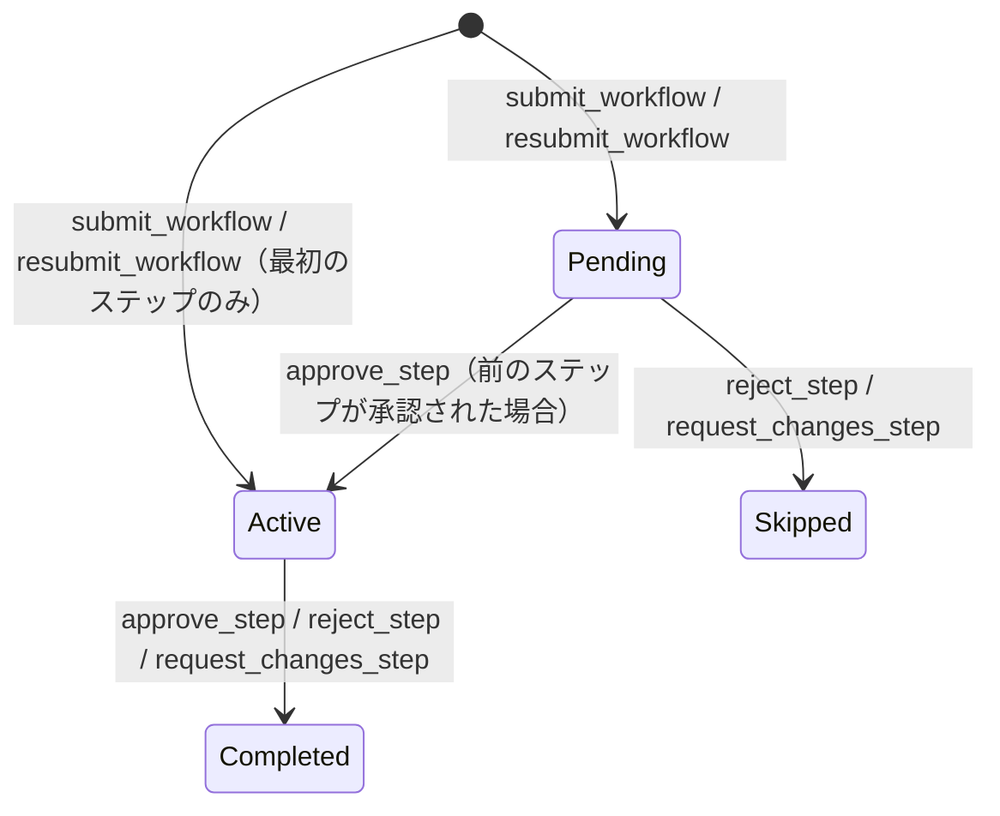

# エンティティ影響マップ: WorkflowStep

## 基本情報

| 項目 | 値 |
|------|-----|
| テーブル | `workflow_steps` |
| ドメインモデル | `ringiflow_domain::workflow::step::WorkflowStep` |
| 主キー | `id` (UUID v7) |
| 楽観的ロック | `version` カラム（`update_with_version_check` で検証） |

## 更新パス

| # | ユースケース | 操作 | 対象 | 更新フィールド | 前提条件 | 備考 |
|---|-------------|------|------|--------------|---------|------|
| 1 | `submit_workflow` | INSERT | 全ステップ | 全フィールド | Instance が Draft | 最初のステップは status=Active + started_at 設定、残りは status=Pending |
| 2 | `approve_step` | UPDATE | 当該ステップ | status(→Completed), decision(→Approved), comment, completed_at, version | status=Active, assigned_to=操作者 | `step.approve()` |
| 3 | `approve_step` | UPDATE | 次ステップ | status(→Active), started_at | status=Pending | `next_step.activated()` |
| 4 | `reject_step` | UPDATE | 当該ステップ | status(→Completed), decision(→Rejected), comment, completed_at, version | status=Active, assigned_to=操作者 | `step.reject()` |
| 5 | `reject_step` | UPDATE | Pending 全ステップ | status(→Skipped) | status=Pending | `pending_step.skipped()`。version は非インクリメント |
| 6 | `request_changes_step` | UPDATE | 当該ステップ | status(→Completed), decision(→RequestChanges), comment, completed_at, version | status=Active, assigned_to=操作者 | `step.request_changes()` |
| 7 | `request_changes_step` | UPDATE | Pending 全ステップ | status(→Skipped) | status=Pending | `pending_step.skipped()`。version は非インクリメント |
| 8 | `resubmit_workflow` | INSERT | 新規全ステップ | 全フィールド | Instance が ChangesRequested | 旧ステップはそのまま残る。新しいステップ群を作成 |

## 競合リスク

| フィールド | 更新元 | リスク | 現在の対策 |
|-----------|--------|--------|-----------|
| status（Active ステップ） | approve_step / reject_step / request_changes_step | 同一ステップに対する同時判断操作 | 楽観的ロック（version check → 409 Conflict） |
| status（Pending ステップ） | reject_step / request_changes_step の Pending→Skipped | 同時実行による二重 Skip 処理 | `update_with_version_check` を使用しているが、`skipped()` は version を非インクリメント。ロックの実効性が不明確 |

トランザクション未整備の問題: 当該ステップの更新 → Pending ステップの Skip → Instance の更新が別々のクエリで実行されるため、途中失敗で部分的な状態遷移が残る可能性がある。→ #687〜#689 で対応予定。

## 状態遷移

### decision（判断結果）の遷移

decision は status=Completed のときのみ値を持つ。

| 操作 | decision の値 |
|------|--------------|
| `approve_step` | `Approved` |
| `reject_step` | `Rejected` |
| `request_changes_step` | `RequestChanges` |

## 不変条件

| ID | 条件 | 検証タイミング |
|----|------|--------------|
| INV-S1 | 同一 Instance 内で status=Active なステップは最大1つ | approve_step（次ステップ activate 後）、submit_workflow / resubmit_workflow 完了後 |
| INV-S2 | status=Completed ⇒ decision IS NOT NULL | approve_step / reject_step / request_changes_step 完了後 |
| INV-S3 | status=Completed ⇒ completed_at IS NOT NULL | approve_step / reject_step / request_changes_step 完了後 |
| INV-S4 | status=Active ⇒ started_at IS NOT NULL | approve_step（次ステップ activate 後）、submit_workflow / resubmit_workflow 完了後 |

### クロスエンティティ不変条件

WorkflowInstance と WorkflowStep の間で成り立つべき条件。

| ID | 条件 | 関連ユースケース |
|----|------|----------------|
| INV-X1 | Instance.status=Approved ⇒ 最終ステップの decision=Approved | approve_step（最終ステップ） |
| INV-X2 | Instance.status=Rejected ⇒ いずれかのステップの decision=Rejected、かつ後続ステップは全て Skipped | reject_step |
| INV-X3 | Instance.status=InProgress ⇒ 対応する Steps が1つ以上存在 | submit_workflow / resubmit_workflow |
| INV-X4 | Step と Instance の状態更新は同一トランザクション内で完了すべき | 全判断系・ライフサイクル系ユースケース |

INV-X4 は現状未実装。#687〜#689 で対応予定。

## 読み取りパス

| # | ユースケース | 参照フィールド | 備考 |
|---|-------------|--------------|------|
| 1 | `get_workflow` | 全フィールド | Instance と一括取得（`find_by_instance`） |
| 2 | `get_workflow_by_display_number` | 全フィールド | Instance と一括取得 |
| 3 | `approve_step` | id, status, version, assigned_to, instance_id | 権限チェック + 楽観的ロック |
| 4 | `reject_step` / `request_changes_step` | id, status, version, assigned_to, instance_id | 権限チェック + Pending ステップ一覧取得 |
| 5 | `list_comments`（間接） | instance_id | display_number → Instance → Steps の参照チェーン |

## 関連エンティティ

| エンティティ | 関係 | FK | 備考 |
|-------------|------|-----|------|
| WorkflowInstance | N:1 | `instance_id` → `workflow_instances.id` | Steps は Instance のライフサイクルに従属 |
| User | N:1 | `assigned_to` → `users.id` | 承認者。NULL 可（将来のグループ割り当て用） |
