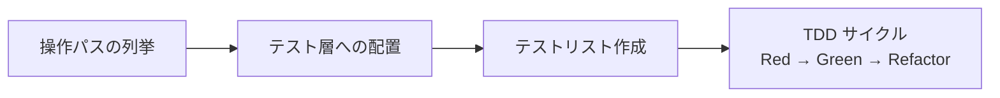

# テスト戦略概要

このドキュメントは ringiflow のテスト戦略のエントリーポイントである。テスト戦略を構成する既存ドキュメント群へのナビゲーションマップを提供する。

## Why: テスト戦略の理念

ringiflow のテスト戦略は 2 つのプロジェクト理念に根ざしている。

| 理念 | テスト戦略への影響 |
|------|-----------------|
| 品質の追求（ISO/IEC 25010） | テストピラミッドの各層で責務を明確に分担し、抜け漏れなく品質を検証する |
| 学習効果の最大化 | テスト設計の判断を ADR に記録し、各テスト手法の選定理由を形式知化する |

テスト戦略の上位要件:
- [コア要件 CORE-12: テスト戦略](../10_要件定義書/01_コア要件.md#core-12-テスト戦略) — テストピラミッドの比率定義（75/20/5）
- [基本設計書: テスト戦略](../30_基本設計書/01_アーキテクチャ設計.md#56-テスト戦略) — テスト層の定義とツール対応

## What: テストピラミッドと各層の責務

### 4 つのテスト手法と 3 層ピラミッドの対応

ringiflow では 4 つのテスト手法を使用する。テストピラミッドのスコープ別に整理すると 3 層に対応する。

```
        /\
       /  \        E2E テスト（Playwright）
      / E2E\       ユーザー操作の完結性
     /------\
    /        \     統合テスト
   /  統合    \    API テスト（Hurl）/ ハンドラテスト
  /------------\
 /              \  ユニットテスト（cargo test / elm-test）
/ ユニットテスト  \  ドメインロジック、ユースケース
\________________/

    少ない ← テスト数 → 多い
    遅い   ← 速度     → 速い
```

### 各テスト手法の責務

| テスト手法 | ピラミッド層 | ツール | 検証対象 | 検証しない（他に委譲） |
|-----------|-----------|--------|---------|---------------------|
| ユニットテスト | ユニット | cargo test / elm-test | ドメインルールの正確さ、境界値、エラー型 | HTTP 層への伝播、UI 表示 |
| ハンドラテスト | 統合 | cargo test（テスト用 Router） | HTTP ステータスコード、認可、エラーマッピング | ドメインロジックの詳細、UI |
| API テスト | 統合 | Hurl（実 HTTP + 実 DB） | ルールの HTTP 層への伝播、状態遷移 | ドメインルール網羅、UI 操作 |
| E2E テスト | E2E | Playwright | ユーザー操作の完結性、UI 固有の問題 | API レスポンス詳細、境界値 |

注: 統合テスト層にはリポジトリ統合テスト（cargo test で直接リポジトリを呼び出し実 DB で検証）も含まれる。詳細は テストピラミッド.md を参照。

詳細:
- [テストピラミッド（概念整理）](../80_ナレッジベース/methodology/テストピラミッド.md) — 3 層モデル、Testing Trophy との比較、統合テスト層内の位置づけ（リポジトリ統合テスト含む 5 手法の全体像）
- [エッジケース・境界値・不変条件テスト方針](テスト戦略_エッジケース方針.md) — 各層の責務分担の詳細

### テスト表現形式

| テスト手法 | 表現形式 | 命名規則 |
|-----------|---------|---------|
| ユニットテスト（Rust） | AAA（Arrange-Act-Assert） | `test_[日本語説明]()` |
| ユニットテスト（Elm） | describe + test 階層 | `"日本語条件"` |
| ハンドラテスト | AAA | `test_[日本語説明]()` |
| API テスト | Given-When-Then | `snake_case_english.hurl` |
| E2E テスト | Given-When-Then | `kebab-case-english.spec.ts` |

詳細: [ADR-032: テスト設計方針](../70_ADR/032_テスト設計方針.md)

## How: テスト設計フロー

テスト設計はトップダウン（操作パスから配置）、実装はボトムアップ（ユニットから E2E へ）。



### 1. 操作パスの列挙

Issue の完了基準から正常系・準正常系・異常系の操作パスを列挙する。

→ [TDD 開発フロー（AI ディレクティブ）> 操作パスの列挙](../../.claude/rules/dev-flow-tdd.md#操作パスの列挙)

### 2. テスト層への配置

各操作パスを適切なテスト層に配置する。1 つの操作パスが複数層にまたがることがある。

→ [TDD 開発フロー（AI ディレクティブ）> テスト層への変換](../../.claude/rules/dev-flow-tdd.md#テスト層への変換)

### 3. テストリスト作成

テストピラミッドの全層を明記する。エッジケースカテゴリを体系的に検討する。

→ [TDD 開発フロー（AI ディレクティブ）> テストリスト](../../.claude/rules/dev-flow-tdd.md#テストリスト)
→ [エッジケース方針 > テストリスト作成時のチェックリスト](テスト戦略_エッジケース方針.md#テストリスト作成時のチェックリスト)

### 4. TDD サイクル

Red（失敗するテスト）→ Green（最短で通す）→ Refactor（設計改善）を繰り返す。

→ [TDD 開発フロー（AI ディレクティブ）> TDD サイクル](../../.claude/rules/dev-flow-tdd.md#tdd-サイクル)
→ [TDD 開発フロー（手順書）](../60_手順書/04_開発フロー/02_TDD開発フロー.md) — 教育的解説、三角測量、テストダブル

### 品質ゲート

TDD サイクル完了後、品質チェックリストのテスト項目で検証する。

→ [Issue 駆動開発フロー > 品質チェックリスト](../../.claude/rules/dev-flow-issue.md#62-品質チェックリスト)

## Where: 詳細ドキュメントへのリンク集

### テスト設計・戦略

| ドキュメント | 内容 |
|------------|------|
| [テストピラミッド](../80_ナレッジベース/methodology/テストピラミッド.md) | 3 層モデルの概念整理、Testing Trophy との比較 |
| [エッジケース・境界値・不変条件テスト方針](テスト戦略_エッジケース方針.md) | 各層の責務分担、エッジケースカテゴリの体系 |

### テスト手法別ルール

| ドキュメント | 内容 |
|------------|------|
| [TDD 開発フロー（AI ディレクティブ）](../../.claude/rules/dev-flow-tdd.md) | TDD サイクル、テストリスト作成、操作パスの列挙 |
| [TDD 開発フロー（手順書）](../60_手順書/04_開発フロー/02_TDD開発フロー.md) | TDD の教育的解説、三角測量、テストダブル、MVP 積み上げ |
| [API テストルール](../../.claude/rules/api-test.md) | Hurl のアサーション戦略（値の確定性、キャプチャパターン） |
| [E2E テストルール](../../.claude/rules/e2e-test.md) | Playwright のスコープ、Given-When-Then 形式、認証パターン |

### ツールのナレッジベース

| ドキュメント | 内容 |
|------------|------|
| [Hurl](../80_ナレッジベース/devtools/hurl.md) | インストール、構文、リクエストチェイン、CLI オプション |
| [Playwright](../80_ナレッジベース/devtools/Playwright.md) | インストール、実行方法、ストレージステート認証、環境差異 |

### ADR（設計判断の記録）

| ADR | 決定内容 |
|-----|---------|
| [ADR-032: テスト設計方針](../70_ADR/032_テスト設計方針.md) | レイヤーごとの表現形式（AAA / Given-When-Then）、命名規則、構造化方法 |
| [ADR-035: コードカバレッジ計測ツール選定](../70_ADR/035_コードカバレッジ計測ツール選定.md) | Rust のカバレッジ計測ツール選定 |
| [ADR-060: テストダブル戦略と Handler 層テスト方針](../70_ADR/060_テストダブル戦略とHandler層テスト方針.md) | テストダブル命名（Stub/Fake/Mock）、古典学派採用、Handler 層テスト条件付き追加 |
| [ADR-037: Elm コードカバレッジツール選定](../70_ADR/037_Elmコードカバレッジツール選定.md) | Elm のカバレッジツールは見送り、型システム + 戦略的テスト選択で代替 |
| [ADR-058: プロパティベーステスト導入](../70_ADR/058_プロパティベーステスト導入.md) | proptest による不変条件テスト、ランダム操作列の探索 |

### 突合表・状態遷移表

| ドキュメント | 内容 |
|------------|------|
| [API テスト突合表](APIテスト突合表.md) | 全エンドポイントと API テストの対応（カバレッジ状況） |
| [E2E テスト突合表](E2Eテスト突合表.md) | 要件シナリオと E2E テストの対応（カバレッジ状況） |
| [状態遷移表（WorkflowInstance）](状態遷移表_WorkflowInstance.md) | WorkflowInstance の状態 x 操作マトリクス |
| [状態遷移表（WorkflowStep）](状態遷移表_WorkflowStep.md) | WorkflowStep の状態 x 操作マトリクス |

### API テストの実行ガイド

| ドキュメント | 内容 |
|------------|------|
| [API テスト README](../../tests/api/README.md) | API テストの実行方法とピラミッド上の位置づけ |

---

## 変更履歴

| 日付 | 変更内容 |
|------|---------|
| 2026-02-28 | 初版作成（#977） |
