# TDD 開発フロー

> AI ディレクティブ版: [`.claude/rules/dev-flow-tdd.md`](../../../.claude/rules/dev-flow-tdd.md)。本ファイルは教育・参照用。

## 概要

このプロジェクトでは TDD（テスト駆動開発）を採用し、テストファーストで実装を進める。
t_wada（和田卓人）の TDD 手法を基本とし、アジャイル的に MVP を積み上げる。

### 採用理由

| 観点 | TDD のメリット |
|------|---------------|
| 品質 | バグの早期発見、リグレッション防止 |
| 設計 | テストしやすい設計 = 良い設計 |
| 学習 | 小さなステップで着実に理解を深められる |
| 安心 | 動くコードを常に維持、大胆なリファクタリングが可能 |

---

## TDD サイクル

```mermaid
flowchart LR
    R["🔴 Red"] --> G["🟢 Green"]
    G --> RF["🔵 Refactor"]
    RF --> R
```



### 確認事項の実施

**目的:** 推測ではなく事実に基づいてコードを書く

→ 哲学と原則: [実装前の確認](../../../.claude/rules/pre-implementation.md)
→ 手順の詳細: [AI ディレクティブ版](../../../.claude/rules/dev-flow-tdd.md#確認事項の実施)

---

### 🔴 Red: 失敗するテストを書く

**目的:** 実装すべき振る舞いを明確にする

→ 手順の詳細: [AI ディレクティブ版](../../../.claude/rules/dev-flow-tdd.md#red-失敗するテストを書く)

```rust
#[tokio::test]
async fn test_find_user_by_email_returns_user_when_exists() {
    // Arrange
    let repo = setup_test_repository().await;

    // Act
    let result = repo.find_by_email(&tenant_id, &email).await;

    // Assert
    assert!(result.is_ok());
    assert!(result.unwrap().is_some());
}
```

#### 二層の Red モデル

静的型付き言語（Rust / Elm）では、テストからのフィードバックが 2 層になる。

→ 手順の詳細: [AI ディレクティブ版](../../../.claude/rules/dev-flow-tdd.md#二層の-red-モデル)

```mermaid
flowchart LR
    T["テスト記述"] --> RC["🔴 Red<br/>(compile)"]
    RC --> GC["スタブ作成<br/>todo!()"]
    GC --> RT["🔴 Red<br/>(test failure)"]
    RT --> G["🟢 Green"]
```



メンタルモデル: コンパイラは「最初のテストランナー」。コンパイラのエラーメッセージが「何を定義すべきか」を教え、テストランナーが「何を実装すべきか」を教える。この 2 つのフィードバックを混同しないことが重要。

Robert C. Martin はこれを nano-cycle（Red 内の小サイクル）と呼ぶ。テストを書く → コンパイルエラーを解消する → テスト失敗を確認する、という一連の流れが Red フェーズ内部のサイクルを成す。

#### コンパイルエラー解消の原則

コンパイルエラーの解消では、コンパイラが要求する最小限の定義だけを記述する。

Rust の例:

```rust
// コンパイルエラー解消で書くもの: 型定義 + todo!()
pub struct UserRepository {
    pool: PgPool,
}

impl UserRepository {
    pub async fn find_by_email(
        &self,
        tenant_id: &TenantId,
        email: &Email,
    ) -> Result<Option<User>> {
        todo!() // ロジックは Green フェーズで書く
    }
}
```

Elm の例:

```elm
-- コンパイルエラー解消で書くもの: 型定義 + Debug.todo
findByEmail : TenantId -> Email -> Cmd Msg
findByEmail tenantId email =
    Debug.todo "findByEmail" -- ロジックは Green フェーズで書く
```

プロジェクト内の実例: テストスタブで `todo!()` を使用するパターン → `core-service/src/handler/auth/tests.rs`

重要: 失敗を確認せずに実装に進まない。失敗を見ることで：
- テストが正しく書けていることを確認できる
- 実装前後の差分が明確になる

### 🟢 Green: 最短で通す

**目的:** テストを通す最小限のコードを書く

→ 手順の詳細: [AI ディレクティブ版](../../../.claude/rules/dev-flow-tdd.md#green-最短で通す)

```rust
// 仮実装の例（まずこれでテストを通す）
pub async fn find_by_email(&self, tenant_id: &TenantId, email: &Email) -> Result<Option<User>> {
    Ok(Some(User::new(/* テストデータと同じ値 */)))
}
```

重要: この段階では「動く」ことだけに集中。重複や汚いコードは許容する。

### 🔵 Refactor: 設計を改善する

**目的:** 動作を変えずに設計品質を高める

#### コードの整理

プロダクションコード:
1. 重複を除去
2. 命名を改善
3. 構造を整理

テストコード:
1. テストの意図が名前から読み取れるか確認
2. 三角測量で追加したテストの中に、一般化後は冗長になったものがないか確認
3. Arrange / Act / Assert の構造が明確か確認

**テストが通り続けることを確認しながら** 進める。

```rust
// リファクタリング後（実際のDB問い合わせ）
pub async fn find_by_email(&self, tenant_id: &TenantId, email: &Email) -> Result<Option<User>> {
    let row = sqlx::query_as!(
        UserRow,
        "SELECT * FROM users WHERE tenant_id = $1 AND email = $2",
        tenant_id.as_uuid(),
        email.as_str()
    )
    .fetch_optional(&self.pool)
    .await?;

    Ok(row.map(User::from))
}
```

#### 設計原則レンズ

コードの整理に加えて、設計原則の観点から改善機会を探す。

→ ISO 25010 品質特性との対応: [KB: ISO 25010 > 設計原則レンズとのマッピング](../../80_ナレッジベース/methodology/ISO25010.md#設計原則レンズとのマッピング)

→ 位置づけ: [俯瞰・実装リズム > 実装中の俯瞰](../../../.claude/rules/zoom-rhythm.md#実装中の俯瞰-設計原則レンズ)

→ 手順の詳細: [AI ディレクティブ版](../../../.claude/rules/dev-flow-tdd.md#設計原則レンズ)

これらの観点は [品質チェックリスト](01_Issue駆動開発.md#62-品質チェックリスト) の「品質向上の最終確認（ゼロ→プラス）」と同一の設計原則。レンズは Refactor ステップで設計品質を作り込むためのもの。品質チェックリストは PR 全体を通した最終確認であり、レンズで見逃した問題を捕捉する最後の砦。

既知手法との対応: 「毎 Refactor」は Kent Beck の Four Rules of Simple Design（Reveals intention → No duplication → Fewest elements）、「モジュール完成時」は SOLID 原則の SRP・DIP および型による不正状態防止（"Making Illegal States Unrepresentable" — Minsky, 2011; "Parse, don't validate" — King, 2019）に対応。

#### UI/UX レンズ（フロントエンド変更時）

フロントエンド（Elm ビュー関数、Tailwind クラス）を変更する場合、コード設計レンズに加えて以下を適用する。

→ 参照: デザインガイドライン — [`docs/40_詳細設計書/13_デザインガイドライン.md`](../../40_詳細設計書/13_デザインガイドライン.md)
→ 参照: デザイントークン定義 — [`frontend/src/styles.css`](../../../frontend/src/styles.css)

→ 手順の詳細: [AI ディレクティブ版](../../../.claude/rules/dev-flow-tdd.md#uiux-レンズフロントエンド変更時)

コード設計レンズとの対応:

| コード設計レンズ | 対応する UI/UX レンズ |
|----------------|---------------------|
| 意図の明確さ | 視覚的階層 |
| 重複の排除 | 共有コンポーネント活用 |
| 要素の最小性 | （H8 ミニマルデザインとして視覚的階層に包含） |
| 型の活用 | 状態の網羅性（RemoteData + Button.Variant） |

既知手法との対応: UI/UX レンズの守りは Nielsen の 10 Usability Heuristics（H1: 状態の網羅性、H4: デザイントークン準拠、H5/H3: 破壊的操作の防御、H8: 視覚的階層、H9: エラーのユーザビリティ）と WCAG 2.1 POUR 原則（アクセシビリティ）に対応。攻めは CRAP 原則（Robin Williams, 2004）の Contrast・Alignment・Proximity に対応（Repetition は守りレンズの「デザイントークン準拠」「共有コンポーネント活用」でカバー）。CRAP はデザイン実践の手法（How）、ゲシュタルト原則が理論的裏付け（Why）を提供する。

---

## テストリスト

実装前にテストリスト（TODO リスト）を作成する。

テストリストには二つの役割がある:

| 段階 | 役割 | 性質 |
|------|------|------|
| TDD サイクル中 | 実装の道標 | 思いついた順に追加してよい。仮実装や三角測量のためのテストも含む |
| Phase 完了時 | 仕様の文書化 | 正常系・異常系・境界値が体系的に整理され、各テストが独立した仕様を表現している |

TDD サイクル中はリストを自由に使い、Phase 完了時に品質保証の観点で整理する（後述の「テストレビュー」を参照）。

### 操作パスの列挙（テストリスト作成の前に）

テストリストを作成する前に、ユーザーの操作パスを列挙する。テスト設計は「実装の構造」（モジュール、関数、レイヤー）ではなく「ユーザーの操作パス」から出発する。

→ 手順の詳細: [AI ディレクティブ版](../../../.claude/rules/dev-flow-tdd.md#操作パスの列挙)

注: 操作パスの分類（正常系・準正常系・異常系）は日本の IT 現場での慣用分類。ISTQB では positive testing / negative testing の 2 分類。

#### 計画ファイル用フォーマット

```markdown
#### 操作パス

| # | 操作パス | 分類 | テスト層 |
|---|---------|------|---------|
| 1 | ログインに成功する | 正常系 | E2E |
| 2 | パスワードが間違っている場合、エラーメッセージが表示される | 準正常系 | E2E |
| 3 | 存在しないユーザーでログインしようとするとエラーが表示される | 準正常系 | API |
| 4 | API がタイムアウトした場合、エラーが表示される | 異常系 | E2E |
```

操作パスが不要な Phase は「操作パス: 該当なし（ドメインロジックのみ）」と明示する。

### テスト設計の方向性

テスト設計はトップダウン（操作パス → テストリスト）で行い、テスト実装はボトムアップ（ユニット → API → E2E）で行う。

```
設計（トップダウン）:  操作パス → テスト層の配置 → テストリスト
実装（ボトムアップ）:  ユニットテスト → ハンドラテスト → API テスト → E2E テスト
```

設計と実装の方向が逆であることを意識する。設計時にボトムアップで考えると、個々のモジュールのテストに集中しやすく、操作パス全体の検証が漏れる。

### 作成のコツ

1. **操作パスから逆算:** 操作パスの各ステップをテストケースに分解
2. **正常系 → 準正常系 → 異常系:** まず成功パス、次に設計されたエラー処理、最後に想定外の障害
3. **境界値:** エッジケースを忘れずに
4. **テスト層の配置:** 操作パスの性質に応じて適切なテスト層に配置

### テスト層の明記

テストリストには、テストピラミッドの各層を明記する。テスト層の選択は設計判断であり、計画ファイル作成時（設計段階）で検討する。

→ 手順の詳細: [AI ディレクティブ版](../../../.claude/rules/dev-flow-tdd.md#テストリスト)
→ 計画ファイルの必須要素: [zoom-rhythm.md > テストリスト](../../../.claude/rules/zoom-rhythm.md#テストリスト各-phase)

### 例: ログイン機能

```markdown
## 操作パス

| # | 操作パス | 分類 | テスト層 |
|---|---------|------|---------|
| 1 | ログイン画面からログイン操作を完了できる | 正常系 | E2E + API + ユニット |
| 2 | 不正なパスワードでエラーメッセージが表示される | 準正常系 | E2E + API + ユニット |
| 3 | 存在しないユーザーでエラーメッセージが表示される | 準正常系 | API + ユニット |
| 4 | 非アクティブユーザーでログインが拒否される | 準正常系 | ユニット |

## テストリスト

### Phase 1: UserRepository / PasswordHasher

操作パス: 該当なし（ドメインロジックのみ）

ユニットテスト:
- [ ] メールアドレスでユーザーを取得できる（操作パス #1 の下位層）
- [ ] 存在しないメールアドレスの場合 None を返す（操作パス #3 の下位層）
- [ ] 別テナントのユーザーは取得できない
- [ ] パスワードを検証できる（正しいパスワード）（操作パス #1 の下位層）
- [ ] 不正なパスワードは検証失敗（操作パス #2 の下位層）

ハンドラテスト（該当なし）
API テスト（該当なし）
E2E テスト（該当なし）

### Phase 2: AuthUseCase

操作パス: 該当なし（ドメインロジックのみ）

ユニットテスト:
- [ ] 正しい認証情報でログインできる（操作パス #1 の下位層）
- [ ] 不正なパスワードでログイン失敗（操作パス #2 の下位層）
- [ ] 存在しないユーザーでログイン失敗（操作パス #3 の下位層）
- [ ] 非アクティブユーザーはログイン不可（操作パス #4）

ハンドラテスト（該当なし）
API テスト（該当なし）
E2E テスト（該当なし）

### Phase 3: Core Service Handler / BFF Handler

ユニットテスト:
- [ ] SessionManager: セッションを作成できる
- [ ] SessionManager: セッションを取得できる
- [ ] SessionManager: セッションを削除できる
- [ ] SessionManager: 存在しないセッションは None を返す

ハンドラテスト:
- [ ] Core Service: 正しい認証情報で 200 を返す（操作パス #1）
- [ ] Core Service: 不正な認証情報で 401 を返す（操作パス #2, #3）
- [ ] BFF: セッション Cookie を設定する（操作パス #1）
- [ ] BFF: テナント分離が機能する

API テスト:
- [ ] POST /api/v1/auth/login で認証成功（操作パス #1）
- [ ] POST /api/v1/auth/login で認証失敗（操作パス #2）

E2E テスト:
- [ ] ログイン画面からログイン操作を完了できる（操作パス #1）
- [ ] 不正なパスワードでエラーメッセージが表示される（操作パス #2）
```

### 進め方

1. リストの最初の項目を選ぶ
2. Red → Green → Refactor
3. 完了したらチェックを付ける ✅
4. 次の項目へ
5. 新しいテストケースを思いついたらリストに追加

---

## MVP 積み上げ方式

アジャイル的に、動く最小単位から段階的に機能を追加する。

→ 手順の詳細: [AI ディレクティブ版](../../../.claude/rules/dev-flow-tdd.md#mvp-積み上げ方式)

### 依存関係を考慮した順序（例）

```mermaid
flowchart TB
    subgraph Layer1["Layer 1: インフラ"]
        A["UserRepository"]
        B["PasswordHasher"]
        C["SessionManager"]
    end

    subgraph Layer2["Layer 2: ユースケース"]
        D["AuthUseCase"]
    end

    subgraph Layer3["Layer 3: API"]
        E["Core Service Handler"]
        F["BFF Handler"]
    end

    A --> D
    B --> D
    D --> E
    C --> F
    E --> F
```



**実装順序:**
1. UserRepository（DB からユーザー取得）
2. PasswordHasher（パスワード検証）
3. AuthUseCase（認証ロジック）
4. Core Service Handler（内部 API）
5. SessionManager（セッション管理）
6. BFF Handler（公開 API）

各ステップで「テスト → 実装 → リファクタリング」を繰り返す。

### テストレビュー（Phase 完了時）

各 Phase の TDD サイクル完了後、テストを品質保証の観点でレビューする。

→ 手順の詳細: [AI ディレクティブ版](../../../.claude/rules/dev-flow-tdd.md#テストレビューphase-完了時)

TDD サイクル中の Refactor はテストの局所的な改善。テストレビューは Phase 全体を俯瞰した整理。

---

## 実践的なパターン

### パターン1: 三角測量（Triangulation）

1つのテストだけでは一般化しにくい場合、複数のテストケースを追加して実装を導く。

```rust
// テスト1
#[test]
fn test_verify_password_returns_true_for_correct_password() {
    let hasher = Argon2PasswordHasher::new();
    let hash = hasher.hash("password123").unwrap();
    assert!(hasher.verify("password123", &hash).unwrap());
}

// テスト2（三角測量）
#[test]
fn test_verify_password_returns_false_for_wrong_password() {
    let hasher = Argon2PasswordHasher::new();
    let hash = hasher.hash("password123").unwrap();
    assert!(!hasher.verify("wrongpassword", &hash).unwrap());
}
```

### パターン2: Given-When-Then（AAA）

テストの構造を明確にする。

```rust
#[tokio::test]
async fn test_login_succeeds_with_valid_credentials() {
    // Given（Arrange）: 前提条件
    let repo = FakeUserRepository::new();
    let hasher = FakePasswordHasher::new();
    let sut = AuthUseCase::new(repo, hasher);

    // When（Act）: 実行
    let result = sut.authenticate(&email, &password).await;

    // Then（Assert）: 検証
    assert!(result.is_ok());
}
```

### パターン3: テストダブル

依存を差し替えて単体テストを可能にする。

| 種類 | 用途 |
|------|------|
| Stub | 固定値を返す |
| Mock | 呼び出しを検証 |
| Fake | 簡易版の実装（インメモリDBなど） |

```rust
// Fake 実装の例
pub struct InMemoryUserRepository {
    users: HashMap<Email, User>,
}

impl UserRepository for InMemoryUserRepository {
    async fn find_by_email(&self, _tenant_id: &TenantId, email: &Email) -> Result<Option<User>> {
        Ok(self.users.get(email).cloned())
    }
}
```

---

## テスト規約

### テスト対象の命名: `sut`

テスト対象オブジェクトの変数名には `sut`（System Under Test）を使用する。

→ 手順の詳細: [AI ディレクティブ版](../../../.claude/rules/dev-flow-tdd.md#sut-命名)

出典: Gerard Meszaros『xUnit Test Patterns』（Addison-Wesley, 2007）で体系化された用語。C#/Java 圏で広く浸透している。

---

## ワークフロー全体像

```mermaid
flowchart TD
    A["Issue の完了基準を確認"] --> OP["操作パスを列挙"]
    OP --> B["テストリストを作成"]
    B --> V["確認事項を実施"]
    V --> C["最初のテストを選択"]
    C --> D["🔴 Red: テストを書く"]
    D --> E["🟢 Green: 実装する"]
    E --> F["🔵 Refactor: 整理する"]
    F --> G{"テストリスト<br/>完了？"}
    G -->|No| C
    G -->|Yes| H["統合テストで動作確認"]
    H --> J["just check<br/>（lint + テスト + 統合テスト）"]
    J --> I["PR 作成"]
```



---

## E2E テストの実行タイミング

E2E テスト（Playwright）は TDD の Red-Green-Refactor サイクルには組み込まない。

| 理由 | 説明 |
|------|------|
| 実行速度 | バックエンド + フロントエンドの起動が必要で、ユニットテストと比べ大幅に遅い |
| TDD の本質 | TDD は高速なフィードバックループ。E2E テストの遅さはこのリズムを崩す |
| 責務の分離 | E2E は「ユーザー操作の完結性」を検証する品質ゲートであり、設計を駆動するツールではない |

→ 手順の詳細: [AI ディレクティブ版](../../../.claude/rules/dev-flow-tdd.md#e2e-テスト実行タイミング)
→ E2E テストの詳細: [Playwright ナレッジベース](../../../docs/80_ナレッジベース/devtools/Playwright.md)
→ E2E テストのルール: [`.claude/rules/e2e-test.md`](../../../.claude/rules/e2e-test.md)

---

## 参考資料

- 『テスト駆動開発』Kent Beck 著、和田卓人 訳
- t_wada のスライド・講演資料
- [テスト駆動開発についてまとめてみた](https://qiita.com/t_wada/items/e2b3b1a5b9e89a5b7f9c)
- Robert C. Martin (2021) "Clean Craftsmanship" — nano-cycle（Red 内の小サイクル）
- Kent Beck (2000) "Extreme Programming Explained" — Four Rules of Simple Design
- Robert C. Martin (2003) "Agile Software Development, Principles, Patterns, and Practices" — SOLID 原則
- Steve Freeman & Nat Pryce (2009) "Growing Object-Oriented Software, Guided by Tests" — "Write the test you wish you had"
- Yaron Minsky (2011) "Effective ML" — Making Illegal States Unrepresentable
- Alexis King (2019) "Parse, don't validate"
- Robin Williams (2004) "The Non-Designer's Design Book" (CRAP 原則)

### 既知手法との対応

| 概念 | 出典 | 本ドキュメントでの対応 |
|------|------|---------------------|
| Four Rules of Simple Design | Kent Beck, *Extreme Programming Explained* (2000) | 毎 Refactor レンズ（意図の明確さ・重複の排除・要素の最小性） |
| SRP・DIP（SOLID 原則） | Robert C. Martin, *Agile Software Development* (2003) | モジュール完成時レンズ（単一責務・依存方向） |
| Making Illegal States Unrepresentable | Yaron Minsky, *Effective ML* (2011); Richard Feldman, *Elm Conf* (2016) | 型の活用レンズ（Newtype、型安全ステートマシン、構造的強制） |
| Parse, don't validate | Alexis King (2019) | 型の活用レンズ（境界での型変換、不変条件の保護） |
| nano-cycle（Red 内の小サイクル） | Robert C. Martin, *Clean Craftsmanship* (2021) | 二層の Red モデル |
| Compiler-Driven Development | 静的型付き言語 TDD の一般的な考え方 | コンパイルエラー解消の原則 |
| "Write the test you wish you had" | Freeman & Pryce, *GOOS* (2009) | Red フェーズの「テストを1つだけ書く」 |
| Usability Heuristics | Jakob Nielsen, *10 Usability Heuristics for User Interface Design* (1994, 2024 更新) | UI/UX レンズ（H1, H3, H4, H5, H8, H9） |
| POUR 原則 | W3C, *WCAG 2.1* (2018) | アクセシビリティレンズ（Perceivable + Operable） |
| CRAP 原則 | Robin Williams, *The Non-Designer's Design Book* (2004) | デザイン品質向上レンズ（C: コントラストの効果、A: 整列の一貫性、P: 余白の活用）。R は守りレンズでカバー |

→ 詳細: [独自フレームワークと既知手法の対応](../../80_ナレッジベース/methodology/独自フレームワークと既知手法の対応.md)

