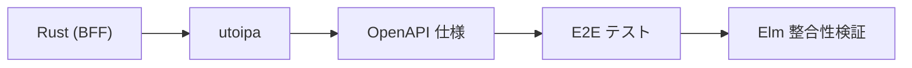

# ADR-047: Elm OpenAPI クライアント自動生成の見送り

## ステータス

Accepted

## コンテキスト

Issue #137「API 仕様と実装の整合性担保（OpenAPI / BFF / Elm）」において、以下の2段階アプローチを採用した：

1. **Phase 1（完了）**: E2E テスト導入で BFF ↔ Elm の整合性を実行時に検証
2. **Phase 2**: Code First 移行（Rust → OpenAPI → Elm の自動生成）

Phase 2-1, 2-2 として utoipa 導入が完了し（PR #444）、Rust の型から OpenAPI 仕様を自動生成する仕組みが確立した。

残る課題は **OpenAPI → Elm デコーダーの自動生成**（Phase 2-3, 2-4）。現状は Elm デコーダーを手動で記述しており、BFF と Elm の整合性を E2E テストで検証している。

## 調査内容

Elm の OpenAPI クライアント生成ツールを評価した。

### 候補ツール

| ツール | メンテナンス | 特徴 |
|--------|-------------|------|
| OpenAPI Generator | 活発（公式） | 多言語対応、Cookie 認証非対応明記 |
| elm-open-api-cli | 2024/12 最新 | Elm 専用、NPM パッケージ |

### elm-open-api-cli の評価

v0.7.0 で実際に生成を実行した。

**生成されたコード：**
```
elm-openapi-generated/
├── Generated/Api/Api.elm       # API 関数（Cmd + Task）
├── Generated/Api/Types.elm     # 型定義 + エラー型
├── Generated/Api/Json.elm      # デコーダー/エンコーダー
└── OpenApi/Common.elm          # 共通ユーティリティ
```

**良い点：**
- 全スキーマが Elm 型として生成
- エンドポイント固有のエラー型（`Login_Error`, `CreateRole_Error` など）
- Cmd と Task の両方を生成
- デコーダー/エンコーダーが自動生成

**問題点：**
1. **Cookie 認証が非サポート**（致命的）
   ```
   Warning: Unsupported security schema: ApiKey in Cookie
     at /api/v1/workflows -> GET
     at /api/v1/auth/login -> POST
     ...（全エンドポイント）
   ```
   生成された API 関数：
   ```elm
   listAuditLogs config =
       Http.request
           { headers = []  -- ← 認証ヘッダーが空
           , ...
           }
   ```

2. **UUID が String として扱われる**
   ```
   Warning: Format "uuid" not supported - using string instead
   ```

3. **Nullable フィールドの扱いが不完全**
   ```elm
   type alias WorkflowStepData =
       { assigned_to : Maybe JsonEncodeValue_Or_UserRefData
       , ...
       }

   type JsonEncodeValue_Or_UserRefData
       = JsonEncodeValue_Or_UserRefData__JsonEncodeValue Json.Encode.Value
       | JsonEncodeValue_Or_UserRefData__UserRefData UserRefData
   ```
   oneOf + null の組み合わせが複雑な型になる。

### OpenAPI Generator

公式ドキュメントで「Cookie parameter not supported」と明記されており、同じ問題を抱える。

## 決定

**Elm OpenAPI クライアント自動生成ツールを採用しない。**

手動で記述した Elm デコーダーを継続し、BFF ↔ Elm の整合性は E2E テストで検証する。

## 理由

### Cookie 認証が必須要件

このプロジェクトの認証スキームは以下の通り：

```yaml
securitySchemes:
  session_auth:
    type: apiKey
    in: cookie
    name: session_id
```

調査したツールはいずれも Cookie ベース認証を非サポート。生成された API 関数は認証ヘッダーを付与しないため、実用できない。

### カスタムヘッダーの必要性

BFF API は以下のカスタムヘッダーを要求する：
- Cookie（セッション ID）
- CSRF トークン（状態変更リクエスト）
- X-Tenant-ID（マルチテナント識別）

自動生成ツールはこれらをサポートせず、既存の `Api.elm` ヘルパーとの統合が困難。

### E2E テストで整合性を担保済み

Phase 1 で導入した E2E テスト（Playwright）が以下を検証している：
- BFF API のレスポンス形式
- Elm デコーダーの正確性
- UI への正しいデータ表示

手動デコーダーの問題は実行時に検出される。

### 手動デコーダーの品質は高い

現在のデコーダーは json-decode-pipeline を使った宣言的なスタイルで記述されており、可読性・保守性が高い。

```elm
decoder : Decoder WorkflowInstance
decoder =
    Decode.succeed WorkflowInstance
        |> required "id" Decode.string
        |> required "display_number" Decode.int
        |> required "status" statusDecoder
        |> optional "assigned_to" (Decode.nullable UserRef.decoder) Nothing
        ...
```

自動生成に置き換えるメリットは、Cookie 認証の制約を考慮すると小さい。

## 代替案

### 代替案 1: 部分的な自動生成（型定義のみ）

型定義とデコーダーだけを自動生成し、API 関数は既存の `Api.elm` を使う。

**却下理由：**
- Cookie 認証の問題は解決しない
- oneOf + null の複雑な型が導入される
- 手動デコーダーとの二重管理になる

### 代替案 2: ツールをフォークして Cookie 認証をサポート

elm-open-api-cli をフォークして Cookie 認証を実装する。

**却下理由：**
- 開発・保守コストが高い
- E2E テストで代替できている
- 上流への貢献（PR）も不確実

### 代替案 3: BearerToken 認証への移行

Cookie セッションから Bearer Token（JWT など）に移行する。

**却下理由：**
- 認証アーキテクチャの大幅な変更が必要
- セキュリティ要件の再検討が必要（CSRF 対策など）
- 現時点で認証方式変更の要求はない

## 結果

### 維持すること

- Elm デコーダー/エンコーダーの手動記述
- `Api.elm` ヘルパー（CSRF、カスタムヘッダー）
- E2E テストによる BFF ↔ Elm の整合性検証

### 整合性担保の仕組み



1. utoipa が Rust の型から OpenAPI を自動生成
2. CI で OpenAPI の同期チェック（`just openapi-check`）
3. E2E テストが BFF レスポンスと Elm デコーダーの整合性を実行時に検証

### 将来の再評価条件

以下の条件を満たす場合、自動生成ツールを再評価する：

1. Cookie 認証をサポートするツールが登場
2. 認証方式を Bearer Token に変更する要件が発生
3. E2E テストでカバーしきれないデコーダーのバグが頻発

## 関連

- Issue #137: API 仕様と実装の整合性担保（OpenAPI / BFF / Elm）
- PR #444: utoipa 導入による OpenAPI Code First 移行
- ADR-025: 情報管理とローカル知識集約の方針
- セッションログ: [prompts/runs/2026-02/2026-02-15_1140_ElmOpenAPIクライアント生成ツール評価.md](../../prompts/runs/2026-02/2026-02-15_1140_ElmOpenAPIクライアント生成ツール評価.md)
