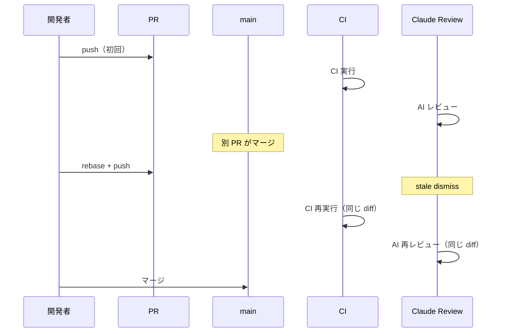

# ADR-064: Merge Queue 導入と品質保証の再設計

## ステータス

保留 — Merge Queue はユーザー所有リポジトリでは利用不可（組織所有が必要）。リポジトリの Organization 移行後に再開予定。

## コンテキスト

並行開発時に `strict_required_status_checks_policy: true`（Require branches to be up to date before merging）がボトルネックになっている。PR をマージするたびに他の全 PR が rebase + CI 再実行 + AI 再レビューを強いられ、マージが直列化される。

Merge Queue の導入によりスループットを改善したいが、現行の再レビュートリガー（rebase → push → stale dismiss → 再レビュー）が消えることで品質保証が弱まるリスクがある。

### 現行フロー（rebase + strict checks）



### 現行の再レビューが提供する保証の分析

| 保証 | 提供元 | Merge Queue での代替 |
|------|--------|---------------------|
| マージ後のコンパイル成功 | CI（rebase 後の再実行） | CI（merge commit での実行）— 同等以上 |
| マージ後のテスト通過 | CI（rebase 後の再実行） | CI（merge commit での実行）— 同等以上 |
| コード品質の確認 | Claude Auto Review | 初回 PR レビューで完了済み — 代替不要 |
| ルール準拠の確認 | Claude Rules Check | 初回 PR チェックで完了済み — 代替不要 |

AI レビューは **PR の diff**（PR の変更内容）をレビューする。rebase 後も diff は同一であり、他の PR との相互作用は分析していない。したがって、再レビューは初回レビューと実質的に同じ結果を返す。

結論: **再レビューなしでも品質は担保される。** CI が merge commit 上で実行されれば、コンパイル・テストの保証は現行と同等以上。AI レビューは PR レビュー時に 1 回実行すれば十分。

## 検討した選択肢

### 選択肢 1: Merge Queue + CI のみ（AI レビューは PR 時のみ）

Merge Queue の merge commit で CI を実行し、AI レビューは PR 時の 1 回のみ。

評価:
- 利点: シンプル、CI コスト削減（AI レビュー再実行なし）、マージスループット向上
- 欠点: merge commit での AI レビューなし（ただし上記分析で不要と判断）

### 選択肢 2: Merge Queue + CI + AI レビュー再実行

Merge Queue の merge commit で CI に加えて AI レビューも再実行。

評価:
- 利点: 最大限の保証
- 欠点: Merge Queue のレイテンシ増加（AI レビューに数分〜十数分）、API コスト増、同じ diff の再レビューで実質的な追加価値なし

### 選択肢 3: Merge Queue 導入なし（現状維持）

`strict_required_status_checks_policy: true` のまま運用。

評価:
- 利点: 変更不要
- 欠点: マージの直列化が継続、並行開発のスループット低下

### 比較表

| 観点 | 選択肢 1（MQ + CI） | 選択肢 2（MQ + CI + AI） | 選択肢 3（現状維持） |
|------|---------------------|--------------------------|---------------------|
| マージスループット | 高 | 中（AI レビュー待ち） | 低（直列化） |
| 品質保証 | 十分（CI + 初回 AI レビュー） | 最大（同じ diff の再レビュー） | 十分（CI + 再 AI レビュー） |
| CI コスト | 低 | 高 | 中 |
| 実装の複雑さ | 低 | 高（merge_group での AI レビュー設計要） | なし |

## 決定

**選択肢 1: Merge Queue + CI のみ（AI レビューは PR 時のみ）を採用する。**

主な理由:

1. AI 再レビューの追加価値が限定的（同じ diff をレビューするため）
2. CI が merge commit で実行されることで、コンパイル・テストの保証は同等以上
3. シンプルな構成で Merge Queue のレイテンシを最小化

選択肢 2 を却下した理由: AI レビューは PR diff をレビューするため、merge commit での再実行は同じ結果を返す。コスト・時間に見合う追加価値がない。

### 設計の詳細

#### CI ワークフローの変更

`merge_group` イベントトリガーを追加:

```yaml
on:
  push:
    branches: [main]
  pull_request:
    types: [opened, synchronize, reopened, ready_for_review]
    branches: [main]
  merge_group:  # Merge Queue 用
```

`dorny/paths-filter` は `merge_group` イベントでも動作する（base と head の diff を検出）。

#### Claude Auto Review / Rules Check の対応

変更不要。既に `workflow_run` のトリガー条件で `event == 'pull_request'` をフィルタしており、`merge_group` 起因の CI 完了では発火しない:

```yaml
# claude-auto-review.yaml, claude-rules-check.yaml
if: >
  github.event.workflow_run.event == 'pull_request' &&  # merge_group を除外
  ...
```

#### Ruleset の変更

```diff
 rules:
+  - type: merge_queue
+    parameters:
+      check_response_timeout_minutes: 60
+      grouping_strategy: ALLGREEN
+      max_entries_to_build: 5
+      max_entries_to_merge: 5
+      merge_method: SQUASH
+      min_entries_to_merge: 1
+      min_entries_to_merge_wait_minutes: 0
+      status_check_configuration:
+        contexts:
+          - context: CI Success
+            integration_id: 15368
   - type: required_status_checks
     parameters:
-      strict_required_status_checks_policy: true
+      strict_required_status_checks_policy: false
       ...
```

Merge Queue の required checks は `CI Success` のみ。`Claude Auto Review` と `Claude Rules Check` は PR レビュー時（branch protection の required checks）で検証済みのため、Merge Queue では不要。

#### マージコマンドの変更

変更不要。`gh pr merge --squash` は Merge Queue が有効化されたブランチでは自動的に PR をキューに追加する。Queue 内で CI が通れば自動的にマージされる。

## 帰結

### 肯定的な影響

- マージの直列化が解消され、並行開発のスループットが向上
- CI コスト削減（AI レビューの再実行が不要）
- 開発者体験の向上（rebase + 再レビュー待ちの手間が不要）

### 否定的な影響・トレードオフ

- merge commit での AI レビューがないため、理論上は AI が検出できたかもしれない問題を見逃す可能性がある（ただし実質的にはゼロに近い）
- Merge Queue の導入により、マージ後の反映にラグが生じる（キュー内の CI 完了を待つ）

### 関連ドキュメント

- Issue: [#757](https://github.com/ka2kama/ringiflow/issues/757)
- Ruleset 設定: GitHub Repository Settings > Rules
- CI ワークフロー: [`.github/workflows/ci.yaml`](../../.github/workflows/ci.yaml)
- Claude Auto Review: [`.github/workflows/claude-auto-review.yaml`](../../.github/workflows/claude-auto-review.yaml)
- Claude Rules Check: [`.github/workflows/claude-rules-check.yaml`](../../.github/workflows/claude-rules-check.yaml)
- レビュー & マージスキル: [`.claude/skills/review-and-merge/SKILL.md`](../../.claude/skills/review-and-merge/SKILL.md)

---

## 変更履歴

| 日付 | 変更内容 |
|------|---------|
| 2026-03-05 | 初版作成 |
| 2026-03-05 | ステータスを保留に変更。Merge Queue はユーザー所有リポジトリの Rulesets API で利用不可と判明 |
