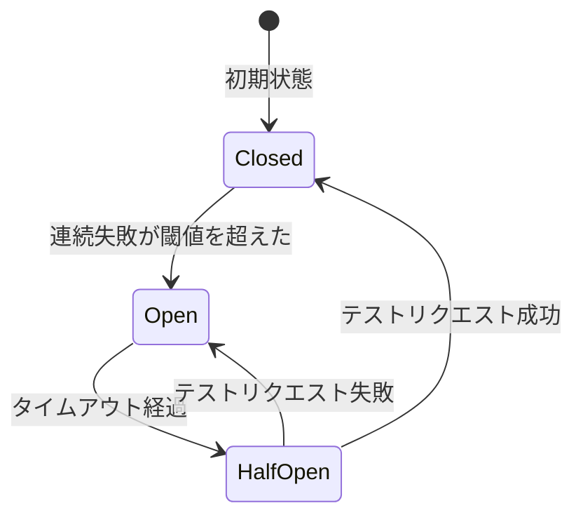
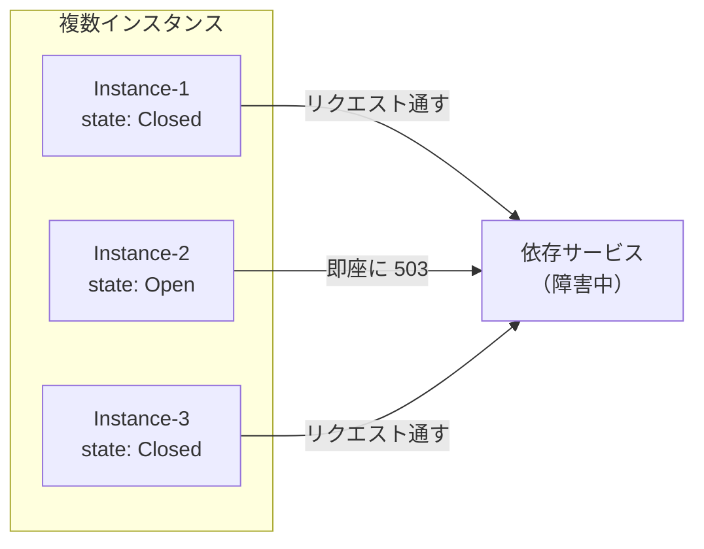

# サーキットブレーカー

マイクロサービス間の障害連鎖を防ぐための設計パターン。

## 概要

電気回路のブレーカー（過電流で自動的に遮断する装置）から名前を借りた概念。**依存先サービスが障害を起こしている時に、リクエストを遮断して素早く失敗させる**ことで、システム全体の安定性を保つ。

Netflix が Hystrix ライブラリで広めた。現在は Resilience4j（Java）や tower（Rust）などで実装可能。

## なぜ必要か

### サーキットブレーカーがない場合

```
依存サービス障害発生
    ↓
呼び出し元がリクエスト → タイムアウト待ち（例: 30秒）
    ↓
その間、スレッド/コネクションが占有される
    ↓
新規リクエストが処理できなくなる
    ↓
呼び出し元も障害状態に（障害の連鎖 = Cascading Failure）
```

### サーキットブレーカーがある場合

```
依存サービス障害発生
    ↓
数回失敗を検知 → サーキットブレーカー Open
    ↓
以降のリクエストは即座にエラーを返す（タイムアウト待ちなし）
    ↓
呼び出し元は他の処理を継続できる
    ↓
一定時間後に Half-Open でリトライし、復旧を検知
```

## 3つの状態



| 状態 | 動作 | 遷移条件 |
|------|------|----------|
| **Closed** | 正常。リクエストを通す | 連続失敗が閾値を超えたら Open へ |
| **Open** | 遮断。即座にエラーを返す | タイムアウト経過後 Half-Open へ |
| **Half-Open** | 試行。限定的にリクエストを通す | 成功なら Closed、失敗なら Open へ |

## 設定パラメータ

| パラメータ | 説明 | 例 |
|-----------|------|-----|
| failure_threshold | Open に遷移する失敗回数 | 5回 |
| success_threshold | Closed に復帰する成功回数 | 3回 |
| timeout | Open から Half-Open への待機時間 | 30秒 |
| half_open_max_calls | Half-Open で許可するリクエスト数 | 3回 |

## Rust での実装

### tower を使用

```rust
use std::time::Duration;
use tower::ServiceBuilder;
use tower::limit::ConcurrencyLimitLayer;
use tower::timeout::TimeoutLayer;

// tower 自体には CircuitBreaker がないため、
// tower-circuit-breaker クレートまたは自前実装が必要

let service = ServiceBuilder::new()
    .layer(TimeoutLayer::new(Duration::from_secs(10)))
    .layer(ConcurrencyLimitLayer::new(100))
    // .layer(CircuitBreakerLayer::new(...))  // サードパーティ
    .service(inner_service);
```

### 自前実装の例

```rust
use std::sync::atomic::{AtomicU32, AtomicU64, Ordering};
use std::sync::Arc;
use std::time::{Duration, Instant};
use tokio::sync::RwLock;

#[derive(Debug, Clone, Copy, PartialEq)]
pub enum CircuitState {
    Closed,
    Open,
    HalfOpen,
}

pub struct CircuitBreaker {
    state: RwLock<CircuitState>,
    failure_count: AtomicU32,
    last_failure_time: RwLock<Option<Instant>>,
    config: CircuitBreakerConfig,
}

pub struct CircuitBreakerConfig {
    pub failure_threshold: u32,
    pub timeout: Duration,
    pub half_open_max_calls: u32,
}

impl CircuitBreaker {
    pub async fn call<F, T, E>(&self, f: F) -> Result<T, CircuitBreakerError<E>>
    where
        F: FnOnce() -> futures::future::BoxFuture<'static, Result<T, E>>,
    {
        // 状態チェック
        let state = *self.state.read().await;

        match state {
            CircuitState::Open => {
                // タイムアウト経過したか確認
                if self.should_try_half_open().await {
                    *self.state.write().await = CircuitState::HalfOpen;
                } else {
                    return Err(CircuitBreakerError::CircuitOpen);
                }
            }
            CircuitState::HalfOpen => {
                // 許可されたリクエスト数を超えていたら拒否
                // （簡略化のため省略）
            }
            CircuitState::Closed => {}
        }

        // リクエスト実行
        match f().await {
            Ok(result) => {
                self.on_success().await;
                Ok(result)
            }
            Err(e) => {
                self.on_failure().await;
                Err(CircuitBreakerError::ServiceError(e))
            }
        }
    }

    async fn on_success(&self) {
        let state = *self.state.read().await;
        if state == CircuitState::HalfOpen {
            // Half-Open で成功 → Closed へ
            self.failure_count.store(0, Ordering::SeqCst);
            *self.state.write().await = CircuitState::Closed;
        }
    }

    async fn on_failure(&self) {
        let count = self.failure_count.fetch_add(1, Ordering::SeqCst) + 1;
        *self.last_failure_time.write().await = Some(Instant::now());

        if count >= self.config.failure_threshold {
            *self.state.write().await = CircuitState::Open;
        }
    }

    async fn should_try_half_open(&self) -> bool {
        if let Some(last_failure) = *self.last_failure_time.read().await {
            last_failure.elapsed() >= self.config.timeout
        } else {
            false
        }
    }
}

#[derive(Debug)]
pub enum CircuitBreakerError<E> {
    CircuitOpen,
    ServiceError(E),
}
```

## 関連パターン

| パターン | 目的 | サーキットブレーカーとの関係 |
|---------|------|---------------------------|
| **Retry** | 一時的な失敗からの回復 | Closed 状態でリトライ、Open では即失敗 |
| **Timeout** | 長時間の待機を防ぐ | タイムアウトを失敗としてカウント |
| **Bulkhead** | リソースの分離 | 依存先ごとにリソースプールを分離 |
| **Fallback** | 代替処理の提供 | Open 時にキャッシュやデフォルト値を返す |

## RingiFlow での適用

[08_AuthService設計.md](../../40_詳細設計書/08_AuthService設計.md) で定義：

```
BFF → Auth Service への接続にサーキットブレーカを適用

| 状態 | 条件 | 動作 |
|-----|------|------|
| Closed | 正常 | リクエストを通す |
| Open | 5秒間で3回連続失敗 | 即座に 503 を返す |
| Half-Open | Open から 30 秒後 | 1リクエストを試行 |
```

## スケーラビリティと状態管理

複数インスタンスで動作する場合、サーキットブレーカーの状態をどこに持つかが問題になる。

### 問題



各インスタンスが独立して状態を持つと：
- インスタンスごとに失敗カウントがバラバラ
- 障害検知が遅れる可能性
- インスタンスごとに挙動が異なる

### 解決策

| 方式 | 説明 | メリット | デメリット |
|------|------|---------|-----------|
| **インスタンス単位** | 各インスタンスが独立して状態を持つ | シンプル、外部依存なし、レイテンシなし | 障害検知が遅れる可能性 |
| **共有ストレージ** | Redis 等で状態を共有 | 一貫した挙動 | レイテンシ増加、Redis 障害時の考慮が必要 |
| **ハイブリッド** | ローカル + 定期同期 | バランス | 実装が複雑 |

### RingiFlow での判断

インスタンス単位（方式 1）を採用。詳細は [ADR-020](../../70_ADR/020_サーキットブレーカーの状態管理方式.md) を参照。

## 参考資料

- [Release It! 本番用ソフトウェア製品の設計とデプロイのために](https://www.oreilly.co.jp/books/9784873118062/) - サーキットブレーカーパターンの原典
- [Microsoft - Circuit Breaker pattern](https://learn.microsoft.com/en-us/azure/architecture/patterns/circuit-breaker)
- [Martin Fowler - CircuitBreaker](https://martinfowler.com/bliki/CircuitBreaker.html)
