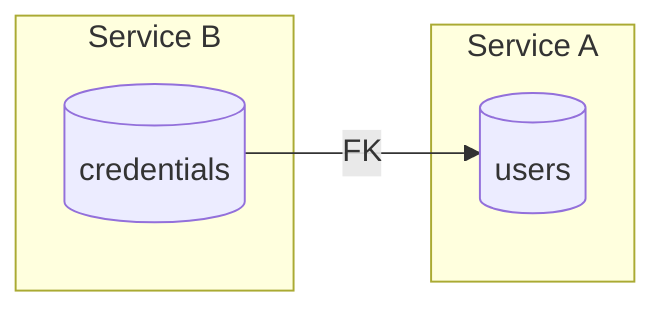
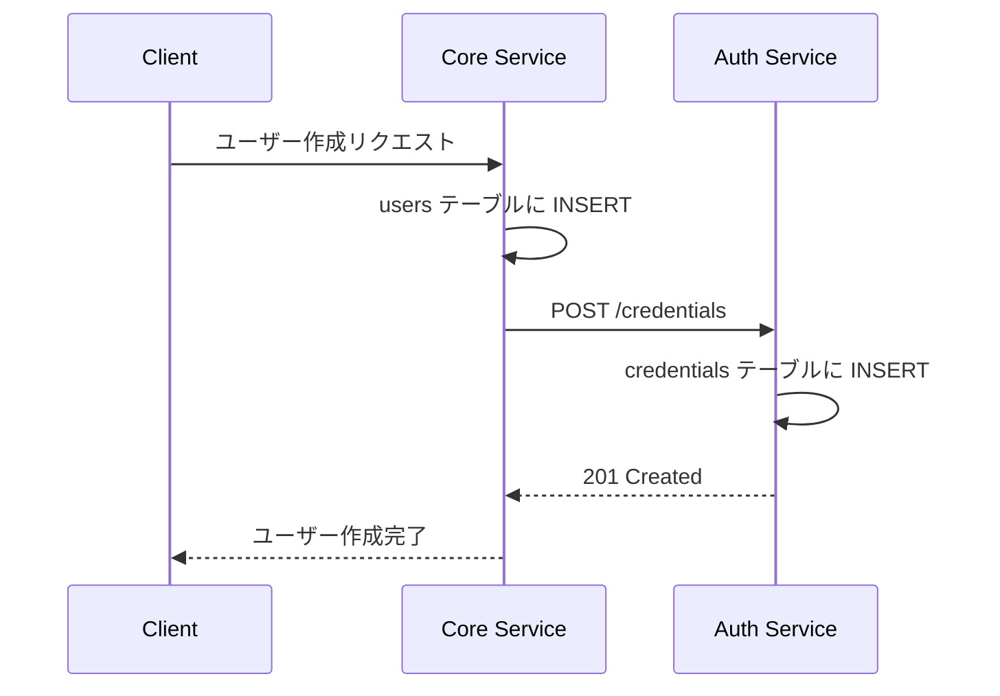
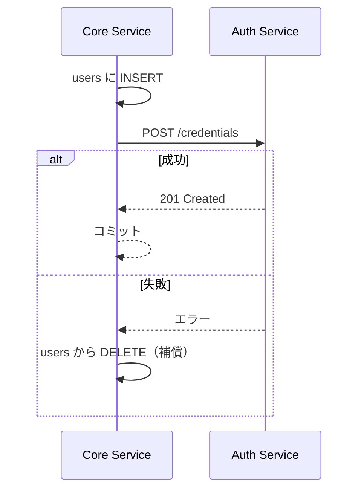
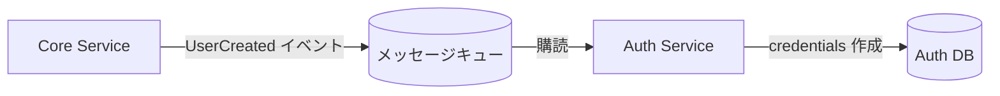

# マイクロサービス間のデータ整合性

サービス分離時のデータベース設計と整合性担保のパターン。

## 概要

マイクロサービスアーキテクチャでは、各サービスが独自のデータストアを持つ（Database per Service）のが原則。しかし、サービス間でデータの関連が必要な場合、どのように整合性を担保するかが課題となる。

## サービス間で FK 制約を設けない理由

モノリスでは当たり前だった FK 制約が、マイクロサービスでは推奨されない。

### 問題点



| 問題 | 説明 |
|------|------|
| サービス境界の侵害 | FK により Service B の操作が Service A のデータに依存。独立したデプロイ・スケーリングが困難に |
| 操作順序の強制 | users を削除する前に credentials を削除する必要がある。サービス間の暗黙的な結合 |
| 将来の分離が困難 | DB を物理的に分離する際、FK は別 DB 間では設定できない |
| 障害の伝播 | FK 制約違反で一方のサービスの障害が他方に波及 |

### マイクロサービスの原則

> Each service should own its data and should not directly access another service's database.
> — Sam Newman, "Building Microservices"

サービス間のデータアクセスは、データベースの直接参照ではなく **API 経由** で行う。

## 整合性担保のパターン

FK 制約を使わずに整合性を担保する方法。

### 1. API 経由の同期的整合性



特徴:
- シンプルで理解しやすい
- 即時整合性が保証される
- Auth Service の障害時、ユーザー作成全体が失敗する

### 2. Saga パターン（補償トランザクション）

複数サービスにまたがる処理を、各サービスのローカルトランザクションと補償処理で実現。



特徴:
- 分散トランザクションを避けられる
- 補償処理の実装が必要
- 一時的な不整合状態が発生しうる

### 3. イベント駆動の結果整合性



特徴:
- サービス間の疎結合
- 非同期処理による高スループット
- 結果整合性（Eventual Consistency）を許容する必要がある
- メッセージキューの運用が必要

### パターン選択の指針

| 要件 | 推奨パターン |
|------|------------|
| 即時整合性が必須 | API 経由の同期的整合性 |
| 高スループットが必要 | イベント駆動 |
| 複数サービスにまたがるトランザクション | Saga パターン |
| シンプルさ優先 | API 経由の同期的整合性 |

## 孤立データ（Orphan）への対処

FK 制約がないと、参照先が削除されても参照元が残る「孤立データ」が発生しうる。

### 予防策

1. **削除時の API 呼び出し**: ユーザー削除時に Auth Service の削除 API も呼ぶ
2. **ソフトデリート**: 物理削除ではなく論理削除で、参照の整合性を維持

### 検出と修復

```sql
-- 孤立した credentials を検出
SELECT c.id, c.user_id
FROM auth.credentials c
LEFT JOIN public.users u ON c.user_id = u.id
WHERE u.id IS NULL;
```

定期的なクリーンアップジョブで孤立データを削除する運用も一般的。

## RingiFlow での適用

[08_AuthService設計.md](../../40_詳細設計書/08_AuthService設計.md) で定義:

- `auth.credentials.user_id` から `public.users.id` への FK 制約は設けない
- 整合性は API 経由の同期的整合性で担保
- テナント退会時は `tenant_id` で両テーブルを並列削除

## 参考資料

- [Sam Newman - Building Microservices](https://www.oreilly.com/library/view/building-microservices-2nd/9781492034018/) - マイクロサービス設計の定番書
- [Chris Richardson - Microservices Patterns](https://microservices.io/patterns/) - Saga パターン等の詳細解説
- [Martin Fowler - Microservices](https://martinfowler.com/articles/microservices.html) - マイクロサービスの概念

