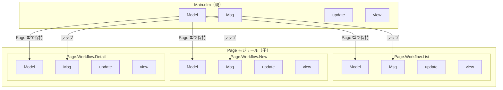
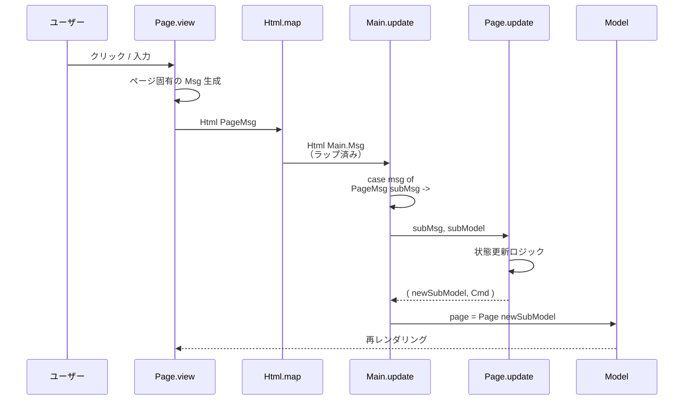
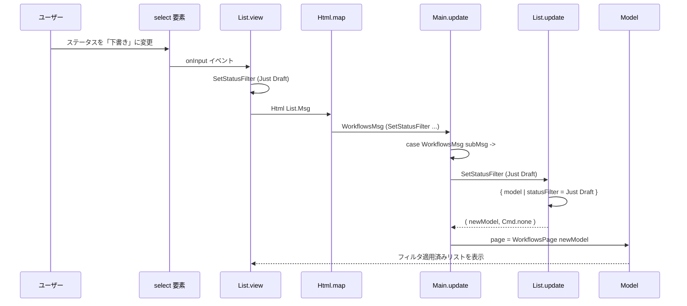
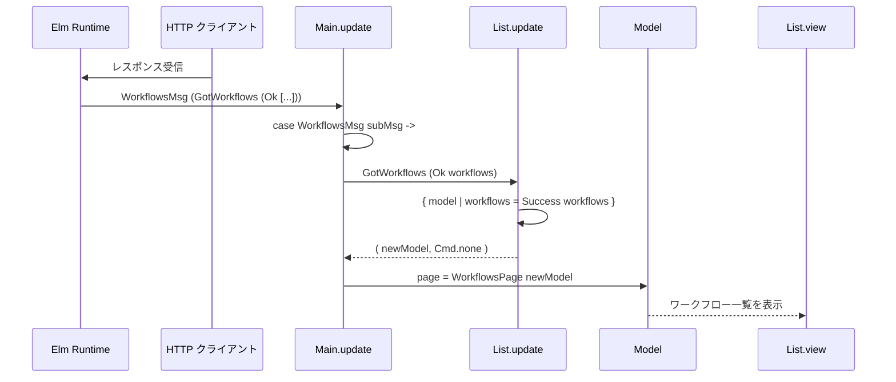

# Nested TEA（ネスト TEA）

## 概要

Nested TEA は、複数ページを持つ SPA で各ページの状態を独立して管理するための TEA 拡張パターン。

親（Main）が複数の子（Page モジュール）を統括し、メッセージと Model を階層的に管理する。

## アーキテクチャ



## メッセージフロー



## Model 構造

親の Model は `Page` カスタム型で各ページの状態をラップする:

```elm
-- Main.elm
type Page
    = HomePage                              -- 状態なし
    | WorkflowsPage WorkflowList.Model      -- 状態あり
    | WorkflowNewPage WorkflowNew.Model     -- 状態あり
    | WorkflowDetailPage WorkflowDetail.Model
    | NotFoundPage                          -- 状態なし

type alias Model =
    { key : Nav.Key
    , url : Url
    , route : Route
    , shared : Shared      -- グローバル状態
    , page : Page            -- 現在のページ状態
    }
```

## Msg 構造

親の Msg は子の Msg をラップする:

```elm
-- Main.elm
type Msg
    = LinkClicked Browser.UrlRequest        -- グローバル
    | UrlChanged Url                        -- グローバル
    | WorkflowsMsg WorkflowList.Msg         -- ページ固有
    | WorkflowNewMsg WorkflowNew.Msg        -- ページ固有
    | WorkflowDetailMsg WorkflowDetail.Msg  -- ページ固有
```

## Update パターン

### 子メッセージの処理

```elm
update : Msg -> Model -> ( Model, Cmd Msg )
update msg model =
    case msg of
        WorkflowsMsg subMsg ->
            case model.page of
                WorkflowsPage subModel ->
                    let
                        ( newSubModel, subCmd ) =
                            WorkflowList.update subMsg subModel
                    in
                    ( { model | page = WorkflowsPage newSubModel }
                    , Cmd.map WorkflowsMsg subCmd
                    )

                _ ->
                    -- ページ不一致は無視（型安全）
                    ( model, Cmd.none )
```

### ページ初期化

```elm
initPage : Route -> Shared -> ( Page, Cmd Msg )
initPage route shared =
    case route of
        Route.Workflows ->
            let
                ( pageModel, pageCmd ) =
                    WorkflowList.init shared
            in
            ( WorkflowsPage pageModel
            , Cmd.map WorkflowsMsg pageCmd
            )

        Route.WorkflowNew ->
            let
                ( pageModel, pageCmd ) =
                    WorkflowNew.init shared
            in
            ( WorkflowNewPage pageModel
            , Cmd.map WorkflowNewMsg pageCmd
            )

        -- 他のルート...
```

## View での Html.map

```elm
viewMain : Model -> Html Msg
viewMain model =
    case model.page of
        HomePage ->
            Page.Home.view
            -- 型: Html msg（ポリモーフィック）

        WorkflowsPage subModel ->
            WorkflowList.view subModel
                |> Html.map WorkflowsMsg
            -- Html WorkflowList.Msg → Html Main.Msg

        WorkflowNewPage subModel ->
            WorkflowNew.view subModel
                |> Html.map WorkflowNewMsg
```

## 具体例: フィルタ変更



## 具体例: API レスポンス受信



## Shared（グローバル状態）

ページ間で共有する状態は Shared で管理:

```elm
type alias Shared =
    { user : Maybe User
    , tenantId : String
    , csrfToken : Maybe String
    , apiBaseUrl : String
    }
```

使用パターン:

1. Main が Shared を保持
2. ページ init 時に Shared を渡す
3. ページは Shared を読み取り専用で使用
4. Shared 変更が必要な場合は Main 経由

## 新ページ追加チェックリスト

1. **Page モジュール作成**

```elm
module Page.Workflow.Example exposing (Model, Msg, init, update, view)

type alias Model = { shared : Shared, ... }
type Msg = ...

init : Shared -> ( Model, Cmd Msg )
update : Msg -> Model -> ( Model, Cmd Msg )
view : Model -> Html Msg
```

2. **Route に追加**

```elm
type Route = ... | WorkflowExample

parser = oneOf [ ..., map WorkflowExample (s "workflows" </> s "example") ]
```

3. **Main.elm に追加**

```elm
type Page = ... | WorkflowExamplePage Example.Model
type Msg = ... | WorkflowExampleMsg Example.Msg

-- initPage, update, viewMain に case 追加
```

## メリット・デメリット

| メリット | 説明 |
|---------|------|
| 分割統治 | 各ページのロジックを独立したモジュールで管理 |
| 型安全 | 存在しないページ遷移は型エラーで検出 |
| テスト容易 | ページの update/view を単独でテスト可能 |
| 状態分離 | グローバル（Shared）とローカル（フォーム）を明確に分離 |

| デメリット | 対策 |
|-----------|------|
| ボイラープレート | パターンが固定化されているので習慣化 |
| ページ間通信が間接的 | 親経由で通信（設計上の制約） |

## 関連

- [Elm アーキテクチャ](Elmアーキテクチャ.md) - 基本的な TEA パターン
- [Elm ルーティング](Elmルーティング.md) - URL 管理
- [frontend/src/Main.elm](../../../frontend/src/Main.elm) - 実装

---

## 変更履歴

| 日付 | 変更内容 |
|------|---------|
| 2026-01-28 | 初版作成 |
