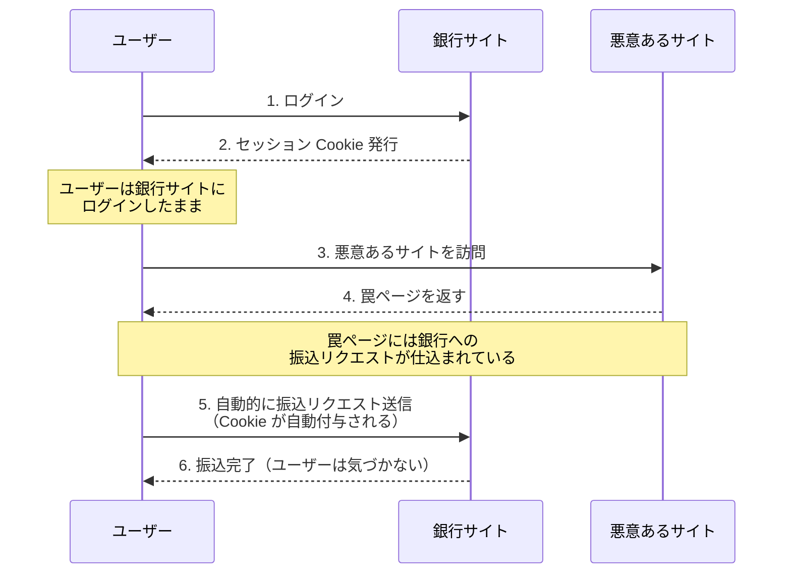
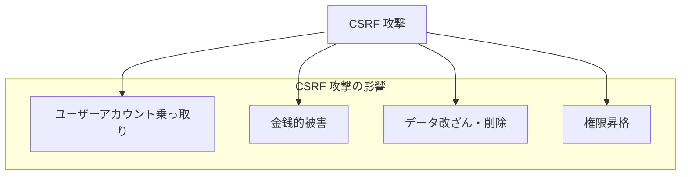
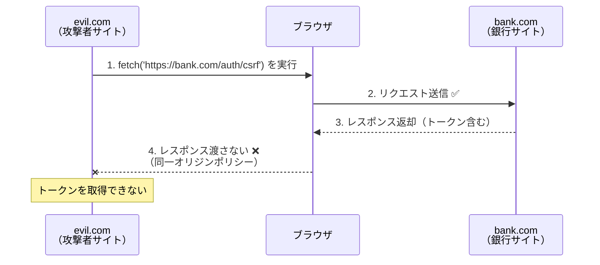
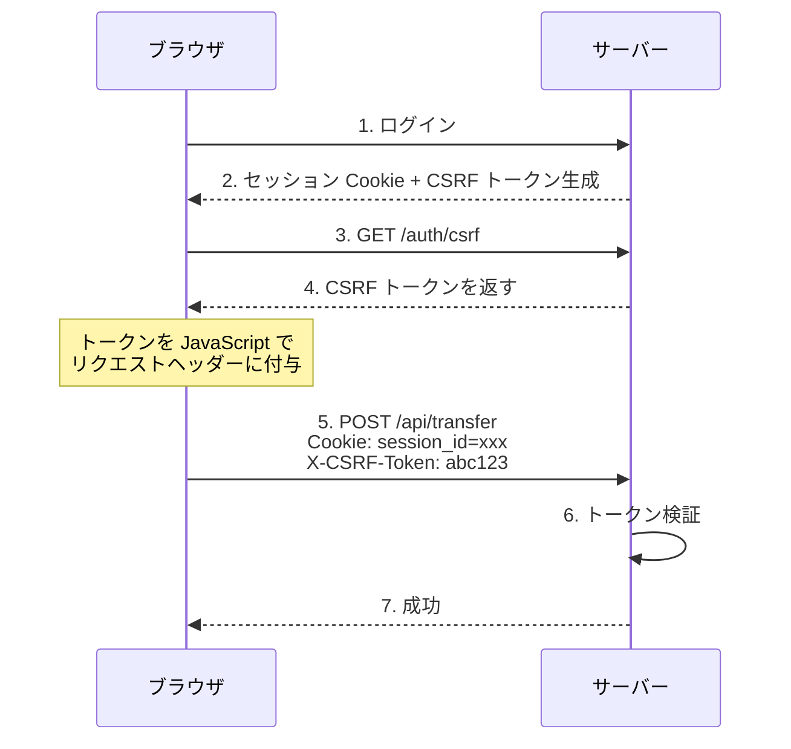
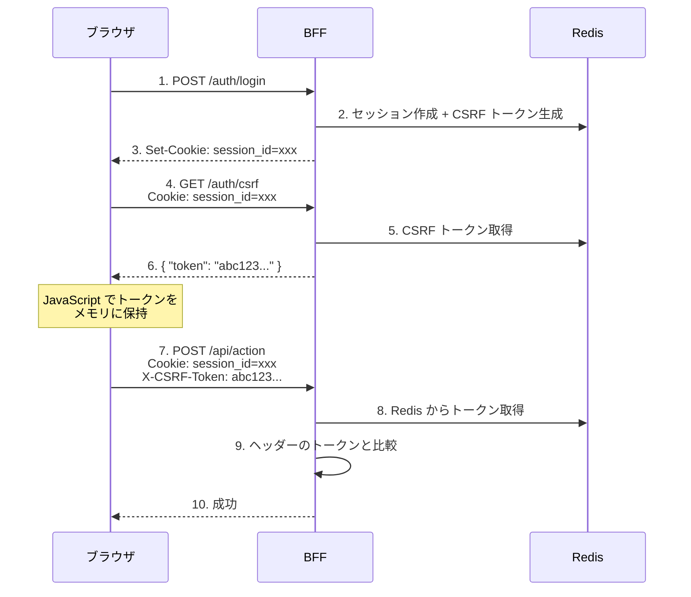

# CSRF（Cross-Site Request Forgery）

## 概要

CSRF（シーエスアールエフ、Cross-Site Request Forgery）は、ユーザーが意図しないリクエストを、認証済みの Web アプリケーションに対して送信させる攻撃手法。「クロスサイトリクエストフォージェリ」または「リクエスト強要」とも呼ばれる。

## CSRF 攻撃の仕組み

### 攻撃シナリオ



### なぜ攻撃が成功するのか

ブラウザは**同一オリジンへのリクエストに自動的に Cookie を付与する**という仕様がある:

| リクエスト元 | リクエスト先 | Cookie |
|-------------|-------------|--------|
| bank.com | bank.com | 付与される |
| evil.com | bank.com | **付与される**（これが問題） |

悪意あるサイトから銀行サイトへのリクエストでも、ユーザーのブラウザが持つ Cookie が自動的に送信される。

### 攻撃コードの例

```html
<!-- evil.com のページに仕込まれた罠 -->

<!-- 方法1: 非表示フォームの自動送信 -->
<form action="https://bank.com/transfer" method="POST" id="evilForm">
  <input type="hidden" name="to" value="attacker-account" />
  <input type="hidden" name="amount" value="1000000" />
</form>
<script>document.getElementById('evilForm').submit();</script>

<!-- 方法2: 画像タグ（GET リクエストの場合） -->


<!-- 方法3: iframe -->
<iframe src="https://bank.com/transfer?to=attacker&amount=1000000" style="display:none"></iframe>
```

## CSRF が危険な理由

### 他の攻撃との違い

| 攻撃 | 攻撃者が得るもの | 特徴 |
|------|----------------|------|
| XSS | Cookie、セッション情報 | 情報を**盗む** |
| CSRF | なし（情報は見えない） | ユーザーに**操作させる** |

CSRF では攻撃者はレスポンスを見ることができない。しかし、**副作用のあるリクエストを実行させる**ことができる:

- 送金、購入
- パスワード変更
- メールアドレス変更
- データの削除
- 管理者権限の付与

### 被害の深刻さ



## 同一オリジンポリシーと CSRF

CSRF トークンによる防御を理解するには、ブラウザの**同一オリジンポリシー（Same-Origin Policy）**を理解する必要がある。

### リクエスト送信 vs レスポンス読み取り

同一オリジンポリシーで重要なのは、**リクエストの送信**と**レスポンスの読み取り**を区別することである。

| 操作 | クロスオリジンで可能か |
|------|---------------------|
| リクエスト送信 | ✅ **可能**（だから CSRF 攻撃が成立する） |
| レスポンス読取 | ❌ **不可**（だから CSRF トークンは盗めない） |



### 具体的なコード例

```javascript
// evil.com のページで実行される JavaScript
fetch('https://bank.com/auth/csrf', { credentials: 'include' })
  .then(res => res.json())   // ← ここでブロック！
  .then(data => {
    console.log(data.token); // ← 到達しない
  })
  .catch(err => {
    // "TypeError: Failed to fetch" または
    // "CORS error: No 'Access-Control-Allow-Origin' header"
  });
```

**何が起きているか:**

1. `fetch` リクエストは bank.com に**送信される**
2. bank.com は正常にレスポンスを**返す**
3. ブラウザがレスポンスを**受け取る**
4. ブラウザが「このレスポンスは別オリジンからだ」と判断
5. **ブラウザが** evil.com の JavaScript にレスポンスを**渡さない**

ブロックしているのはサーバーではなく、**ブラウザ**である点が重要。

### なぜ CSRF 攻撃は成立するのか

リクエスト送信自体はブロックされないため、**副作用を起こすだけの攻撃**は成立する。

```html
<!-- evil.com のページ -->
<form action="https://bank.com/transfer" method="POST" id="evilForm">
  <input type="hidden" name="to" value="attacker-account" />
  <input type="hidden" name="amount" value="1000000" />
</form>
<script>document.getElementById('evilForm').submit();</script>
```

| ステップ | 結果 |
|---------|------|
| 1. POST リクエストが bank.com に送信される | ✅ 成功 |
| 2. Cookie が自動付与される | ✅ 成功 |
| 3. bank.com が振込を実行する | ✅ 成功 |
| 4. レスポンスが evil.com に見える | ❌ 見えない |

攻撃者はレスポンスを見る必要がない。**振込という副作用**だけで目的達成。

### なぜ CSRF トークンで防げるのか

攻撃者がトークンを取得できないため、正しいトークンを付与したリクエストを作れない。

```javascript
// evil.com が CSRF トークンを取得しようとする
const token = await fetch('https://bank.com/auth/csrf')
  .then(res => res.json())    // ❌ ブロック！トークン見えない
  .then(data => data.token);

// トークンがわからないので、攻撃リクエストを作れない
fetch('https://bank.com/transfer', {
  method: 'POST',
  headers: { 'X-CSRF-Token': '???' },  // 何を入れればいい？
  body: JSON.stringify({ to: 'attacker', amount: 1000000 })
});
```

### CORS との関係

CORS（Cross-Origin Resource Sharing）は、同一オリジンポリシーを**緩和する**仕組み。

```http
# bank.com のレスポンスヘッダー
Access-Control-Allow-Origin: https://trusted-partner.com
```

このヘッダーがあると、`trusted-partner.com` からのリクエストはレスポンスを読める。

| CORS 設定 | evil.com からのレスポンス読取 |
|----------|---------------------------|
| ヘッダーなし | ❌ 読めない（デフォルト） |
| `Allow-Origin: *` | ✅ 読める（危険！） |
| `Allow-Origin: https://trusted.com` | ❌ 読めない |

**セキュリティ上の注意:** `Access-Control-Allow-Origin: *` を設定すると、どのサイトからでもレスポンスが読めてしまう。認証が必要な API では絶対に設定してはならない。

### オリジン偽装はできるか？

「evil.com が bank.com になりすませないのか？」という疑問が生じるかもしれない。答えは「ブラウザ経由では不可能」である。

**オリジンはブラウザが決定する:**

オリジン（Origin）は以下の3つで構成される:

```
https://bank.com:443
 ↑        ↑      ↑
プロトコル  ホスト   ポート
```

これは**ブラウザが自動的に判定**するもので、JavaScript から偽装できない。

**Origin ヘッダーは偽装不可:**

クロスオリジンリクエストでは、ブラウザが自動的に `Origin` ヘッダーを付与する。

```http
# evil.com から bank.com へのリクエスト
POST /transfer HTTP/1.1
Host: bank.com
Origin: https://evil.com   ← ブラウザが自動設定、JavaScript で変更不可
```

JavaScript でこのヘッダーを上書きしようとしても:

```javascript
fetch('https://bank.com/api', {
  headers: {
    'Origin': 'https://bank.com'  // ← 無視される、または エラー
  }
});
```

ブラウザは「禁止ヘッダー」として無視する。

**禁止ヘッダー一覧（一部）:**

| ヘッダー | 理由 |
|---------|------|
| `Origin` | オリジン偽装防止 |
| `Host` | リクエスト先偽装防止 |
| `Cookie` | 任意の Cookie 送信防止 |
| `Referer` | 参照元偽装防止 |

**ブラウザを経由しなければ偽装可能:**

```bash
# curl なら Origin ヘッダーを自由に設定できる
curl -X POST https://bank.com/transfer \
  -H "Origin: https://bank.com" \
  -H "Cookie: session_id=xxx"
```

しかし、この場合:
- 攻撃者は**被害者の Cookie を知らない**
- Cookie は被害者のブラウザにしかない

CSRF 攻撃が「被害者のブラウザを経由する」必要があるのはこのためである。

```
攻撃者のサーバーから直接  → Cookie がない → 認証失敗
被害者のブラウザ経由      → Cookie 自動付与 → 認証成功（でも Origin 偽装不可）
```

### ブラウザ脆弱性と多層防御

同一オリジンポリシーや禁止ヘッダーの制限は、**ブラウザが正しく実装していることが前提**である。ブラウザに脆弱性があれば、これらの保護が無効化される可能性がある。

**実際に起きた例:**

| CVE | 内容 |
|-----|------|
| CVE-2016-5765 | Chrome の同一オリジンポリシーバイパス |
| CVE-2020-6519 | Chrome の CSP バイパス |
| CVE-2021-21224 | Chrome の V8 エンジン脆弱性 |

**多層防御の効果:**

| 防御層 | ブラウザ正常 | ブラウザ脆弱 |
|-------|------------|------------|
| 同一オリジンポリシー | ✅ 有効 | ❌ 無効 |
| SameSite Cookie | ✅ 有効 | ❌ 無効（かも） |
| CSRF トークン | ✅ 有効 | ✅ 有効（かも） |

CSRF トークンが「有効（かも）」なのは、脆弱性の種類によっては Origin 偽装はできてもレスポンス読み取りはできない場合があるため。複数の防御層を重ねることで、1つが突破されても他が防ぐ可能性がある。

**現実的なリスク評価:**

| 攻撃 | 難易度 | 対象 |
|------|--------|------|
| 通常の CSRF | 低 | 不特定多数 |
| ブラウザ脆弱性利用 | 高（ゼロデイは非常に高） | 標的型攻撃 |

ブラウザのゼロデイ脆弱性は:
- 発見が難しい
- 発見されても非公開で売買される（数千万〜数億円）
- 国家レベルの攻撃や高価値ターゲットに使われる

一般的な Web アプリへの攻撃には「もったいない」ので、通常は心配しなくて良い。

**結論:**

| 観点 | 対応 |
|------|------|
| 通常の攻撃 | SameSite + CSRF トークンで防御 |
| ブラウザ脆弱性 | ブラウザを最新に保つ、多層防御 |
| ゼロデイ | リスク受容（対策コストが見合わない） |

本プロジェクトで SameSite Cookie と CSRF トークンの両方を採用しているのは、この多層防御の考え方である。

## CSRF 防御方法

### 1. SameSite Cookie 属性

Cookie に `SameSite` 属性を設定することで、クロスサイトリクエストへの Cookie 送信を制限できる。

| 値 | 動作 | ユーザビリティ |
|-----|------|--------------|
| `Strict` | 他サイトからのリクエストには一切 Cookie を送らない | リンクからのアクセスでもログアウト状態になる |
| `Lax` | 安全なメソッド（GET）のトップレベルナビゲーションのみ Cookie を送る | バランスが良い（**推奨**） |
| `None` | 常に Cookie を送る（`Secure` 必須） | 従来の動作 |

```http
Set-Cookie: session_id=xxx; SameSite=Lax; HttpOnly; Secure
```

**SameSite=Lax の動作:**

| シナリオ | Cookie 送信 |
|---------|------------|
| `<a href="bank.com">` をクリック | ✅ 送信される |
| `<form method="GET">` の送信 | ✅ 送信される |
| `<form method="POST">` の送信 | ❌ 送信されない |
| `` | ❌ 送信されない |
| `fetch()` / `XMLHttpRequest` | ❌ 送信されない |

注意: `SameSite=Lax` は GET リクエストに対しては保護しない。GET で状態を変更しない設計が前提。

### 2. CSRF トークン

最も一般的で確実な防御方法。サーバーがランダムなトークンを生成し、リクエストに含めることを要求する。



**なぜ攻撃者はトークンを付与できないのか:**

1. トークンは `GET /auth/csrf` で取得する必要がある
2. 悪意あるサイトから `bank.com` への fetch は**同一オリジンポリシー**でブロックされる
3. 攻撃者はトークンを知ることができない

### 3. Double Submit Cookie パターン

本プロジェクトで採用しているパターン。



**検証フロー:**

```rust
// CSRF ミドルウェア
if !requires_csrf_validation(&method) {
    return next.run(request).await;
}

// 1. Cookie からセッション ID を取得
let session_id = jar.get("session_id")?;

// 2. ヘッダーから CSRF トークンを取得
let provided_token = request.headers().get("X-CSRF-Token")?;

// 3. Redis から保存されたトークンを取得
let stored_token = session_manager.get_csrf_token(&tenant_id, &session_id).await?;

// 4. 比較
if stored_token != provided_token {
    return Err(CsrfError::InvalidToken);
}
```

**なぜ「Double Submit」と呼ばれるか:**

- Cookie（セッション ID）と
- ヘッダー/ボディ（CSRF トークン）

の 2 つの経路でトークンを送信し、サーバー側で両方を検証するため。

### 防御方法の比較

| 方法 | 実装の手軽さ | セキュリティ | 注意点 |
|------|------------|------------|--------|
| SameSite Cookie | ✅ 簡単 | ⚠️ GET には効かない | 古いブラウザは非対応 |
| Synchronizer Token | ⚠️ セッション管理必要 | ✅ 高い | フォームに埋め込みが必要 |
| Double Submit Cookie | ✅ ステートレス可能 | ✅ 高い | JavaScript 必須 |
| Origin/Referer 検証 | ✅ 簡単 | ⚠️ バイパス可能 | 補助的な対策 |

**本プロジェクトの選択:**
- `SameSite=Lax` Cookie（第一の防御）
- Double Submit Cookie パターン（第二の防御）

両方を併用することで、多層防御を実現。

## CSRF トークンの仕様

### トークン生成

```rust
/// 64文字の暗号論的ランダム文字列（hex）を生成
fn generate_csrf_token() -> String {
    let uuid1 = Uuid::new_v4();  // 暗号論的に安全
    let uuid2 = Uuid::new_v4();
    format!("{}{}", uuid1.simple(), uuid2.simple())
}
```

**なぜ 64 文字か:**

| 長さ | エントロピー | 安全性 |
|------|------------|--------|
| 16 文字 | 64 ビット | 最低限 |
| 32 文字 | 128 ビット | 十分 |
| 64 文字 | 256 ビット | 非常に高い |

長いほど総当たり攻撃への耐性が上がる。

### トークンの保存

| 保存場所 | キー | TTL |
|---------|------|-----|
| Redis | `csrf:{tenant_id}:{session_id}` | 28800 秒（8 時間） |

セッションと同じ有効期限を設定。

### 検証対象メソッド

| HTTP メソッド | CSRF 検証 | 理由 |
|--------------|----------|------|
| GET | 不要 | 副作用なし（べき等） |
| HEAD | 不要 | 副作用なし |
| OPTIONS | 不要 | プリフライトリクエスト |
| POST | **必要** | 状態変更 |
| PUT | **必要** | 状態変更 |
| PATCH | **必要** | 状態変更 |
| DELETE | **必要** | 状態変更 |

重要: GET リクエストで状態を変更してはならない。これは REST の原則でもある。

## フロントエンド実装

### トークンの取得と送信

```javascript
// ログイン後に CSRF トークンを取得
async function fetchCsrfToken() {
  const response = await fetch('/auth/csrf', {
    credentials: 'include'  // Cookie を送信
  });
  const data = await response.json();
  return data.data.token;
}

// 状態変更リクエストにトークンを付与
async function postWithCsrf(url, body) {
  const csrfToken = await fetchCsrfToken();

  return fetch(url, {
    method: 'POST',
    credentials: 'include',
    headers: {
      'Content-Type': 'application/json',
      'X-CSRF-Token': csrfToken  // ここにトークンを付与
    },
    body: JSON.stringify(body)
  });
}
```

### Elm での実装パターン

```elm
-- CSRF トークンを Model に保持
type alias Model =
    { csrfToken : Maybe String
    , ...
    }

-- リクエスト時にヘッダーに付与
postWithCsrf : String -> String -> Json.Encode.Value -> Cmd Msg
postWithCsrf csrfToken url body =
    Http.request
        { method = "POST"
        , headers =
            [ Http.header "X-CSRF-Token" csrfToken
            ]
        , url = url
        , body = Http.jsonBody body
        , expect = ...
        , timeout = Nothing
        , tracker = Nothing
        }
```

## よくある質問

### Q: なぜ Cookie だけでは不十分なのか？

Cookie は**ブラウザが自動的に送信する**ため、攻撃者が制御できてしまう。CSRF トークンは**明示的にリクエストに含める**必要があるため、攻撃者は付与できない。

### Q: CSRF トークンは毎回新しく生成すべきか？

| 方式 | メリット | デメリット |
|------|---------|----------|
| セッション毎に固定 | シンプル、複数タブ対応 | トークン漏洩時のリスク |
| リクエスト毎に再生成 | より安全 | 複数タブで問題、実装複雑 |

**本プロジェクトではセッション毎に固定**を採用。ログイン時に生成し、ログアウトまで同じトークンを使用。

### Q: SameSite Cookie があれば CSRF トークンは不要では？

理論上は `SameSite=Strict` で十分だが、以下の理由で併用を推奨:

1. **古いブラウザ**: SameSite 非対応のブラウザがまだ存在
2. **設定ミス**: Cookie 設定の誤りに対する多層防御
3. **サブドメイン**: SameSite は同一サイト（サブドメイン含む）からの攻撃は防げない

### Q: GET /auth/csrf は CSRF 攻撃で呼び出せないのか？

呼び出せるが、レスポンスを読むことはできない:

```javascript
// evil.com から bank.com への fetch
fetch('https://bank.com/auth/csrf')
  .then(res => res.json())  // ← 同一オリジンポリシーでエラー
  .then(data => console.log(data.token));  // 到達しない
```

ブラウザの**同一オリジンポリシー**により、異なるオリジンからのレスポンス読み取りはブロックされる。

## 関連リソース

- [OWASP CSRF Prevention Cheat Sheet](https://cheatsheetseries.owasp.org/cheatsheets/Cross-Site_Request_Forgery_Prevention_Cheat_Sheet.html)
- [MDN: SameSite cookies](https://developer.mozilla.org/en-US/docs/Web/HTTP/Headers/Set-Cookie/SameSite)
- [RFC 6265bis: Cookies](https://datatracker.ietf.org/doc/html/draft-ietf-httpbis-rfc6265bis)

---

## 変更履歴

| 日付 | 変更内容 |
|------|---------|
| 2026-01-18 | 初版作成 |
| 2026-01-18 | 同一オリジンポリシーと CSRF セクションを追加 |
| 2026-01-18 | オリジン偽装、ブラウザ脆弱性と多層防御セクションを追加 |
