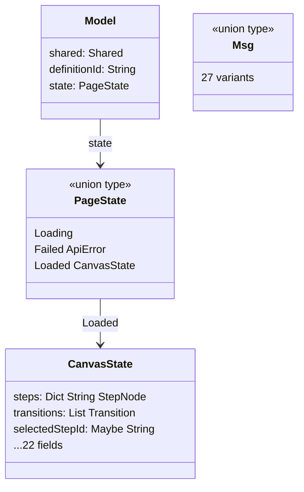
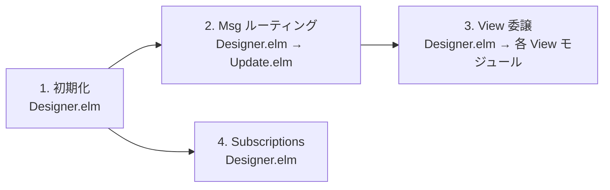
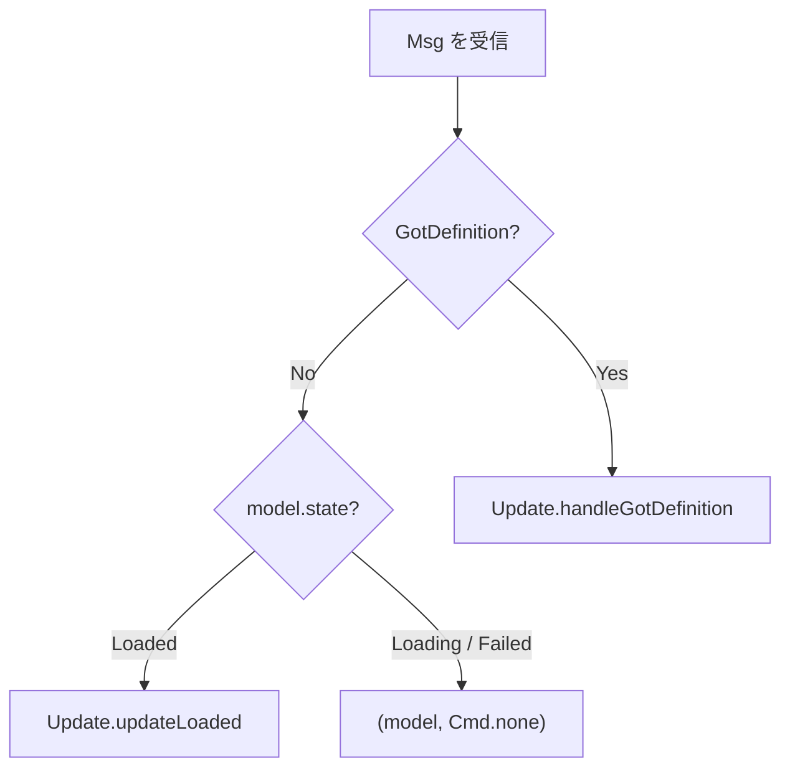
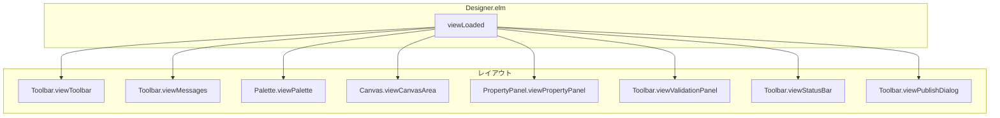

# Designer.elm 分割 - コード解説

対応 PR: #1013
対応 Issue: #1004

## 主要な型・関数

| 型/関数 | ファイル | 責務 |
|--------|---------|------|
| `Model` | [`Designer/Types.elm:42`](../../../frontend/src/Page/WorkflowDefinition/Designer/Types.elm) | ページ全体のモデル（shared, definitionId, state） |
| `PageState` | [`Designer/Types.elm:55`](../../../frontend/src/Page/WorkflowDefinition/Designer/Types.elm) | 型安全ステートマシン（Loading / Failed / Loaded） |
| `CanvasState` | [`Designer/Types.elm:63`](../../../frontend/src/Page/WorkflowDefinition/Designer/Types.elm) | Loaded 状態のキャンバスデータ（22 フィールド） |
| `Msg` | [`Designer/Types.elm:91`](../../../frontend/src/Page/WorkflowDefinition/Designer/Types.elm) | 全メッセージ定義（27 バリアント） |
| `handleGotDefinition` | [`Designer/Update.elm:26`](../../../frontend/src/Page/WorkflowDefinition/Designer/Update.elm) | API 応答 → Loading 状態遷移 |
| `updateLoaded` | [`Designer/Update.elm:72`](../../../frontend/src/Page/WorkflowDefinition/Designer/Update.elm) | Loaded 状態の全メッセージ処理 |
| `viewCanvasArea` | [`Designer/Canvas.elm:29`](../../../frontend/src/Page/WorkflowDefinition/Designer/Canvas.elm) | SVG キャンバス描画のエントリポイント |
| `viewPropertyPanel` | [`Designer/PropertyPanel.elm:24`](../../../frontend/src/Page/WorkflowDefinition/Designer/PropertyPanel.elm) | プロパティパネルのエントリポイント |
| `viewPalette` | [`Designer/Palette.elm:20`](../../../frontend/src/Page/WorkflowDefinition/Designer/Palette.elm) | ステップパレットのエントリポイント |
| `viewToolbar` | [`Designer/Toolbar.elm:28`](../../../frontend/src/Page/WorkflowDefinition/Designer/Toolbar.elm) | ツールバーのエントリポイント |

### 型の関係



## コードフロー

Designer.elm の分割は「コードの物理的な配置を変える」リファクタリング。ライフサイクルは変わらないが、コードの居場所が変わる。



### 1. 初期化（Designer.elm）

`init` は Designer.elm に残る。API 呼び出しと初期 Model の構築を行う。

```elm
-- Designer.elm:33-44
init : Shared -> String -> ( Model, Cmd Msg )
init shared definitionId =
    ( { shared = shared
      , definitionId = definitionId
      , state = Loading           -- ① 初期状態は Loading
      }
    , WorkflowDefinitionApi.getDefinition
        { config = Shared.toRequestConfig shared
        , id = definitionId
        , toMsg = GotDefinition   -- ② 応答は GotDefinition で受信
        }
    )
```

注目ポイント:

- ① `PageState = Loading` で開始。CanvasState はまだ存在しない（型安全ステートマシン）
- ② `GotDefinition` は Types.elm で定義された Msg バリアント

### 2. Msg ルーティング（Designer.elm → Update.elm）

Designer.elm は Msg の種類と現在の状態に応じて Update.elm に委譲する。



```elm
-- Designer.elm:66-82
update : Msg -> Model -> ( Model, Cmd Msg )
update msg model =
    case msg of
        GotDefinition result ->
            DesignerUpdate.handleGotDefinition result model  -- ① 全状態で処理

        _ ->
            case model.state of
                Loaded canvas ->
                    let
                        ( newCanvas, cmd ) =
                            DesignerUpdate.updateLoaded msg model.shared model.definitionId canvas
                    in                                       -- ② CanvasState のみ更新
                    ( { model | state = Loaded newCanvas }, cmd )

                _ ->
                    ( model, Cmd.none )                      -- ③ Loading/Failed は無視
```

注目ポイント:

- ① `GotDefinition` は Loading → Loaded/Failed の状態遷移を行うため、状態に関わらず処理
- ② `updateLoaded` は `CanvasState` を受け取り `CanvasState` を返す。Designer.elm が `Loaded` でラップし直す
- ③ Loading/Failed 状態では Canvas 操作系の Msg を無視。型安全ステートマシンにより CanvasState が存在しないため安全

### 3. View 委譲（Designer.elm → 各 View モジュール）

Loaded 状態の view は各サブモジュールの関数を呼び出してレイアウトする。



```elm
-- Designer.elm:152-165
viewLoaded : CanvasState -> Html Msg
viewLoaded canvas =
    div [ class "flex flex-col", style "height" "calc(100vh - 8rem)" ]
        [ Toolbar.viewToolbar canvas        -- ① 上部ツールバー
        , Toolbar.viewMessages canvas       -- ② 成功/エラーメッセージ
        , div [ class "flex flex-1 overflow-hidden" ]
            [ Palette.viewPalette           -- ③ 左パレット（引数不要）
            , Canvas.viewCanvasArea canvas  -- ④ 中央キャンバス
            , PropertyPanel.viewPropertyPanel canvas  -- ⑤ 右プロパティ
            ]
        , Toolbar.viewValidationPanel canvas
        , Toolbar.viewStatusBar canvas
        , Toolbar.viewPublishDialog canvas
        ]
```

注目ポイント:

- ③ `Palette.viewPalette` は引数なし。パレットの内容は静的（3 種類のステップ）
- ① ② ⑥ ⑦ ⑧ ツールバー系の 5 つの view は全て `Toolbar` モジュールに集約

### 4. Subscriptions（Designer.elm）

Subscriptions は Designer.elm に残る。CanvasState のフィールド（`dragging`）を参照するため。

```elm
-- Designer.elm:89-128
subscriptions : Model -> Sub Msg
subscriptions model =
    Sub.batch
        [ Ports.receiveCanvasBounds GotCanvasBounds  -- ① 全状態で購読
        , case model.state of
            Loaded canvas ->
                Sub.batch
                    [ if canvas.dragging /= Nothing then  -- ② ドラッグ中のみ
                        Sub.batch
                            [ Browser.Events.onMouseMove ... ]
                      else
                        Sub.none
                    , Browser.Events.onKeyDown ...         -- ③ キーボードショートカット
                    ]
            _ ->
                Sub.none
        ]
```

注目ポイント:

- ① `Ports.receiveCanvasBounds` は Loading 中も購読（Canvas の bounds は初回描画で必要）
- ② ドラッグ中のみ `onMouseMove`/`onMouseUp` を購読（パフォーマンス最適化）

## テスト

リファクタリングのため新規テスト不要。既存の elm-test 467 件が動作保証する。

| テスト | 検証内容 |
|-------|---------|
| `DesignerTest.elm` | Designer ページの初期化、API 応答処理、メッセージハンドリング |

### 実行方法

```bash
cd frontend && pnpm run test
```

## 設計解説

コード実装レベルの判断を記載する。機能・仕組みレベルの判断は[機能解説](./01_Designer-elm分割_機能解説.md#設計判断)を参照。

### 1. Main.elm での import 方式

場所: `Main.elm:37`, `Main.elm:102`, `Main.elm:404`

```elm
import Page.WorkflowDefinition.Designer.Types as DesignerTypes

-- Usage:
| DesignerPage DesignerTypes.Model
| DesignerMsg DesignerTypes.Msg
```

なぜこの実装か:
Elm はモジュールの re-export をサポートしない。`Designer.elm` が `Types.elm` の型を re-export できないため、Main.elm は Types.elm を直接 import する必要がある。エイリアス `DesignerTypes` で既存の `Designer` エイリアス（関数用）と区別する。

代替案:

| 案 | メリット | デメリット | 判断 |
|----|---------|-----------|------|
| **`DesignerTypes` エイリアスで直接 import（採用）** | 明示的、1 行の変更 | Main.elm に Types の知識が必要 | 採用 |
| `Designer` から qualified access | import パス不変 | Elm で不可能（re-export 非対応） | 不可 |

### 2. updateLoaded の戻り値型

場所: `Update.elm:72`

```elm
updateLoaded : Msg -> Shared -> String -> CanvasState -> ( CanvasState, Cmd Msg )
```

なぜこの実装か:
`updateLoaded` は `CanvasState` のみを受け取り返す。`Model` 全体ではなく `CanvasState` だけを扱うことで、Loaded 状態でのみ有効な操作であることが型で表現される。Designer.elm が `Loaded` でラップし直す責務を持つ。

代替案:

| 案 | メリット | デメリット | 判断 |
|----|---------|-----------|------|
| **CanvasState → CanvasState（採用）** | 型で Loaded 限定を表現 | Designer.elm でラップが必要 | 採用 |
| Model → Model | Designer.elm の update がシンプルに | Update.elm が Model 全体に触れる | 見送り |

### 3. List.Extra への置き換え

場所: `Update.elm:18`

元の Designer.elm にはファイル内ローカルの `removeAt` と `getAt` ヘルパーが定義されていた。分割時に `List.Extra.removeAt` / `List.Extra.getAt` に置き換えた。

なぜこの実装か:
`List.Extra` は既にプロジェクトの依存関係に含まれている。ファイル内ヘルパーを維持するよりも、標準的なライブラリ関数を使う方が重複が減り、動作の信頼性も高い。

## 関連ドキュメント

- [機能解説](./01_Designer-elm分割_機能解説.md)
- [ADR-062: 大型ファイル分割計画](../../70_ADR/062_大型ファイル分割計画2026-03.md)
- [ADR-054: 型安全ステートマシンパターンの標準化](../../70_ADR/054_型安全ステートマシンパターンの標準化.md)
