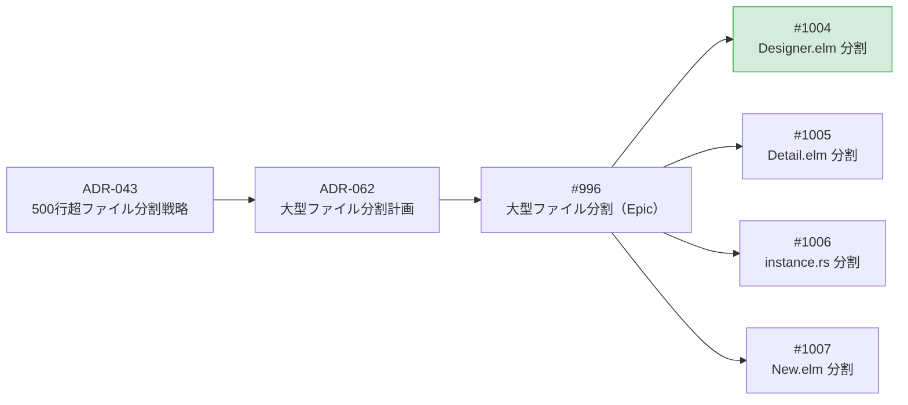
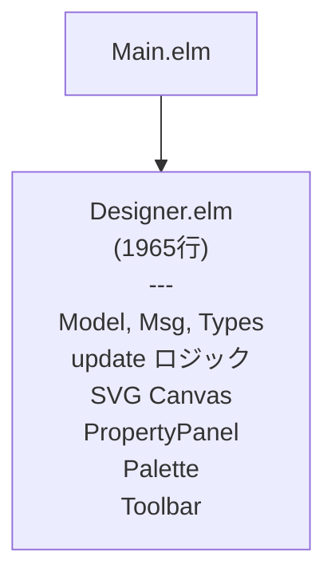
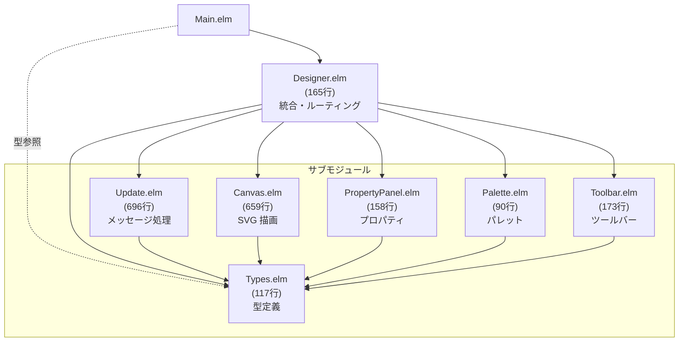
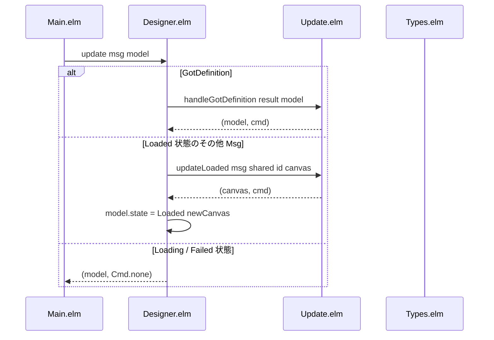
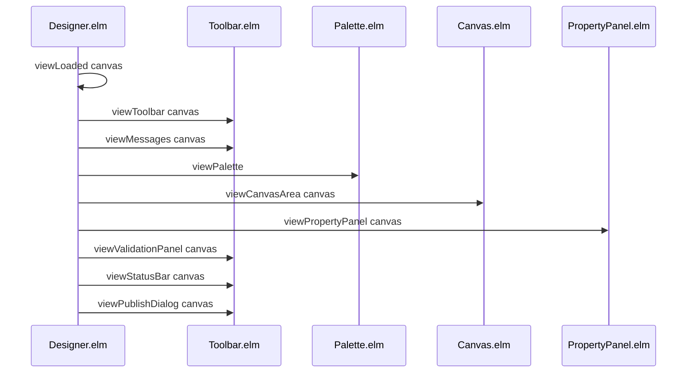

# Designer.elm 分割 - 機能解説

対応 PR: #1013
対応 Issue: #1004

## 概要

ワークフローデザイナー画面の `Designer.elm`（1965行）を責務別に 7 つのモジュールに分割した。ADR-062 で策定された分割計画に基づくが、Elm の循環依存制約に対応するため `Types.elm` を追加した 7 ファイル構成とした。

## 背景

### 大型ファイル分割の方針

ADR-043 で定められた 500 行超ファイルの分割戦略に基づき、`Designer.elm` は分割対象として識別されていた。ADR-062 では具体的な分割計画として 6 ファイル構成が策定されたが、実装時に Elm のモジュール制約が判明し、7 ファイル構成に調整した。

### 変更前の課題

`Designer.elm` は TEA（The Elm Architecture）のページモジュールとして Model/Msg/update/view の全てを含む 1965 行のモノリシックファイルだった。

- SVG キャンバス描画、プロパティパネル、ツールバー、パレット、メッセージ処理が 1 ファイルに集約
- 編集時のナビゲーションが困難（IDE でのジャンプが必要）
- ファイル全体の構造を把握するのにスクロールが必要

### Issue 全体の中での位置づけ

| Issue | 内容 | 状態 |
|-------|------|------|
| #996 | 大型ファイル分割（Epic） | Open |
| #1004 | Designer.elm 分割 | 本 PR |
| #1005 | Detail.elm 分割 | Open |
| #1006 | instance.rs 分割 | Open |
| #1007 | New.elm 分割 | Open |

## 用語・概念

| 用語 | 説明 | 関連コード |
|------|------|-----------|
| TEA | The Elm Architecture。Model-Msg-update-view のパターン | `Designer.elm` |
| 型安全ステートマシン | ADT（代数的データ型）で状態を表現し、各状態でのみ有効なフィールドを型レベルで保証する | `PageState`, `CanvasState` |
| Types.elm パターン | 共有型定義を独立モジュールに配置し、親子モジュール間の循環依存を解消するパターン | `Designer/Types.elm` |

## ビフォー・アフター

### Before（変更前）

全ての責務が 1 ファイル（1965行）に集約されていた。

#### 制約・課題

- 1965 行のファイルを全体把握するには IDE のアウトライン機能に依存
- view 関数の修正時に update ロジックのコードが視界に入りノイズになる
- 個別の UI コンポーネント（パレット、ツールバー等）だけを確認したい場合でも巨大ファイルを開く必要がある

### After（変更後）

責務別に 7 モジュールに分割。Types.elm が循環依存のハブとなり、一方向の依存グラフを形成する。

#### 改善点

- 各モジュールが単一の責務を持ち、90〜696 行のサイズに収まる
- Designer.elm は 165 行の薄いオーケストレータに
- view の修正は該当サブモジュールのみを開けば完結する

## データフロー

### フロー 1: Msg のルーティング

Designer.elm がメッセージを受け取り、Update.elm に委譲する。

### フロー 2: View の委譲

Loaded 状態の view を各サブモジュールに委譲する。

## 設計判断

機能・仕組みレベルの判断を記載する。コード実装レベルの判断は[コード解説](./01_Designer-elm分割_コード解説.md#設計解説)を参照。

### 1. 循環依存をどう解消するか

Designer.elm が Msg を定義し、サブモジュール（Update.elm、Canvas.elm 等）が Msg を参照する。一方、Designer.elm はサブモジュールの関数を呼び出す。この双方向依存は Elm では許されない。

| 案 | 循環依存 | ボイラープレート | 全モジュールの統一性 |
|----|---------|----------------|-------------------|
| **Types.elm パターン（採用）** | 解消 | 少ない | 全モジュールが Types.elm から import |
| コールバックレコードパターン | 解消 | 多い（各 view にレコードを渡す） | view ごとに異なるレコード型 |
| Msg を各サブモジュールに分散 | 新たな統合の複雑さ | 中程度 | Msg の変換コード必要 |

採用理由: Types.elm に共有型を集約すれば、全サブモジュールが同じパスで import でき、コールバックレコードのボイラープレートも不要。ページ固有のサブモジュール（再利用不要）にはコールバックパターンの汎用性の利点が活きない。

### 2. 外部モジュール（Main.elm）の import パスをどうするか

Types.elm 導入により、Model/Msg が Designer.elm ではなく Types.elm に移動する。Main.elm の import を変更する必要がある。

| 案 | Main.elm の変更 | 暗黙の依存 | 実装コスト |
|----|---------------|-----------|-----------|
| **直接 import（採用）** | `import Designer.Types as DesignerTypes` に変更 | なし（明示的） | 低 |
| Designer.elm で re-export | 変更不要 | あり（re-export が必要） | Elm は re-export 非対応で不可 |

採用理由: Elm はモジュールの re-export をサポートしないため、Main.elm から Types.elm を直接 import する以外の選択肢がない。

## 関連ドキュメント

- [コード解説](./01_Designer-elm分割_コード解説.md)
- [ADR-062: 大型ファイル分割計画](../../70_ADR/062_大型ファイル分割計画2026-03.md)
- [ADR-043: 500行超ファイルの分割戦略](../../70_ADR/043_500行超ファイルの分割戦略.md)
- [ADR-054: 型安全ステートマシンパターンの標準化](../../70_ADR/054_型安全ステートマシンパターンの標準化.md)
