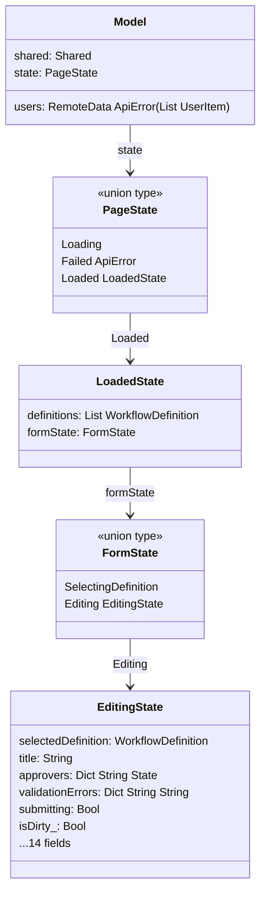
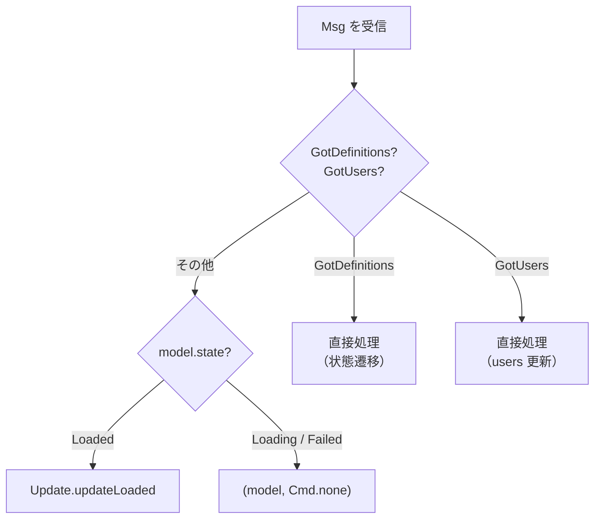
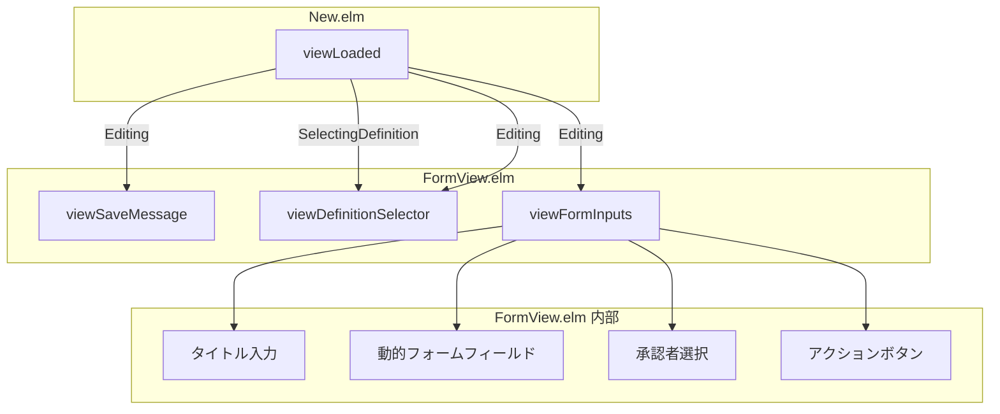

# New.elm 分割 - コード解説

対応 PR: #1018
対応 Issue: #1007

## 主要な型・関数

| 型/関数 | ファイル | 責務 |
|--------|---------|------|
| `Model` | [`New/Types.elm:34`](../../../frontend/src/Page/Workflow/New/Types.elm) | ページ全体のモデル（shared, users, state） |
| `PageState` | [`New/Types.elm:47`](../../../frontend/src/Page/Workflow/New/Types.elm) | 型安全ステートマシン（Loading / Failed / Loaded） |
| `LoadedState` | [`New/Types.elm:56`](../../../frontend/src/Page/Workflow/New/Types.elm) | 定義一覧 + FormState |
| `FormState` | [`New/Types.elm:65`](../../../frontend/src/Page/Workflow/New/Types.elm) | 定義選択前後の状態（SelectingDefinition / Editing） |
| `EditingState` | [`New/Types.elm:74`](../../../frontend/src/Page/Workflow/New/Types.elm) | フォーム入力中の全状態（14 フィールド） |
| `Msg` | [`New/Types.elm:99`](../../../frontend/src/Page/Workflow/New/Types.elm) | 全メッセージ定義（16 バリアント） |
| `initEditing` | [`New/Types.elm:131`](../../../frontend/src/Page/Workflow/New/Types.elm) | EditingState の初期化 |
| `updateLoaded` | [`New/Update.elm:33`](../../../frontend/src/Page/Workflow/New/Update.elm) | Loaded 状態の全メッセージ処理 |
| `viewDefinitionSelector` | [`New/FormView.elm:61`](../../../frontend/src/Page/Workflow/New/FormView.elm) | ワークフロー定義セレクター |
| `viewFormInputs` | [`New/FormView.elm:115`](../../../frontend/src/Page/Workflow/New/FormView.elm) | フォーム入力エリア全体 |
| `viewSaveMessage` | [`New/FormView.elm:30`](../../../frontend/src/Page/Workflow/New/FormView.elm) | 保存メッセージバナー |

### 型の関係



## コードフロー

New.elm の分割は「コードの物理的な配置を変える」リファクタリング。ライフサイクルは変わらないが、コードの居場所が変わる。


### 1. 初期化（New.elm）

`init` は New.elm に残る。API 呼び出し（定義一覧 + ユーザー一覧）と初期 Model の構築を行う。

```elm
-- New.elm:53-63
init : Shared -> ( Model, Cmd Msg )
init shared =
    ( { shared = shared
      , users = RemoteData.Loading   -- ① ユーザーは RemoteData で管理
      , state = Loading              -- ② ページ状態は PageState で管理
      }
    , Cmd.batch
        [ fetchDefinitions shared    -- ③ 2 つの API を並行取得
        , fetchUsers shared
        ]
    )
```

注目ポイント:

- ① `users` は `RemoteData` で管理。ページ状態（`Loading`/`Failed`/`Loaded`）とは独立
- ② `PageState = Loading` で開始。LoadedState はまだ存在しない（型安全ステートマシン）
- ③ 定義一覧とユーザー一覧を `Cmd.batch` で並行取得

### 2. Msg ルーティング（New.elm → Update.elm）

New.elm は Msg の種類と現在の状態に応じて Update.elm に委譲する。



```elm
-- New.elm:124-167
update : Msg -> Model -> ( Model, Cmd Msg )
update msg model =
    case msg of
        GotDefinitions result ->
            case result of
                Ok definitions ->
                    ( { model | state =
                            Loaded { definitions = definitions
                                   , formState = SelectingDefinition  -- ① 定義選択画面へ
                                   }
                      }, Cmd.none )
                Err error ->
                    ( { model | state = Failed error }, Cmd.none )

        GotUsers result ->                                            -- ② state に依存しない
            ...

        _ ->
            case model.state of
                Loaded loaded ->
                    let
                        ( newLoaded, cmd ) =
                            Update.updateLoaded msg model.shared model.users loaded
                    in                                                -- ③ LoadedState のみ更新
                    ( { model | state = Loaded newLoaded }, cmd )

                _ ->
                    ( model, Cmd.none )
```

注目ポイント:

- ① `GotDefinitions Ok` で `Loaded { formState = SelectingDefinition }` に遷移。定義がまだ選択されていない状態
- ② `GotUsers` はページ状態に関わらず `model.users` を更新。users は Model 直下で管理
- ③ `updateLoaded` は `LoadedState` を受け取り `LoadedState` を返す。New.elm が `Loaded` でラップし直す

### 3. View 委譲（New.elm → FormView.elm）

Loaded 状態の view は FormState で分岐し、FormView.elm の関数を呼び出す。



```elm
-- New.elm:210-221
viewLoaded : RemoteData ApiError (List UserItem) -> LoadedState -> Html Msg
viewLoaded users loaded =
    case loaded.formState of
        SelectingDefinition ->
            FormView.viewDefinitionSelector loaded.definitions Nothing  -- ① 定義未選択

        Editing editing ->
            div []
                [ FormView.viewSaveMessage editing.saveMessage          -- ② 成功/エラーバナー
                , FormView.viewDefinitionSelector loaded.definitions (Just editing.selectedDefinition.id)
                , FormView.viewFormInputs users editing                 -- ③ フォーム全体
                ]
```

注目ポイント:

- ① `SelectingDefinition` 状態では定義セレクターのみ表示（フォームは非表示）
- ② `Editing` 状態では保存メッセージ → 定義セレクター → フォーム入力の順で表示
- ③ `viewFormInputs` はタイトル入力、動的フォーム、承認者選択、アクションボタンを内部で構成

## テスト

リファクタリングのため新規テスト不要。既存の elm-test 467 件が動作保証する。

| テスト | 検証内容 |
|-------|---------|
| `NewTest.elm`（14 テスト） | 状態遷移、SaveDraft バリデーション、Submit バリデーション、承認者キーボード操作、dirty 状態管理 |

テストの import を `Page.Workflow.New` から `Page.Workflow.New.Types` に変更。テストロジックの変更はなし。

### 実行方法

```bash
cd frontend && pnpm run test
```

## 設計解説

コード実装レベルの判断を記載する。機能・仕組みレベルの判断は[機能解説](./01_New-elm分割_機能解説.md#設計判断)を参照。

### 1. Main.elm での import 方式

場所: `Main.elm:37-38`

```elm
import Page.Workflow.New as WorkflowNew
import Page.Workflow.New.Types as NewTypes

-- Usage:
| WorkflowNewPage NewTypes.Model
| WorkflowNewMsg NewTypes.Msg
```

なぜこの実装か:
Detail.elm 分割（#1005）で確立した `DetailTypes` パターンを踏襲。Elm は re-export をサポートしないため、Main.elm は Types.elm を直接 import する必要がある。エイリアス `NewTypes` で既存の `WorkflowNew`（関数用）と区別する。

代替案:

| 案 | メリット | デメリット | 判断 |
|----|---------|-----------|------|
| **`NewTypes` エイリアスで直接 import（採用）** | DetailTypes と一貫、明示的 | Main.elm に Types の知識が必要 | 採用 |
| `WorkflowNew` から qualified access | import パス不変 | Elm で不可能（re-export 非対応） | 不可 |

### 2. RemoteData の名前衝突回避

場所: `New.elm:26`

```elm
import Page.Workflow.New.Types exposing (..)   -- PageState(Loading, ...) を公開
import RemoteData exposing (RemoteData)         -- RemoteData のみ公開（コンストラクタは非公開）

-- 修飾アクセスで使用:
RemoteData.Success users
RemoteData.Failure error
```

なぜこの実装か:
`Types exposing (..)` で `Loading`（PageState のバリアント）が公開される。`RemoteData exposing (RemoteData(..))` も `Loading` を公開するため名前衝突が発生する。RemoteData 側を修飾アクセスにすることで衝突を回避した。

代替案:

| 案 | メリット | デメリット | 判断 |
|----|---------|-----------|------|
| **RemoteData を修飾アクセス（採用）** | Types の `exposing (..)` を維持 | `RemoteData.Success` と書く必要あり | 採用 |
| Types を修飾アクセス | RemoteData が短く書ける | Types の全バリアントに `Types.` プレフィックスが必要 | 見送り |
| 両方を修飾アクセス | 完全に明示的 | 冗長 | 見送り |

### 3. updateLoaded の引数設計

場所: `Update.elm:33`

```elm
updateLoaded : Msg -> Shared -> RemoteData ApiError (List UserItem) -> LoadedState -> ( LoadedState, Cmd Msg )
```

なぜこの実装か:
`updateLoaded` は `LoadedState` を受け取り返す。`Model` 全体を渡さないことで、Loaded 状態でのみ有効な操作であることが型で表現される。`users` と `shared` は `Model` から取り出して引数で渡す。これは Designer.elm 分割での `updateLoaded` と同じパターン。

代替案:

| 案 | メリット | デメリット | 判断 |
|----|---------|-----------|------|
| **LoadedState + 個別引数（採用）** | 型で Loaded 限定を表現、Designer と一貫 | 引数が 4 つと多め | 採用 |
| Model → Model | 引数がシンプル | Update.elm が Model 全体に触れる | 見送り |

## 関連ドキュメント

- [機能解説](./01_New-elm分割_機能解説.md)
- [ADR-062: 大型ファイル分割計画](../../70_ADR/062_大型ファイル分割計画2026-03.md)
- [Designer.elm 分割 - コード解説](../PR1013_Designer-elm分割/01_Designer-elm分割_コード解説.md)（同パターンの先行実装）
