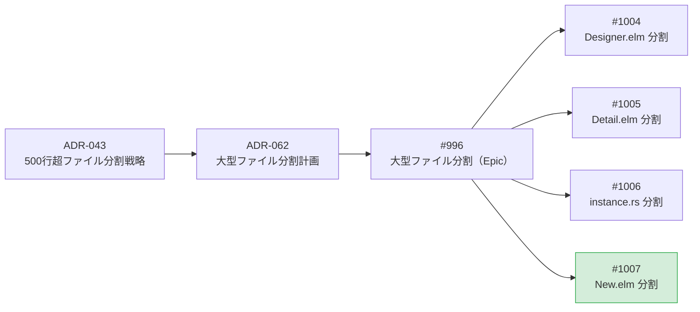
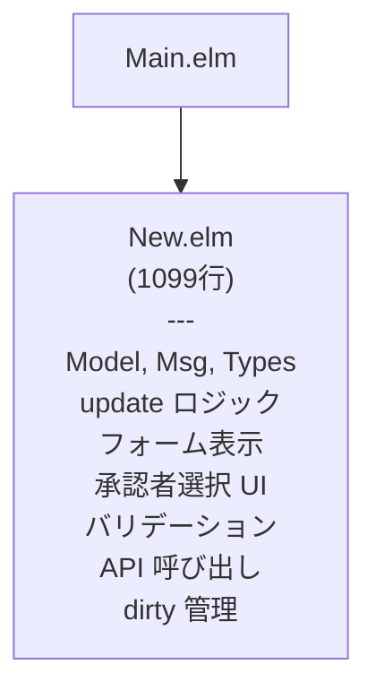
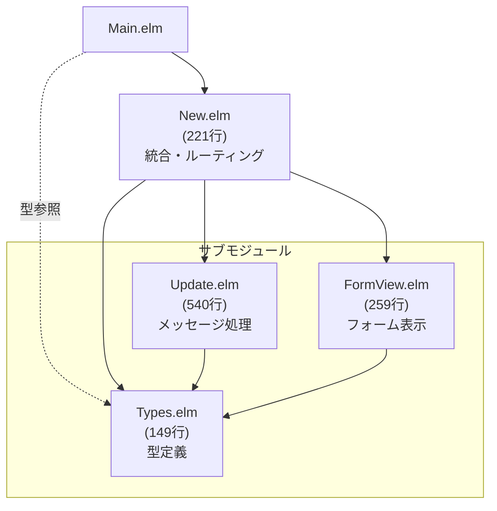
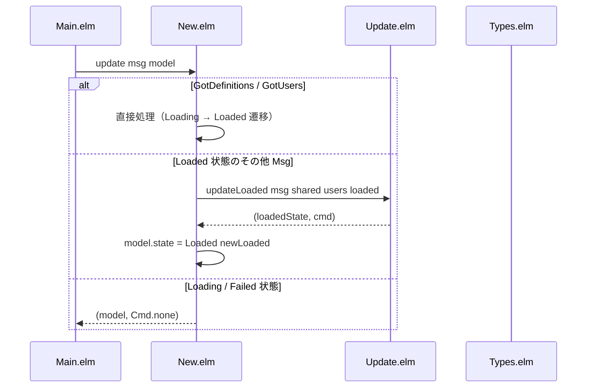
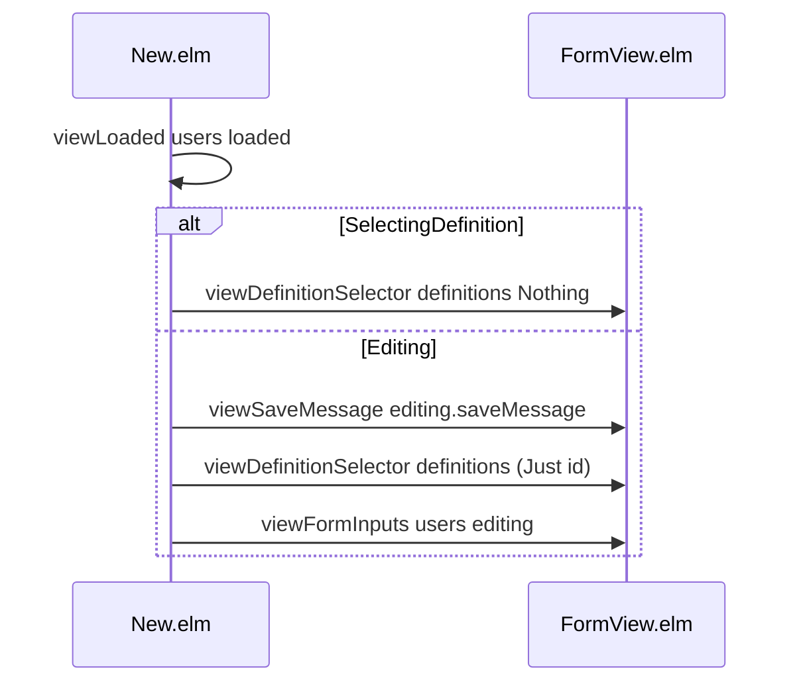

# New.elm 分割 - 機能解説

対応 PR: #1018
対応 Issue: #1007

## 概要

ワークフロー新規申請ページの `New.elm`（1099行）を責務別に 4 つのモジュールに分割した。ADR-062 で策定された 3 ファイル構成に、Elm の循環依存制約に対応するための `Types.elm` を追加した 4 ファイル構成とした。

## 背景

### 大型ファイル分割の方針

ADR-043 で 500 行超ファイルの分割戦略が確立され、ADR-062 で New.elm を含む 4 ファイルの具体的な分割計画が策定された。New.elm は ADR-062 の対象 4（最後の分割対象）であり、先行する Designer.elm（#1004）、Detail.elm（#1005）、instance.rs（#1006）の分割が完了済み。

### 変更前の課題

`New.elm` は TEA（The Elm Architecture）のページモジュールとして、定義選択・フォーム入力・承認者選択・バリデーション・API 呼び出し・dirty 管理の全ロジックが 1 ファイルに集約されていた。

- Update ロジック（約 560行）が view ロジック（約 280行）と混在し、変更時の影響把握が困難
- ADR-043 の ApproverSelector 抽出で一部は解消済みだが、依然として 1099 行
- Designer.elm、Detail.elm と同じ構造的課題（TEA ページモジュールの肥大化）

### Issue 全体の中での位置づけ

| Issue | 内容 | 状態 |
|-------|------|------|
| #996 | 大型ファイル分割（Epic） | Open |
| #1004 | Designer.elm 分割 | Closed（PR #1013） |
| #1005 | Detail.elm 分割 | Closed（PR #1016） |
| #1006 | instance.rs 分割 | Closed（PR #1012） |
| #1007 | New.elm 分割 | 本 PR |

## 用語・概念

| 用語 | 説明 | 関連コード |
|------|------|-----------|
| TEA | The Elm Architecture。Model-Msg-update-view のパターン | `New.elm` |
| 型安全ステートマシン | ADT で状態を表現し、各状態でのみ有効なフィールドを型レベルで保証する | `PageState`, `FormState` |
| Types.elm パターン | 共有型定義を独立モジュールに配置し、親子モジュール間の循環依存を解消するパターン | `New/Types.elm` |
| dirty 管理 | フォームの未保存変更を追跡し、ページ離脱時に beforeunload 警告を表示する仕組み | `markDirty`, `clearDirty` |

## ビフォー・アフター

### Before（変更前）

全ての責務が 1 ファイル（1099行）に集約されていた。

#### 制約・課題

- Update ロジック（バリデーション・API・dirty 管理含む）と View ロジック（フォーム表示）が混在し、一方の修正時にもう一方のコードが視界に入る
- 1099 行のファイルを把握するには IDE のアウトライン機能に依存

### After（変更後）

責務別に 4 モジュールに分割。Types.elm が循環依存のハブとなり、一方向の依存グラフを形成する。

#### 改善点

- 各モジュールが単一の責務を持ち、149〜540 行のサイズに収まる
- New.elm は 221 行の薄いオーケストレータに
- Update ロジックとフォーム表示の修正が独立して行える

## データフロー

### フロー 1: Msg のルーティング

New.elm がメッセージを受け取り、状態に応じて処理を分岐する。

### フロー 2: View の委譲

Loaded 状態の view を FormView.elm に委譲する。

## 設計判断

機能・仕組みレベルの判断を記載する。コード実装レベルの判断は[コード解説](./01_New-elm分割_コード解説.md#設計解説)を参照。

### 1. 循環依存をどう解消するか

New.elm が Msg を定義し、Update.elm / FormView.elm が Msg を参照する。一方、New.elm はこれらの関数を呼び出す。Designer.elm 分割（#1004）と同じ構造的課題。

| 案 | 循環依存 | ボイラープレート | 実績 |
|----|---------|----------------|------|
| **Types.elm パターン（採用）** | 解消 | 少ない | Designer.elm、Detail.elm で確立済み |
| コールバックレコードパターン | 解消 | 多い | FormView.elm の各関数にレコードが必要 |

採用理由: Designer.elm (#1004)、Detail.elm (#1005) で確立済みのパターンを踏襲。プロジェクト内の一貫性を維持する。

### 2. 分割の粒度をどうするか

ADR-062 では 3 ファイル構成（New.elm + Update.elm + FormView.elm）を計画していた。

| 案 | ファイル数 | 循環依存 | 一貫性 |
|----|----------|---------|--------|
| **4 ファイル（Types.elm 追加）（採用）** | 4 | 解消 | Designer / Detail と同パターン |
| 3 ファイル（Types なし） | 3 | 発生 | Elm では実現不可 |
| 5 ファイル以上（View をさらに分割） | 5+ | 解消 | 過度な分割 |

採用理由: Elm の循環依存制約により Types.elm は必須。View の追加分割（定義選択、承認者セクション等）は個々の関数が小さく（44行、24行等）、独立モジュール化の価値が低い。

### 3. Update.elm の 540行超過をどう扱うか

Update.elm は 540行で ADR-043 の 500行閾値を 40行超過している。

| 案 | 行数 | 責務の明確さ | 複雑さ |
|----|------|------------|--------|
| **現状維持（採用）** | 540 | updateEditing が単一の case 式 | 低 |
| バリデーション分離 | ~400 + ~140 | バリデーションだけ別ファイル | 中（参照先増加） |
| API 呼び出し分離 | ~440 + ~100 | API コード量が少なく分割の意義が薄い | 中 |

採用理由: `updateEditing` は Msg のパターンマッチによる単一の case 式であり、case の腕を別モジュールに分離すると責務境界が不明確になる。Designer/Update.elm（696行）でも同様の判断で現状維持としている。

## 関連ドキュメント

- [コード解説](./01_New-elm分割_コード解説.md)
- [ADR-062: 大型ファイル分割計画](../../70_ADR/062_大型ファイル分割計画2026-03.md)
- [ADR-043: 500行超ファイルの分割戦略](../../70_ADR/043_500行超ファイルの分割戦略.md)
- [Designer.elm 分割 - 機能解説](../PR1013_Designer-elm分割/01_Designer-elm分割_機能解説.md)（同パターンの先行実装）
