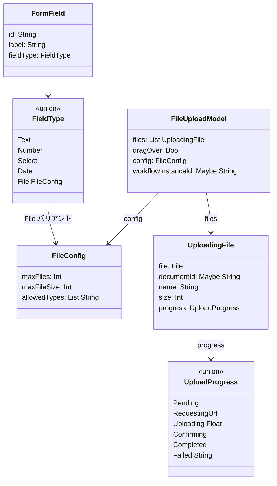
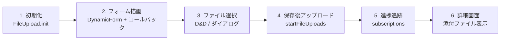
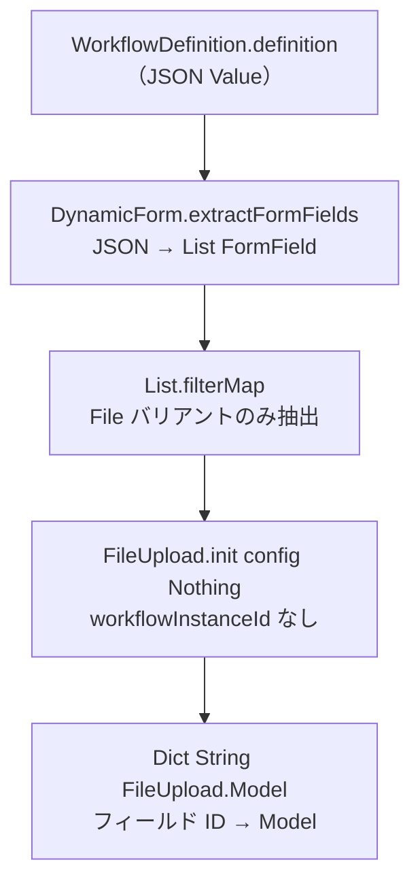
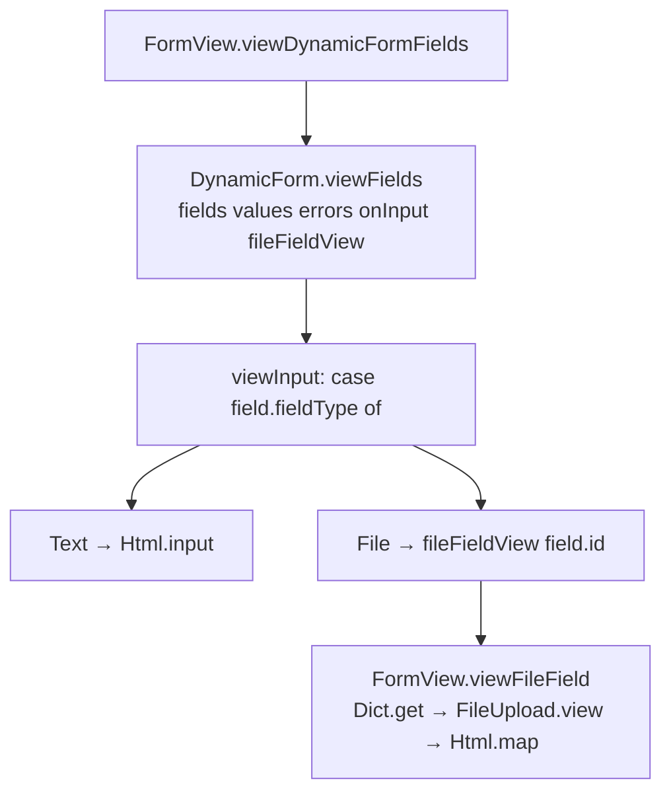
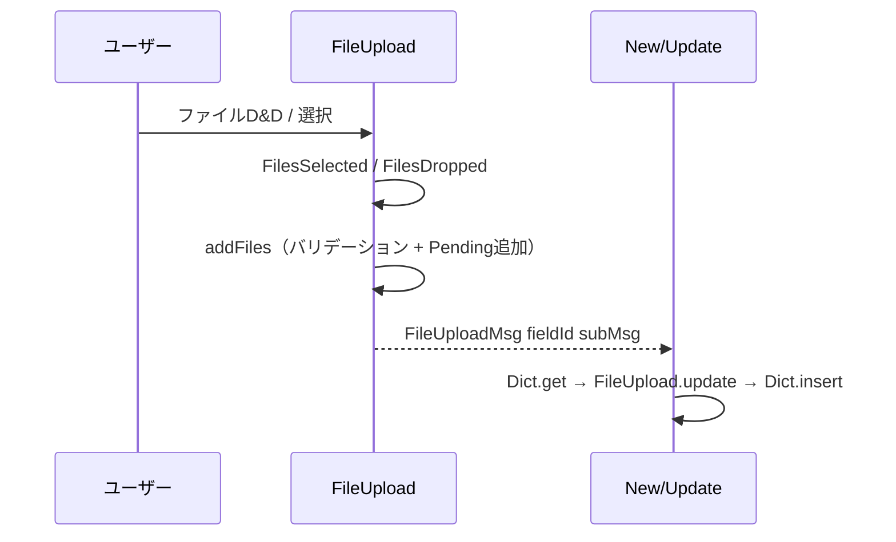
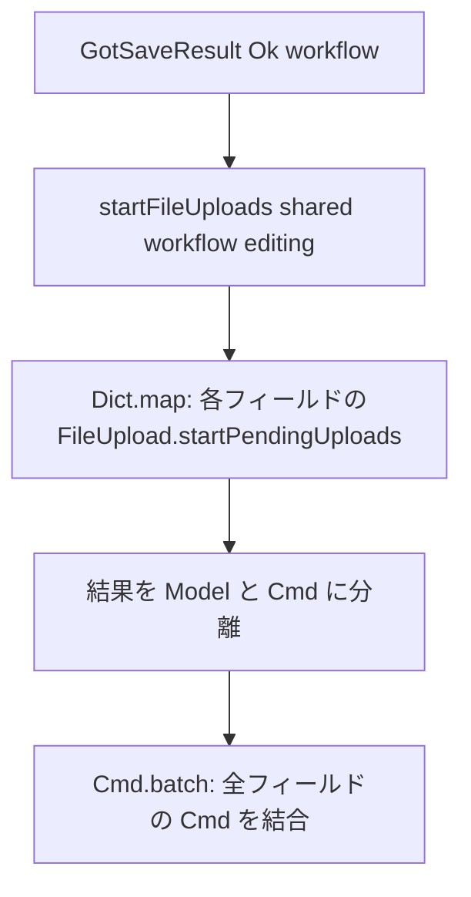
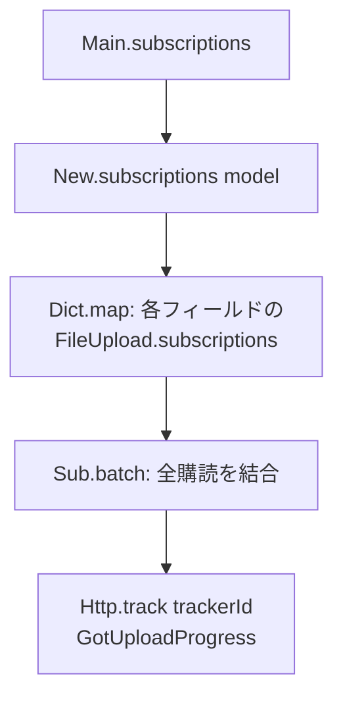
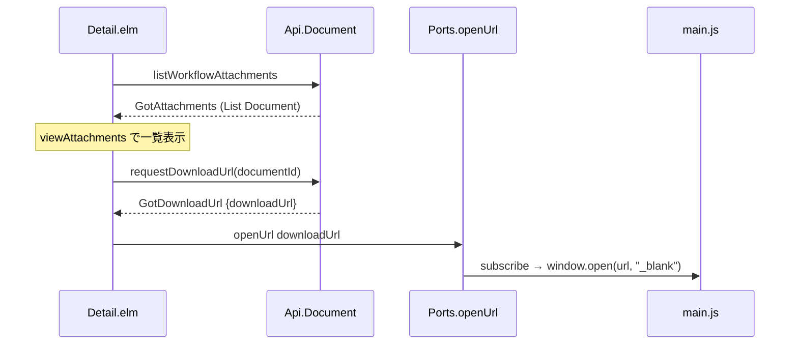
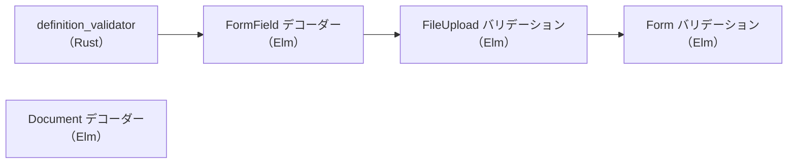

# ワークフローファイル添付 - コード解説

対応 PR: #1031
対応 Issue: #884

## 主要な型・関数

| 型/関数 | ファイル | 責務 |
|--------|---------|------|
| `FileConfig` | `frontend/src/Data/FormField.elm:31` | ファイルフィールドの制約定義（maxFiles, maxFileSize, allowedTypes） |
| `FileUpload.Model` | `frontend/src/Component/FileUpload.elm:86` | アップロード状態管理（ファイルリスト、D&D 状態、設定） |
| `UploadProgress` | `frontend/src/Component/FileUpload.elm:79` | ファイルごとのアップロード状態マシン |
| `UploadingFile` | `frontend/src/Component/FileUpload.elm:93` | 個別ファイルの状態（File オブジェクト、進捗、ドキュメント ID） |
| `startPendingUploads` | `frontend/src/Component/FileUpload.elm` | Pending ファイルのアップロードを一括開始 |
| `viewFields` | `frontend/src/Form/DynamicForm.elm` | 動的フォーム描画（File 型はコールバック注入） |
| `startFileUploads` | `frontend/src/Page/Workflow/New/Update.elm` | 全フィールドの FileUpload を一括開始 |

### 型の関係



## コードフロー

コードをライフサイクル順に追う。ワークフロー定義のフィールド解析 → フォーム表示 → ファイル選択 → 保存 → アップロード → 詳細画面表示の順。



### 1. FileUpload コンポーネントの初期化（ワークフロー定義選択時）

ワークフロー定義が選択されると、定義内のフォームフィールドを解析し、File 型フィールドごとに FileUpload.Model を生成する。



```elm
-- frontend/src/Page/Workflow/New/Types.elm
initFileUploads : WorkflowDefinition -> Dict String FileUpload.Model
initFileUploads definition =
    case DynamicForm.extractFormFields definition.definition of
        Ok fields ->
            fields
                |> List.filterMap                        -- ① File バリアントのみ抽出
                    (\field ->
                        case field.fieldType of
                            File config ->
                                Just ( field.id, FileUpload.init config Nothing )  -- ② workflowInstanceId なし
                            _ ->
                                Nothing
                    )
                |> Dict.fromList                         -- ③ フィールド ID をキーに Dict 化
        Err _ ->
            Dict.empty
```

注目ポイント:
- ① `List.filterMap` で File 型フィールドのみを安全に抽出。パターンマッチで `FileConfig` を取得
- ② `Nothing` は「まだ `workflow_instance_id` がない」状態。保存後に `startPendingUploads` で設定される
- ③ フィールド ID をキーにすることで、複数のファイルフィールドを独立に管理

### 2. DynamicForm のコールバック注入によるフォーム描画

DynamicForm は FileUpload コンポーネントに依存せず、コールバック関数で File 型フィールドの描画を外部に委譲する。



```elm
-- frontend/src/Form/DynamicForm.elm
viewInput : ... -> (String -> Html msg) -> FormField -> Html msg
viewInput values onInputMsg fileFieldView field =           -- ① fileFieldView を受け取る
    case field.fieldType of
        Text -> ...
        Number -> ...
        File _ ->
            fileFieldView field.id                          -- ② File 型はコールバックに委譲
```

```elm
-- frontend/src/Page/Workflow/New/FormView.elm
viewFileField : EditingState -> String -> Html Msg
viewFileField editing fieldId =
    case Dict.get fieldId editing.fileUploads of            -- ③ Dict から FileUpload.Model を取得
        Just fileUploadModel ->
            FileUpload.view fileUploadModel
                |> Html.map (FileUploadMsg fieldId)         -- ④ Msg 空間を変換
        Nothing ->
            text ""
```

注目ポイント:
- ① `(String -> Html msg)` 型のコールバックで、DynamicForm を FileUpload から疎結合に保つ
- ② DynamicForm は File 型の描画方法を知らない。フィールド ID を渡すだけ
- ③ フィールド ID で Dict から対応する FileUpload.Model を検索
- ④ `Html.map` で子コンポーネントの `FileUpload.Msg` を親の `FileUploadMsg fieldId subMsg` に変換（Nested TEA パターン）

### 3. ファイル選択と Msg ルーティング

ユーザーがファイルを選択すると、FileUpload コンポーネント内部で処理され、親コンポーネントが `FileUploadMsg` でルーティングする。



```elm
-- frontend/src/Page/Workflow/New/Update.elm
FileUploadMsg fieldId subMsg ->
    case Dict.get fieldId editing.fileUploads of
        Just fileUploadModel ->
            let
                requestConfig = Shared.toRequestConfig shared
                ( newFileUploadModel, fileUploadCmd ) =
                    FileUpload.update requestConfig subMsg fileUploadModel   -- ① 子に委譲
            in
            ( { editing
                | fileUploads =
                    Dict.insert fieldId newFileUploadModel editing.fileUploads  -- ② Dict を更新
              }
            , Cmd.map (FileUploadMsg fieldId) fileUploadCmd                    -- ③ Cmd も変換
            )
        Nothing ->
            ( editing, Cmd.none )
```

注目ポイント:
- ① `FileUpload.update` に `RequestConfig` を渡す。API 呼び出しに認証情報が必要なため
- ② `Dict.insert` で該当フィールドの Model のみ更新。他のフィールドには影響しない
- ③ `Cmd.map` で子の Cmd も親の Msg 空間に変換

### 4. 保存後のアップロード開始

下書き保存成功で `workflow_instance_id` が得られたら、全フィールドの Pending ファイルのアップロードを一括開始する。



```elm
-- frontend/src/Page/Workflow/New/Update.elm
startFileUploads : Shared -> WorkflowInstance -> EditingState
    -> ( Dict String FileUpload.Model, Cmd Msg )
startFileUploads shared workflow editing =
    let
        requestConfig = Shared.toRequestConfig shared
        results =
            editing.fileUploads
                |> Dict.map                                 -- ① 各フィールドに適用
                    (\fieldId fileUploadModel ->
                        let
                            ( updatedModel, cmd ) =
                                FileUpload.startPendingUploads  -- ② Pending → RequestingUrl
                                    requestConfig
                                    workflow.id
                                    fileUploadModel
                        in
                        ( updatedModel, Cmd.map (FileUploadMsg fieldId) cmd )
                    )
        updatedModels = Dict.map (\_ ( m, _ ) -> m) results
        cmds = results |> Dict.values |> List.map (\( _, cmd ) -> cmd) |> Cmd.batch  -- ③
    in
    ( updatedModels, cmds )
```

注目ポイント:
- ① `Dict.map` で全ファイルフィールドに一括適用
- ② `startPendingUploads` は `workflowInstanceId` を Model に設定し、Pending ファイルの URL 取得を開始
- ③ `Cmd.batch` で全フィールドの Cmd を結合。各ファイルのアップロードは並列に進行

### 5. アップロード進捗の購読

`Http.track` によるアップロード進捗は Elm の subscriptions で購読する。



```elm
-- frontend/src/Page/Workflow/New.elm
subscriptions : Model -> Sub Msg
subscriptions model =
    case model.state of
        Loaded loaded ->
            case loaded.formState of
                Editing editing ->
                    editing.fileUploads
                        |> Dict.map                        -- ① 各フィールドの subscriptions
                            (\fieldId fileUploadModel ->
                                FileUpload.subscriptions fileUploadModel
                                    |> Sub.map (FileUploadMsg fieldId)  -- ② Msg 変換
                            )
                        |> Dict.values
                        |> Sub.batch                       -- ③ 全フィールドを結合
                SelectingDefinition ->
                    Sub.none
        _ ->
            Sub.none
```

注目ポイント:
- ① 各ファイルフィールドの FileUpload.subscriptions は、アクティブなアップロードがある場合のみ `Http.track` を返す
- ② `Sub.map` で Msg 空間を変換（`Cmd.map` と同じパターン）
- ③ Editing 状態でのみ購読。定義選択中や Loading 中は `Sub.none`

### 6. 詳細画面での添付ファイル表示とダウンロード

ワークフロー取得成功時に添付ファイル一覧を非同期ロードし、ダウンロードは Presigned URL + Ports で実現する。



```elm
-- frontend/src/Page/Workflow/Detail.elm
DownloadFile documentId ->
    ( loaded
    , DocumentApi.requestDownloadUrl                   -- ① Presigned URL を取得
        { config = Shared.toRequestConfig shared
        , documentId = documentId
        , toMsg = GotDownloadUrl
        }
    )

GotDownloadUrl result ->
    case result of
        Ok response ->
            ( loaded, Ports.openUrl response.downloadUrl )  -- ② Ports で新タブ
        Err err ->
            ( { loaded | errorMessage = Just (ErrorMessage.fromApiError err) }
            , Cmd.none
            )
```

注目ポイント:
- ① ダウンロード URL は毎回取得する（Presigned URL は有効期限があるため）
- ② `Ports.openUrl` → JavaScript の `window.open(url, "_blank")` で新タブ。`Nav.load` ではなく Ports を使うのは、SPA の状態を保持するため

## テスト

各テストがライフサイクルのどのステップを検証しているかを示す。



| テスト | 検証対象 | 検証内容 |
|-------|---------|---------|
| `definition_validator` Rust テスト（10 件） | Phase 1 | file フィールドの JSON スキーマバリデーション |
| `FormFieldTest`（4 件） | Phase 2 | FileConfig の JSON デコード（デフォルト値含む） |
| `DocumentTest`（13 件） | Phase 2 | Document, UploadUrlResponse 等のデコード |
| `FileUploadTest`（10 件） | Phase 3 | validateFile（MIME, サイズ）、validateFileCount |
| `ValidationTest`（4 件） | Phase 4 | validateFileField（completedCount による検証） |

### 実行方法

```bash
# Rust テスト
cd backend && cargo test --lib -- definition_validator

# Elm テスト
cd frontend && npx elm-test
```

## 依存関係

| パッケージ | バージョン | 追加理由 |
|-----------|-----------|---------|
| `elm/file` | 1.0.5 | `File` 型、`File.Select.files`、`File.decoder`（D&D 用） |
| `elm/http` | 2.0.0 | `Http.fileBody`（S3 PUT）、`Http.track`（進捗購読） |

注: 両パッケージとも既に依存にあったが、本 PR で初めて `File.Select`, `Http.fileBody`, `Http.track` を使用。

## 設計解説

コード実装レベルの判断を記載する。機能・仕組みレベルの判断は[機能解説](./01_ファイル添付_機能解説.md#設計判断)を参照。

### 1. DynamicForm のコールバック注入パターン

場所: `frontend/src/Form/DynamicForm.elm` の `viewFields` 関数

```elm
viewFields :
    List FormField -> Dict String String -> Dict String String
    -> (String -> String -> msg)
    -> (String -> Html msg)    -- fileFieldView コールバック
    -> Html msg
```

なぜこの実装か:
DynamicForm は汎用的なフォーム生成モジュールであり、FileUpload コンポーネントへの依存を持つべきではない。`(String -> Html msg)` コールバックを受け取ることで、File 型の描画責務をページ側に委譲する。将来新しいフィールド型が追加されても同じパターンで対応できる（Open-Closed Principle）。

代替案:

| 案 | メリット | デメリット | 判断 |
|----|---------|-----------|------|
| **コールバック注入（採用）** | DynamicForm が汎用のまま | パラメータが 1 つ増える | 採用 |
| DynamicForm 内で FileUpload を直接 import | パラメータが少ない | 循環依存のリスク、DynamicForm が特定コンポーネントに結合 | 見送り |
| レコード型で拡張ポイントを渡す | 複数の拡張に対応しやすい | 現時点では過剰な抽象化（YAGNI） | 見送り |

### 2. Dict ベースの子コンポーネント管理

場所: `frontend/src/Page/Workflow/New/Types.elm` の `EditingState`

```elm
type alias EditingState =
    { ...
    , fileUploads : Dict String FileUpload.Model
    }
```

なぜこの実装か:
ワークフロー定義によってファイルフィールドの数と ID が動的に決まる。`Dict String Model` パターンにより、フィールド ID をキーにして任意の数の FileUpload コンポーネントを独立に管理できる。Msg に `fieldId` を携帯させることで、ルーティングも自然に実現する。

代替案:

| 案 | メリット | デメリット | 判断 |
|----|---------|-----------|------|
| **Dict String Model（採用）** | 動的なフィールド数に対応、ID ベースでルーティング | Dict 操作のボイラープレート | 採用 |
| List (String, Model) | 順序を保持 | ルックアップが O(n)、更新が煩雑 | 見送り |
| 単一の FileUpload.Model | シンプル | 複数ファイルフィールドに対応できない | 見送り |

### 3. subscriptions の伝播パターン

場所: `frontend/src/Page/Workflow/New.elm` → `frontend/src/Main.elm`

```elm
-- Main.elm
subscriptions model =
    case model.page of
        WorkflowNewPage subModel ->
            Sub.map WorkflowNewMsg (WorkflowNew.subscriptions subModel)
        ...
```

なぜこの実装か:
`Http.track` は Elm の subscriptions 経由でのみ進捗を受け取れる。Main → Page → Dict → FileUpload の 4 階層を `Sub.map` で接続する。アップロード中のファイルがない場合は `Sub.none` を返すため、不要な購読は発生しない。

## 関連ドキュメント

- [機能解説](./01_ファイル添付_機能解説.md)
- [詳細設計書: ドキュメント管理設計](../../40_詳細設計書/17_ドキュメント管理設計.md)
- [ファイルアップロード API コード解説](../PR935_ファイルアップロードAPI/01_ファイルアップロードAPI_コード解説.md)
