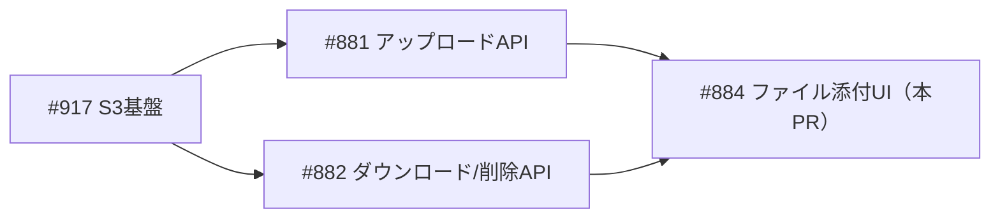
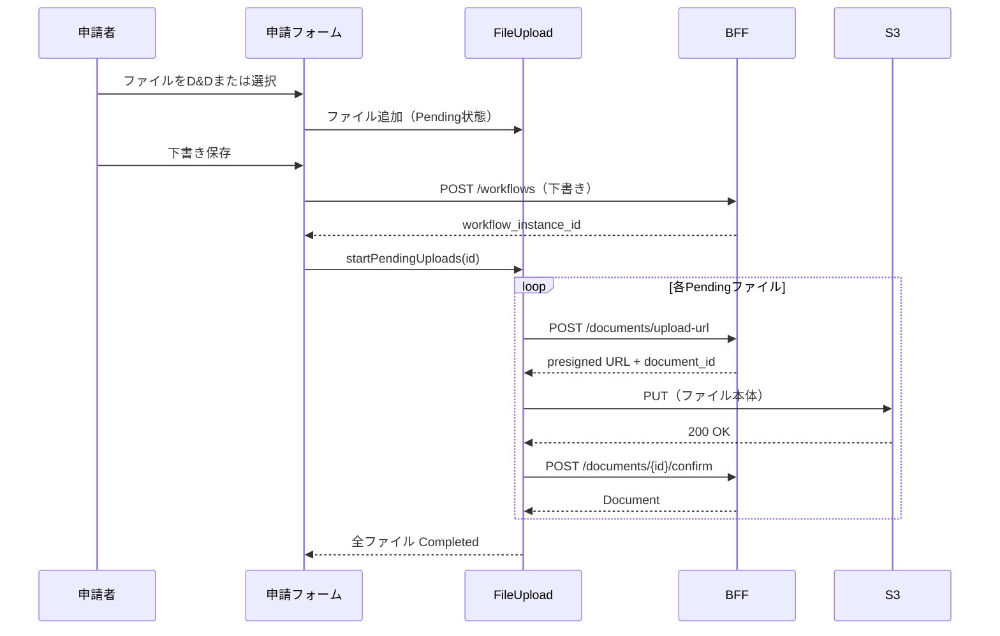
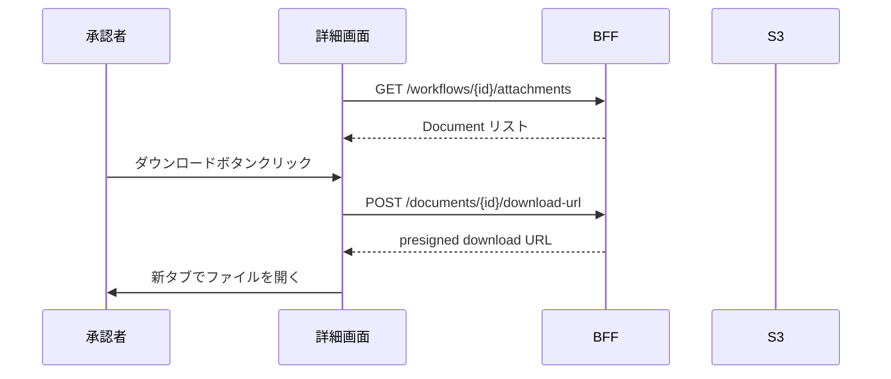
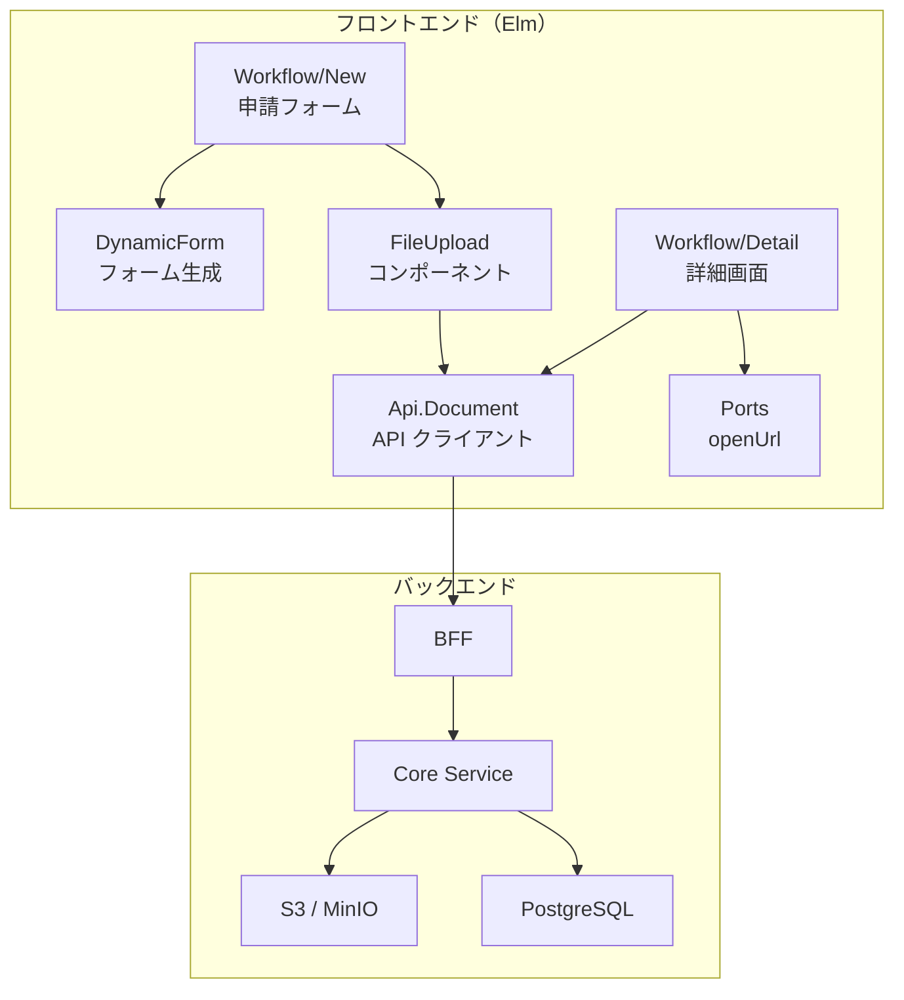
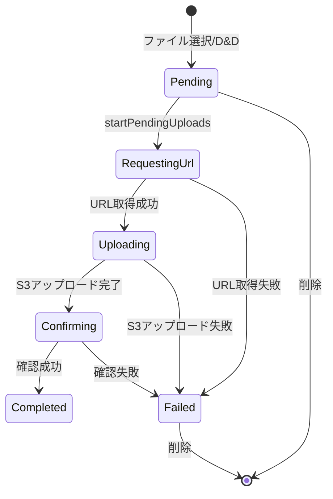

# ワークフローファイル添付 - 機能解説

対応 PR: #1031
対応 Issue: #884

## 概要

ワークフロー申請フォームにファイル添付機能を追加する。申請者はドラッグ&ドロップまたはファイル選択でファイルを添付でき、アップロード進捗がリアルタイムで表示される。承認者は詳細画面で添付ファイルを確認・ダウンロードできる。

## 背景

### ドキュメント管理基盤の上に構築

ファイルアップロード API（#881）とダウンロード/削除 API（#882）が先行して実装されている。これらは Presigned URL 方式で S3 に直接アップロード/ダウンロードする設計。本 PR はこの基盤の上にフロントエンド UI を構築する。

### Epic 全体の中での位置づけ

| Issue | 内容 | 状態 |
|-------|------|------|
| #917 | S3 基盤と MinIO ローカル環境 | 完了 |
| #881 | ファイルアップロード API | 完了 |
| #882 | ファイルダウンロード・削除 API | 完了 |
| #884 | ファイル添付 UI（本 PR） | 完了 |

## 用語・概念

| 用語 | 説明 | 関連コード |
|------|------|-----------|
| Presigned URL | S3 への一時的なアクセス権を持つ署名付き URL。BFF が発行し、ブラウザが S3 に直接アップロード/ダウンロードする | `Api.Document` |
| FileConfig | ファイルフィールドの制約（最大ファイル数、最大サイズ、許可 MIME タイプ） | `Data.FormField.FileConfig` |
| UploadProgress | ファイルごとのアップロード状態（Pending → Uploading → Completed 等） | `Component.FileUpload.UploadProgress` |
| DynamicForm | ワークフロー定義の JSON スキーマからフォームを動的に生成する仕組み | `Form.DynamicForm` |

## フロー

### 申請者のファイル添付フロー

ポイント:
- ファイル選択時点ではアップロードしない（Pending 状態で保持）
- 下書き保存で `workflow_instance_id` を取得してからアップロードを開始
- 各ファイルは独立して 3 ステップ（URL 取得 → S3 PUT → 確認）で処理

### 承認者のダウンロードフロー

## アーキテクチャ

## 状態遷移

### ファイルアップロードの状態

| 状態 | UI 表示 | 次のアクション |
|------|--------|--------------|
| Pending | ファイル名とサイズ | 保存後に自動アップロード |
| RequestingUrl | 「準備中...」 | 自動（URL 取得待ち） |
| Uploading | 進捗バー（0-100%） | 自動（S3 PUT 中） |
| Confirming | 「確認中...」 | 自動（BFF 確認待ち） |
| Completed | チェックマーク | 完了 |
| Failed | エラーメッセージ | 削除して再選択 |

## 設計判断

機能・仕組みレベルの判断を記載する。コード実装レベルの判断は[コード解説](./01_ファイル添付_コード解説.md#設計解説)を参照。

### 1. アップロードのタイミングをどうするか

ファイル選択時に即座にアップロードするか、下書き保存後にアップロードするかの選択。

| 案 | API 設計との整合 | UX | 実装の複雑さ |
|----|-----------------|-----|-------------|
| **下書き保存後にアップロード（採用）** | 既存 API が `workflow_instance_id` を要求する設計と整合 | 保存前はオフラインでもファイル選択可能 | Pending → Upload の 2 段階 |
| ファイル選択時に即座にアップロード | 一時コンテキストでアップロード → 後で関連付けが必要 | 即時フィードバック | 一時ファイル管理が追加 |

採用理由: 既存の `UploadContext::Workflow(WorkflowInstanceId)` 設計に素直に従い、追加のバックエンド変更を回避する。

### 2. ダウンロードの実装方式をどうするか

ブラウザでファイルを開く方法の選択。

| 案 | SPA との相性 | ユーザー体験 | 実装 |
|----|-------------|-------------|------|
| **Elm Ports + window.open（採用）** | ページ状態を保持 | 新タブで開く | Ports 追加が必要 |
| Nav.load | SPA がリロードされる | ページ遷移が発生 | Ports 不要 |

採用理由: `Nav.load` は SPA 全体をリロードするため、詳細画面の状態（コメント入力中の内容等）が失われる。

### 3. ファイルフィールドの制約をどこに持たせるか

ファイルサイズ上限やファイル数上限の情報源。

| 案 | Single Source of Truth | フロント・バックの整合 | 柔軟性 |
|----|----------------------|---------------------|--------|
| **ワークフロー定義の JSON スキーマ（採用）** | 定義作成時に決定、JSON で配信 | デコーダーで型安全に取得 | 定義ごとにカスタマイズ可能 |
| フロントエンドの定数 | コード内に固定 | バックエンドと乖離するリスク | 変更にデプロイが必要 |

採用理由: `FileConfig`（maxFiles, maxFileSize, allowedTypes）をワークフロー定義の一部として格納し、申請フォーム表示時にデコードする。定義ごとに制約をカスタマイズでき、バックエンドの `definition_validator` と整合する。

## 関連ドキュメント

- [コード解説](./01_ファイル添付_コード解説.md)
- [詳細設計書: ドキュメント管理設計](../../40_詳細設計書/17_ドキュメント管理設計.md)
- [ファイルアップロード API 機能解説](../PR935_ファイルアップロードAPI/01_ファイルアップロードAPI_機能解説.md)
- [計画ファイル](../../../prompts/plans/884_workflow-file-attachment.md)
