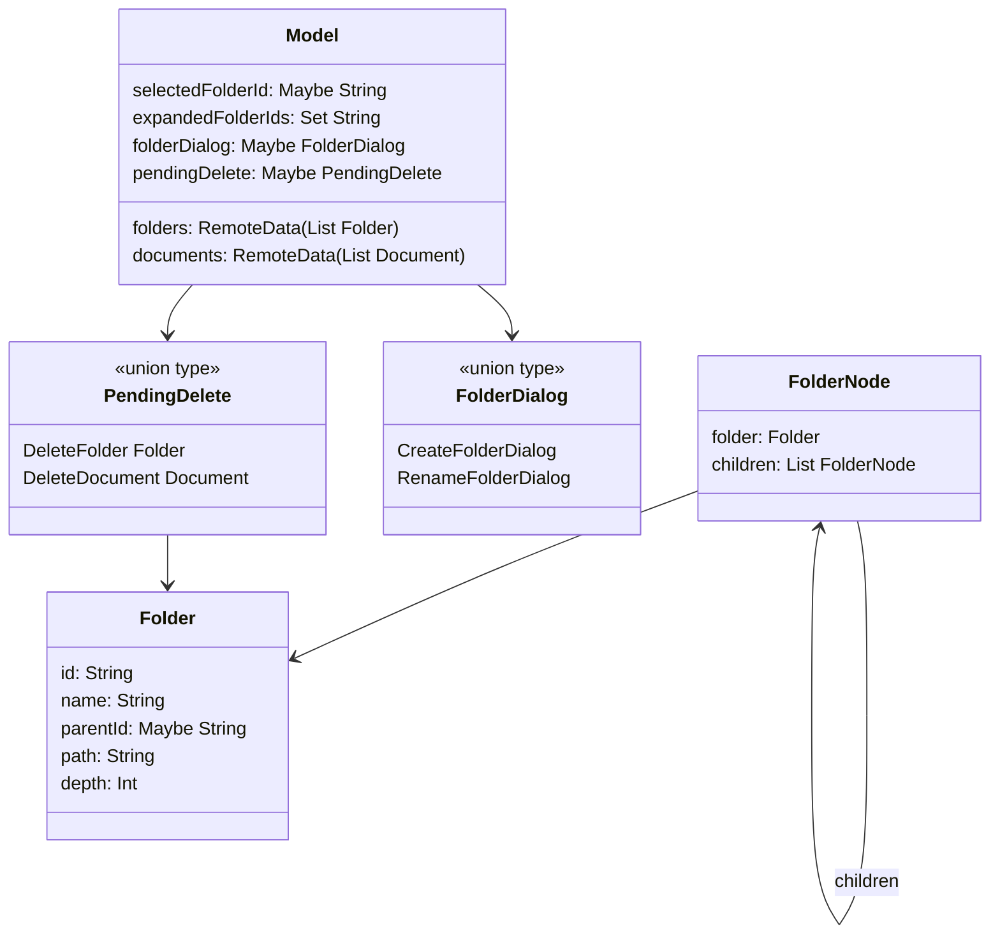
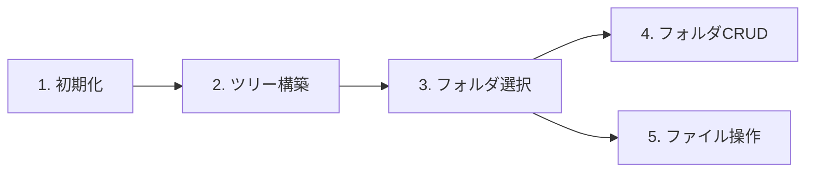
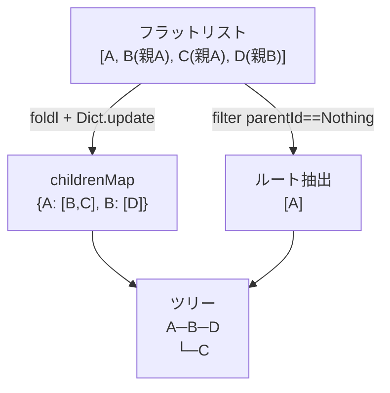
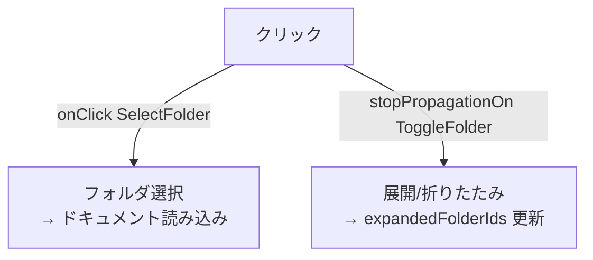
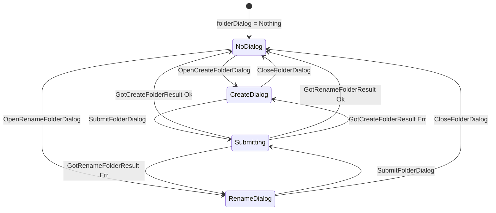
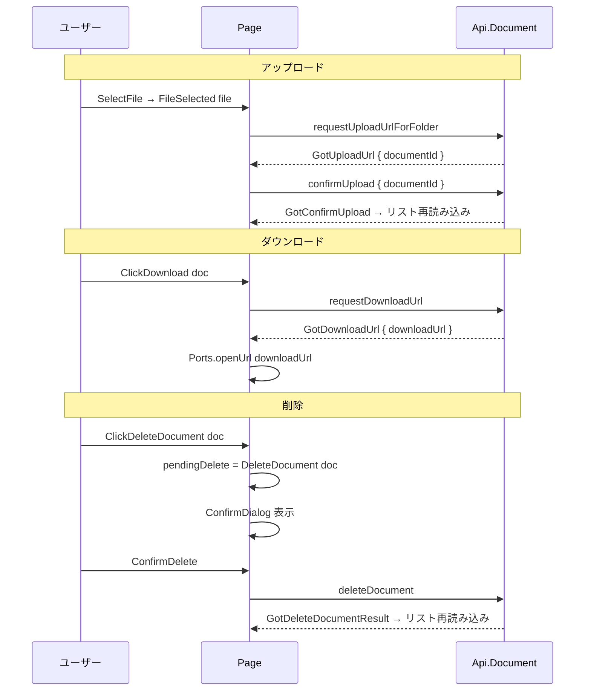
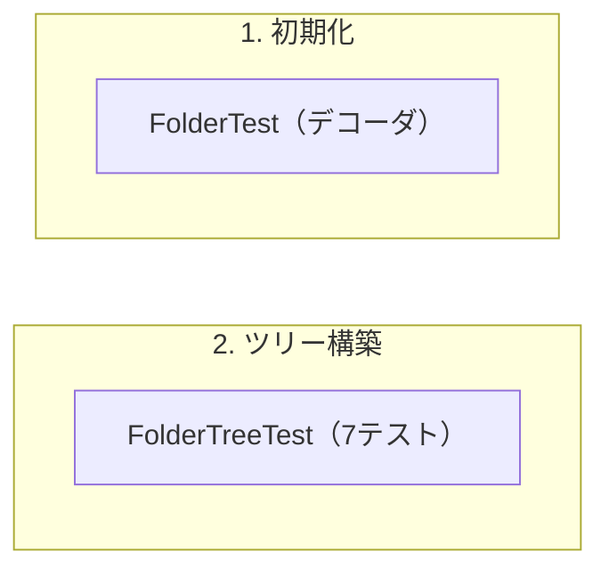

# ドキュメント管理画面 - コード解説

対応 PR: #1067
対応 Issue: #885

## 主要な型・関数

| 型/関数 | ファイル | 責務 |
|--------|---------|------|
| `Folder` | [`frontend/src/Data/Folder.elm:24`](../../../frontend/src/Data/Folder.elm) | フォルダデータ型（id, name, parentId, path, depth） |
| `FolderNode` | [`frontend/src/Component/FolderTree.elm:20`](../../../frontend/src/Component/FolderTree.elm) | 再帰ツリーノード（opaque type） |
| `buildTree` | [`frontend/src/Component/FolderTree.elm:47`](../../../frontend/src/Component/FolderTree.elm) | フラットリスト → ツリー変換 |
| `Model` | [`frontend/src/Page/Document/List.elm:39`](../../../frontend/src/Page/Document/List.elm) | ページ状態（フォルダ、ドキュメント、ダイアログ、メッセージ） |
| `FolderDialog` | [`frontend/src/Page/Document/List.elm:55`](../../../frontend/src/Page/Document/List.elm) | フォルダ作成/名前変更ダイアログの状態 |
| `PendingDelete` | [`frontend/src/Page/Document/List.elm:62`](../../../frontend/src/Page/Document/List.elm) | 削除対象の union type |

### 型の関係



## コードフロー

コードをライフサイクル順に追う。



### 1. 初期化（ページ遷移時）

ページ遷移時に `init` が呼ばれ、フォルダ一覧 API を発行する。

```elm
-- frontend/src/Page/Document/List.elm:67-84
init : Shared -> ( Model, Cmd Msg )
init shared =
    ( { shared = shared
      , folders = Loading           -- ① 初期状態は Loading
      , selectedFolderId = Nothing  -- ② フォルダ未選択
      , documents = NotAsked        -- ③ ドキュメントは未要求
      ...
      }
    , FolderApi.listFolders         -- ④ フォルダ一覧 API を発行
        { config = Shared.toRequestConfig shared
        , toMsg = GotFolders
        }
    )
```

注目ポイント:

- ① `folders` は `Loading` で開始し、`LoadingSpinner` が表示される
- ② フォルダ未選択状態では右ペインに「フォルダを選択してください」が表示される
- ③ `documents` は `NotAsked`（フォルダ選択前は API を叩かない）
- ④ `Shared.toRequestConfig` で認証トークンを含むリクエスト設定を取得

### 2. ツリー構築（API レスポンス受信後）

フラットなフォルダリストから再帰ツリーを構築する。`buildTree` は view 関数内で毎回呼ばれる（仮想 DOM の diff で効率的に処理される）。



```elm
-- frontend/src/Component/FolderTree.elm:47-89
buildTree : List Folder -> List FolderNode
buildTree folders =
    let
        childrenMap : Dict String (List Folder)  -- ①
        childrenMap =
            List.foldl
                (\folder acc ->
                    case folder.parentId of
                        Just pid ->
                            Dict.update pid             -- ②
                                (\existing -> ...)
                                acc
                        Nothing -> acc
                )
                Dict.empty
                folders

        toNode : Folder -> FolderNode              -- ③
        toNode folder =
            let
                children =
                    Dict.get folder.id childrenMap
                        |> Maybe.withDefault []
                        |> List.map toNode             -- ④ 再帰
            in
            FolderNode { folder = folder, children = children }

        roots =                                        -- ⑤
            List.filter (\f -> f.parentId == Nothing) folders
    in
    List.map toNode roots
```

注目ポイント:

- ① `childrenMap` は `parentId → 子フォルダリスト` の Dict。O(n) で構築
- ② `Dict.update` で既存エントリへの追加を安全に処理
- ③ `toNode` は再帰関数。子フォルダをさらに `toNode` で変換
- ④ `List.map toNode` で深さに関わらず再帰的にツリーを構築
- ⑤ ルートフォルダは `parentId == Nothing` でフィルタ

### 3. フォルダ選択とツリー UI

フォルダノードの再帰的な描画と、展開/選択のイベント処理。



```elm
-- frontend/src/Page/Document/List.elm:590-641
viewFolderNode : Model -> Int -> FolderNode -> Html Msg
viewFolderNode model depth node =
    let
        paddingLeft =
            String.fromInt (depth * 16 + 8) ++ "px"  -- ① 深さベースのインデント
    in
    li []
        [ div
            [ onClick (SelectFolder folder.id)         -- ② 親要素でフォルダ選択
            ]
            [ if hasChildren then
                button
                    [ stopPropagationOn "click"         -- ③ イベント伝播を停止
                        (Decode.succeed ( ToggleFolder folder.id, True ))
                    ]
                    [ text (if isExpanded then "▼" else "▶") ]
              else ...
            , if isSelected && Shared.isAdmin model.shared then
                span [] [ ... ]                        -- ④ 管理者のみ操作ボタン表示
              else text ""
            ]
        , if hasChildren && isExpanded then
            ul []
                (List.map (viewFolderNode model (depth + 1)) children)  -- ⑤ 再帰描画
          else text ""
        ]
```

注目ポイント:

- ① `depth * 16 + 8` px でネストの深さを視覚的に表現
- ② 行全体のクリックでフォルダ選択（`SelectFolder`）
- ③ `stopPropagationOn` で展開ボタンのクリックが親の `SelectFolder` に伝播しない
- ④ `Shared.isAdmin` で管理者権限チェック。非管理者には操作ボタンを表示しない
- ⑤ `depth + 1` を渡して再帰。子ノードはさらに深いインデントで描画

### 4. フォルダ CRUD（FolderDialog による型安全なダイアログ管理）



```elm
-- frontend/src/Page/Document/List.elm:55-57
type FolderDialog
    = CreateFolderDialog { name : String, parentId : Maybe String, isSubmitting : Bool }
    | RenameFolderDialog { folderId : String, name : String, isSubmitting : Bool }
```

注目ポイント:

- 作成と名前変更で異なるフィールドを持つ（`parentId` vs `folderId`）が、`name` と `isSubmitting` は共通
- `updateDialogName` と `setDialogNotSubmitting` ヘルパーで共通操作を吸収

### 5. ファイル操作（アップロード・ダウンロード・削除）



```elm
-- frontend/src/Page/Document/List.elm:62-64
type PendingDelete
    = DeleteFolder Folder      -- ① フォルダ削除
    | DeleteDocument Document  -- ② ドキュメント削除
```

注目ポイント:

- ①② 同じ `ConfirmDelete` メッセージで、`pendingDelete` の値でフォルダ/ドキュメントを分岐
- ダウンロードは `Ports.openUrl` で Presigned URL をブラウザの新しいタブで開く

## テスト

各テストがコードフローのどのステップを検証しているかを示す。



| テスト | 検証対象のステップ | 検証内容 |
|-------|------------------|---------|
| `FolderTreeTest.空リストの場合は空リストを返す` | 2 | buildTree の空入力 |
| `FolderTreeTest.ルートフォルダのみの場合` | 2 | ルートのみのツリー構築 |
| `FolderTreeTest.ルートフォルダのみの場合、子は空` | 2 | 子なしノードの children が空 |
| `FolderTreeTest.2階層のネスト` | 2 | 親子関係の構築 |
| `FolderTreeTest.2階層のネスト: 子フォルダの名前` | 2 | 子フォルダの正確性 |
| `FolderTreeTest.3階層以上のネスト` | 2 | 深いネストの再帰処理 |
| `FolderTreeTest.複数ルートフォルダそれぞれに子がある場合` | 2 | 複数ルートのツリー構築 |
| `FolderTest.*` | 1 | JSON デコーダの正確性 |

### 実行方法

```bash
cd frontend && npx elm-test
```

## 設計解説

コード実装レベルの判断を記載する。機能・仕組みレベルの判断は[機能解説](./01_ドキュメント管理画面_機能解説.md#設計判断)を参照。

### 1. FolderNode を opaque type にする

場所: `frontend/src/Component/FolderTree.elm:20-24`

```elm
type FolderNode
    = FolderNode
        { folder : Folder
        , children : List FolderNode
        }
```

なぜこの実装か:
Elm の `type alias` は再帰を許容しないため、`type` で定義する必要がある。さらにコンストラクタを直接使わず `folderOf`/`childrenOf` アクセサ関数を提供することで、内部構造の変更を呼び出し元に影響させない。

代替案:

| 案 | メリット | デメリット | 判断 |
|----|---------|-----------|------|
| `type FolderNode = FolderNode { ... }` + アクセサ（採用） | 内部隠蔽、パターンマッチ不要 | アクセサ関数の定義が必要 | 採用 |
| コンストラクタを直接公開 `FolderNode(..)` | パターンマッチ可能 | 内部変更で呼び出し元に影響 | 見送り |

### 2. Dict ベースの O(n) ツリー構築

場所: `frontend/src/Component/FolderTree.elm:47-89`

```elm
childrenMap : Dict String (List Folder)
childrenMap =
    List.foldl (\folder acc -> ...) Dict.empty folders
```

なぜこの実装か:
ナイーブな実装（各ノードで `List.filter` で子を探す）は O(n^2)。先に `parentId → children` の Dict を構築することで、各ノードの子取得が O(1) になり、全体が O(n) で完了する。

代替案:

| 案 | 時間計算量 | 空間計算量 | 判断 |
|----|----------|----------|------|
| Dict ベース（採用） | O(n) | O(n) 追加 | 採用 |
| 毎回 List.filter | O(n^2) | O(1) 追加 | 見送り（フォルダ数が増えると性能劣化） |

### 3. stopPropagationOn によるイベント分離

場所: `frontend/src/Page/Document/List.elm:599-600`

```elm
stopPropagationOn "click"
    (Decode.succeed ( ToggleFolder folder.id, True ))
```

なぜこの実装か:
展開ボタンは `onClick SelectFolder` を持つ親要素の中にある。`stopPropagationOn` で展開ボタンのクリックイベントが親に伝播するのを防ぎ、フォルダ選択と展開/折りたたみを独立したイベントにする。`True` はイベントの `stopPropagation` を有効にするフラグ。

## 関連ドキュメント

- [機能解説](./01_ドキュメント管理画面_機能解説.md)
- [FolderTree テスト](../../../frontend/tests/Component/FolderTreeTest.elm)
- [Folder デコーダテスト](../../../frontend/tests/Data/FolderTest.elm)
