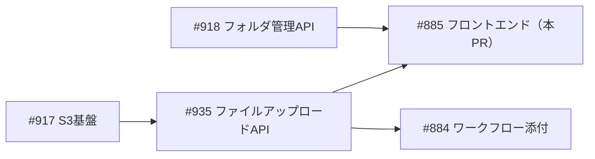
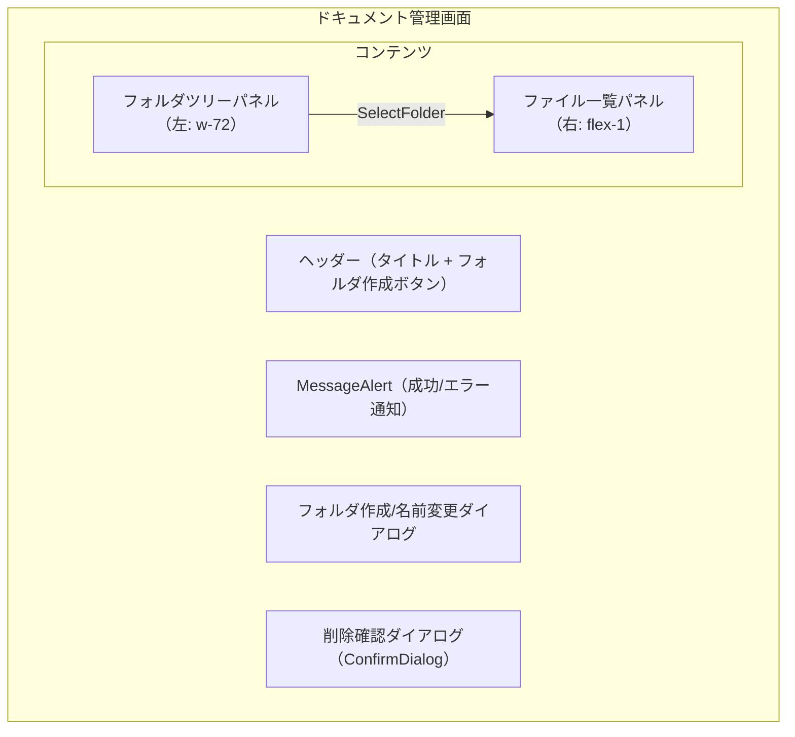
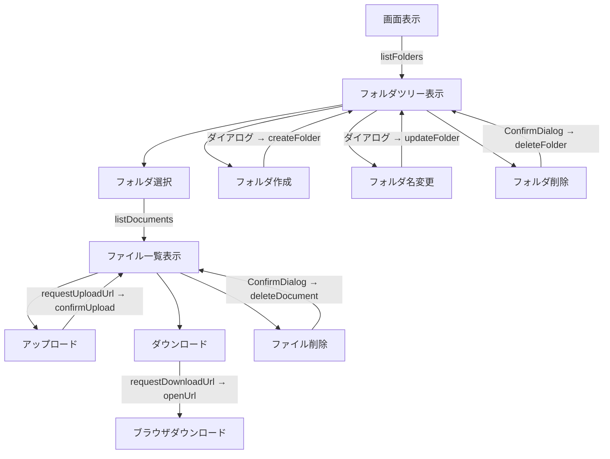
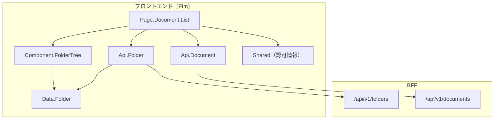
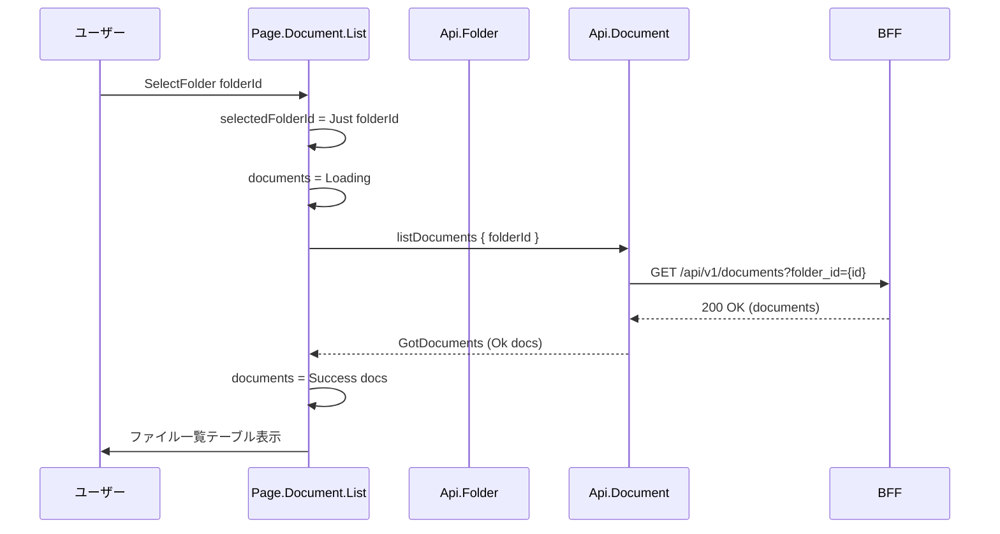
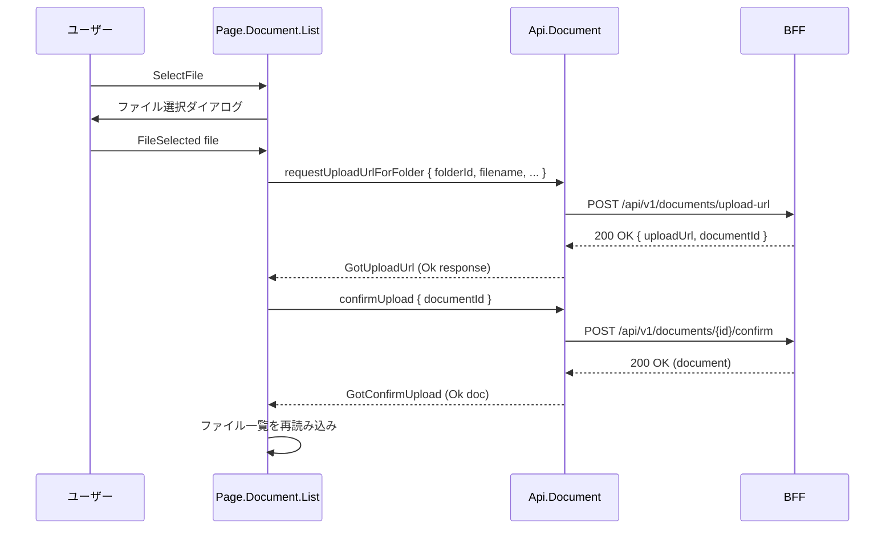

# ドキュメント管理画面 - 機能解説

対応 PR: #1067
対応 Issue: #885

## 概要

ドキュメント管理画面は、フォルダツリーとファイル一覧の2ペインレイアウトで構成されるファイル管理 UI。左側のフォルダツリーでフォルダを選択すると、右側にそのフォルダ内のファイル一覧が表示される。管理者はフォルダの CRUD 操作とファイルのアップロード・ダウンロード・削除を行える。

## 背景

### ドキュメント管理の位置づけ

RingiFlow のドキュメント管理は、ワークフロー申請に添付するファイルだけでなく、組織のファイルを一元管理する機能。バックエンドの S3 基盤（#917）、フォルダ管理 API（#918）、ファイルアップロード API（#935）が先行して実装されており、本 PR はそれらの API を呼び出すフロントエンドを提供する。

### Epic 全体の中での位置づけ

| Issue | 内容 | 状態 |
|-------|------|------|
| #917 | S3 基盤と MinIO ローカル環境 | 完了 |
| #918 | フォルダ管理 API | 完了 |
| #935 | ファイルアップロード API | 完了 |
| #884 | ワークフロー申請ファイル添付 | 完了 |
| #885 | ドキュメント管理フロントエンド（本 PR） | 本 PR |

## 用語・概念

| 用語 | 説明 | 関連コード |
|------|------|-----------|
| フォルダツリー | フラットなフォルダリストを parentId で再帰ツリー構造に変換した UI | `Component.FolderTree` |
| FolderNode | ツリーの再帰ノード。opaque type で内部構造を隠蔽 | `FolderNode` type |
| PendingDelete | 削除対象（フォルダまたはドキュメント）を表す union type | `PendingDelete` type |
| FolderDialog | フォルダ作成/名前変更ダイアログの状態を表す union type | `FolderDialog` type |
| Presigned URL | S3 への直接アップロード用の一時署名付き URL | `Api.Document` |

## フロー

### 画面構成

### ユーザー操作フロー

## アーキテクチャ

## データフロー

### フロー 1: フォルダ選択 → ファイル一覧表示

### フロー 2: ファイルアップロード

## 設計判断

機能・仕組みレベルの判断を記載する。コード実装レベルの判断は[コード解説](./01_ドキュメント管理画面_コード解説.md#設計解説)を参照。

### 1. フォルダ/ドキュメント削除の UI パターンをどうするか

2種類の削除対象（フォルダ、ドキュメント）があり、それぞれ確認ダイアログが必要。ConfirmDialog コンポーネントは固定 dialogId を持つため、1ページに複数配置できない制約がある。

| 案 | 実装複雑度 | ConfirmDialog 互換性 | 型安全性 |
|----|----------|---------------------|---------|
| **PendingDelete union type で統一（採用）** | 低 | 互換（1つで共用） | 高 |
| 種類別に 2 つのダイアログ | 中 | 非互換（dialogId 衝突） | 中 |
| 動的 dialogId の ConfirmDialog 拡張 | 高 | 要改修 | 高 |

採用理由: PendingDelete union type により、1つの ConfirmDialog を共有しつつ型でフォルダ/ドキュメントを識別できる。

### 2. ファイルアップロードに FileUpload コンポーネントを使うか

既存の FileUpload コンポーネントはワークフロー申請向けに設計されており、workflowInstanceId を前提とする。

| 案 | 再利用性 | 実装コスト | 複雑度 |
|----|---------|-----------|--------|
| **ページ内で直接実装（採用）** | 低 | 低 | 低 |
| FileUpload を汎用化 | 高 | 高 | 高 |
| FileUpload を fork | 中 | 中 | 中 |

採用理由: FileUpload コンポーネントはワークフロー固有の設計（進捗追跡、添付管理）が深く組み込まれており、汎用化コストが高い。ドキュメント管理では Presigned URL 取得 → confirmUpload のシンプルなフローで十分。

### 3. フォルダ作成/名前変更ダイアログに ConfirmDialog を使うか

フォルダ操作にはテキスト入力が必要。ConfirmDialog はメッセージ + 確認/キャンセルボタンのみで、入力フィールドを持たない。

| 案 | 入力対応 | 実装コスト | 一貫性 |
|----|---------|-----------|--------|
| **カスタムダイアログ（採用）** | 対応 | 低 | ページ固有 |
| ConfirmDialog に input 拡張 | 対応 | 高 | 全体統一 |
| FormDialog 新規コンポーネント | 対応 | 高 | 全体統一 |

採用理由: フォルダ名入力のみの単純なフォームであり、ConfirmDialog の拡張や新コンポーネント作成は過剰。

## 関連ドキュメント

- [コード解説](./01_ドキュメント管理画面_コード解説.md)
- [フォルダ管理 API 実装解説](../PR918_フォルダ管理API/)
- [ファイルアップロード API 実装解説](../PR935_ファイルアップロードAPI/)
