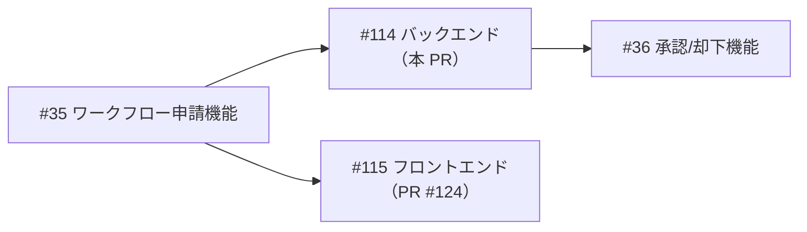
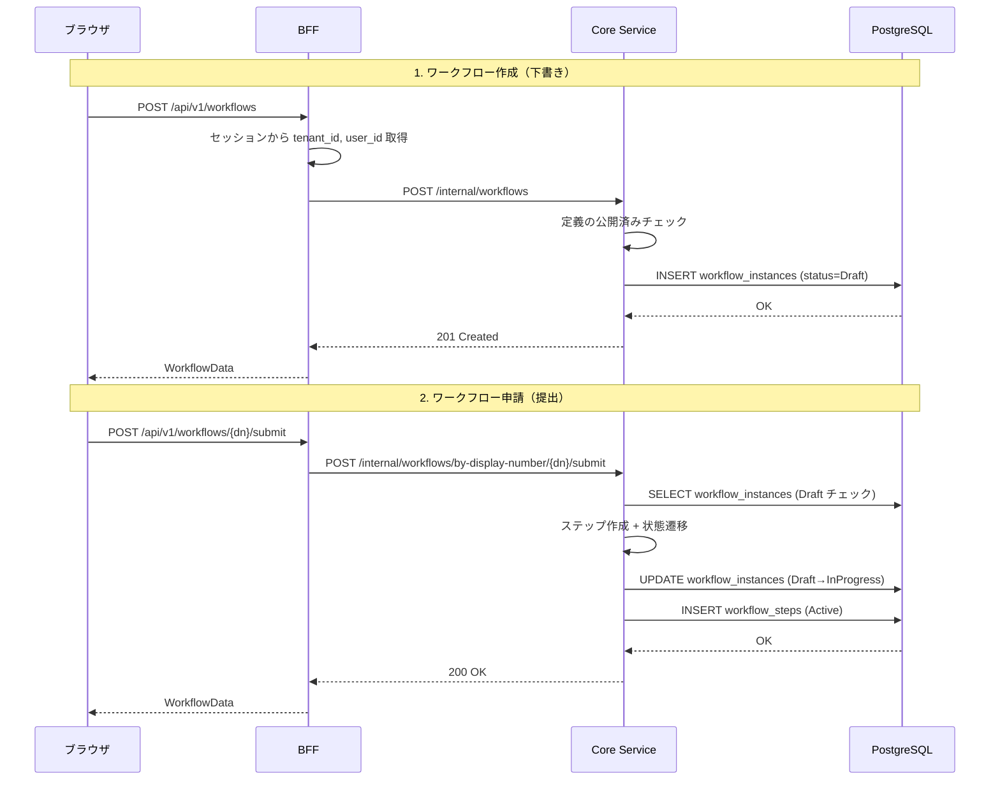
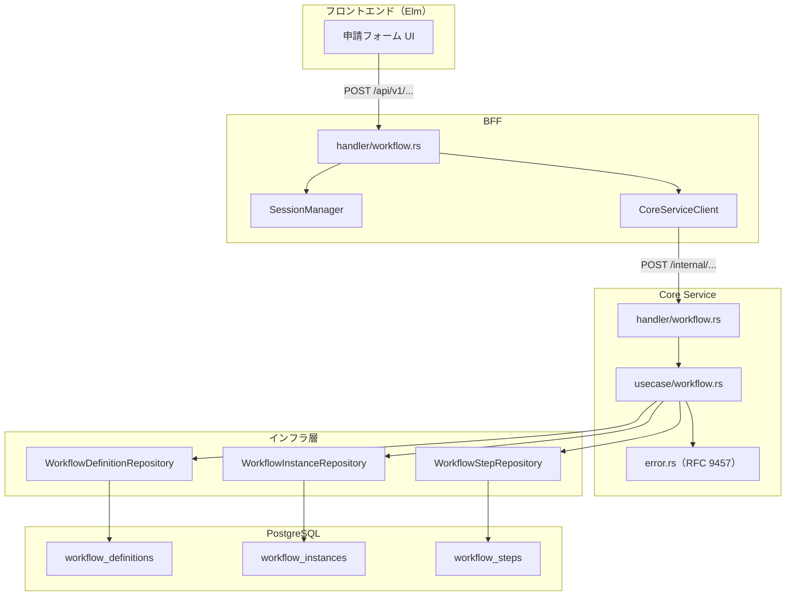
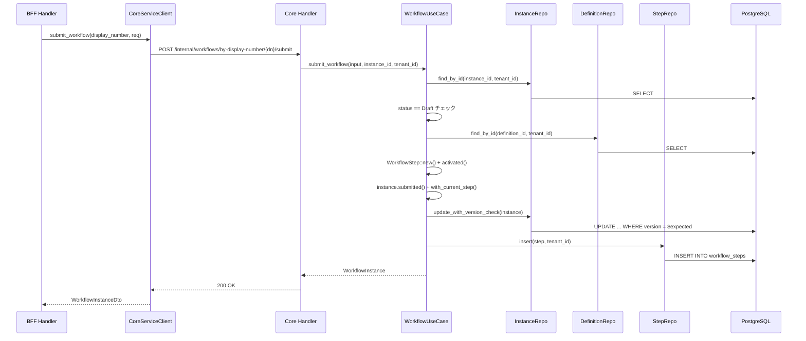
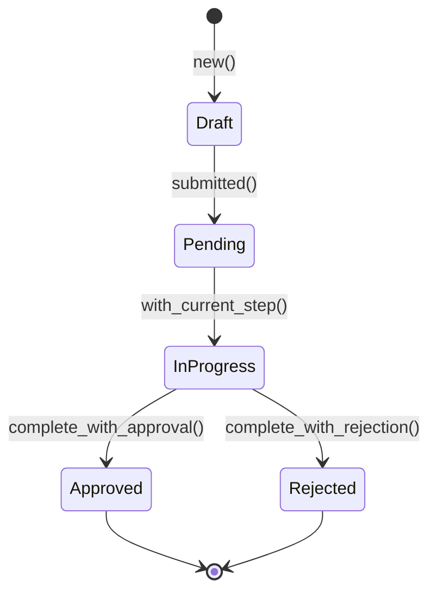
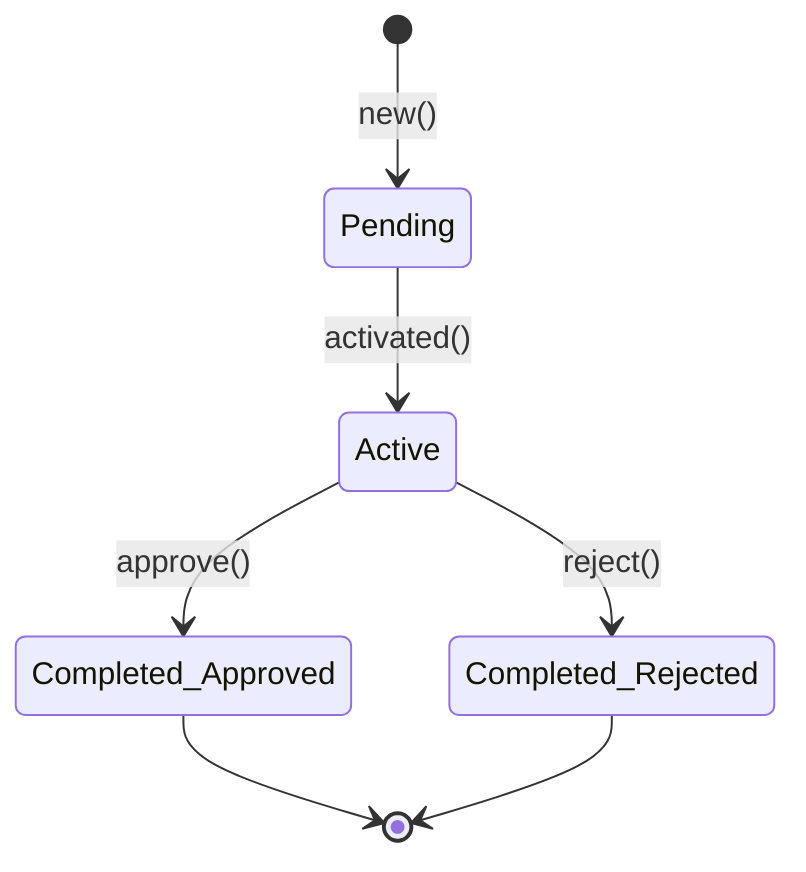
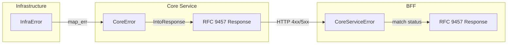

# ワークフロー申請機能（バックエンド） - 機能解説

対応 PR: [#114](https://github.com/ka2kama/ringiflow/pull/114)
対応 Issue: [#35](https://github.com/ka2kama/ringiflow/issues/35)

## 概要

ワークフロー定義から申請案件を作成し、承認フローを実行する機能のバックエンド実装。BFF（公開 API）→ Core Service（内部 API・ビジネスロジック）→ リポジトリ（データアクセス）の全レイヤーを段階的に実装した。

この PR はバックエンドのみをカバーする。フロントエンド（Elm）は [#115](https://github.com/ka2kama/ringiflow/issues/115)（PR [#124](https://github.com/ka2kama/ringiflow/pull/124)）に分離されている。

## 背景

### ワークフロー管理システムの中核機能

RingiFlow は承認フロー・タスク管理・ドキュメント管理を一元化するエンタープライズ向けワークフロー管理システムである。「申請」はその最も基本的な操作であり、ユーザーがワークフロー定義を選び、フォームに記入して承認者に提出する一連の流れを指す。

### 実装前の状態

この PR の時点では、認証機能（[#34](https://github.com/ka2kama/ringiflow/issues/34)）と Auth Service 分離（[#80](https://github.com/ka2kama/ringiflow/issues/80)）が完了しており、3サービス構成（BFF / Core Service / Auth Service）のアーキテクチャが確立されていた。ビジネスドメインの実装はこの PR が最初のものとなる。

### アーキテクチャ方針

[基本設計書](../../30_基本設計書/01_アーキテクチャ設計.md)で定められた方針に従い、以下の構造で実装した。

| レイヤー | 責務 | 認証情報の扱い |
|---------|------|-------------|
| BFF | セッション管理、公開 API、Core Service へのプロキシ | セッションから tenant_id / user_id を取得 |
| Core Service | ビジネスロジック、内部 API | リクエストボディで受け取る（ステートレス） |
| インフラ | データアクセス、楽観的ロック | tenant_id による全クエリのフィルタ |

### Issue 構成

ワークフロー申請機能は Issue [#35](https://github.com/ka2kama/ringiflow/issues/35) として管理され、バックエンド（本 PR）とフロントエンド（[#115](https://github.com/ka2kama/ringiflow/issues/115)）に分離されている。



## 用語・概念

| 用語 | 説明 | 関連コード |
|------|------|-----------|
| ワークフロー定義（WorkflowDefinition） | 申請フォームの構造と承認フローを定義するテンプレート。公開済み（Published）の定義のみ申請に使用可能 | `WorkflowDefinition` |
| ワークフローインスタンス（WorkflowInstance） | 定義に基づいて作成された個別の申請案件。状態遷移（Draft → InProgress → Approved/Rejected）を持つ | `WorkflowInstance` |
| ワークフローステップ（WorkflowStep） | インスタンスに紐づく承認タスク。MVP では1段階承認（1ステップ）のみ | `WorkflowStep` |
| 楽観的ロック | version カラムで同時更新を検知する仕組み。`WHERE version = $expected` で更新し、影響行数0なら競合 | `update_with_version_check` |
| display_number | ユーザー向けの連番 ID（`WF-42` 形式）。内部では UUID を使用し、公開 API では display_number でアクセスする | `DisplayNumber`, `DisplayId` |
| CQRS | Command（状態変更）と Query（読み取り）をモジュール分割するパターン | `command.rs`, `query.rs` |

## フロー

### ワークフロー作成・申請フロー

新規機能のため Before はない。以下が実装されたフロー。



## アーキテクチャ



## データフロー

### フロー 1: ワークフロー作成

```mermaid
sequenceDiagram
    participant Browser as ブラウザ
    participant BFF as BFF Handler
    participant Session as SessionManager
    participant Client as CoreServiceClient
    participant Core as Core Handler
    participant UC as WorkflowUseCase
    participant DefRepo as DefinitionRepo
    participant InstRepo as InstanceRepo
    participant DB as PostgreSQL

    Browser->>BFF: POST /api/v1/workflows
    Note over Browser,BFF: Cookie: session_id<br/>Header: X-Tenant-ID

    BFF->>Session: get(tenant_id, session_id)
    Session-->>BFF: SessionData { tenant_id, user_id }

    BFF->>Client: create_workflow(req + tenant_id + user_id)
    Client->>Core: POST /internal/workflows

    Core->>UC: create_workflow(input, tenant_id, user_id)
    UC->>DefRepo: find_by_id(definition_id, tenant_id)
    DefRepo->>DB: SELECT ... WHERE id = $1 AND tenant_id = $2
    DB-->>DefRepo: WorkflowDefinition
    UC->>UC: 公開済みチェック
    UC->>InstRepo: insert(instance)
    InstRepo->>DB: INSERT INTO workflow_instances
    UC-->>Core: WorkflowInstance

    Core->>Core: DTO 変換 + ユーザー名解決
    Core-->>Client: 201 Created + JSON
    Client-->>BFF: WorkflowInstanceDto
    BFF-->>Browser: ApiResponse&lt;WorkflowData&gt;
```

#### 処理ステップ

| # | レイヤー | ファイル:関数 | 処理内容 |
|---|---------|-------------|---------|
| 1 | BFF | `handler/workflow/command.rs:create_workflow` | X-Tenant-ID 抽出、セッション取得 |
| 2 | BFF | `client/core_service/workflow_client.rs` | Core Service へ HTTP POST（tenant_id, user_id を付加） |
| 3 | Core | `handler/workflow/command.rs:create_workflow` | Uuid → ドメイン型変換 |
| 4 | UseCase | `usecase/workflow/command.rs:create_workflow` | 定義取得、公開済みチェック、インスタンス作成 |
| 5 | Infra | `repository/workflow_instance_repository.rs:insert` | DB に INSERT |
| 6 | Core | `handler/workflow/command.rs` | WorkflowInstance → DTO 変換、ユーザー名解決 |

### フロー 2: ワークフロー申請（提出）



#### 処理ステップ

| # | レイヤー | ファイル:関数 | 処理内容 |
|---|---------|-------------|---------|
| 1 | UseCase | `usecase/workflow/command.rs:submit_workflow` | インスタンス取得、Draft チェック |
| 2 | UseCase | 同上 | 定義取得（将来のステップ定義解析に備える） |
| 3 | Domain | `WorkflowStep::new()` + `activated()` | 承認ステップ作成（Active 状態） |
| 4 | Domain | `instance.submitted()` + `with_current_step()` | Draft → Pending → InProgress |
| 5 | Infra | `workflow_instance_repository.rs:update_with_version_check` | 楽観的ロック付き更新 |
| 6 | Infra | `workflow_step_repository.rs:insert` | ステップを DB に保存 |

## 状態遷移

### WorkflowInstance



### WorkflowStep



## データ変換

### リクエストの変換

```
[フロントエンド]
    CreateWorkflowRequest { definition_id, title, form_data }

    ↓ BFF: セッションから tenant_id, user_id を追加

[BFF → Core Service]
    CreateWorkflowRequest { definition_id, title, form_data, tenant_id, user_id }

    ↓ Core Handler: Uuid → ドメイン型

[UseCase]
    CreateWorkflowInput { definition_id: WorkflowDefinitionId, title, form_data }
    + tenant_id: TenantId, user_id: UserId
```

### レスポンスの変換

```
[UseCase]
    WorkflowInstance（ドメインモデル）

    ↓ Core Handler: DTO 変換 + ユーザー名解決

[Core Service → BFF]
    WorkflowInstanceDto { id: String, display_id: "WF-42", status: String, ... }

    ↓ BFF: From impl

[BFF → フロントエンド]
    ApiResponse<WorkflowData>
```

## エラーハンドリング



| エラー | 発生箇所 | HTTP Status | ユーザーへの表示 |
|-------|---------|-------------|---------------|
| 定義が見つからない | UseCase | 404 | ワークフロー定義が存在しません |
| 未公開定義での作成 | UseCase | 400 | バリデーションエラー |
| Draft 以外の申請 | UseCase | 400 | バリデーションエラー |
| 楽観的ロック競合 | Repository | 409 | 競合が発生しました |
| DB エラー | Repository | 500 | 内部エラー（詳細は隠蔽） |

## 設計判断

機能・仕組みレベルの判断を記載する。コード実装レベルの判断は[コード解説](./02_ワークフロー申請_コード解説.md#設計解説)を参照。

### 1. BFF と Core Service の責務をどう分けるか

認証情報（tenant_id, user_id）の管理場所と、公開 API と内部 API の境界が問題になる。

| 案 | セキュリティ | Core Service の独立性 | 複雑さ |
|----|-----------|---------------------|-------|
| **BFF でセッション管理、Core はステートレス（採用）** | セッション情報は BFF に閉じる。クライアントが tenant_id を偽装できない | Core はリクエストボディの情報だけで完結 | BFF → Core 間のリクエスト構築が必要 |
| JWT ヘッダー方式 | トークン検証が必要 | 自律的に認証可能 | トークン管理の複雑化 |
| 共有セッション | 両方でセッションにアクセス | 結合度が高い | セッションストアへの依存が増える |

**採用理由**: BFF パターンの本質はフロントエンドとバックエンドの関心の分離。セッション管理を BFF に閉じることで、Core Service はビジネスロジックに専念でき、将来の内部サービス追加時もセッション管理の変更が不要。

### 2. テナント分離をどのレイヤーで担保するか

マルチテナント SaaS では全データアクセスでテナント分離が必要。

| 案 | 安全性 | 運用負荷 | この時点での実現可能性 |
|----|-------|---------|-------------------|
| **アプリケーション層で WHERE 句（採用）** | 単一防御だが全クエリに適用 | 開発者が全クエリで意識 | すぐ実装可能 |
| RLS（DB 層） | 二重防御 | DB 設定が必要 | 後続 Issue で対応予定 |
| テナント別 DB | 完全分離 | DB 管理コスト大 | SaaS では非現実的 |

**採用理由**: この時点ではアプリケーション層のみで実装し、後続の [#402](https://github.com/ka2kama/ringiflow/issues/402)（マルチテナント RLS）で DB 層の二重防御を追加する計画。全リポジトリクエリに `WHERE tenant_id = $N` を含め、`workflow_steps` は親テーブルとの JOIN でテナントを検証する。

### 3. 楽観的ロックをどこで実装するか

ワークフローの承認/却下では複数ユーザーが同時にアクションする可能性がある。

| 案 | 検知精度 | パフォーマンス | 実装複雑度 |
|----|---------|-------------|----------|
| **リポジトリ層の version チェック（採用）** | DB レベルで確実 | 追加コストなし（WHERE 句） | 低い |
| ユースケース層のみでチェック | レース条件あり | — | 低い |
| 悲観的ロック（SELECT FOR UPDATE） | 確実 | ロック待ちが発生 | 中程度 |

**採用理由**: `update_with_version_check` で `WHERE id = $1 AND version = $2` を使い、影響行数0なら `InfraError::Conflict` を返す。ユースケース層でも早期にバージョンチェックし、二重のチェック体制を取る。

### 4. エラー形式をどう統一するか

3サービス間で一貫したエラーレスポンスが必要。

| 案 | 標準準拠 | クライアントの扱いやすさ | 拡張性 |
|----|---------|---------------------|-------|
| **RFC 9457 Problem Details（採用）** | 業界標準 | type, title, detail, status で構造化 | 拡張フィールド可 |
| 独自形式 | なし | 学習コスト | 自由に設計可能 |
| HTTP ステータスのみ | — | 詳細情報なし | 制限的 |

**採用理由**: RFC 9457（旧 RFC 7807 の後継）は HTTP API のエラー形式として広く採用されている標準。BFF、Core Service、Auth Service の全サービスで統一し、エラー伝播時の変換コストを最小化する。

### 5. MVP でのワークフロー構造をどこまで実装するか

ワークフローエンジンとしては多段階承認・並列承認・条件分岐が将来必要だが、MVP のスコープを決める必要がある。

| 案 | スコープ | 拡張コスト | 学習効果 |
|----|---------|----------|---------|
| **固定1段階承認（採用）** | 1ステップのみ | ステップ定義解析の追加で拡張可能 | 全レイヤーの実装パターンを学べる |
| 多段階承認 | 複数ステップ | — | 実装量が大きい |
| 承認なし（申請のみ） | 最小限 | 承認の追加で大幅改修 | 学習効果が限定的 |

**採用理由**: 定義取得のコードを残しつつ、ステップ生成はハードコード（`step_id="approval"`, `step_name="承認"`）とする。全レイヤー（BFF → Core → UseCase → Repository → DB）の実装パターンを一通り確立でき、後続の [#36](https://github.com/ka2kama/ringiflow/issues/36)（承認/却下機能）で自然に拡張できる。

## 関連ドキュメント

- [コード解説](./02_ワークフロー申請_コード解説.md)
- [API 設計書](../../40_詳細設計書/03_API設計.md)
- [データベース設計書](../../40_詳細設計書/02_データベース設計.md)
- [実装ロードマップ](../../40_詳細設計書/00_実装ロードマップ.md)
- 関連 Issue: [#115 フロントエンド](https://github.com/ka2kama/ringiflow/issues/115)、[#36 承認/却下機能](https://github.com/ka2kama/ringiflow/issues/36)
