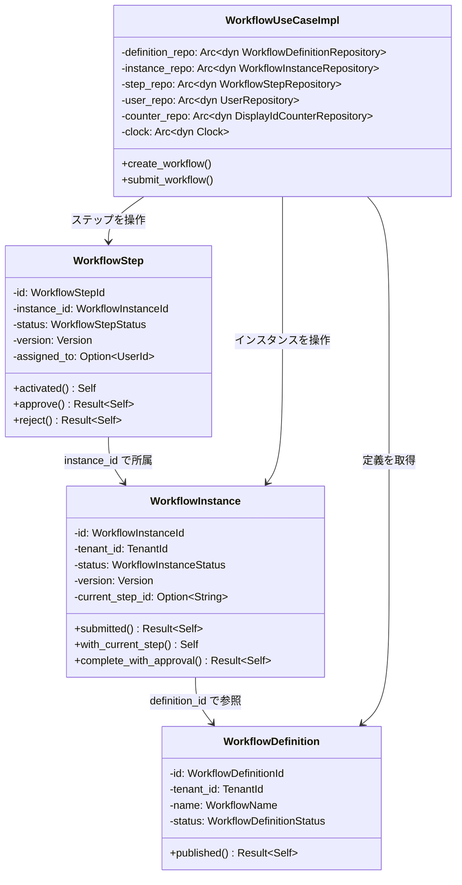
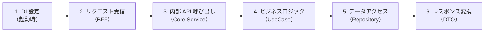
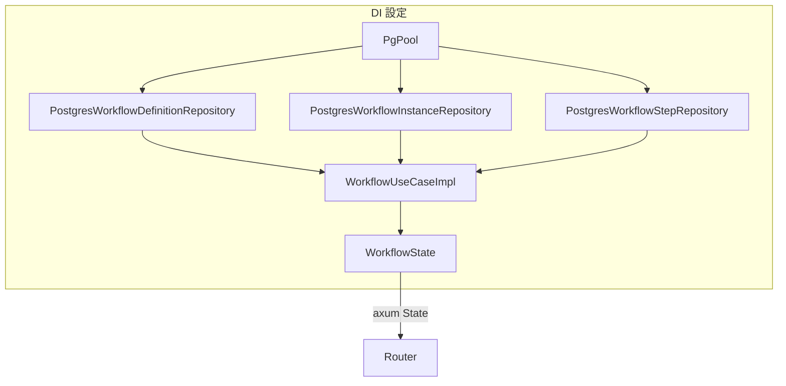
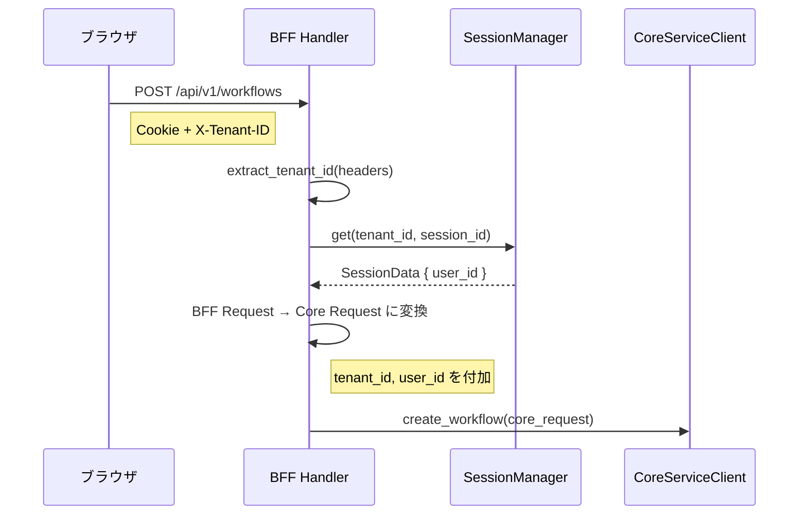
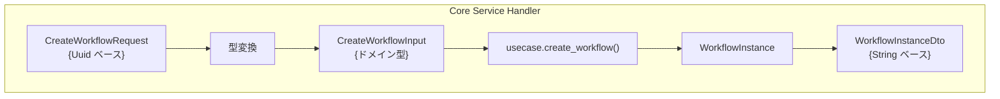
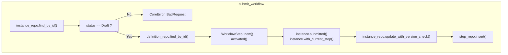
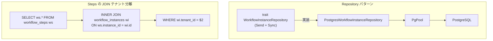
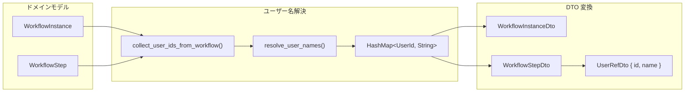
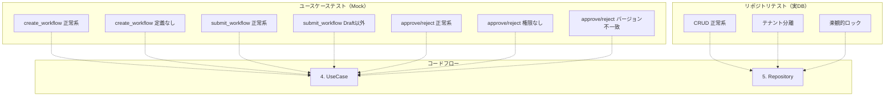

# ワークフロー申請機能（バックエンド） - コード解説

対応 PR: [#114](https://github.com/ka2kama/ringiflow/pull/114)
対応 Issue: [#35](https://github.com/ka2kama/ringiflow/issues/35)

## 主要な型・関数

| 型/関数 | ファイル | 責務 |
|--------|---------|------|
| `WorkflowDefinition` | [`domain/workflow/definition.rs`](../../../backend/crates/domain/src/workflow/definition.rs) | ワークフロー定義エンティティ |
| `WorkflowInstance` | [`domain/workflow/instance.rs:97`](../../../backend/crates/domain/src/workflow/instance.rs) | 申請案件エンティティ（状態遷移を持つ） |
| `WorkflowStep` | [`domain/workflow/step.rs:112`](../../../backend/crates/domain/src/workflow/step.rs) | 承認ステップエンティティ |
| `WorkflowUseCaseImpl` | [`usecase/workflow.rs:83`](../../../backend/apps/core-service/src/usecase/workflow.rs) | ビジネスロジック（Command + Query） |
| `create_workflow` | [`usecase/workflow/command.rs:43`](../../../backend/apps/core-service/src/usecase/workflow/command.rs) | ワークフロー作成（下書き） |
| `submit_workflow` | [`usecase/workflow/command.rs:113`](../../../backend/apps/core-service/src/usecase/workflow/command.rs) | ワークフロー申請（提出） |
| `CoreError` | [`error.rs:15`](../../../backend/apps/core-service/src/error.rs) | Core Service のエラー型 |
| `WorkflowState` | [`handler/workflow.rs:272`](../../../backend/apps/core-service/src/handler/workflow.rs) | ハンドラの axum State |

### 型の関係

3つのドメインエンティティとリポジトリ、ユースケースの関係を示す。



## コードフロー

コードをライフサイクル順に追う。各ステップの構造を図で示した後、対応するコードを解説する。



### 1. DI 設定（アプリケーション起動時）

Core Service の `main.rs` でリポジトリとユースケースを組み立て、axum の State として注入する。



```rust
// backend/apps/core-service/src/main.rs（概要）
let definition_repo = Arc::new(PostgresWorkflowDefinitionRepository::new(pool.clone()));
let instance_repo = Arc::new(PostgresWorkflowInstanceRepository::new(pool.clone()));
let step_repo = Arc::new(PostgresWorkflowStepRepository::new(pool.clone()));

let workflow_usecase = WorkflowUseCaseImpl::new(
    definition_repo,
    instance_repo,
    step_repo,
    user_repo,
    counter_repo,
    clock,
);

let workflow_state = WorkflowState { usecase: workflow_usecase };
```

注目ポイント:

- リポジトリはトレイトオブジェクト（`Arc<dyn XxxRepository>`）で注入。テスト時に Mock に差し替え可能
- `PgPool` は `Clone` が低コスト（内部 `Arc`）なので各リポジトリに clone して渡す

### 2. リクエスト受信（BFF ハンドラ）

BFF はセッションから認証情報を取得し、Core Service の内部 API に転送する。



```rust
// backend/apps/bff/src/handler/workflow/command.rs（概要）
pub async fn create_workflow(
    State(state): State<WorkflowState>,
    headers: HeaderMap,
    jar: CookieJar,
    Json(req): Json<CreateWorkflowRequest>,     // ① tenant_id/user_id なし
) -> impl IntoResponse {
    let tenant_id = extract_tenant_id(&headers)?;            // ② ヘッダーから取得
    let session = get_session(&state, &jar, &tenant_id)?;    // ③ セッション取得
    let user_id = session.user_id;                           // ④ セッションから user_id

    let core_req = client::CreateWorkflowRequest {
        definition_id: req.definition_id,
        title: req.title,
        form_data: req.form_data,
        tenant_id,                                           // ⑤ 付加
        user_id,                                             // ⑥ 付加
    };

    let response = state.core_service_client
        .create_workflow(core_req).await?;
    // ...
}
```

注目ポイント:

- ①② BFF 公開 API のリクエストには tenant_id/user_id が含まれない。クライアントが偽装できない設計
- ③④ セッションから取得した値を Core Service リクエストに付加する

### 3. 内部 API 呼び出し（Core Service ハンドラ）

Core Service ハンドラは Uuid をドメイン型に変換し、ユースケースに委譲する。



```rust
// backend/apps/core-service/src/handler/workflow/command.rs（概要）
pub async fn create_workflow(
    State(state): State<WorkflowState>,
    Json(req): Json<CreateWorkflowRequest>,
) -> Result<Response, CoreError> {
    let tenant_id = TenantId::from_uuid(req.tenant_id);     // ① Uuid → Newtype
    let user_id = UserId::from_uuid(req.user_id);
    let input = CreateWorkflowInput {
        definition_id: WorkflowDefinitionId::from_uuid(req.definition_id),
        title: req.title,
        form_data: req.form_data,
    };

    let instance = state.usecase
        .create_workflow(input, tenant_id, user_id).await?;  // ② ユースケース呼び出し

    // DTO 変換 + ユーザー名解決
    let user_ids = vec![*instance.initiated_by()];
    let user_names = state.usecase
        .resolve_user_names(&user_ids).await?;               // ③ ユーザー名一括解決
    let dto = WorkflowInstanceDto::from_instance(&instance, &user_names);
    // ...
}
```

注目ポイント:

- ① `Uuid` をドメイン型（`TenantId`, `UserId`, `WorkflowDefinitionId`）に変換。型システムで異なる ID の混同を防ぐ
- ③ ユーザー名解決は DTO 変換時に一括で行う。N+1 クエリを避けるため `HashMap<UserId, String>` で保持

### 4. ビジネスロジック（UseCase）

`submit_workflow` を例に、ドメインモデルの状態遷移とリポジトリ操作の流れを追う。



```rust
// backend/apps/core-service/src/usecase/workflow/command.rs:113
pub async fn submit_workflow(
    &self, input: SubmitWorkflowInput,
    instance_id: WorkflowInstanceId, tenant_id: TenantId,
) -> Result<WorkflowInstance, CoreError> {
    let instance = self.instance_repo                            // ① インスタンス取得
        .find_by_id(&instance_id, &tenant_id).await?
        .ok_or_else(|| CoreError::NotFound(...))?;

    if instance.status() != &WorkflowInstanceStatus::Draft {     // ② Draft チェック
        return Err(CoreError::BadRequest(...));
    }

    let _definition = self.definition_repo                       // ③ 将来の拡張に備える
        .find_by_id(instance.definition_id(), &tenant_id).await?
        .ok_or_else(|| CoreError::NotFound(...))?;

    let now = self.clock.now();
    let display_number = self.counter_repo                       // ④ 連番取得
        .next_display_number(...).await?;

    let step = WorkflowStep::new(NewWorkflowStep {               // ⑤ ステップ作成
        // MVP: 固定の1段階承認
        step_id: "approval".to_string(),
        step_name: "承認".to_string(),
        assigned_to: Some(input.assigned_to),
        // ...
    });
    let step = step.activated(now);                              // ⑥ Pending → Active

    let instance = instance.submitted(now)?;                     // ⑦ Draft → Pending
    let instance = instance.with_current_step("approval", now);  // ⑧ Pending → InProgress

    self.instance_repo                                           // ⑨ 楽観的ロック付き保存
        .update_with_version_check(&instance, ...).await
        .map_err(|e| match e { ... })?;

    self.step_repo.insert(&step, &tenant_id).await?;             // ⑩ ステップ保存

    Ok(instance)
}
```

注目ポイント:

- ③ `_definition` は現時点で使用していないが、将来の多段階承認（ステップ定義の解析）に備えて取得している
- ⑤⑥ MVP ではステップ定義をハードコード。`step_id="approval"` は定義内のステップ識別子
- ⑦⑧ 状態遷移は不変エンティティ方式。各メソッドが `self` を消費して新しい値を返す
- ⑨ `InfraError::Conflict` を `CoreError::Conflict` にマッピングするエラー変換

### 5. データアクセス（Repository）

リポジトリ層の楽観的ロック実装と、`workflow_steps` の JOIN によるテナント分離を追う。



```rust
// backend/crates/infra/src/repository/workflow_instance_repository.rs（楽観的ロック）
pub async fn update_with_version_check(
    &self, instance: &WorkflowInstance, expected_version: Version,
) -> Result<(), InfraError> {
    let result = sqlx::query(
        "UPDATE workflow_instances
         SET status = $1, ..., version = $8, updated_at = $9
         WHERE id = $10 AND version = $11"                     // ① version チェック
    )
    .bind(...)
    .bind(instance.version().as_i32())                         // ② 新しい version
    .bind(instance.id().as_uuid())
    .bind(expected_version.as_i32())                           // ③ 期待する version
    .execute(&self.pool).await?;

    if result.rows_affected() == 0 {                           // ④ 影響行数0 = 競合
        return Err(InfraError::Conflict {
            entity: "WorkflowInstance".to_string(),
            id: instance.id().to_string(),
        });
    }
    Ok(())
}
```

```rust
// backend/crates/infra/src/repository/workflow_step_repository.rs（JOIN テナント分離）
pub async fn find_by_id(
    &self, id: &WorkflowStepId, tenant_id: &TenantId,
) -> Result<Option<WorkflowStep>, InfraError> {
    let row = sqlx::query_as::<_, WorkflowStepRecord>(
        "SELECT ws.id, ws.instance_id, ...
         FROM workflow_steps ws
         INNER JOIN workflow_instances wi ON ws.instance_id = wi.id  -- ⑤ JOIN
         WHERE ws.id = $1 AND wi.tenant_id = $2"                    -- ⑥ テナント分離
    )
    .bind(id.as_uuid())
    .bind(tenant_id.as_uuid())
    .fetch_optional(&self.pool).await?;
    // ...
}
```

注目ポイント:

- ①③ `WHERE version = $expected` で楽観的ロックを実現。DB レベルで原子的に検証・更新
- ④ 影響行数0は「他の処理が先に更新した」ことを意味し、`InfraError::Conflict` を返す
- ⑤⑥ `workflow_steps` テーブルに `tenant_id` カラムがないため、親テーブルとの JOIN でテナント分離を実現。正規化を維持しつつセキュリティを確保する設計

### 6. レスポンス変換（DTO）

ドメインモデルから DTO への変換パターン。ユーザー名解決を含む。



```rust
// backend/apps/core-service/src/handler/workflow.rs（DTO 変換）
impl WorkflowInstanceDto {
    pub fn from_instance(
        instance: &WorkflowInstance,
        user_names: &HashMap<UserId, String>,          // ① 事前解決済みの名前マップ
    ) -> Self {
        let initiated_by_id = instance.initiated_by();
        Self {
            id: instance.id().to_string(),
            display_id: DisplayId::new(                // ② 表示用 ID 生成
                display_prefix::WORKFLOW_INSTANCE,
                instance.display_number(),
            ).to_string(),
            initiated_by: UserRefDto {
                id: initiated_by_id.to_string(),
                name: user_names.get(initiated_by_id)  // ③ 名前解決
                    .cloned()
                    .unwrap_or_else(|| "(不明なユーザー)".to_string()),
            },
            // ...
        }
    }
}
```

注目ポイント:

- ① ユーザー名は事前に `resolve_user_names` で一括取得し、`HashMap` で渡す。N+1 クエリ回避
- ② `DisplayId::new("WF", display_number)` で `WF-42` 形式の人間可読 ID を生成
- ③ ユーザーが見つからない場合のフォールバック。DB から削除されたユーザーへの耐性

## テスト

各テストがライフサイクルのどのステップを検証しているかを示す。



### ユースケーステスト（Mock リポジトリ）

| テスト | 検証対象 | 検証内容 |
|-------|---------|---------|
| `test_create_workflow_正常系` | UseCase | 公開済み定義からインスタンスを作成 |
| `test_create_workflow_定義が見つからない` | UseCase | 存在しない定義 ID → NotFound |
| `test_submit_workflow_正常系` | UseCase | Draft → InProgress、ステップ作成 |
| `test_submit_workflow_draft以外は400` | UseCase | InProgress インスタンス → BadRequest |
| `test_approve_step_正常系` | UseCase | ステップ承認 + インスタンス完了 |
| `test_approve_step_未割り当てユーザーは403` | UseCase | 別ユーザー → Forbidden |
| `test_approve_step_active以外は400` | UseCase | Pending ステップ → BadRequest |
| `test_approve_step_バージョン不一致で409` | UseCase | バージョン不一致 → Conflict |
| `test_reject_step_正常系` | UseCase | ステップ却下 + インスタンス完了 |
| `test_reject_step_未割り当てユーザーは403` | UseCase | 別ユーザー → Forbidden |
| `test_reject_step_active以外は400` | UseCase | Pending ステップ → BadRequest |
| `test_reject_step_バージョン不一致で409` | UseCase | バージョン不一致 → Conflict |

### リポジトリテスト（実 DB）

| テスト | 検証対象 | 検証内容 |
|-------|---------|---------|
| `test_find_published_by_tenant` | DefinitionRepo | 公開済み定義のテナント別取得 |
| `test_別テナントの定義は取得できない` | DefinitionRepo | テナント分離 |
| `test_save_で新規インスタンスを作成できる` | InstanceRepo | INSERT |
| `test_find_by_id` | InstanceRepo | ID 検索 |
| `test_find_by_tenant_別テナント` | InstanceRepo | テナント分離 |
| `test_find_by_initiated_by` | InstanceRepo | 申請者検索 |
| `test_update_with_version_check_一致` | InstanceRepo | 楽観的ロック成功 |
| `test_update_with_version_check_不一致` | InstanceRepo | 楽観的ロック競合 → Conflict |
| `test_save_で新規ステップを作成できる` | StepRepo | INSERT |
| `test_find_by_instance_別テナント` | StepRepo | JOIN テナント分離 |
| `test_find_by_assigned_to` | StepRepo | 担当者検索 |
| `test_ステップを完了できる` | StepRepo | activated → completed のライフサイクル |

### テスト基盤

```rust
// ユースケーステスト: Mock リポジトリ
struct MockWorkflowDefinitionRepository {
    definitions: Arc<Mutex<Vec<WorkflowDefinition>>>,
}

// リポジトリテスト: sqlx::test + マイグレーション
#[sqlx::test(migrations = "../../migrations")]
async fn test_xxx(pool: PgPool) {
    let sut = PostgresWorkflowInstanceRepository::new(pool);
    // ...
}
```

- ユースケーステスト: `Arc<Mutex<Vec<T>>>` による Mock リポジトリで DB 不要。各テストで独立したインスタンスを作成
- リポジトリテスト: `#[sqlx::test]` でテストごとに独立した DB を自動作成。マイグレーションを自動適用

### 実行方法

```bash
# ユースケーステスト（DB 不要）
cd backend && cargo test -p ringiflow-core-service workflow

# リポジトリテスト（DB 必要）
just dev-deps
just test-rust-integration
```

## 設計解説

コード実装レベルの判断を記載する。機能・仕組みレベルの判断は[機能解説](./01_ワークフロー申請_機能解説.md#設計判断)を参照。

### 1. 不変エンティティによる状態遷移

場所: `backend/crates/domain/src/workflow/instance.rs`

```rust
// self を消費して新しい値を返す
pub fn submitted(self, now: DateTime<Utc>) -> Result<Self, DomainError> {
    if self.status != WorkflowInstanceStatus::Draft {
        return Err(DomainError::InvalidStateTransition { ... });
    }
    Ok(Self {
        status: WorkflowInstanceStatus::Pending,
        submitted_at: Some(now),
        updated_at: now,
        ..self   // 他のフィールドは引き継ぐ
    })
}
```

なぜこの実装か: `self` を消費（ムーブ）することで、遷移前のインスタンスを誤って使い続けることをコンパイラが防ぐ。Rust の所有権システムと相性が良い。

代替案:

| 案 | メリット | デメリット | 判断 |
|----|---------|-----------|------|
| self を消費（ムーブ） | 遷移前の値を使えない。コンパイル時保証 | `clone()` が必要な場面がある | 採用 |
| `&mut self` で変更 | clone 不要 | 遷移前の状態が暗黙に失われる | 見送り |
| Builder パターン | 柔軟 | 過剰な抽象化 | 見送り |

### 2. CQRS のモジュール分割

場所: `backend/apps/core-service/src/usecase/workflow/command.rs`, `query.rs`

ユースケース層とハンドラ層の両方で `command.rs`（状態変更）と `query.rs`（読み取り）にモジュール分割している。

```
usecase/workflow/
├── mod.rs      # WorkflowUseCaseImpl の定義
├── command.rs  # create, submit, approve, reject
└── query.rs    # list, get
```

なぜこの実装か: CQRS パターンに従い、読み取りと書き込みの関心を分離する。各モジュールの責務が明確になり、ファイルサイズも適切に保たれる。

代替案:

| 案 | メリット | デメリット | 判断 |
|----|---------|-----------|------|
| command/query 分割 | 責務が明確、ファイルサイズ適切 | モジュール数が増える | 採用 |
| 単一ファイル | シンプル | ファイルが肥大化する | 見送り |
| trait 分割（CommandUseCase/QueryUseCase） | 型レベルで分離 | 過剰な抽象化 | 見送り |

### 3. Record 構造体による DB 行のマッピング

場所: `backend/crates/infra/src/repository/workflow_instance_repository.rs`

```rust
// DB 行を表す中間構造体
#[derive(sqlx::FromRow)]
struct WorkflowInstanceRecord {
    id: Uuid,
    tenant_id: Uuid,
    status: String,
    version: i32,          // DB は INTEGER
    // ...
}

// Record → ドメインモデル変換
let instance = WorkflowInstance::from_db(WorkflowInstanceDbRecord {
    id: WorkflowInstanceId::from_uuid(record.id),
    tenant_id: TenantId::from_uuid(record.tenant_id),
    status: record.status.parse()?,    // String → enum
    version: Version::new(record.version as u32),  // i32 → u32
    // ...
});
```

なぜこの実装か: `sqlx::FromRow` は基本型（Uuid, String, i32 等）にマッピングするため、ドメイン型（Newtype）への変換には中間層が必要。Record 構造体でクエリ結果を受け取り、`from_db` でドメインモデルに変換する二段階方式。

代替案:

| 案 | メリット | デメリット | 判断 |
|----|---------|-----------|------|
| Record 構造体 + from_db | 型変換が明示的、エラーハンドリング可能 | ボイラープレート | 採用 |
| sqlx の Type derive | 直接マッピング | Newtype すべてに対応が必要 | 見送り |
| 手動カラム取得 | 柔軟 | コンパイル時チェックなし | 見送り |

### 4. テストにおける `#[sqlx::test]` と migrations パス指定

場所: `backend/crates/infra/tests/`

```rust
#[sqlx::test(migrations = "../../migrations")]
async fn test_xxx(pool: PgPool) {
    // ...
}
```

なぜこの実装か: Cargo workspace 構成では `sqlx::test` のデフォルトのマイグレーションパス（`./migrations`）がクレートルートからの相対パスとなり、ワークスペースルートの `migrations/` を見つけられない。相対パス `../../migrations` で明示的に指定する必要がある。

Phase 1 で発見されたこのパターンは、以降の全リポジトリテストで再利用された。

## 関連ドキュメント

- [機能解説](./01_ワークフロー申請_機能解説.md)
- [API 設計書](../../40_詳細設計書/03_API設計.md)
- [データベース設計書](../../40_詳細設計書/02_データベース設計.md)
- [DDD エンティティパターン](../../80_ナレッジベース/architecture/DDD_エンティティパターン.md)
