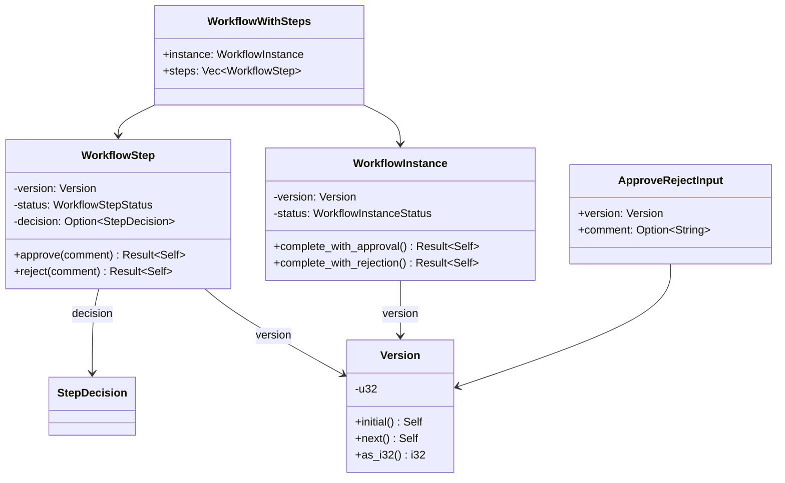
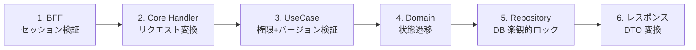
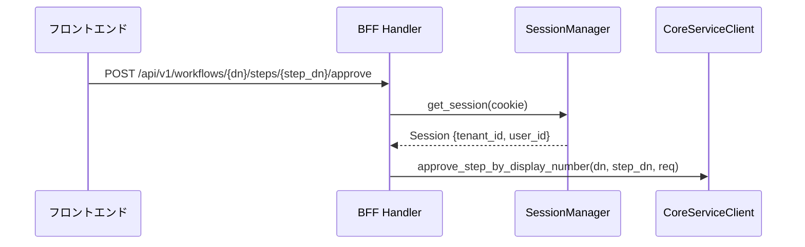
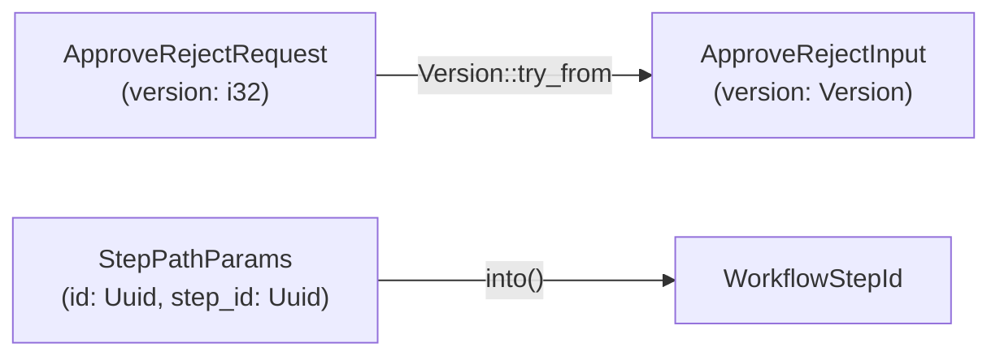
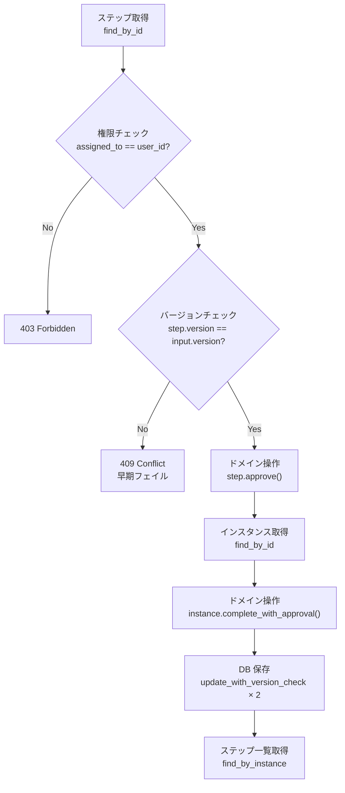
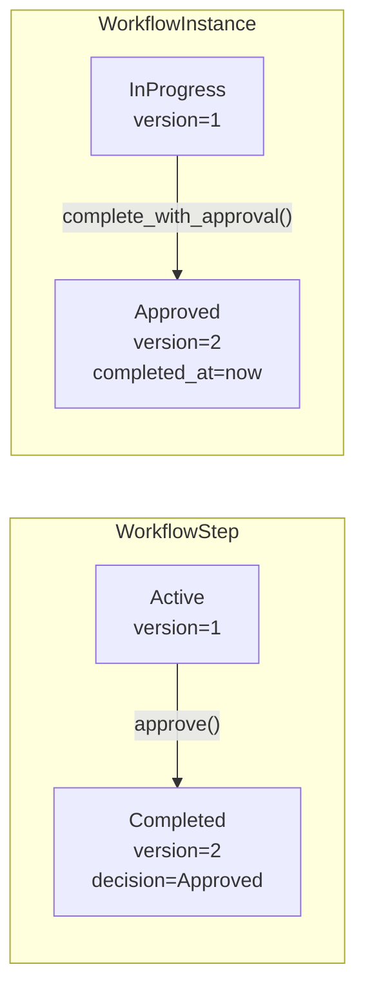
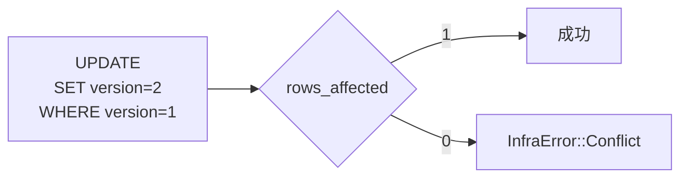
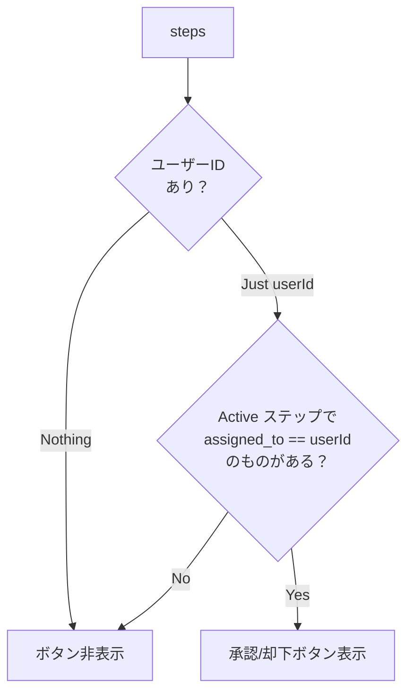
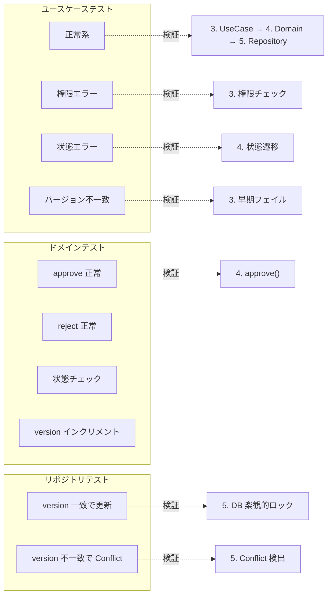

# ワークフロー承認却下機能 - コード解説

対応 PR: #141
対応 Issue: #36

## 主要な型・関数

| 型/関数 | ファイル | 責務 |
|--------|---------|------|
| `Version` | [`domain/src/value_objects.rs:53`](../../../backend/crates/domain/src/value_objects.rs) | 楽観的ロック用バージョン番号（u32 ラッパー、初期値 1） |
| `WorkflowStepStatus` | [`domain/src/workflow/step.rs:50`](../../../backend/crates/domain/src/workflow/step.rs) | ステップの状態 (Pending/Active/Completed/Skipped) |
| `StepDecision` | [`domain/src/workflow/step.rs:82`](../../../backend/crates/domain/src/workflow/step.rs) | ステップの決定結果 (Approved/Rejected/RequestChanges) |
| `WorkflowStep::approve()` | [`domain/src/workflow/step.rs:326`](../../../backend/crates/domain/src/workflow/step.rs) | Active → Completed (Approved)、version インクリメント |
| `WorkflowStep::reject()` | [`domain/src/workflow/step.rs:353`](../../../backend/crates/domain/src/workflow/step.rs) | Active → Completed (Rejected)、version インクリメント |
| `WorkflowInstance::complete_with_approval()` | [`domain/src/workflow/instance.rs:340`](../../../backend/crates/domain/src/workflow/instance.rs) | InProgress → Approved、version インクリメント |
| `WorkflowInstance::complete_with_rejection()` | [`domain/src/workflow/instance.rs:365`](../../../backend/crates/domain/src/workflow/instance.rs) | InProgress → Rejected、version インクリメント |
| `ApproveRejectInput` | [`core-service/src/usecase/workflow.rs:59`](../../../backend/apps/core-service/src/usecase/workflow.rs) | 承認/却下ユースケースの入力 (version + comment) |
| `WorkflowWithSteps` | [`core-service/src/usecase/workflow.rs:34`](../../../backend/apps/core-service/src/usecase/workflow.rs) | ユースケース出力の集約型 (instance + steps) |
| `approve_step()` | [`core-service/src/usecase/workflow/command.rs:214`](../../../backend/apps/core-service/src/usecase/workflow/command.rs) | 承認ビジネスロジック |
| `reject_step()` | [`core-service/src/usecase/workflow/command.rs:311`](../../../backend/apps/core-service/src/usecase/workflow/command.rs) | 却下ビジネスロジック |
| `update_with_version_check()` | [`infra/src/repository/workflow_step_repository.rs:125`](../../../backend/crates/infra/src/repository/workflow_step_repository.rs) | DB レベルの楽観的ロック付き更新 |
| `InfraError::Conflict` | [`infra/src/error.rs:42`](../../../backend/crates/infra/src/error.rs) | 楽観的ロック競合エラー (entity + id) |
| `CoreError::Conflict` | [`core-service/src/error.rs:29`](../../../backend/apps/core-service/src/error.rs) | 競合エラー → 409 Conflict |
| `CoreError::Forbidden` | [`core-service/src/error.rs:25`](../../../backend/apps/core-service/src/error.rs) | 権限不足 → 403 Forbidden |

### 型の関係



## コードフロー

コードをライフサイクル順に追う。各ステップの構造を図で示した後、対応するコードを解説する。



### 1. BFF ハンドラ（リクエスト受信時）

BFF はセッションからテナント/ユーザー情報を取得し、Core Service の内部 API に中継する。



```rust
// backend/apps/bff/src/handler/workflow/command.rs:161-223
pub async fn approve_step(
    State(state): State<WorkflowState<impl CoreServiceClient>>,
    headers: HeaderMap,
    Path(path): Path<StepPathParams>,   // ① display_number ベースのパス
    Json(body): Json<ApproveRejectRequest>,
) -> Result<impl IntoResponse, Response> {
    let session = get_session(&state, &headers).await?;   // ② セッションからユーザー情報取得
    let req = CoreApproveRejectRequest {
        version: body.version,
        comment: body.comment,
        tenant_id: session.tenant_id,   // ③ セッションの tenant_id を付加
        user_id: session.user_id,       // ③ セッションの user_id を付加
    };
    // Core Service の display_number ベースエンドポイントを呼び出し
    let response = state.core_service_client
        .approve_step_by_display_number(path.display_number, path.step_display_number, req)
        .await;
    // ...
}
```

注目ポイント:

- ① BFF の公開 API は `display_number`（表示用連番）をパスパラメータに使う。UUID は内部 API のみ
- ② セッションから `tenant_id` と `user_id` を取得。クライアントが偽装できない設計
- ③ BFF の `ApproveRejectRequest` には tenant_id/user_id がない。Core Service への内部リクエストで付加する

### 2. Core Service ハンドラ（リクエスト変換時）

Core Service ハンドラは HTTP リクエストをドメイン型に変換し、ユースケースに渡す。



```rust
// backend/apps/core-service/src/handler/workflow/command.rs:122-156
pub async fn approve_step(
    State(state): State<WorkflowState>,
    Path(path): Path<StepPathParams>,
    Json(req): Json<ApproveRejectRequest>,
) -> Result<impl IntoResponse, CoreError> {
    let version = Version::try_from(req.version)   // ① i32 → Version（0以下はエラー）
        .map_err(|e| CoreError::BadRequest(e.to_string()))?;
    let input = ApproveRejectInput {
        version,
        comment: req.comment,
    };
    let result = state.usecase
        .approve_step(input, path.step_id.into(), req.tenant_id.into(), req.user_id.into())
        .await?;
    // DTO 変換とレスポンス構築...
}
```

注目ポイント:

- ① `Version::try_from(i32)` でバリデーション。0 以下は `DomainError::Validation` → `CoreError::BadRequest`

### 3. ユースケース（権限・バージョン検証時）

ユースケース層が承認の中核ロジックを担う。7ステップの処理フロー。



```rust
// backend/apps/core-service/src/usecase/workflow/command.rs:214-297
pub async fn approve_step(
    &self,
    input: ApproveRejectInput,
    step_id: WorkflowStepId,
    tenant_id: TenantId,
    user_id: UserId,
) -> Result<WorkflowWithSteps, CoreError> {
    // 1. ステップを取得
    let step = self.step_repo.find_by_id(&step_id, &tenant_id).await
        .map_err(|e| CoreError::Internal(...))?
        .ok_or_else(|| CoreError::NotFound(...))?;

    // 2. 権限チェック                          ← ①
    if step.assigned_to() != Some(&user_id) {
        return Err(CoreError::Forbidden(...));
    }

    // 3. 楽観的ロック（早期フェイル）              ← ②
    if step.version() != input.version {
        return Err(CoreError::Conflict(...));
    }

    // 4. ステップを承認                          ← ③
    let now = self.clock.now();
    let step_expected_version = step.version();
    let approved_step = step.approve(input.comment, now)
        .map_err(|e| CoreError::BadRequest(e.to_string()))?;

    // 5. インスタンスを取得して完了に遷移           ← ④
    let instance = self.instance_repo.find_by_id(approved_step.instance_id(), &tenant_id).await...;
    let instance_expected_version = instance.version();
    let completed_instance = instance.complete_with_approval(now)
        .map_err(|e| CoreError::BadRequest(e.to_string()))?;

    // 6. 楽観的ロック付きで保存                    ← ⑤
    self.step_repo
        .update_with_version_check(&approved_step, step_expected_version).await
        .map_err(|e| match e {
            InfraError::Conflict { .. } => CoreError::Conflict(...),  // ⑥
            other => CoreError::Internal(...),
        })?;

    self.instance_repo
        .update_with_version_check(&completed_instance, instance_expected_version).await...;

    // 7. 保存後のステップ一覧を取得して返却
    let steps = self.step_repo.find_by_instance(completed_instance.id(), &tenant_id).await...;
    Ok(WorkflowWithSteps { instance: completed_instance, steps })
}
```

注目ポイント:

- ① 権限チェック: `assigned_to` が操作ユーザーと一致するかを検証
- ② 早期フェイル: メモリ上のバージョン比較で DB I/O を節約
- ③ `step.approve()` は `self` を消費して新しい `Self` を返す（不変パターン）
- ④ MVP では1段階承認のため、ステップ承認 = インスタンス承認
- ⑤ `step_expected_version` を保存前に取得。approve() でインクリメントされた後の version ではなく、元の version を DB の WHERE 条件に使う
- ⑥ `InfraError::Conflict` を `CoreError::Conflict` にマッピング。それ以外のインフラエラーは `CoreError::Internal`

### 4. ドメインモデル（状態遷移時）

状態遷移メソッドは `self` を消費し、新しい `Self` を返す不変パターンを採用。



```rust
// backend/crates/domain/src/workflow/step.rs:326-343
pub fn approve(self, comment: Option<String>, now: DateTime<Utc>) -> Result<Self, DomainError> {
    if self.status != WorkflowStepStatus::Active {   // ① 状態チェック（不変条件）
        return Err(DomainError::Validation(format!(
            "承認はアクティブ状態でのみ可能です（現在: {}）",
            self.status
        )));
    }

    Ok(Self {
        status: WorkflowStepStatus::Completed,   // ② Active → Completed
        version: self.version.next(),             // ③ version インクリメント
        decision: Some(StepDecision::Approved),   // ④ 決定結果を記録
        comment,
        completed_at: Some(now),
        updated_at: now,
        ..self                                    // ⑤ 残りのフィールドは移動
    })
}
```

注目ポイント:

- ① 不変条件のチェックをエンティティ自身が行う。呼び出し側に依存しない
- ② ③ ④ 状態変更、バージョン更新、決定記録がアトミックに実行される
- ⑤ `..self` で残りのフィールドを所有権移動。`self` は消費されるため、古い状態のオブジェクトは使えない

### 5. リポジトリ（DB 楽観的ロック時）

DB レベルで `WHERE version = $expected` による CAS（Compare-and-Swap）操作。



```rust
// backend/crates/infra/src/repository/workflow_step_repository.rs:125-165
async fn update_with_version_check(
    &self,
    step: &WorkflowStep,
    expected_version: Version,
) -> Result<(), InfraError> {
    let result = sqlx::query!(
        r#"UPDATE workflow_steps SET
            status = $1, version = $2, decision = $3, comment = $4,
            started_at = $5, completed_at = $6, updated_at = $7
           WHERE id = $8 AND version = $9"#,   // ① version を WHERE 条件に含める
        // ... バインドパラメータ
        step.id().as_uuid(),
        expected_version.as_i32(),               // ② 元の version を指定
    )
    .execute(&*self.pool)
    .await?;

    if result.rows_affected() == 0 {             // ③ 0行更新 = 競合
        return Err(InfraError::Conflict {
            entity: "WorkflowStep".to_string(),
            id: step.id().to_string(),
        });
    }
    Ok(())
}
```

注目ポイント:

- ① `WHERE id = $8 AND version = $9`: 期待するバージョンの行のみ更新
- ② `expected_version` は approve/reject 前の元バージョン。step のバージョンは既にインクリメント済み
- ③ `rows_affected() == 0` は「期待したバージョンの行が存在しない = 別の操作で更新済み」を意味する

### 6. フロントエンド（Elm）

#### 承認ボタンの表示制御



3つの条件をすべて満たす場合のみ承認/却下ボタンを表示:
1. ユーザーがログイン済み（`Session.getUserId` が `Just userId`）
2. アクティブなステップが存在する
3. そのステップの担当者が現在のユーザー

#### エラーハンドリング（409 Conflict）

`ApiError` 型に `Conflict ProblemDetails` を追加。409 レスポンスを「このワークフローは既に更新されています。最新の状態を取得してください。」という日本語メッセージに変換する。

#### StepStatus のプレフィックス命名

Elm は同一モジュール内でコンストラクタ名の重複を許さないため、`StepPending`、`StepActive` 等のプレフィックスを付与。`WorkflowInstanceStatus` の `Pending` との衝突を回避。

## テスト

各テストがライフサイクルのどのステップを検証しているかを示す。



| テスト | 検証対象 | 検証内容 |
|-------|---------|---------|
| `test_approve_step_正常系` | UseCase | 承認成功、ステータスが Approved に |
| `test_approve_step_未割り当てユーザーは403` | UseCase | 別ユーザーで Forbidden |
| `test_approve_step_active以外は400` | UseCase | Pending ステップで BadRequest |
| `test_approve_step_バージョン不一致で409` | UseCase | 不正バージョンで Conflict |
| `test_reject_step_正常系` | UseCase | 却下成功、ステータスが Rejected に |
| `test_reject_step_未割り当てユーザーは403` | UseCase | 別ユーザーで Forbidden |
| `test_reject_step_active以外は400` | UseCase | Pending ステップで BadRequest |
| `test_reject_step_バージョン不一致で409` | UseCase | 不正バージョンで Conflict |
| WorkflowStep approve/reject 正常系 | Domain | Active → Completed (Approved/Rejected) |
| WorkflowStep 状態チェック | Domain | Active 以外で DomainError |
| WorkflowInstance complete_with_approval | Domain | InProgress → Approved |
| update_with_version_check バージョン一致 | Repository | 正常更新 |
| update_with_version_check バージョン不一致 | Repository | InfraError::Conflict |

### 実行方法

```bash
# ドメインテスト
cd backend && cargo test --package ringiflow-domain workflow

# ユースケーステスト
cd backend && cargo test --package ringiflow-core-service approve_step
cd backend && cargo test --package ringiflow-core-service reject_step

# リポジトリテスト（DB 接続必要）
just test-rust-integration
```

## マイグレーション

### add_version_to_workflows

ファイル: `backend/migrations/20260128000002_add_version_to_workflows.sql`

```sql
-- 楽観的ロック用 version カラムを追加
ALTER TABLE workflow_instances
ADD COLUMN version INTEGER NOT NULL DEFAULT 1;

ALTER TABLE workflow_steps
ADD COLUMN version INTEGER NOT NULL DEFAULT 1;
```

既存データの version は DEFAULT 1 で初期化される。

## 設計解説

コード実装レベルの判断を記載する。機能・仕組みレベルの判断は[機能解説](./01_ワークフロー承認却下_機能解説.md#設計判断)を参照。

### 1. `self` 消費パターンによる不変な状態遷移

場所: `domain/src/workflow/step.rs:326`

```rust
pub fn approve(self, ...) -> Result<Self, DomainError> {
    Ok(Self { status: Completed, version: self.version.next(), ..self })
}
```

なぜこの実装か:
- `self` を消費するため、古い状態のオブジェクトがコンパイル後に使えない
- `&mut self` で書き換えるパターンと比べ、「遷移前の状態」と「遷移後の状態」を同時に参照する誤りを型レベルで防止
- Rust の所有権システムと相性が良い

代替案:

| 案 | メリット | デメリット | 判断 |
|----|---------|----------|------|
| `self` 消費 + 新規 `Self` 返却 | 古い状態の使用を防止 | clone が必要な場面がある | 採用 |
| `&mut self` で書き換え | メモリ効率 | 古い状態へのアクセスを防げない | 見送り |

### 2. save() の insert() + update_with_version_check() への分離

場所: `infra/src/repository/workflow_instance_repository.rs:45`, `61`

```rust
// 旧: 1つの save() で UPSERT
async fn save(&self, instance: &WorkflowInstance) -> Result<(), InfraError>;

// 新: 操作を明示的に分離
async fn insert(&self, instance: &WorkflowInstance) -> Result<(), InfraError>;
async fn update_with_version_check(&self, instance: &WorkflowInstance, expected_version: Version) -> Result<(), InfraError>;
```

なぜこの実装か:
- `INSERT ... ON CONFLICT DO UPDATE` (UPSERT) は楽観的ロックと相性が悪い。version チェックをバイパスしてしまう
- `insert` と `update_with_version_check` を分離することで、「新規作成」と「楽観的ロック付き更新」の意図が明確になる
- TOCTOU 対策: `WHERE version = $expected` が SQL レベルでアトミックに実行される

代替案:

| 案 | メリット | デメリット | 判断 |
|----|---------|----------|------|
| insert + update_with_version_check | 操作の意図が明確、楽観的ロック対応 | メソッド数が増える | 採用 |
| save (UPSERT) のまま WHERE 追加 | メソッド数が少ない | UPSERT と version チェックの組み合わせが複雑 | 見送り |

### 3. InfraError::Conflict のエンティティ情報付与

場所: `infra/src/error.rs:42`

```rust
Conflict {
    entity: String,  // "WorkflowInstance" or "WorkflowStep"
    id: String,
}
```

なぜこの実装か:
- 汎用的な Conflict エラーではなく、どのエンティティの競合かを伝える
- ログやデバッグ時に「何が競合したか」を即座に特定できる

### 4. エラー変換の map_err パターン

場所: `core-service/src/usecase/workflow/command.rs:264-273`

```rust
self.step_repo
    .update_with_version_check(&approved_step, step_expected_version)
    .await
    .map_err(|e| match e {
        InfraError::Conflict { .. } => CoreError::Conflict(...),
        other => CoreError::Internal(format!("ステップの保存に失敗: {}", other)),
    })?;
```

なぜこの実装か:
- `InfraError` から `CoreError` への変換を明示的に行う
- `InfraError::Conflict` だけを `CoreError::Conflict` (409) にマッピングし、その他のインフラエラーは `CoreError::Internal` (500) にする
- `#[from]` による自動変換では `InfraError::Conflict` も 500 になってしまうため、手動マッピングが必要

## 関連ドキュメント

- [機能解説](./01_ワークフロー承認却下_機能解説.md)
- [ワークフロー申請機能 - コード解説](../PR114_ワークフロー申請機能/02_ワークフロー申請_コード解説.md)
- [詳細設計書: ワークフロー承認却下機能設計](../../40_詳細設計書/11_ワークフロー承認却下機能設計.md)
