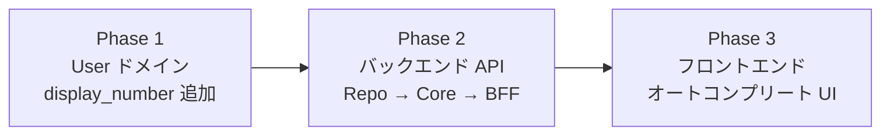
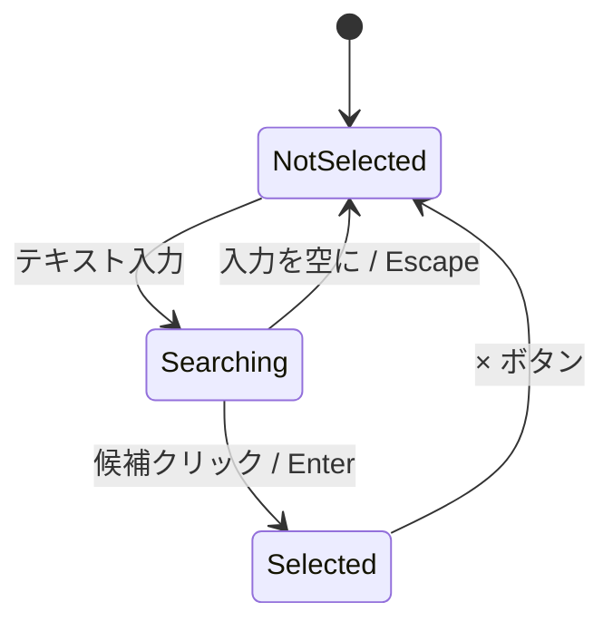
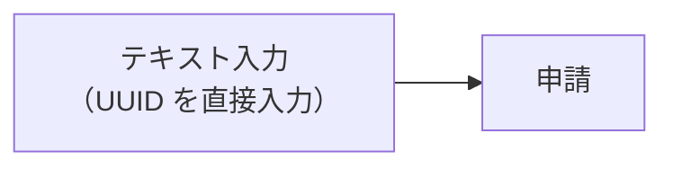
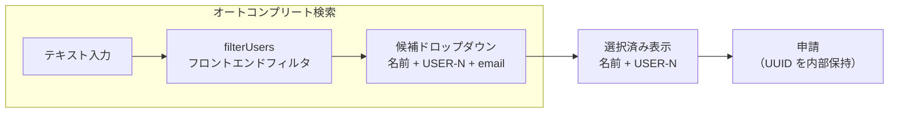
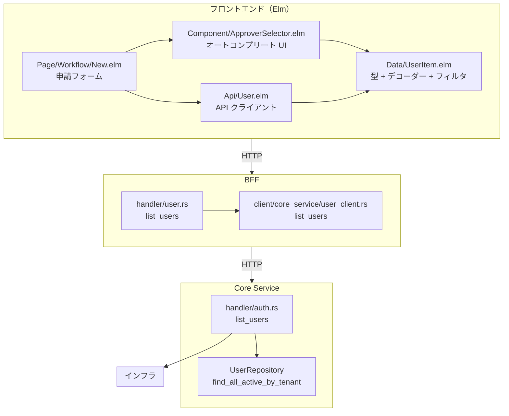

# ユーザー検索 UI - 機能解説

対応 PR: #254
対応 Issue: #203

## 概要

新規申請フォームの承認者選択を UUID 直接入力からオートコンプリート検索 UI に改善する。ユーザーは名前・表示用 ID・メールアドレスで候補を検索し、選択すると UUID が内部的に保持される。バックエンド（User ドメイン拡張 + ユーザー一覧 API）からフロントエンド（Elm オートコンプリート UI）までのフルスタック実装。

## 背景

### 変更前の課題

PR #114 で承認者設定を実装した際、承認者の指定は UUID を直接入力する方式だった。これは開発初期の暫定 UI であり、実運用では以下の問題がある:

- ユーザーは他のユーザーの UUID を知り得ない
- コピー&ペーストが必要で操作ミスが発生しやすい

### 変更の動機

- 承認者選択は「名前で検索し、候補から選ぶ」のが自然な操作
- オートコンプリート型は入力量が少なく、候補が即座にフィードバックされる UX
- フロントエンドフィルタリングにより、サーバー負荷なしで即座に候補を絞り込める

### Issue 全体の構成

Issue #203 は 1 つの PR（#254）で完結する。3 Phase で段階的にフルスタック実装。



## 用語・概念

| 用語 | 説明 | 関連コード |
|------|------|-----------:|
| UserItem | ユーザー一覧表示用の軽量 DTO（id, displayId, name, email） | `Data.UserItem` |
| ApproverSelection | 承認者の選択状態を型で表現する Union Type | `Component.ApproverSelector` |
| オートコンプリート | テキスト入力に連動して候補リストを表示する UI パターン | `Component.ApproverSelector.view` |
| フロントエンドフィルタリング | 全ユーザーを一括取得し、クライアント側で絞り込む方式 | `UserItem.filterUsers` |

## フロー

### ユーザー検索フロー

ユーザーが承認者を検索・選択するまでの流れ。

```mermaid
sequenceDiagram
    participant User as ユーザー
    participant Elm as Elm App
    participant BFF as BFF
    participant Core as Core Service
    participant DB as PostgreSQL

    User->>Elm: /workflows/new にアクセス
    Elm->>BFF: GET /api/v1/users
    BFF->>BFF: セッション検証
    BFF->>Core: GET /internal/users?tenant_id=...
    Core->>DB: SELECT ... FROM users WHERE tenant_id = $1 AND status = 'active'
    DB-->>Core: ユーザー一覧
    Core-->>BFF: ApiResponse&lt;Vec&lt;UserItemDto&gt;&gt;
    BFF-->>Elm: ApiResponse&lt;Vec&lt;UserItemData&gt;&gt;

    User->>Elm: テキスト入力（例: "山田"）
    Elm->>Elm: filterUsers("山田", users)
    Elm-->>User: 候補リスト表示

    User->>Elm: 候補をクリック or Enter
    Elm->>Elm: ApproverSelection = Selected user
    Elm-->>User: 選択済み表示（名前 + USER-N）
```

### 承認者選択の状態遷移



## ビフォー・アフター

### Before（変更前）



- 承認者 ID を UUID 文字列で直接入力
- ユーザーは他のユーザーの UUID を知る手段がない
- コピー&ペーストが必須で、操作ミスが起きやすい

### After（変更後）



#### 改善点

- 名前・表示用 ID・メールアドレスで検索可能
- 候補が即座にフィードバックされる（フロントエンドフィルタリング）
- キーボードナビゲーション対応（↑↓ Enter Escape）
- 選択状態を型で表現（`ApproverSelection` Union Type）

## アーキテクチャ



## データフロー

### フロー 1: ユーザー一覧取得

```mermaid
sequenceDiagram
    participant Elm as Elm App
    participant BFF as BFF Handler
    participant Client as BFF Client
    participant Core as Core Handler
    participant Repo as UserRepository

    Elm->>BFF: GET /api/v1/users
    BFF->>BFF: セッション検証（extract_tenant_id + get_session）
    BFF->>Client: list_users(tenant_id)
    Client->>Core: GET /internal/users?tenant_id=...
    Core->>Repo: find_all_active_by_tenant(tenant_id)
    Repo-->>Core: Vec&lt;User&gt;
    Core->>Core: User → UserItemDto（DisplayId 生成）
    Core-->>Client: ApiResponse&lt;Vec&lt;UserItemDto&gt;&gt;
    Client-->>BFF: ApiResponse&lt;Vec&lt;UserItemDto&gt;&gt;
    BFF->>BFF: UserItemDto → UserItemData
    BFF-->>Elm: ApiResponse&lt;Vec&lt;UserItemData&gt;&gt;
    Elm->>Elm: デコード → List UserItem
```

#### 処理ステップ

| # | レイヤー | ファイル:関数 | 処理内容 |
|---|---------|-------------|---------:|
| 1 | フロントエンド | `Api/User.elm:listUsers` | `GET /api/v1/users` を送信 |
| 2 | BFF | `handler/user.rs:list_users` | セッション検証、Core Service 呼び出し |
| 3 | BFF Client | `client/core_service/user_client.rs:list_users` | Core Service の内部 API を呼び出し |
| 4 | Core Service | `handler/auth.rs:list_users` | クエリパラメータ抽出、リポジトリ呼び出し |
| 5 | インフラ | `user_repository.rs:find_all_active_by_tenant` | SQL で `status = 'active'` のユーザーを取得 |
| 6 | Core Service | `handler/auth.rs:UserItemDto::from_user` | User → UserItemDto（DisplayId 生成） |
| 7 | フロントエンド | `Data/UserItem.elm:listDecoder` | `{ data: [...] }` 形式をデコード |

## 設計判断

機能・仕組みレベルの判断を記載する。コード実装レベルの判断は[コード解説](./02_ユーザー検索UI_コード解説.md#設計解説)を参照。

### 1. UI パターン: オートコンプリート vs ドロップダウン vs モーダル検索

承認者選択の UI パターンの選択。

| 案 | 入力の容易さ | 候補のフィードバック | 実装コスト |
|----|-----------|-------------------|-----------|
| **オートコンプリート（採用）** | 高い（テキスト入力） | 即座（入力に連動） | 中 |
| 固定ドロップダウン | 低い（長いリスト） | 全件表示 | 低 |
| モーダル検索 | 中（別画面遷移） | 検索後に表示 | 高 |

**採用理由**: テキスト入力に連動して候補が即座にフィードバックされるオートコンプリートが、操作の効率性と UX のバランスに最も優れる。ユーザー数が少ない MVP フェーズでは、全件取得 + フロントエンドフィルタリングで十分な性能が確保できる。

### 2. データ取得戦略: 一括取得 + フロントエンドフィルタリング vs サーバーサイド検索

検索クエリごとに API を呼び出すか、初回に全件取得してフロントエンドでフィルタリングするか。

| 案 | レイテンシ | サーバー負荷 | 実装コスト |
|----|----------|-----------|-----------|
| **一括取得 + FE フィルタ（採用）** | 初回のみ | 低い | 低 |
| サーバーサイド検索 | 毎回 | クエリごとに発生 | 高 |

**採用理由**: MVP フェーズではテナント内ユーザー数が限定的（数十人〜数百人規模）であり、初回の全件取得コストは軽微。フロントエンドフィルタリングにより入力ごとの API 呼び出しが不要で、即座のレスポンスが実現できる。ユーザー数が増加した時点でサーバーサイド検索への移行を検討する。

### 3. 選択状態の型安全な表現

承認者の選択状態をどのように管理するか。

| 案 | 型安全性 | 不正状態の可能性 |
|----|---------|---------------|
| **Union Type（採用）** | 高い（全パターン強制） | なし |
| Maybe String（UUID） | 低い（空文字チェック） | 空文字 = 未選択の暗黙規約 |
| Bool + String | 低い（手動同期） | フラグとデータの不一致 |

**採用理由**: `ApproverSelection` Union Type（`NotSelected | Selected UserItem`）で選択状態を表現することで、`case` 式の網羅性チェックにより全パターンの処理が強制される。Elm の「不正な状態を表現不可能にする」原則の実践。

### 4. Tasks ルートにフィルタを付けない

承認待ちタスクカードの遷移先にフィルタを付けるかの判断。（ダッシュボードカードナビゲーションの設計判断を継承）

## 関連ドキュメント

- [コード解説](./02_ユーザー検索UI_コード解説.md)
- [表示用 ID 設計](../../40_詳細設計書/12_表示用ID設計.md)
- [表示用 ID 実装解説](../PR215_表示用ID/01_表示用ID_機能解説.md)
