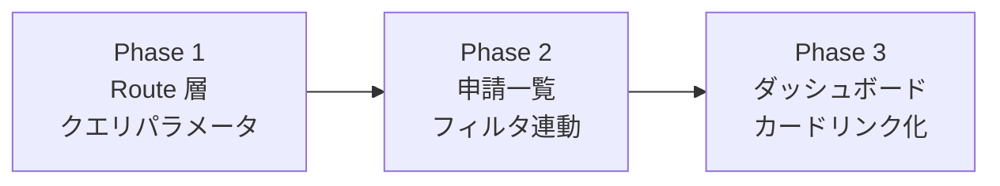
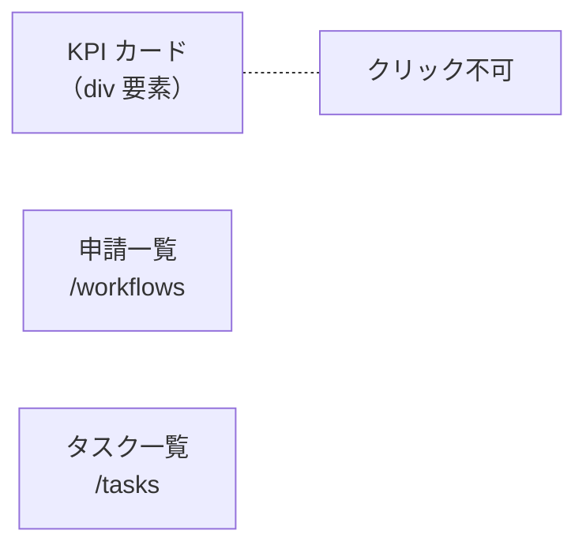
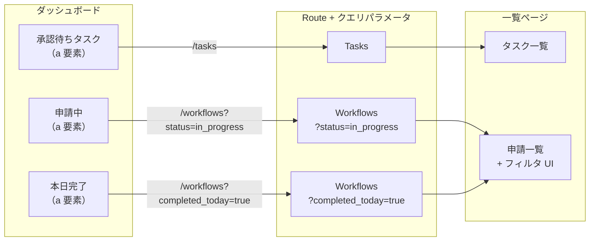
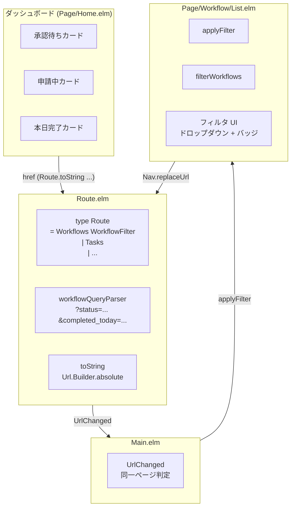

# ダッシュボードカードナビゲーション - 機能解説

対応 PR: #268
対応 Issue: #267

## 概要

ダッシュボードの KPI カード（承認待ちタスク・申請中・本日完了）をクリックして、対応するフィルタ付き一覧ページに遷移できるようにする。フロントエンド（Elm）のみの変更で、バックエンドは変更なし。

## 背景

### 変更前の課題

PR #166 でダッシュボードに KPI カードを実装したが、カードは静的な表示のみだった。ユーザーは統計値を見た後、手動で一覧ページに遷移し、目的のデータを探す必要があった。

### 変更の動機

- KPI カードから対応する一覧ページへの「ドリルダウン」は、ダッシュボード UI の標準的なパターン
- URL クエリパラメータでフィルタ状態を保持することで、ブックマーク・URL 共有にも対応
- フィルタ変更時のブラウザ履歴制御で UX を向上

### Issue 全体の構成

Issue #267 は 1 つの PR（#268）で完結する。フロントエンドの 3 層（Route → ページ → ダッシュボード）を段階的に変更。

## 用語・概念

| 用語 | 説明 | 関連コード |
|------|------|-----------|
| WorkflowFilter | ワークフロー一覧のフィルタ条件（status + completedToday） | `Route.WorkflowFilter` |
| プリセットフィルタ | `completedToday=True` のように、複合条件を 1 つのフラグで表すフィルタ | `filterWorkflows` |
| Single Source of Truth | Route 型にフィルタを埋め込み、URL = アプリケーション状態とする設計 | `Route.Workflows WorkflowFilter` |
| 同一ページ判定 | URL 変更時に現在のページと同じルートかを判定し、不要な再初期化を回避 | `Main.elm:302` |

## ビフォー・アフター

### Before（変更前）

- KPI カードは `div` 要素で静的表示のみ
- 一覧ページにフィルタ機能なし
- `Route.Workflows` にフィルタ情報なし

#### 制約・課題

- カードの数値を見ても、対応するデータに直接アクセスできない
- 一覧ページで手動でデータを探す必要がある

### After（変更後）

#### 改善点

- KPI カードをクリックすると対応するフィルタ付きページに遷移
- URL クエリパラメータでフィルタ状態を保持（ブックマーク・共有可能）
- フィルタ変更時は `Nav.replaceUrl` で履歴を汚さない
- 同一ページ判定で不要なデータ再取得を回避

## アーキテクチャ

## 設計判断

機能・仕組みレベルの判断を記載する。コード実装レベルの判断は[コード解説](./02_カードナビゲーション_コード解説.md#設計解説)を参照。

### 1. Route にフィルタを埋め込むか、ページモデルのみに持つか

フィルタ状態の管理場所の選択。

| 案 | URL との一致 | ブックマーク対応 | 型安全性 |
|----|------------|----------------|---------|
| **Route に埋め込み（採用）** | 常に一致 | 対応 | コンパイラが全箇所を強制 |
| ページモデルのみ | 乖離の可能性 | 非対応 | 手動管理 |

**採用理由**: Route にフィルタを埋め込むことで URL = アプリケーション状態（Single Source of Truth）を型レベルで保証する。URL 直接入力時もフィルタが正しく復元される。

### 2. `completedToday` の優先度（プリセットフィルタ）

`completedToday=True` と `status` フィルタが同時に指定された場合の振る舞い。

| 案 | 直感性 | 空結果リスク | UI との整合 |
|----|-------|------------|-----------|
| **completedToday 優先（採用）** | 高い | なし | バッジ表示と一致 |
| AND 結合 | 低い | 高い（例: draft & completedToday） | 複雑 |

**採用理由**: `completedToday` は「Approved かつ本日 updated」を暗黙に含むプリセット。AND 結合にすると矛盾する組み合わせで空結果になり混乱を招く。

### 3. フィルタ変更時の履歴制御

フィルタ変更で `Nav.pushUrl`（履歴追加）か `Nav.replaceUrl`（履歴置換）か。

| 案 | 戻るボタンの挙動 | UX |
|----|----------------|----|
| **replaceUrl（採用）** | 前のページに戻る | 自然 |
| pushUrl | フィルタ変更を巻き戻す | 煩雑 |

**採用理由**: フィルタ変更ごとに履歴エントリを作ると、戻るボタンが「フィルタ変更の巻き戻し」になる。ダッシュボードカードのクリックは通常のリンク（`<a>` 要素 → pushUrl 相当）で履歴に残るため、戻るボタンでダッシュボードに戻れる。

### 4. Tasks ルートにフィルタを付けない

承認待ちタスクカードの遷移先にフィルタを付けるかの判断。

| 案 | 根拠 |
|----|------|
| **フィルタなし（採用）** | API が Active タスクのみ返すため、クライアント側フィルタは不要 |
| status フィルタ付き | API が全ステータスのタスクを返す場合に必要（YAGNI） |

**採用理由**: 現在の `/tasks` API は Active なタスクのみを返す設計のため、フィルタは不要。将来 API が変更された時点で対応する。

## 関連ドキュメント

- [コード解説](./02_カードナビゲーション_コード解説.md)
- [ダッシュボード（API 実装）](../PR166_ダッシュボード/01_ダッシュボード_機能解説.md)
