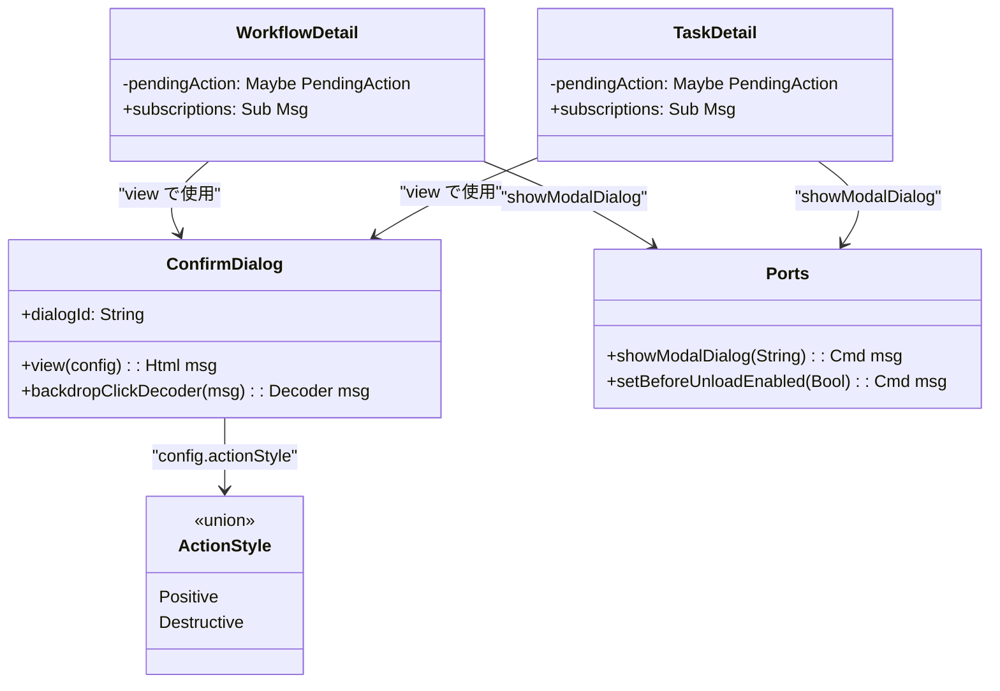
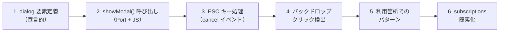
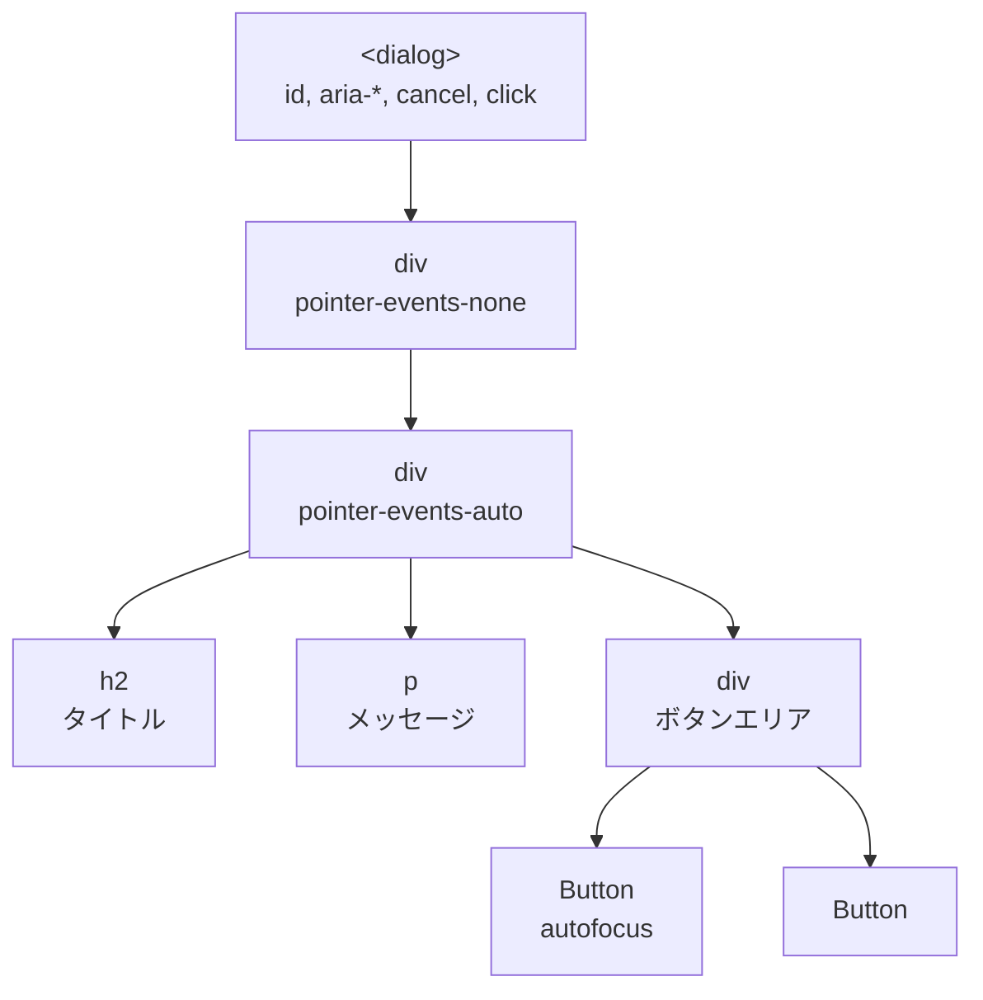
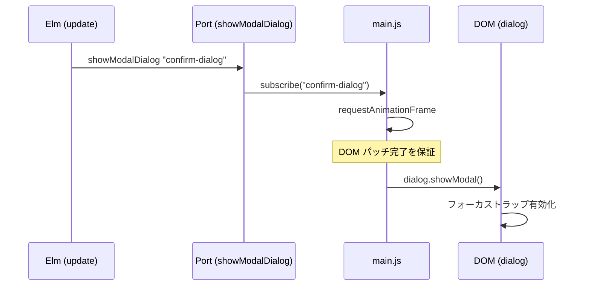
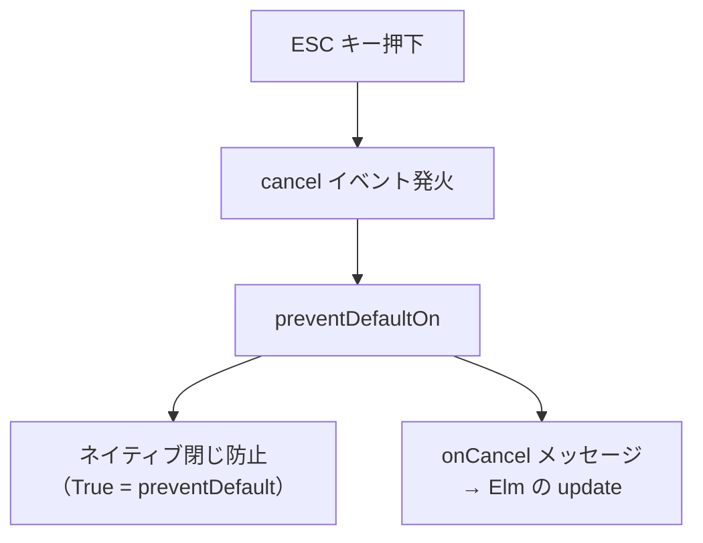
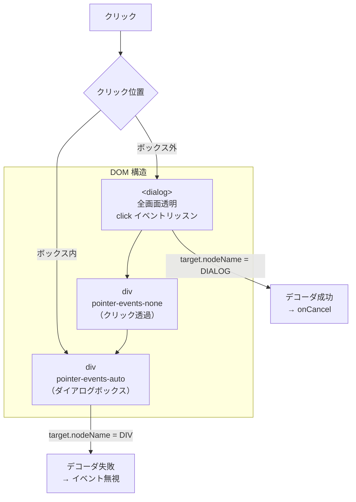
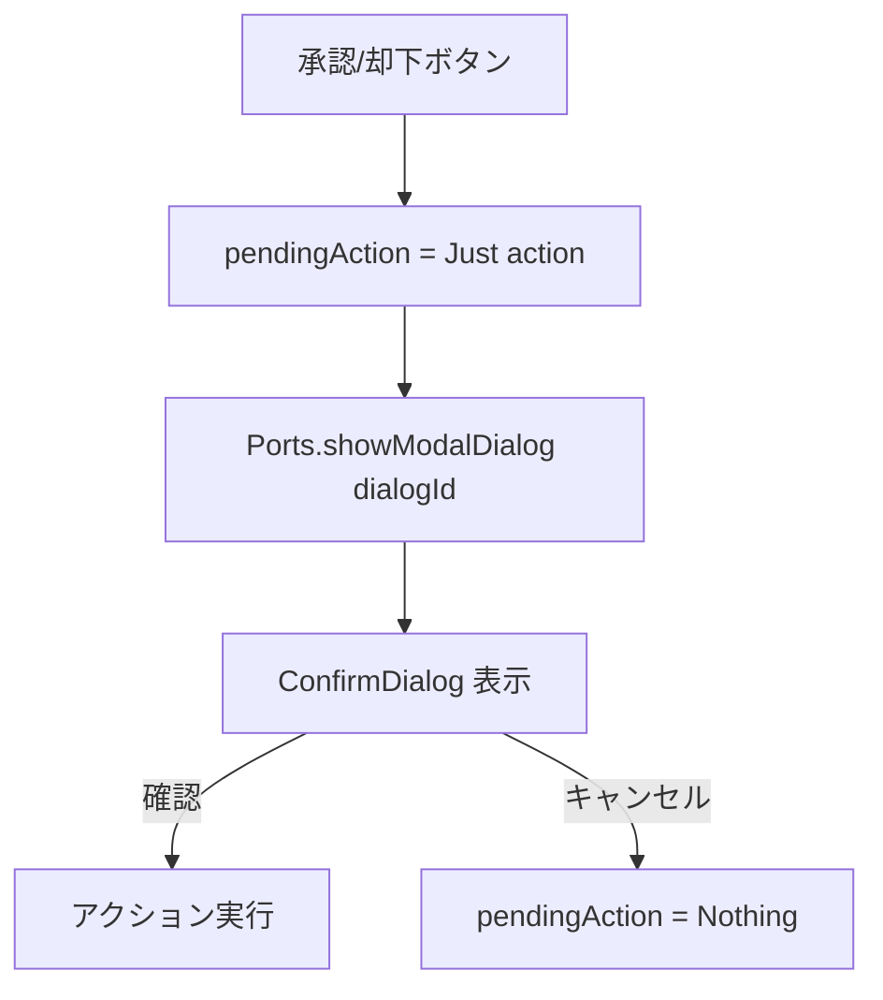
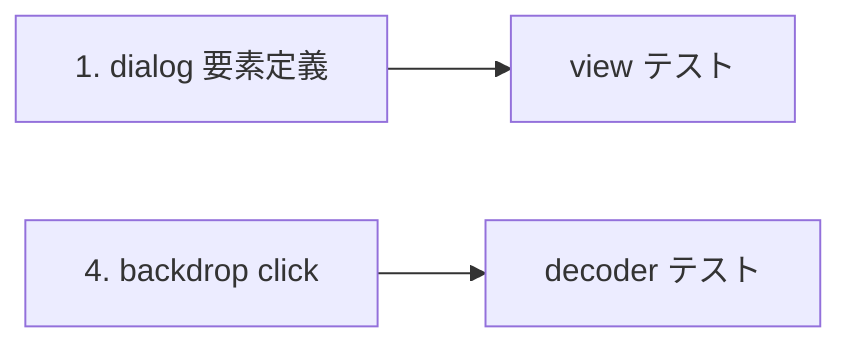

# ConfirmDialog アクセシビリティ改善 - コード解説

対応 PR: #278
対応 Issue: #265

## 主要な型・関数

| 型/関数 | ファイル | 責務 |
|--------|---------|------|
| `ConfirmDialog.view` | [`ConfirmDialog.elm:87`](../../../frontend/src/Component/ConfirmDialog.elm) | `<dialog>` 要素による確認ダイアログの描画 |
| `ActionStyle` | [`ConfirmDialog.elm:58`](../../../frontend/src/Component/ConfirmDialog.elm) | `Positive` / `Destructive` のスタイル指定 |
| `backdropClickDecoder` | [`ConfirmDialog.elm:142`](../../../frontend/src/Component/ConfirmDialog.elm) | バックドロップクリック検出デコーダ |
| `dialogId` | [`ConfirmDialog.elm:130`](../../../frontend/src/Component/ConfirmDialog.elm) | ダイアログ要素の HTML id（`"confirm-dialog"`） |
| `showModalDialog` | [`Ports.elm:65`](../../../frontend/src/Ports.elm) | `String -> Cmd msg`。JS への `showModal()` 呼び出し委譲 |
| `PendingAction` | [`Workflow/Detail.elm:85`](../../../frontend/src/Page/Workflow/Detail.elm) | 確認待ち操作（承認/却下）を表す型 |
| `subscriptions` | [`Workflow/Detail.elm:289`](../../../frontend/src/Page/Workflow/Detail.elm) | `Sub Msg`（値。ESC 処理不要で引数なし） |

### 型の関係



## コードフロー

コードをライフサイクル順に追う。各ステップの構造を図で示した後、対応するコードを解説する。



### 1. dialog 要素定義（宣言的）

Elm の Virtual DOM で `<dialog>` 要素を生成する。



```elm
-- frontend/src/Component/ConfirmDialog.elm:87-121
view config =
    Html.node "dialog"
        [ id dialogId                                           -- ① Port のターゲット
        , class "fixed inset-0 m-0 h-full w-full max-h-none max-w-none bg-transparent p-0 border-none outline-none"
        , attribute "aria-labelledby" titleId                   -- ② ARIA ラベリング
        , attribute "aria-describedby" messageId                -- ③ ARIA 説明
        , preventDefaultOn "cancel"                             -- ④ ESC キー処理
            (Decode.succeed ( config.onCancel, True ))
        , Html.Events.on "click"                                -- ⑤ backdrop click
            (backdropClickDecoder config.onCancel)
        ]
        [ div [ class "flex h-full w-full items-center justify-center pointer-events-none" ]
            [ div [ class "pointer-events-auto w-full max-w-md rounded-lg bg-white p-6 shadow-xl" ]
                [ h2 [ id titleId, ... ] [ text config.title ]
                , p [ id messageId, ... ] [ text config.message ]
                , div [ class "mt-6 flex justify-end gap-3" ]
                    [ Button.viewWithAttrs                      -- ⑥ キャンセルボタン
                        { variant = Button.Outline, ... }
                        [ Html.Attributes.id cancelButtonId
                        , Html.Attributes.autofocus True         -- ⑦ 初期フォーカス
                        ]
                        [ text config.cancelLabel ]
                    , Button.view                                -- ⑧ 確認ボタン
                        { variant = actionStyleToVariant config.actionStyle, ... }
                        [ text config.confirmLabel ]
                    ]
                ]
            ]
        ]
```

注目ポイント:

- ① `id dialogId` で Port からの `showModal()` ターゲットを特定
- ② ③ `aria-labelledby` と `aria-describedby` でスクリーンリーダーがタイトルとメッセージを読み上げ
- ④ `preventDefaultOn "cancel"` で ESC キー処理を一元化（詳細はステップ 3）
- ⑤ backdrop click 検出（詳細はステップ 4）
- ⑥ ⑦ キャンセルボタンに `autofocus True` を設定。`showModal()` がこの要素に自動フォーカスする
- ⑧ `actionStyleToVariant` で `Positive` → `Button.Success`、`Destructive` → `Button.Error` にマッピング

### 2. showModal() 呼び出し（Port + JS）

Elm の宣言的な世界と、命令的な `showModal()` API を Port で橋渡しする。



```elm
-- frontend/src/Ports.elm:65
port showModalDialog : String -> Cmd msg
```

```javascript
// frontend/src/main.js:223-232
if (app.ports.showModalDialog) {
  app.ports.showModalDialog.subscribe((dialogId) => {
    requestAnimationFrame(() => {                    // ① DOM パッチ後に実行
      const dialog = document.getElementById(dialogId);
      if (dialog && !dialog.open) {                  // ② 二重呼び出し防止
        dialog.showModal();
      }
    });
  });
}
```

注目ポイント:

- ① `requestAnimationFrame` で Elm の Virtual DOM パッチ完了後に `showModal()` を呼ぶ。Port コマンドは DOM パッチ後に実行されるが、安全マージンとして次フレームまで遅延
- ② `!dialog.open` チェックで二重 `showModal()` 呼び出しによる `InvalidStateError` を防止

### 3. ESC キー処理（cancel イベント）

`<dialog>` の `cancel` イベントで ESC キーを処理する。



```elm
-- frontend/src/Component/ConfirmDialog.elm:93-94
, preventDefaultOn "cancel"
    (Decode.succeed ( config.onCancel, True ))  -- ① True = preventDefault
```

注目ポイント:

- ① `preventDefaultOn` の第 2 要素 `True` が `preventDefault` に対応。`<dialog>` のネイティブ ESC 閉じ動作を防止し、Elm の状態管理（`pendingAction = Nothing`）に委ねる
- この 2 行で、以前 3 箇所に分散していた `Browser.Events.onKeyDown (KeyEvent.escKeyDecoder ...)` がすべて不要になった

### 4. バックドロップクリック検出

`::backdrop` 疑似要素は DOM イベントをバインドできないため、`pointer-events` トリックで代替する。



```elm
-- frontend/src/Component/ConfirmDialog.elm:142-152
backdropClickDecoder : msg -> Decode.Decoder msg
backdropClickDecoder msg =
    Decode.at [ "target", "nodeName" ] Decode.string
        |> Decode.andThen
            (\nodeName ->
                if nodeName == "DIALOG" then            -- ① backdrop クリック
                    Decode.succeed msg

                else
                    Decode.fail ("Click was not on the backdrop: " ++ nodeName)  -- ② 子要素クリック
            )
```

注目ポイント:

- ① `<dialog>` 要素が直接 `target` になるのは、中間コンテナが `pointer-events-none` でクリックを透過するため
- ② ダイアログボックス内のクリックは `pointer-events-auto` で捕捉され、`target` が `DIV` になるためデコーダが失敗し、イベントが無視される

### 5. 利用箇所でのパターン

各ページでの PendingAction + ConfirmDialog パターン。



```elm
-- frontend/src/Page/Workflow/Detail.elm:194-200（承認/却下ボタンクリック）
StartApprove step ->
    ( { model | pendingAction = Just (ConfirmApprove step) }
    , Ports.showModalDialog ConfirmDialog.dialogId       -- ① showModal() を呼ぶ
    )

StartReject step ->
    ( { model | pendingAction = Just (ConfirmReject step) }
    , Ports.showModalDialog ConfirmDialog.dialogId
    )
```

注目ポイント:

- ① 以前は `focusDialogCancel`（`Browser.Dom.focus` の `Task.attempt`）を呼んでいたが、`showModal()` + `autofocus` で不要になった

### 6. subscriptions 簡素化

ESC 処理が `<dialog>` の `cancel` イベントに統合されたため、`subscriptions` が Model に依存しなくなった。

```elm
-- Before: Model を受け取る関数
subscriptions : Model -> Sub Msg
subscriptions model =
    case model.pendingAction of
        Just _ -> Browser.Events.onKeyDown (KeyEvent.escKeyDecoder CancelAction)
        Nothing -> Sub.none

-- After: 常に Sub.none を返す値
-- frontend/src/Page/Workflow/Detail.elm:289-290
subscriptions : Sub Msg
subscriptions =
    Sub.none
```

```elm
-- Main.elm 側の呼び出しも対応
-- Before
Sub.map TaskDetailMsg (TaskDetail.subscriptions subModel)

-- After（frontend/src/Main.elm:506-510）
Sub.map TaskDetailMsg TaskDetail.subscriptions
```

注目ポイント:

- 型が `Model -> Sub Msg` から `Sub Msg` に変更。elm-review の `NoUnused.Parameters` ルールに準拠
- `Util/KeyEvent.elm` とそのテスト `Util/KeyEventTest.elm` が完全に不要になり削除

## テスト

各テストがライフサイクルのどのステップを検証しているかを示す。



| テスト | 検証対象のステップ | 検証内容 |
|-------|------------------|---------:|
| `dialog 要素で描画される` | 1 | `Html.node "dialog"` が正しく生成される |
| `aria-labelledby` | 1 | タイトル要素の ID を参照する |
| `aria-describedby` | 1 | メッセージ要素の ID を参照する |
| `タイトル要素の ID` | 1 | 正しい ID が付与されテキストが表示される |
| `メッセージ要素の ID` | 1 | 正しい ID が付与されテキストが表示される |
| `DIALOG ノードへのクリックで成功` | 4 | `target.nodeName === "DIALOG"` で成功 |
| `子要素へのクリックで失敗` | 4 | `target.nodeName === "DIV"` で失敗 |

### 実行方法

```bash
cd frontend && pnpm run test -- --watch tests/Component/ConfirmDialogTest.elm
```

## 依存関係

| パッケージ | バージョン | 変更 |
|-----------|-----------|------|
| なし | — | 新規パッケージ追加なし |

削除されたファイル:

| ファイル | 理由 |
|---------|------|
| `Util/KeyEvent.elm` | 全利用箇所が `<dialog>` の `cancel` イベントに置換 |
| `tests/Util/KeyEventTest.elm` | 上記に伴い不要 |

## 設計解説

コード実装レベルの判断を記載する。機能・仕組みレベルの判断は[機能解説](./01_ConfirmDialogアクセシビリティ_機能解説.md#設計判断)を参照。

### 1. `preventDefaultOn "cancel"` による状態整合性の保証

場所: `frontend/src/Component/ConfirmDialog.elm:93-94`

```elm
preventDefaultOn "cancel"
    (Decode.succeed ( config.onCancel, True ))
```

なぜこの実装か:

`<dialog>` は ESC キーで `cancel` イベントを発火し、デフォルト動作としてダイアログを閉じる。しかし Elm では `pendingAction` の状態管理がコンポーネント外にあるため、ネイティブの閉じ動作を許すと状態が不整合になる（DOM ではダイアログが閉じているのに、Elm の Model では `pendingAction = Just action` のまま）。

代替案:

| 案 | メリット | デメリット | 判断 |
|----|---------|-----------|------|
| `preventDefaultOn`（採用） | 状態整合性が保証される | — | 採用 |
| `Html.Events.on "cancel"` | シンプル | `preventDefault` 不可。ちらつき発生 | 見送り |

### 2. `requestAnimationFrame` による DOM パッチ完了保証

場所: `frontend/src/main.js:225-230`

```javascript
requestAnimationFrame(() => {
  const dialog = document.getElementById(dialogId);
  if (dialog && !dialog.open) {
    dialog.showModal();
  }
});
```

なぜこの実装か:

Port コマンドは Elm の Virtual DOM パッチ後に実行されるが、`requestAnimationFrame` で次フレームまで遅延させることで、DOM 更新の完了を確実に保証する。`!dialog.open` チェックで二重呼び出しの `InvalidStateError` も防止。

代替案:

| 案 | メリット | デメリット | 判断 |
|----|---------|-----------|------|
| `requestAnimationFrame`（採用） | 確実 | 1 フレーム遅延（人間には知覚不能） | 採用 |
| 直接呼び出し | 遅延なし | DOM パッチ未完了のリスク | 見送り |
| `setTimeout(0)` | マイクロタスク後 | 信頼性が `rAF` より低い | 見送り |

### 3. `pointer-events` による backdrop click 検出

場所: `frontend/src/Component/ConfirmDialog.elm:89-98`

```elm
Html.node "dialog"
    [ ...
    , Html.Events.on "click" (backdropClickDecoder config.onCancel)
    ]
    [ div [ class "... pointer-events-none" ]
        [ div [ class "... pointer-events-auto" ]
            [ ... ]
        ]
    ]
```

なぜこの実装か:

`::backdrop` 疑似要素は DOM イベントをバインドできない。`<dialog>` を全画面透明にし、中間コンテナを `pointer-events-none`、ダイアログボックスを `pointer-events-auto` にすることで、ボックス外のクリックが `<dialog>` 要素に到達する。`target.nodeName` で判定するためクリック位置の座標計算が不要。

代替案:

| 案 | メリット | デメリット | 判断 |
|----|---------|-----------|------|
| `pointer-events` トリック（採用） | コンポーネント API がシンプル | CSS レイアウトが若干複雑 | 採用 |
| `stopPropagation` パターン | 直感的 | no-op Msg が必要。API 複雑化 | 見送り |
| 座標計算（`getBoundingClientRect`） | CSS 制約なし | JS 側実装必要。Port 増加 | 見送り |

### 4. `subscriptions` の型変更（関数 → 値）

場所: `frontend/src/Page/Workflow/Detail.elm:289-290`

```elm
subscriptions : Sub Msg
subscriptions =
    Sub.none
```

なぜこの実装か:

ESC 処理が `<dialog>` の `cancel` イベントに統合されたため、`subscriptions` が Model に依存しなくなった。elm-review の `NoUnused.Parameters` ルールに従い、不要なパラメータを除去して型を `Model -> Sub Msg` から `Sub Msg` に変更。

将来 Model に依存するサブスクリプションが必要になれば、型を関数に戻せばよい（YAGNI）。

## 関連ドキュメント

- [機能解説](./01_ConfirmDialogアクセシビリティ_機能解説.md)
- ADR-031: [ConfirmDialog の dialog 要素への移行](../../70_ADR/031_ConfirmDialogのdialog要素への移行.md)
- [WAI-ARIA Dialog (Modal) Pattern](https://www.w3.org/WAI/ARIA/apg/patterns/dialog-modal/)
- [ナレッジベース: Elm ポート](../../80_ナレッジベース/elm/Elmポート.md)
