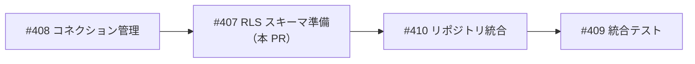
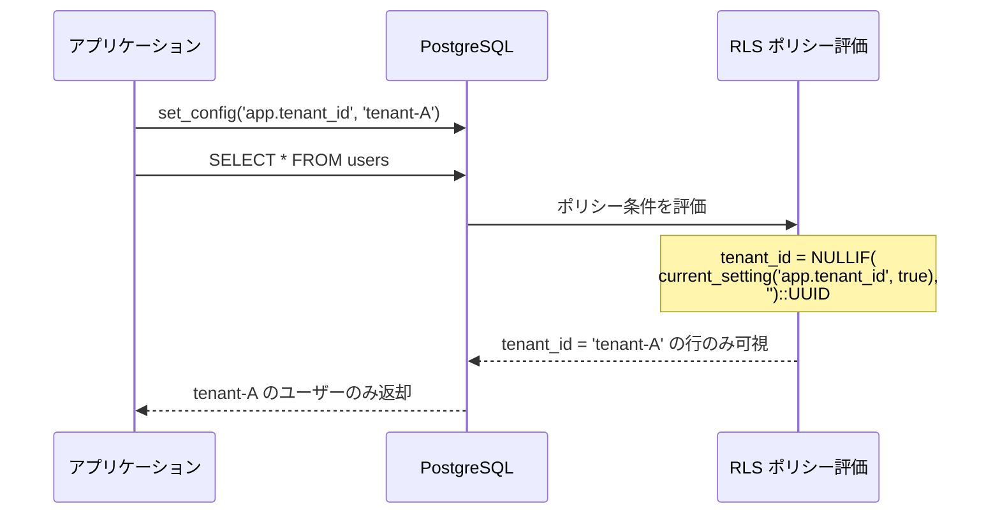
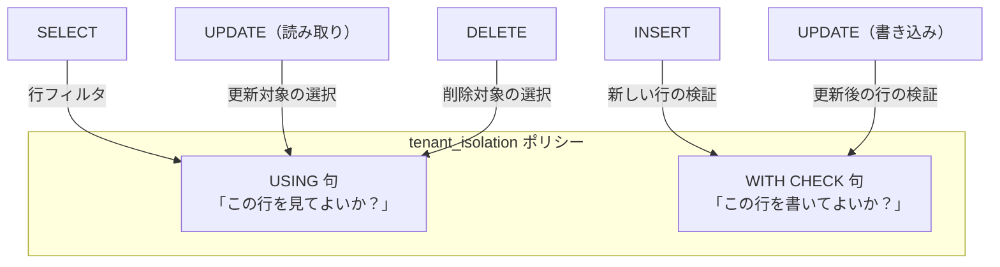
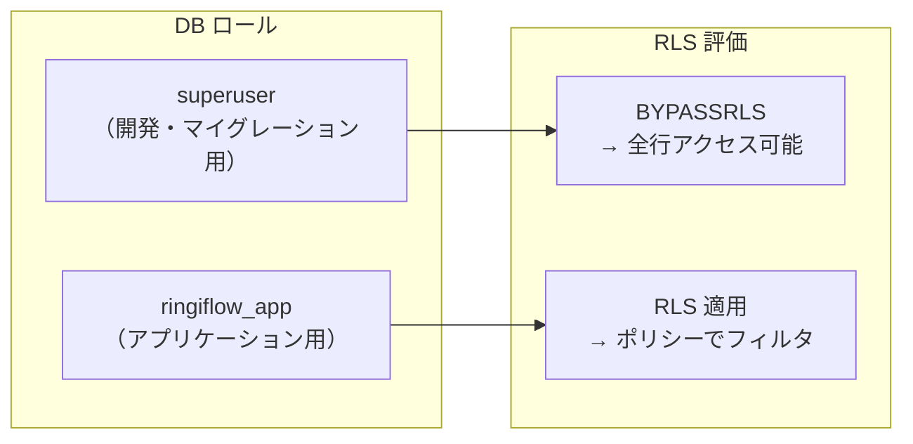
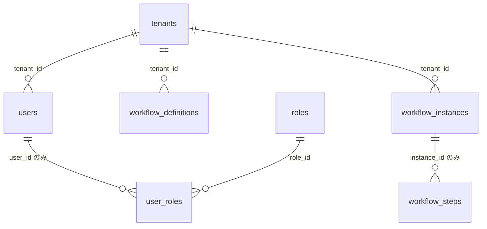
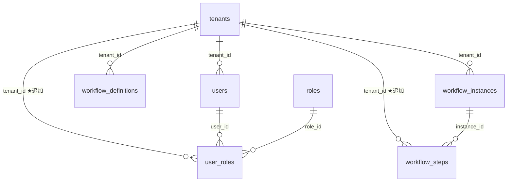

# RLS スキーマ準備 - 機能解説

対応 PR: [#413](https://github.com/ka2kama/ringiflow/pull/413)
対応 Issue: [#407](https://github.com/ka2kama/ringiflow/issues/407)
親 Epic: [#402 Phase 2-1: マルチテナント RLS](https://github.com/ka2kama/ringiflow/issues/402)

## 概要

全テナントスコープテーブル（9 テーブル）に PostgreSQL RLS（Row Level Security）を有効化し、テナント分離ポリシーを設定した。`workflow_steps` と `user_roles` に不足していた `tenant_id` カラムを追加し、アプリケーション用の非 superuser ロール `ringiflow_app` を作成している。

この PR は、[#412（コネクション管理）](./03_コネクション管理_機能解説.md)で実装した「配管」（セッション変数の設定・リセット）の上に乗る「ポリシー」部分にあたる。

## 背景

### 二重防御の DB 層

[基本設計書 7.1.3](../../30_基本設計書/03_インフラとDB設計.md) で定義された「二重防御」のうち、DB 層を本 PR で実装する。背景の詳細は [RLS コネクション管理 - 機能解説 > 背景](./03_コネクション管理_機能解説.md#背景) を参照。

| 防御層 | 手段 | 状態 |
|-------|------|------|
| アプリケーション層 | `WHERE tenant_id = $1` | Phase 1 で実装済み |
| DB 層ガードレール（配管） | `TenantConnection` + `after_release` フック | [#412](./03_コネクション管理_機能解説.md) で実装済み |
| **DB 層ガードレール（ポリシー）** | **RLS ポリシー + tenant_id カラム（本 PR）** | **本 PR で実装** |

### Epic #402 における位置づけ

| Issue | 内容 | 状態 |
|-------|------|------|
| [#408](https://github.com/ka2kama/ringiflow/issues/408) | `after_release` フック + `TenantConnection` | 完了 |
| [#407](https://github.com/ka2kama/ringiflow/issues/407) | tenant_id カラム追加 + RLS ポリシー設定（本 PR） | 完了 |
| [#410](https://github.com/ka2kama/ringiflow/issues/410) | 既存リポジトリの RLS 対応 | 未着手 |
| [#409](https://github.com/ka2kama/ringiflow/issues/409) | クロステナントアクセス防止の統合テスト | 未着手 |

## 用語・概念

| 用語 | 説明 | 関連コード |
|------|------|-----------|
| RLS（Row Level Security） | PostgreSQL の機能。テーブルの行単位でアクセスを制御する。ポリシーに合致しない行は「存在しない」かのように振る舞う | `ENABLE ROW LEVEL SECURITY` |
| ポリシー | RLS のルール定義。`USING` 句（読み取り）と `WITH CHECK` 句（書き込み）で条件を指定する | `CREATE POLICY tenant_isolation` |
| GUC 変数 | PostgreSQL のセッション単位のキーバリューストア。`set_config` で設定し `current_setting` で取得する | `app.tenant_id` |
| NULLIF パターン | `NULLIF(value, '')` で空文字列を NULL に変換するテクニック。未設定時のフェイルセーフに使用 | ポリシーの条件式 |
| `ringiflow_app` | アプリケーション用の非 superuser ロール。superuser は RLS をバイパスするため、RLS を適用するには非 superuser が必要 | マイグレーション |
| 非正規化 | 正規化で排除される冗長データを意図的に持たせること。本 PR では子テーブルに `tenant_id` を直接持たせている | `workflow_steps.tenant_id` |

## RLS の仕組み

### RLS が行をフィルタする流れ

RLS は SQL 文と DB ロールに応じて、ポリシーの条件を自動的に追加する。アプリケーションが書いた SQL が変わるわけではなく、PostgreSQL が内部で行フィルタを挿入する。

### USING 句と WITH CHECK 句

ポリシーには2種類の条件がある。

| 句 | 適用される操作 | 役割 |
|----|--------------|------|
| `USING` | SELECT, UPDATE（読み取り）, DELETE | 行の可視性: この行にアクセスしてよいか |
| `WITH CHECK` | INSERT, UPDATE（書き込み） | 行の書き込み可否: この行を作成/更新してよいか |

`FOR ALL` を使うと、USING と WITH CHECK の両方を一度に定義できる。

### superuser と RLS

PostgreSQL の superuser は `BYPASSRLS` 権限を持ち、RLS を自動的にバイパスする。これは意図された動作で、マイグレーションやメンテナンスで RLS を意識せず全データにアクセスする必要があるため。

アプリケーションからの接続で RLS を適用するには、非 superuser ロール（`ringiflow_app`）を使う必要がある。

## ビフォー・アフター

### Before（変更前）

DB にはテナント分離の仕組みがなく、アプリケーション層の WHERE 句のみに依存していた。`workflow_steps` と `user_roles` は直接 `tenant_id` を持っていなかった。

#### 制約・課題

- `workflow_steps` と `user_roles` は親テーブル経由でしかテナントを特定できない
- RLS ポリシーは各テーブルに `tenant_id` カラムが必要（JOIN ベースは非推奨）
- DB レベルのアクセス制御がなく、誤ったクエリがそのまま実行される

### After（変更後）

全テーブルが直接 `tenant_id` を持ち、RLS ポリシーが行単位でアクセスを制御する。

#### 改善点

- 全 9 テーブルに RLS ポリシーが設定され、DB レベルでテナント分離を強制
- `workflow_steps` と `user_roles` が直接 `tenant_id` を持ち、JOIN なしでポリシーが評価可能
- `ringiflow_app` ロールで接続すると、RLS が自動適用される
- `app.tenant_id` 未設定時はフェイルセーフ（全行アクセス不可）

## 設計判断

機能・仕組みレベルの判断を記載する。コード実装レベルの判断は[コード解説](./02_スキーマ準備_コード解説.md#設計解説)を参照。

### 1. 子テーブルのテナント識別をどうするか

`workflow_steps` は `workflow_instances` 経由で、`user_roles` は `users` 経由でテナントを特定できる。RLS ポリシーで直接 `tenant_id` が必要な場面で、正規化を維持するか非正規化するかの判断。

| 案 | ポリシーの複雑さ | パフォーマンス | データ冗長性 |
|----|----------------|-------------|------------|
| **非正規化: tenant_id カラム追加（採用）** | 単純（単一カラム比較） | 高速（JOIN 不要） | あり（FK + CASCADE で整合性担保） |
| JOIN ベースポリシー | 複雑（サブクエリ or JOIN） | 低速（全行に対して JOIN 評価） | なし |

**採用理由**: PostgreSQL 公式ドキュメントで JOIN ベースの RLS ポリシーは非推奨。FK 制約と `ON DELETE CASCADE` でデータ整合性を担保すれば、冗長性のリスクは十分に管理できる。

### 2. テナントコンテキスト未設定時にどう振る舞うべきか

アプリケーションが `app.tenant_id` の設定を忘れた場合の挙動。安全性とデバッグ容易性のトレードオフ。

| 案 | 未設定時の挙動 | 安全性 | デバッグ容易性 |
|----|-------------|-------|-------------|
| **フェイルセーフ: 全行ブロック（採用）** | `NULLIF('','')` → NULL → 全行不可視 | データ漏洩なし | 「データが見えない」エラーとして発現 |
| エラーを発生させる | `''::UUID` でキャストエラー | データ漏洩なし | エラーメッセージが明確 |
| 全行許可 | 全データ可視 | データ漏洩のリスク | — |

**採用理由**: `NULLIF` パターンにより、`tenant_id = NULL` は SQL の三値論理で常に `false` となり、どの行もマッチしない。キャストエラー方式はクエリ実行自体が失敗するが、NULLIF 方式は「空の結果セット」として正常に返るため、アプリケーション側の例外ハンドリングが不要。

### 3. RLS をどのロールに適用するか

ポリシーの `TO` 句で指定するロール。開発・テスト・本番で異なるロールが使われる環境での設計。

| 案 | 適用範囲 | テストへの影響 | 運用 |
|----|---------|-------------|------|
| **専用ロール `ringiflow_app`（採用）** | `ringiflow_app` のみに適用 | superuser のテスト（`#[sqlx::test]`）は影響なし | 本番で接続ロールを切り替え |
| `PUBLIC`（全ロール） | superuser 含め全員に適用 | superuser でも RLS が適用されうる | テーブル所有者は `BYPASSRLS` で回避可能 |
| ロールなし指定 | デフォルト（`PUBLIC`） | 同上 | 同上 |

**採用理由**: `ringiflow_app` 専用にすることで、既存の superuser テスト（`#[sqlx::test]`）に影響を与えない。本番デプロイ時にアプリケーション接続をこのロールに切り替えることで RLS が有効化される。段階的な移行が可能。

## 関連ドキュメント

- [コード解説](./02_スキーマ準備_コード解説.md)
- [RLS コネクション管理 - 機能解説](./03_コネクション管理_機能解説.md)（配管部分）
- [ナレッジベース: PostgreSQL RLS](../../80_ナレッジベース/infra/PostgreSQL_RLS.md)
- [基本設計書: インフラと DB 設計](../../30_基本設計書/03_インフラとDB設計.md)
