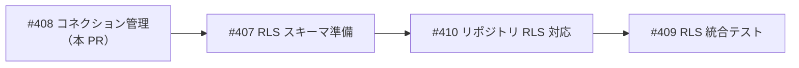
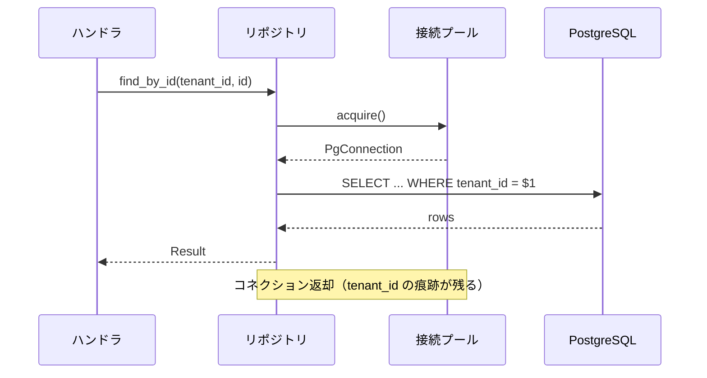
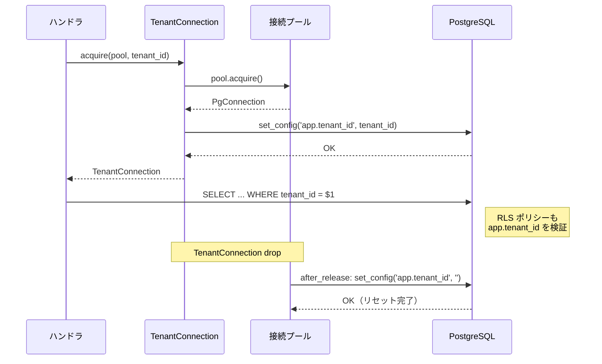
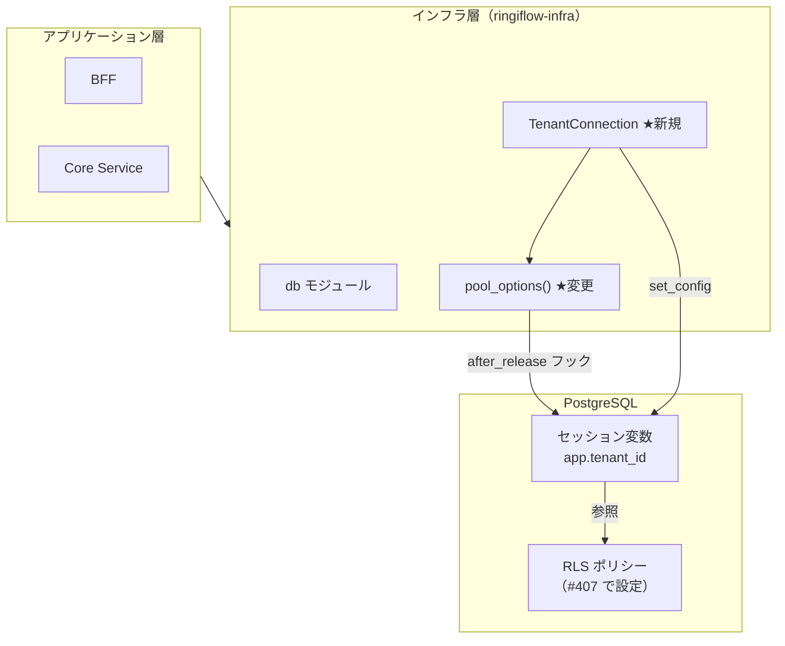
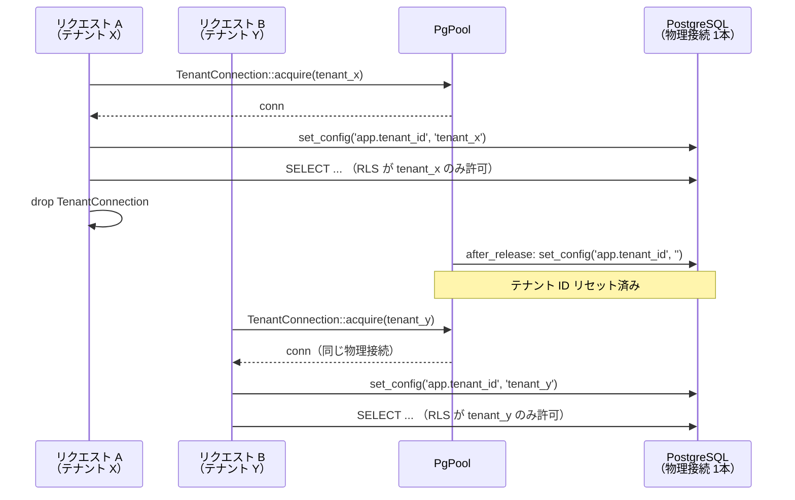

# RLS コネクション管理 - 機能解説

対応 PR: [#412](https://github.com/ka2kama/ringiflow/pull/412)
対応 Issue: [#408](https://github.com/ka2kama/ringiflow/issues/408)
親 Epic: [#402 Phase 2-1: マルチテナント RLS](https://github.com/ka2kama/ringiflow/issues/402)

## 概要

DB コネクションプールにテナントコンテキスト管理の仕組みを導入した。コネクション返却時に前のテナント情報をリセットするフック（`after_release`）と、テナント ID を自動的にセッション変数に設定するコネクション型（`TenantConnection`）の2つを実装している。

これは基本設計書 7.1.3 で定義された「二重防御」（アプリケーション層 + DB 層）のうち、DB 層ガードレールの基盤部分にあたる。この仕組みの上に RLS ポリシー（[#407](https://github.com/ka2kama/ringiflow/issues/407)）が乗ることで、テナント分離が DB レベルで強制される。

## 背景

### マルチテナントアーキテクチャ

RingiFlow は「共有データベース・共有スキーマ」方式のマルチテナント SaaS である。全テナントのデータが同一の PostgreSQL データベース・同一テーブルに格納され、各行の `tenant_id` カラムで所属テナントを識別する。

この方式はインフラコストとスキーマ管理の面で効率的だが、テナント間のデータ分離を確実に実現する仕組みが不可欠になる。

### Phase 1 の課題: 単一防御の脆弱性

Phase 1 ではアプリケーション層のみでテナント分離を実現していた。リポジトリの各クエリに `WHERE tenant_id = $1` を手動で付与する方式である。

```sql
-- すべてのクエリにこの条件を漏れなく付与する必要がある
SELECT * FROM workflows WHERE tenant_id = $1 AND id = $2
```

この方式の問題点:

- **単一障害点**: WHERE 句の付与漏れ1つでテナントデータが漏洩する
- **防御層が1つ**: アプリケーション層を突破されると DB にガードレールがない
- **人的ミスに依存**: 新規クエリ追加のたびに開発者が `tenant_id` を意識する必要がある

### 二重防御の設計方針

[基本設計書 7.1.3](../../30_基本設計書/03_インフラとDB設計.md) では、テナント分離を「アプリケーション層 + DB 層」の二重防御で実現する方針を定めている。

| 防御層 | 手段 | 役割 |
|-------|------|------|
| アプリケーション層 | `WHERE tenant_id = $1` | 通常時のテナント分離（Phase 1 で実装済み） |
| DB 層ガードレール | PostgreSQL RLS | 仮にアプリ層を突破されても DB が最終防衛線として機能 |

### Epic #402 の構成と本 PR の位置づけ

DB 層ガードレールの実現は Epic [#402](https://github.com/ka2kama/ringiflow/issues/402)（Phase 2-1: マルチテナント RLS）として複数の Issue に分割されている。



| Issue | 内容 | 状態 |
|-------|------|------|
| [#408](https://github.com/ka2kama/ringiflow/issues/408) | `after_release` フック + `TenantConnection`（本 PR） | 完了 |
| [#407](https://github.com/ka2kama/ringiflow/issues/407) | `tenant_id` カラム追加 + RLS ポリシー設定 | 完了 |
| [#410](https://github.com/ka2kama/ringiflow/issues/410) | 既存リポジトリの RLS 対応 | 未着手 |
| [#409](https://github.com/ka2kama/ringiflow/issues/409) | クロステナントアクセス防止の統合テスト | 未着手 |

本 PR（#408）は RLS の「配管」にあたる部分で、セッション変数の設定・リセットを担う。この上に RLS ポリシー（#407）が乗り、リポジトリ統合（#410）で実際のクエリに適用される。

## 用語・概念

| 用語 | 説明 | 関連コード |
|------|------|-----------|
| RLS（Row Level Security） | PostgreSQL の機能。テーブルの行単位でアクセスを制御する。ポリシーに合致しない行は存在しないかのように振る舞う | RLS ポリシー（#407 で設定） |
| セッション変数 | PostgreSQL の接続（セッション）ごとに保持されるキーバリュー。`set_config` で設定し `current_setting` で取得する | `set_config('app.tenant_id', ...)` |
| `app.tenant_id` | RLS ポリシーが参照するカスタムセッション変数。現在のリクエストのテナント ID を保持する | `db.rs` 全般 |
| 接続プール | DB 接続を事前に確立し再利用する仕組み。接続の作成コスト（TCP、認証、SSL）を償却する | `sqlx::PgPool` |
| `after_release` フック | sqlx の機能。コネクションがプールに返却される際に実行されるコールバック | `pool_options()` |
| 二重防御 | テナント分離をアプリケーション層（WHERE 句）と DB 層（RLS）の両方で行う設計方針 | 基本設計書 7.1.3 |

## ビフォー・アフター

### Before（変更前）

テナント分離はアプリケーション層のみで実現していた。リポジトリの各クエリに `WHERE tenant_id = $1` を手動で付与する方式。



#### 制約・課題

- テナント分離が WHERE 句の付与漏れ1つで破綻する（単一障害点）
- DB 層にはガードレールがなく、誤ったクエリがそのまま実行される
- コネクションプール内の接続にテナント情報が残留するリスク

### After（変更後）

`TenantConnection` がセッション変数を設定し、`after_release` フックがリセットする。この上に RLS ポリシーが乗ることで、DB 層でもテナント分離が強制される構造になる。



#### 改善点

- DB 層にガードレールが追加され、二重防御が実現（RLS ポリシーは #407 で設定）
- コネクション返却時にテナント情報が自動リセットされ、残留リスクを排除
- `TenantConnection` 型により、テナントコンテキストの設定が API レベルで強制される

## アーキテクチャ

この変更はインフラ層（`ringiflow-infra`）の DB モジュールに閉じている。



## データフロー

### フロー 1: テナントスコープ付きコネクション取得

リクエスト処理でテナントスコープ付きコネクションを取得するフロー。

```mermaid
sequenceDiagram
    participant Caller as 呼び出し元
    participant TC as TenantConnection
    participant Pool as PgPool
    participant PG as PostgreSQL

    Caller->>TC: acquire(&pool, &tenant_id)
    TC->>Pool: pool.acquire()
    Pool-->>TC: PoolConnection&lt;Postgres&gt;
    TC->>PG: set_config('app.tenant_id', tenant_id, false)
    PG-->>TC: OK
    TC-->>Caller: TenantConnection

    Note over Caller,PG: クエリ実行（RLS が app.tenant_id を検証）

    Caller->>Caller: TenantConnection を drop
    Note over TC,Pool: PoolConnection がプールに返却
    Pool->>PG: after_release: set_config('app.tenant_id', '', false)
    PG-->>Pool: OK
```

#### 処理ステップ

| # | レイヤー | ファイル:関数 | 処理内容 |
|---|---------|-------------|---------|
| 1 | インフラ | `db.rs:TenantConnection::acquire` | プールからコネクションを取得 |
| 2 | インフラ | `db.rs:TenantConnection::acquire` | `set_config` でセッション変数にテナント ID を設定 |
| 3 | — | — | 呼び出し元がクエリを実行（`Deref` で `PgConnection` として使用） |
| 4 | インフラ | `db.rs:pool_options` | `TenantConnection` の drop 時、`after_release` フックがテナント ID をリセット |

### フロー 2: テナント切り替え（同一物理接続の再利用）

同一物理接続が異なるテナントで再利用されるケース。接続プールの `max_connections` が少ない場合や高負荷時に発生する。



## 設計判断

機能・仕組みレベルの判断を記載する。コード実装レベルの判断は[コード解説](./04_コネクション管理_コード解説.md#設計解説)を参照。

### 1. テナントコンテキストをどうやって DB に伝えるか

RLS ポリシーが「今のリクエストはどのテナントか」を知る手段が必要。PostgreSQL にはいくつかの方法がある。

| 案 | 仕組み | メリット | デメリット |
|----|-------|---------|-----------|
| **セッション変数（採用）** | `set_config('app.tenant_id', ...)` で接続にテナント ID を紐づける | RLS ポリシーが `current_setting()` で直接参照可能。接続単位で状態を管理 | 接続プール使用時にリセットが必要 |
| クエリパラメータ毎回渡し | 各クエリで `$1` としてテナント ID を渡す | ステートレス。リセット不要 | RLS ポリシーでは参照できない。WHERE 句の手動付与と変わらない |
| ロール切り替え | `SET ROLE tenant_xxx` でテナント専用 DB ロールに切り替え | PostgreSQL のネイティブな権限モデルを活用 | テナント数分のロール管理が必要。SaaS では非現実的 |

**採用理由**: RLS ポリシーから透過的に参照できるのはセッション変数のみ。接続プールでのリセット管理が必要になるが、`after_release` フックで自動化できる。

### 2. テナントコンテキストをいつリセットするか

接続プールでは物理接続が複数テナントで再利用される。前のテナント ID が残留すると、別テナントのデータにアクセスできてしまう。

| 案 | タイミング | 安全性 | パフォーマンス |
|----|----------|-------|-------------|
| **コネクション返却時（採用）** | `after_release` フックで返却直後にリセット | プール内の接続は常にクリーンな状態 | リセットは返却時に 1 回 |
| コネクション取得時にリセット | `acquire` 後、テナント ID 設定前にリセット | 取得直後にリセットするため安全 | 設定 + リセットで毎回 2 クエリ |
| トランザクション終了時に自動 | `set_config` の `is_local = true` | PostgreSQL が自動リセット | トランザクション外のクエリでテナント ID が空になる |

**採用理由**: プール内の接続が常にクリーンな状態であることを保証できる。「汚れた接続がプールに存在しない」という不変条件が成立する。

### 3. テナントコンテキストの設定を利用者に強制できるか

セッション変数を設定し忘れると RLS が全行をブロックし、テナントのデータが見えなくなる。仕組みとして「設定し忘れ」を防ぎたい。

| 案 | 利用者のコード | 設定忘れの可能性 |
|----|-------------|----------------|
| **専用型 `TenantConnection`（採用）** | `TenantConnection::acquire(&pool, &tenant_id)` | 型レベルで強制。`TenantConnection` を手に入れた時点で設定済み |
| ミドルウェアで自動設定 | 通常の `pool.acquire()` + ミドルウェアで設定 | ミドルウェアの適用漏れで未設定の接続が使われるリスク |
| 手動で `set_config` を呼ぶ | `pool.acquire()` → `set_config(...)` → クエリ | 開発者の手動操作に依存。WHERE 句の付与漏れと同じ問題が再発 |

**採用理由**: 型システムで強制する「Make Illegal States Unrepresentable」の原則。`TenantConnection` を取得する唯一の方法が `acquire(pool, tenant_id)` であるため、テナント ID 未設定の状態を型レベルで防げる。

## 関連ドキュメント

- [コード解説](./04_コネクション管理_コード解説.md)
- [実装計画](../../../prompts/plans/408_rls-connection-management.md)
- [基本設計書: マルチテナント分離](../../30_基本設計書/03_インフラとDB設計.md)
- 関連 Issue: [#407 RLS スキーマ準備](https://github.com/ka2kama/ringiflow/issues/407)、[#402 Epic: マルチテナント RLS](https://github.com/ka2kama/ringiflow/issues/402)
