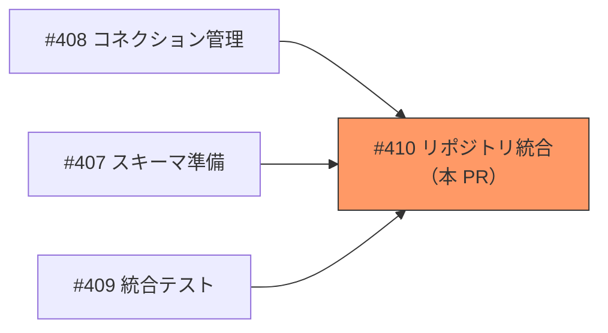
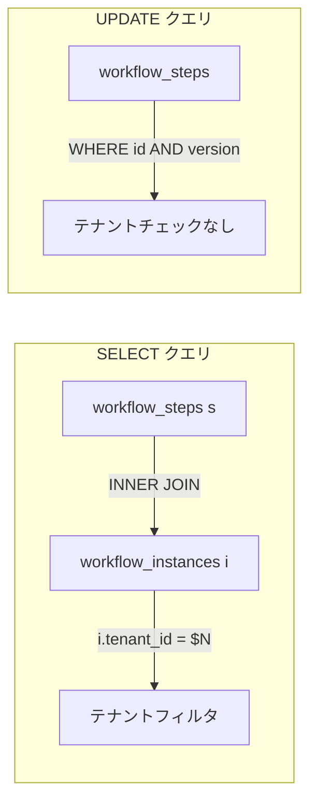
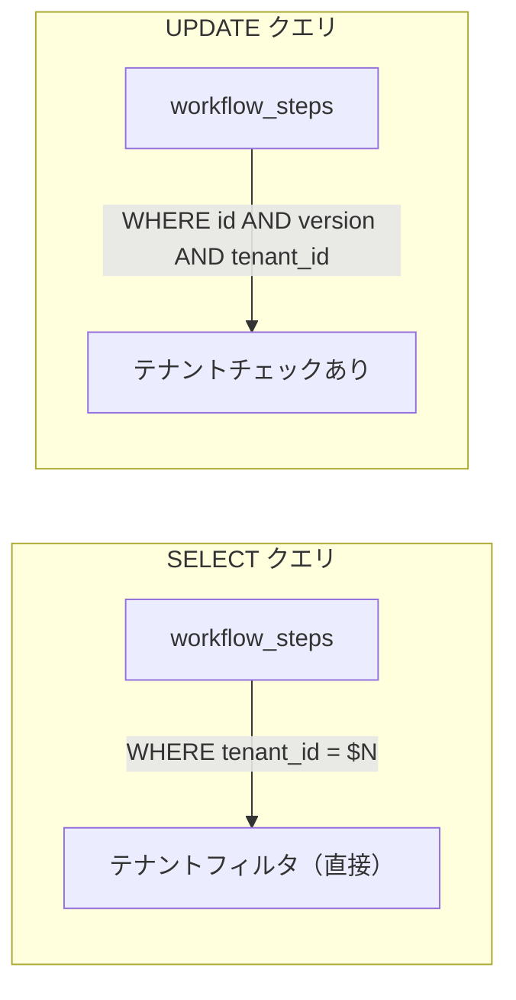

# RLS リポジトリ統合 - 機能解説

対応 PR: [#420](https://github.com/ka2kama/ringiflow/pull/420)
対応 Issue: [#410](https://github.com/ka2kama/ringiflow/issues/410)
親 Epic: [#402 Phase 2-1: マルチテナント RLS](https://github.com/ka2kama/ringiflow/issues/402)

## 概要

[#407（スキーマ準備）](./01_スキーマ準備_機能解説.md)で `workflow_steps` と `user_roles` に追加された `tenant_id` カラムを、既存リポジトリのクエリで活用するよう更新した。これにより、RLS 二重防御のアプリケーション層が全クエリで完成する。

## 背景

### 二重防御の完成

[基本設計書 7.1.3](../../30_基本設計書/03_インフラとDB設計.md) で定義された二重防御アーキテクチャの全レイヤーが本 PR で完成する。

| 防御層 | 手段 | 状態 |
|-------|------|------|
| **アプリケーション層** | **`WHERE tenant_id = $N`（本 PR で全クエリ対応）** | **本 PR で完成** |
| DB 層ガードレール（配管） | `TenantConnection` + `after_release` フック | [#412](./03_コネクション管理_機能解説.md) で実装済み |
| DB 層ガードレール（ポリシー） | RLS ポリシー + tenant_id カラム | [#413](./01_スキーマ準備_機能解説.md) で実装済み |

### Epic #402 における位置づけ

本 PR は Epic #402 の最終 Story。前提となる Story 1-3 がすべて完了した上で実施する。

| Story | 内容 | 状態 |
|-------|------|------|
| #408 コネクション管理 | `TenantConnection` + `after_release` フック | 完了 |
| #407 スキーマ準備 | `tenant_id` カラム追加 + RLS ポリシー | 完了 |
| #409 統合テスト | クロステナントアクセス防止テスト | 完了 |
| **#410 リポジトリ統合** | **既存クエリの tenant_id 対応** | **本 PR** |

### 変更前の課題

`workflow_steps` に `tenant_id` カラムが追加されたにもかかわらず、SELECT クエリは依然として `workflow_instances` との JOIN でテナントフィルタを行っていた。また `update_with_version_check` にはテナントチェックがなく、`user_roles` のクエリにも `tenant_id` フィルタが欠如していた。

## 用語・概念

| 用語 | 説明 | 関連コード |
|------|------|-----------|
| 二重防御 | アプリケーション層（WHERE）と DB 層（RLS ポリシー）の両方でテナント分離を保証する方式 | 全リポジトリクエリ |
| 楽観的ロック | `version` カラムで同時更新を検出する仕組み | `update_with_version_check` |
| RLS 二重防御用パラメータ | リポジトリメソッドの `tenant_id` 引数。ドメインモデルではなくインフラ層で管理する | `WorkflowStepRepository` トレイト |

## ビフォー・アフター

### Before（変更前）

SELECT クエリは `workflow_instances` テーブルとの JOIN を介してテナントフィルタを行っていた。UPDATE にはテナントチェックがなかった。

制約・課題:
- JOIN が不要なオーバーヘッド（`workflow_steps` に `tenant_id` カラムがある）
- `workflow_instance_repository` との一貫性がない
- UPDATE でクロステナント更新が理論上可能
- `user_roles` クエリにテナントフィルタがない

### After（変更後）

全クエリが直接 `tenant_id` カラムを参照する。

改善点:
- JOIN 不要でクエリがシンプルに
- `workflow_instance_repository` と一貫したパターン
- 全クエリ（INSERT, SELECT, UPDATE）でテナント分離を保証

## 設計判断

機能・仕組みレベルの判断を記載する。コード実装レベルの判断は[コード解説](./08_リポジトリ統合_コード解説.md#設計解説)を参照。

### 1. SELECT クエリのテナントフィルタをどうするか

`workflow_steps` に `tenant_id` カラムが追加されたことで、テナントフィルタの方式を選択する必要があった。

| 案 | シンプルさ | パフォーマンス | 一貫性 |
|----|----------|--------------|--------|
| **直接カラム参照（採用）** | JOIN 不要 | JOIN コスト削減 | `workflow_instance_repository` と統一 |
| JOIN 維持 | JOIN が残る | 追加テーブルスキャン | 不統一 |

**採用理由**: JOIN は `tenant_id` カラムがなかった時代のワークアラウンド。カラム追加後は直接参照がシンプルかつ一貫。

### 2. `find_with_roles` のシグネチャをどうするか

`user_roles` クエリに `tenant_id` フィルタを追加する際、引数で渡すか内部で取得するかの選択。

| 案 | 呼び出し元への影響 | Mock 変更 | 安全性 |
|----|------------------|-----------|--------|
| **内部で `user.tenant_id()` 使用（採用）** | なし | なし | ユーザーに紐づくテナントを使用 |
| 引数に `tenant_id` 追加 | auth.rs ハンドラの変更必要 | 変更必要 | 外部から指定（冗長） |

**採用理由**: `find_with_roles` は内部で `find_by_id` → `user` を取得済み。`user.tenant_id()` が利用可能で、呼び出し元（auth.rs ハンドラ）に `tenant_id` がないため、シグネチャ変更なしが最適。

## 関連ドキュメント

- [コード解説](./08_リポジトリ統合_コード解説.md)
- [RLS スキーマ準備 - 機能解説](./01_スキーマ準備_機能解説.md)
- [RLS コネクション管理 - 機能解説](./03_コネクション管理_機能解説.md)
- [RLS 統合テスト - 機能解説](./05_統合テスト_機能解説.md)
