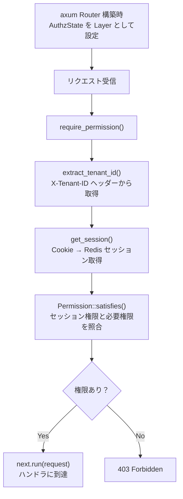
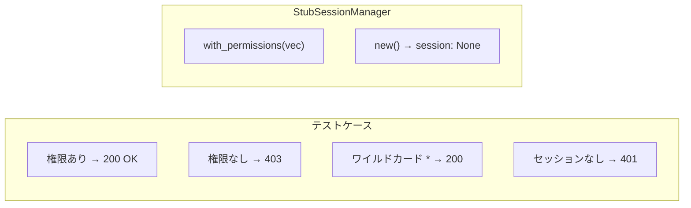

# RBAC 認可ミドルウェア コード解説

対応 PR: #426
対応 Issue: #403 (Epic), #428 (Story)

## 主要な型・関数

| 型/関数 | ファイル | 責務 |
|--------|---------|------|
| `Permission` | `backend/crates/domain/src/role.rs:88` | 権限の値オブジェクト。`resource:action` 形式 |
| `Permission::satisfies()` | `backend/crates/domain/src/role.rs:117` | 保持権限が要求権限を満たすか判定 |
| `AuthzState` | `backend/apps/bff/src/middleware/authz.rs:37` | 認可ミドルウェアの State。SessionManager + 必要権限 |
| `require_permission()` | `backend/apps/bff/src/middleware/authz.rs:47` | 認可ミドルウェア関数 |
| `Role` | `backend/crates/domain/src/role.rs:143` | ロールエンティティ。権限の集合 |

## コードフロー



## コード解説

### Permission 値オブジェクト

```rust
// backend/crates/domain/src/role.rs:88-131

pub struct Permission(String);

impl Permission {
    pub fn satisfies(&self, required: &Permission) -> bool {
        let held = self.as_str();
        let req = required.as_str();

        // 1. 全権限ワイルドカード
        if held == "*" {
            return true;
        }

        // 2. リソース内ワイルドカード
        if let Some(resource) = held.strip_suffix(":*") {
            return req.starts_with(&format!("{resource}:"));
        }

        // 3. 完全一致
        held == req
    }
}
```

注目ポイント:

1. `strip_suffix(":*")` で Rust の文字列操作を活用。正規表現を使わずシンプルかつ高速に判定
2. 3 段階の fallthrough 設計: ワイルドカード（最も広い）→ リソースワイルドカード → 完全一致（最も狭い）
3. 引数は `&Permission` 型で型安全。文字列を直接渡せない

### axum ミドルウェアの適用パターン

```rust
// backend/apps/bff/src/middleware/authz.rs:37-40

#[derive(Clone)]
pub struct AuthzState {
    pub session_manager:     Arc<dyn SessionManager>,
    pub required_permission: String,
}
```

```rust
// ルーター構築時の適用例（概念）
let authz_state = AuthzState {
    session_manager: session_manager.clone(),
    required_permission: "user:read".to_string(),
};

Router::new()
    .route("/api/admin/users", get(list_users))
    .layer(from_fn_with_state(authz_state, require_permission))
```

注目ポイント:

1. `from_fn_with_state` で State を渡す axum パターン。各エンドポイントグループに異なる `required_permission` を設定可能
2. `Arc<dyn SessionManager>` で SessionManager をトレイトオブジェクトとして共有。テストではスタブに差し替え可能

### 認可チェック本体

```rust
// backend/apps/bff/src/middleware/authz.rs:47-77

pub async fn require_permission(
    State(state): State<AuthzState>,
    jar: CookieJar,
    request: Request<Body>,
    next: Next,
) -> Response {
    // テナント ID を取得
    let tenant_id = match extract_tenant_id(request.headers()) {
        Ok(id) => id,
        Err(e) => return e.into_response(),
    };

    // セッションを取得
    let session = match get_session(state.session_manager.as_ref(), &jar, tenant_id).await {
        Ok(s) => s,
        Err(response) => return response,
    };

    // 権限チェック
    let required = Permission::new(&state.required_permission);
    let has_permission = session
        .permissions()
        .iter()
        .any(|p| Permission::new(p).satisfies(&required));

    if !has_permission {
        return forbidden_response("この操作を実行する権限がありません");
    }

    next.run(request).await
}
```

注目ポイント:

1. `Iterator::any()` で短絡評価。最初にマッチする権限が見つかれば残りはスキップ
2. `next.run(request).await` が axum ミドルウェアの「次に進む」パターン。ここに到達 = 認可成功

## テスト



| テスト | 検証内容 | ファイル |
|--------|---------|---------|
| `test_権限を持つユーザーはリクエストが通過する` | 正常系: 必要権限を保持 | `authz.rs:210` |
| `test_権限を持たないユーザーは403を返す` | 異なる権限でアクセス | `authz.rs:233` |
| `test_ワイルドカード権限は任意のリクエストを通過させる` | `*` 権限の検証 | `authz.rs:256` |
| `test_セッションなしは401を返す` | 未認証アクセス | `authz.rs:279` |

### テストパターン

```rust
// StubSessionManager で依存を分離
struct StubSessionManager {
    session: Option<SessionData>,
}

impl StubSessionManager {
    fn with_permissions(permissions: Vec<String>) -> Self { /* ... */ }
}
```

`tower::ServiceExt::oneshot()` で Router を直接テスト。HTTP サーバーを起動せずにリクエスト/レスポンスのサイクルを検証する。

## 設計解説

### なぜ Permission は独自の satisfies メソッドを持つか

Permission のマッチングロジックをドメイン層に置くことで、以下を実現している:

1. ドメインロジックの凝集: 「権限が満たされるか」はビジネスルール。インフラ層やハンドラ層に漏れない
2. テスト容易性: Permission 単体でユニットテスト可能。ミドルウェアの統合テストとは独立
3. 拡張性: 将来の権限モデル拡張（条件付き権限等）が Permission クラス内に閉じる

### なぜシステムロールは tenant_id を持たないか

| 案 | メリット | デメリット | 判断 |
|----|---------|-----------|------|
| `tenant_id = None`（採用） | テナント間で共有、DB シードで一括管理 | NULL 処理が必要 |  |
| 各テナントにコピー | テナント完結 | データ重複、シードスクリプトの複雑化 |  |

システムロールは変更不可のため、テナント間で共有しても問題ない。`is_system` フラグとの組み合わせで不変条件を明確にしている。

## 関連ドキュメント

- [ドメインモデル: role.rs](../../../backend/crates/domain/src/role.rs)
- [ミドルウェア: authz.rs](../../../backend/apps/bff/src/middleware/authz.rs)
