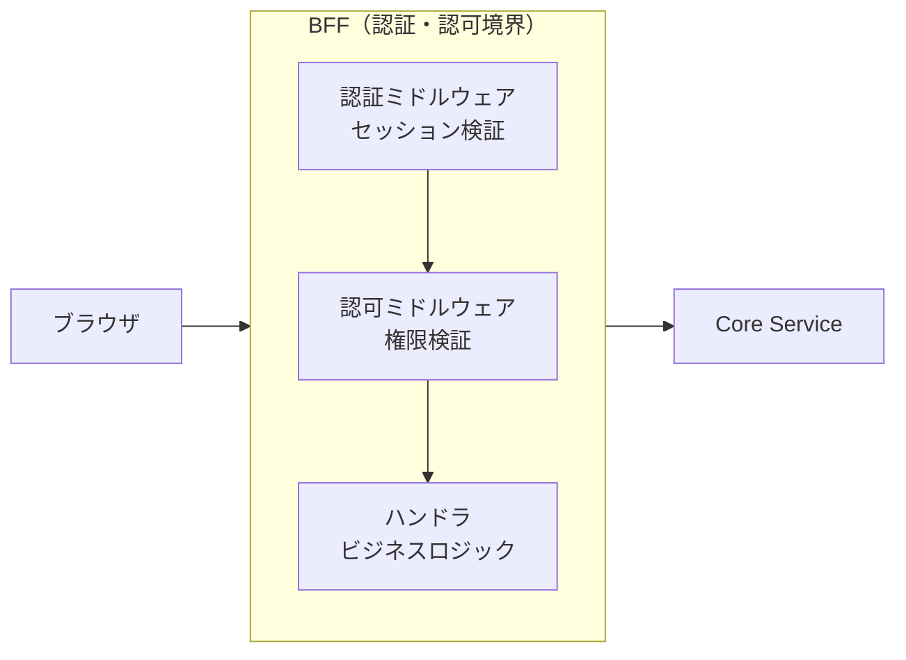
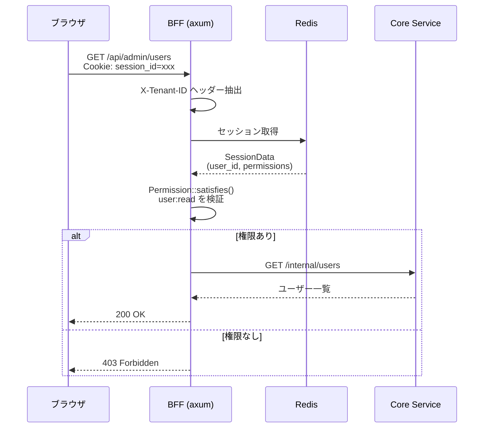

# RBAC 認可ミドルウェア 機能解説

対応 PR: #426
対応 Issue: #403 (Epic), #428 (Story)

## 概要

テナント管理画面のエンドポイントに対して、ロールベースアクセス制御（RBAC: Role-Based Access Control）を導入した。axum のミドルウェアとして実装し、セッション内の権限情報に基づいてリクエストを許可または拒否する。

## 背景

### 解決する課題

Phase 2-1 までの認証・認可は、セッションの有無による認証チェックのみで、「ログインしていれば全操作が可能」な状態だった。テナント管理画面ではユーザー作成やロール変更といった特権操作を提供するため、権限に基づくアクセス制御が必要になった。

### 要件

- AUTHZ-001: RBAC（役割ベースアクセス制御）。ユーザーにロールを割り当て、ロールに紐づく権限で操作を制御する
- 管理者のみがテナント管理 API にアクセスできること
- 権限の粒度は `リソース:アクション` 形式（例: `user:read`, `role:create`）

## 用語・概念

| 用語 | 定義 | 例 |
|------|------|-----|
| Permission（権限） | `リソース:アクション` 形式の文字列 | `user:read`, `workflow:create` |
| Role（ロール） | 権限の集合。ユーザーに割り当てる | `admin`（全権限）, `user`（一般） |
| System Role | 全テナント共通のロール。変更・削除不可 | `admin`, `user` |
| Custom Role | テナント固有のロール。テナント管理者が作成 | `reviewer`, `auditor` |
| ワイルドカード権限 | すべてのリソース・アクションを許可 | `*`（全権限）, `user:*`（user 全アクション） |

## アーキテクチャ

### 認可の位置づけ



認証（Authentication）と認可（Authorization）はどちらも BFF レイヤーで実施する。Core Service は内部通信のため、認証・認可を持たない。

### 権限マッチングモデル

```mermaid
flowchart TD
    A["保持権限を1つずつ確認"] --> B{"`*` か？"}
    B -->|Yes| C["全権限 → 許可"]
    B -->|No| D{"`resource:*` 形式か？"}
    D -->|Yes| E{"要求権限が<br/>同一リソースか？"}
    E -->|Yes| F["リソース内全許可"]
    E -->|No| G["不一致"]
    D -->|No| H{"完全一致か？"}
    H -->|Yes| I["許可"]
    H -->|No| J["次の権限を確認"]
    J --> K{"全権限を<br/>確認済みか？"}
    K -->|Yes| L["拒否（403）"]
    K -->|No| A
```

## データフロー

### 認可チェックのシーケンス



## 設計判断

### 1. ミドルウェアか、ハンドラ内での検証か

| 案 | メリット | デメリット | 判断 |
|----|---------|-----------|------|
| ミドルウェア（採用） | ハンドラコードがクリーン、DRY、一箇所で変更可能 | ミドルウェア合成の複雑さ、エンドポイントごとの State 管理 |  |
| ハンドラ内 | 柔軟性が高い、コンテキスト依存の権限チェックが容易 | 各ハンドラに散在、チェック漏れのリスク |  |

採用理由: テナント管理の権限チェックは「エンドポイント = 必要権限」の単純な対応関係であり、ミドルウェアの横断的関心事としての抽象化が適切。ハンドラ内検証は将来の細かな権限制御（リソース所有者チェック等）が必要になったときに追加できる。

### 2. 権限モデルの粒度

| 案 | メリット | デメリット | 判断 |
|----|---------|-----------|------|
| `resource:action`（採用） | 直感的、一般的な RBAC パターン | 粒度が固定的 |  |
| 階層型 (`tenant.admin.user.read`) | きめ細かい制御 | 複雑性が高い、現時点で不要 |  |
| ビット演算 | 高速 | 可読性が低い、権限数に上限 |  |

採用理由: AWS IAM の `service:action` パターンに倣った。ワイルドカード（`*`, `resource:*`）により柔軟性を確保しつつ、シンプルさを維持。

### 3. セッションに権限を格納する方式

セッション作成時にロールの権限を展開してセッションデータに格納する。リクエスト毎にロール → 権限の解決を行わない。

| 案 | メリット | デメリット | 判断 |
|----|---------|-----------|------|
| セッション格納（採用） | 高速、DB アクセス不要 | ロール変更が即時反映されない |  |
| リクエスト毎解決 | 即時反映 | DB アクセスが毎リクエスト発生 |  |

採用理由: ロール変更の即時反映は、セッション TTL（8 時間）で十分許容可能。パフォーマンスを優先した。

## 関連ドキュメント

- [要件定義書: 認可要件 AUTHZ-001](../../10_要件定義書/)
- ADR-006: 認証認可アーキテクチャ（未作成）
- [基本設計書: アーキテクチャ概要](../../30_基本設計書/00_アーキテクチャ概要.md)
