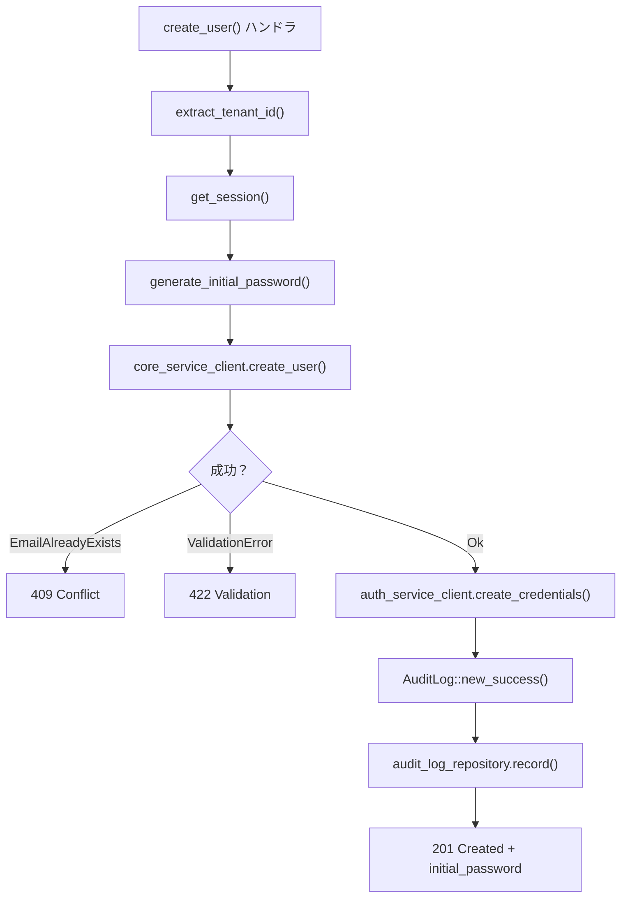

# ユーザー・ロール管理 API コード解説

対応 PR: #426
対応 Issue: #403 (Epic), #428 (Story: ユーザー管理), #429 (Story: ロール管理)

## 主要な型・関数

### ドメイン層

| 型/関数 | ファイル | 責務 |
|--------|---------|------|
| `User` | `backend/crates/domain/src/user.rs:199` | ユーザーエンティティ。不変更新メソッド付き |
| `User::with_status()` | `backend/crates/domain/src/user.rs:345` | ステータス変更。不変更新パターン |
| `UserStatus` | `backend/crates/domain/src/user.rs:157` | Active / Inactive / Deleted の3状態 |
| `Email` | `backend/crates/domain/src/user.rs:92` | メールアドレス値オブジェクト。バリデーション付き |
| `Role` | `backend/crates/domain/src/role.rs:143` | ロールエンティティ。system/tenant の区別 |
| `Role::with_name()` | `backend/crates/domain/src/role.rs:275` | 名前の不変更新 |
| `Role::with_permissions()` | `backend/crates/domain/src/role.rs:293` | 権限の不変更新 |

### BFF 層

| 型/関数 | ファイル | 責務 |
|--------|---------|------|
| `UserState` | `backend/apps/bff/src/handler/user.rs:47` | ユーザー API の共有状態 |
| `create_user()` | `backend/apps/bff/src/handler/user.rs:216` | ユーザー作成ハンドラ |
| `update_user_status()` | `backend/apps/bff/src/handler/user.rs:455` | ステータス変更ハンドラ |
| `RoleState` | `backend/apps/bff/src/handler/role.rs:46` | ロール API の共有状態 |
| `create_role()` | `backend/apps/bff/src/handler/role.rs:190` | ロール作成ハンドラ |
| `delete_role()` | `backend/apps/bff/src/handler/role.rs:332` | ロール削除ハンドラ |

## コードフロー

### ユーザー作成の全体フロー



## コード解説

### ドメインエンティティの不変更新パターン

User と Role は Rust の所有権を活用した不変更新パターンを採用している:

```rust
// backend/crates/domain/src/user.rs:345-351

pub fn with_status(self, status: UserStatus, now: DateTime<Utc>) -> Self {
    Self {
        status,
        updated_at: now,
        ..self  // 残りのフィールドは元の値を移動
    }
}
```

注目ポイント:

1. `self`（値渡し）で所有権を消費。元のインスタンスは使えなくなる → 旧状態の誤使用を防止
2. `..self` で変更しないフィールドを移動。追加フィールド時にコンパイラが漏れを検出
3. `now` を外部から注入。テストでの時刻制御が容易

Role も同じパターン:

```rust
// backend/crates/domain/src/role.rs:275-280

pub fn with_name(self, name: String, now: DateTime<Utc>) -> Self {
    Self {
        name,
        updated_at: now,
        ..self
    }
}
```

### BFF ハンドラの State パターン

各リソースグループに専用の State 構造体を定義:

```rust
// backend/apps/bff/src/handler/user.rs:47-52

pub struct UserState {
    pub core_service_client:  Arc<dyn CoreServiceUserClient>,
    pub auth_service_client:  Arc<dyn AuthServiceClient>,
    pub session_manager:      Arc<dyn SessionManager>,
    pub audit_log_repository: Arc<dyn AuditLogRepository>,
}
```

```rust
// backend/apps/bff/src/handler/role.rs:46-50

pub struct RoleState {
    pub core_service_client:  Arc<dyn CoreServiceRoleClient>,
    pub session_manager:      Arc<dyn SessionManager>,
    pub audit_log_repository: Arc<dyn AuditLogRepository>,
}
```

注目ポイント:

1. `Arc<dyn Trait>` でトレイトオブジェクトを共有。具象型に依存しないため、テスト時のモック差し替えが容易
2. 各 State は必要な依存のみを持つ。UserState は AuthServiceClient を持つが、RoleState は持たない（認証情報操作が不要）
3. CoreServiceClient は `CoreServiceUserClient` / `CoreServiceRoleClient` にトレイト分割。インターフェース分離の原則（ISP）

### ユーザー作成と監査ログ記録の統合

```rust
// backend/apps/bff/src/handler/user.rs:277-294

// 監査ログ記録
let audit_log = AuditLog::new_success(
    session_data.tenant_id().clone(),
    session_data.user_id().clone(),
    session_data.name().to_string(),
    AuditAction::UserCreate,
    "user",
    user_data.id.to_string(),
    Some(serde_json::json!({
        "email": &user_data.email,
        "name": &user_data.name,
        "role": &user_data.role,
    })),
    None,
);
if let Err(e) = state.audit_log_repository.record(&audit_log).await {
    tracing::error!("監査ログ記録に失敗: {}", e);
}
```

注目ポイント:

1. 監査ログは操作成功後に記録。失敗操作の監査は現スコープ外
2. 監査ログ記録の失敗はログ出力のみで握り潰す。ユーザー操作自体は成功しているため、監査ログ失敗でロールバックしない（Fire-and-forget パターン）
3. `serde_json::json!()` マクロで操作詳細を構造化データとして記録

### ステータス変更時の監査アクション振り分け

```rust
// backend/apps/bff/src/handler/user.rs:506-511

// 監査ログ記録: ステータスに応じて Deactivate / Activate を使い分ける
let action = if user.status == "inactive" {
    AuditAction::UserDeactivate
} else {
    AuditAction::UserActivate
};
```

`UserUpdate` ではなく `UserDeactivate` / `UserActivate` を使い分けることで、監査ログの検索・フィルタで「無効化操作」だけを抽出できる。

### ロール削除の CoreServiceError ハンドリング

```rust
// backend/apps/bff/src/handler/role.rs:348-378

match state.core_service_client.delete_role(role_id).await {
    Ok(()) => {
        // 監査ログ記録 + 204 No Content
    }
    Err(CoreServiceError::RoleNotFound) => {
        not_found_response("role-not-found", "Role Not Found", "ロールが見つかりません")
    }
    Err(CoreServiceError::ValidationError(msg)) => validation_error_response(&msg),
    Err(CoreServiceError::Conflict(msg)) => conflict_response(&msg),
    Err(e) => {
        tracing::error!("ロール削除で内部エラー: {}", e);
        internal_error_response()
    }
}
```

注目ポイント:

1. `CoreServiceError` の各バリアントを明示的にマッチ。Core Service の HTTP ステータスを BFF の適切なレスポンスに変換
2. `Conflict` は「ユーザー割り当て中のロール削除」のケース。Core Service で `count_users_with_role > 0` をチェック
3. 削除成功時は `204 No Content`（REST のベストプラクティス）

## テスト

### ドメインモデルのテスト

| テスト | 検証内容 | ファイル |
|--------|---------|---------|
| `test_新規ユーザーはアクティブ状態` | 初期状態の不変条件 | `user.rs:415` |
| `test_ステータス変更後の状態` | 不変更新で正しいフィールドが変更される | `user.rs:439` |
| `test_削除されたユーザーはログインできない` | ビジネスルール | `user.rs:487` |
| `test_システムロールはテナントidを持たない` | 不変条件 | `role.rs:402` |
| `test_with_permissionsで権限とupdated_atが更新される` | 不変更新パターン | `role.rs:544` |

テストは rstest フィクスチャを活用し、テストデータの準備を共通化している:

```rust
// backend/crates/domain/src/user.rs:374-389

#[fixture]
fn active_user(now: DateTime<Utc>) -> User {
    User::new(
        UserId::new(),
        TenantId::new(),
        DisplayNumber::new(42).unwrap(),
        Email::new("user@example.com").unwrap(),
        UserName::new("Test User").unwrap(),
        now,
    )
}
```

## 設計解説

### なぜ User エンティティは `from_db` コンストラクタを持つか

| 案 | メリット | デメリット | 判断 |
|----|---------|-----------|------|
| `from_db`（採用） | DB 復元時にバリデーションをスキップ | API が増える |  |
| `new` のみ | API がシンプル | DB の既存データに対してバリデーションが走る |  |

DB に格納済みのデータはバリデーション通過済みであり、復元時に再検証は不要。`new` は生成時の不変条件（status = Active, last_login_at = None）を強制するため、DB 復元には使えない。

### なぜ BFF で display_number → UUID の解決を行うか

Core Service の内部 API は UUID ベースだが、公開 API は display_number を使う。この変換は BFF の責務とした。

理由: Core Service は「データの正しさ」に集中し、「表示の便利さ」は BFF が担う。display_number は UI の関心事であり、ドメインモデルの識別子（UUID）とは別の概念。

## 関連ドキュメント

- [ドメインモデル: user.rs](../../../backend/crates/domain/src/user.rs)
- [ドメインモデル: role.rs](../../../backend/crates/domain/src/role.rs)
- [BFF ハンドラ: user.rs](../../../backend/apps/bff/src/handler/user.rs)
- [BFF ハンドラ: role.rs](../../../backend/apps/bff/src/handler/role.rs)
