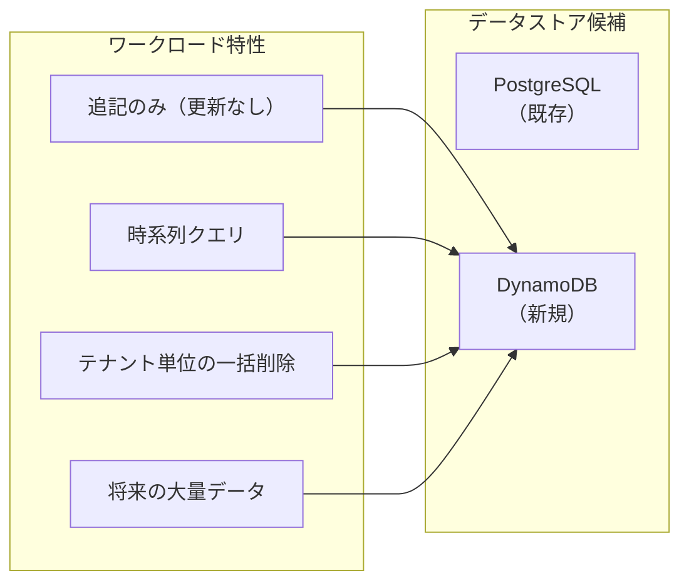
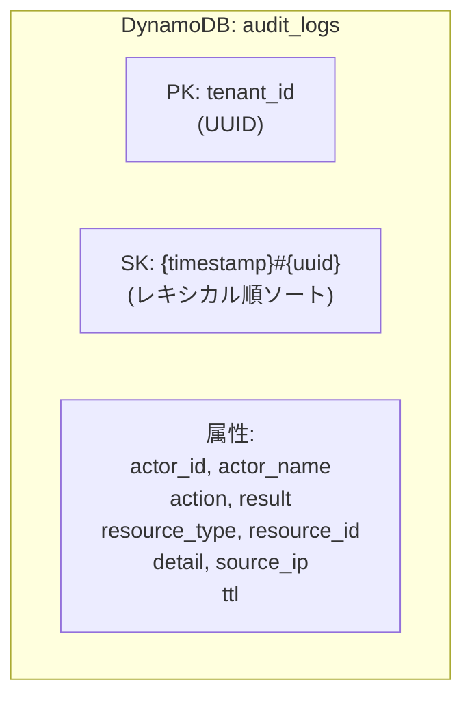
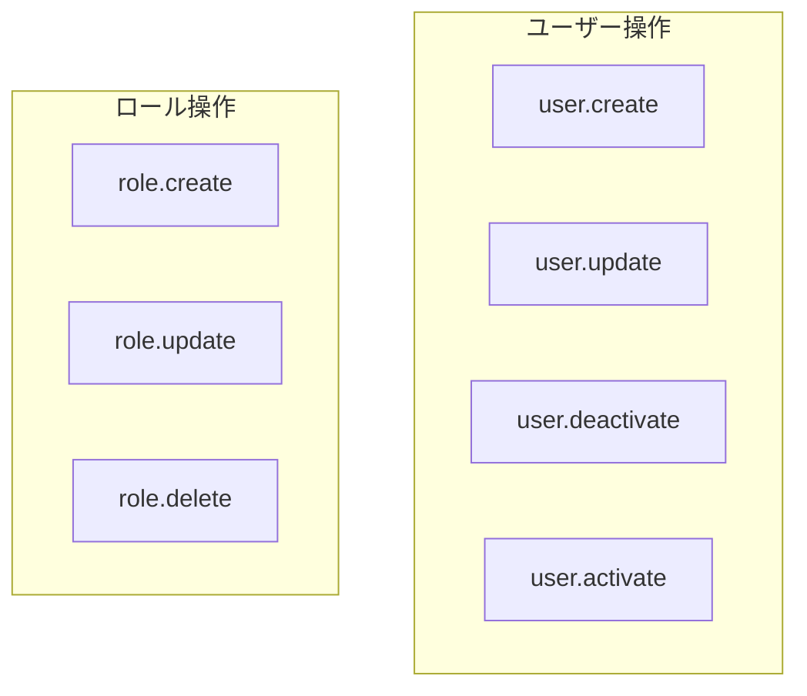
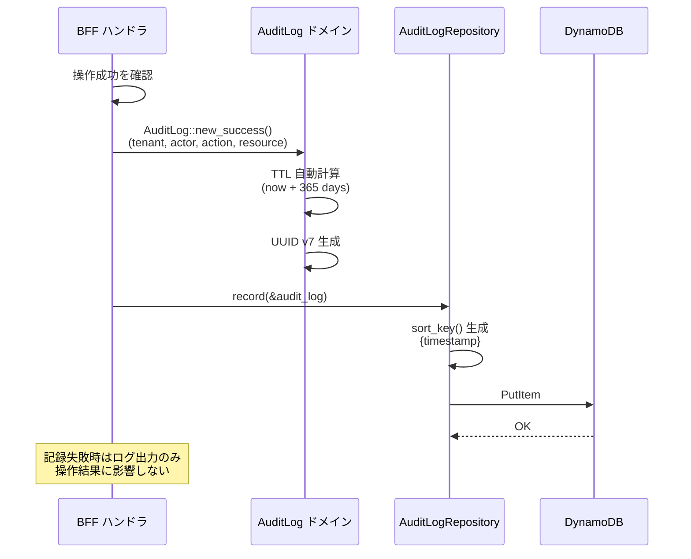
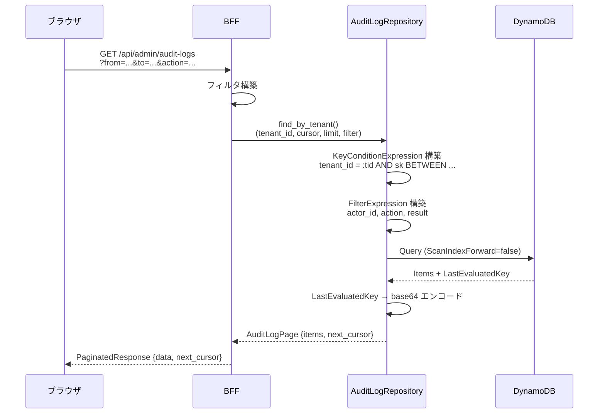

# DynamoDB 監査ログ基盤 機能解説

対応 PR: #426
対応 Issue: #403 (Epic), #430 (Story)

## 概要

ユーザー操作の監査証跡を DynamoDB に記録・閲覧する基盤を構築した。テナント管理者によるユーザー管理・ロール管理の操作を追跡し、セキュリティ監査とコンプライアンスに対応する。

## 背景

### 解決する課題

テナント管理操作（ユーザー作成、ロール変更等）は、セキュリティ上の追跡が必須。「誰が・いつ・何を・どうしたか」を記録し、テナント管理者が一覧・検索できる仕組みが必要になった。

### なぜ DynamoDB か



| 観点 | PostgreSQL | DynamoDB |
|------|-----------|----------|
| 追記型ワークロード | 可能だがテーブル肥大化 | 設計思想が合致 |
| 時系列クエリ | インデックスが必要 | Sort Key で自然にソート |
| テナント退会時の一括削除 | RLS + DELETE | Partition Key 指定で効率的 |
| スケーラビリティ | 垂直スケール | 水平スケール（自動） |
| 運用コスト | 既存で追加コストなし | 新規サービスの運用コスト |
| TTL（自動削除） | cron ジョブが必要 | ネイティブサポート |

採用理由: 監査ログの追記のみ・時系列・テナント分離というワークロード特性が DynamoDB の設計思想と合致。TTL によるデータのライフサイクル管理も容易。

## 用語・概念

| 用語 | 定義 |
|------|------|
| Partition Key (PK) | DynamoDB テーブルのパーティション分割キー。`tenant_id` を使用 |
| Sort Key (SK) | パーティション内のソートキー。`{timestamp}#{uuid}` 形式 |
| TTL | Time To Live。自動削除までの期間。作成から 365 日 |
| カーソルページネーション | `LastEvaluatedKey` をエンコードした opaque トークンで次ページを取得 |
| AuditAction | 監査対象の操作種別。`resource.action` 形式 |

## アーキテクチャ

### データモデル



### テーブル設計

| 属性 | 型 | 説明 |
|------|-----|------|
| `tenant_id` (PK) | String | テナント ID（UUID） |
| `sk` (SK) | String | `{ISO8601}#{uuid}` |
| `actor_id` | String | 操作者 ID |
| `actor_name` | String | 操作者名（非正規化） |
| `action` | String | `user.create` 等 |
| `result` | String | `success` / `failure` |
| `resource_type` | String | `user` / `role` |
| `resource_id` | String | 対象リソースの ID |
| `detail` | String (JSON) | 操作詳細 |
| `source_ip` | String | リクエスト元 IP |
| `ttl` | Number | 自動削除タイムスタンプ（epoch seconds） |

### アクション体系



## データフロー

### 監査ログ記録



### 監査ログ検索



## 設計判断

### 1. Sort Key の設計: `{timestamp}#{uuid}`

| 案 | メリット | デメリット | 判断 |
|----|---------|-----------|------|
| `{timestamp}#{uuid}`（採用） | 時系列ソート + 一意性保証 | SK がやや長い |  |
| UUID のみ | シンプル | 時系列ソートに別インデックスが必要 |  |
| タイムスタンプのみ | シンプル | 同一ミリ秒で衝突のリスク |  |

ISO 8601 形式のタイムスタンプはレキシカル順でソート可能であり、DynamoDB の SK ソートと自然に整合する。UUID サフィックスで同一ミリ秒のエントリでも一意性を保証する。

### 2. カーソルページネーション

| 案 | メリット | デメリット | 判断 |
|----|---------|-----------|------|
| カーソル（採用） | 一貫したページング、大量データでも性能劣化なし | 「前のページ」が複雑 |  |
| オフセット | 実装がシンプル | データ変動時にずれる、大量データでの性能劣化 |  |

DynamoDB の `LastEvaluatedKey` がカーソルとして自然に機能する。初期スコープでは「次のページ」のみをサポートし、前ページ機能は将来課題とした。

### 3. actor_name の非正規化

監査ログに `actor_name` を直接格納し、ユーザーテーブルとの JOIN を不要にした。

理由: 監査ログは「その時点の事実」を記録するもの。ユーザー名が後から変更されても、操作時点の名前で記録されるべき。また、DynamoDB と PostgreSQL の JOIN は技術的に不可能であり、アプリケーション側での結合は性能・複雑さの観点で避けた。

### 4. 監査ログ記録の失敗ハンドリング

```
if let Err(e) = state.audit_log_repository.record(&audit_log).await {
    tracing::error!("監査ログ記録に失敗: {}", e);
}
```

操作自体は成功しているため、監査ログの記録失敗で操作をロールバックしない。これは可用性を優先した判断であり、監査ログの完全性は運用監視（ログアラート）で補完する。

## 関連ドキュメント

- [基本設計書: アーキテクチャ概要](../../30_基本設計書/00_アーキテクチャ概要.md)
- [OpenAPI 仕様: 監査ログ API](../../../openapi/openapi.yaml)
- [ナレッジベース: DynamoDB](../../80_ナレッジベース/)
