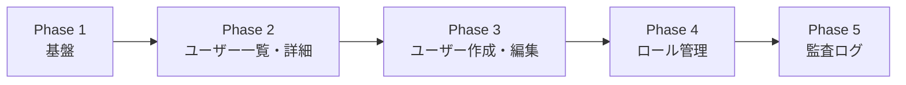
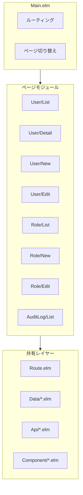
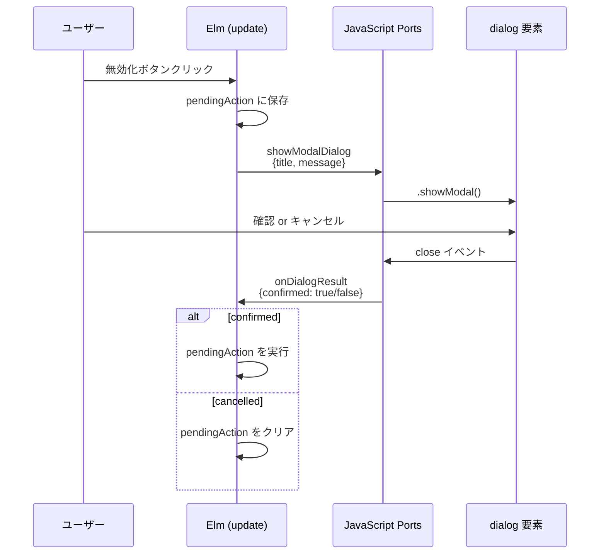
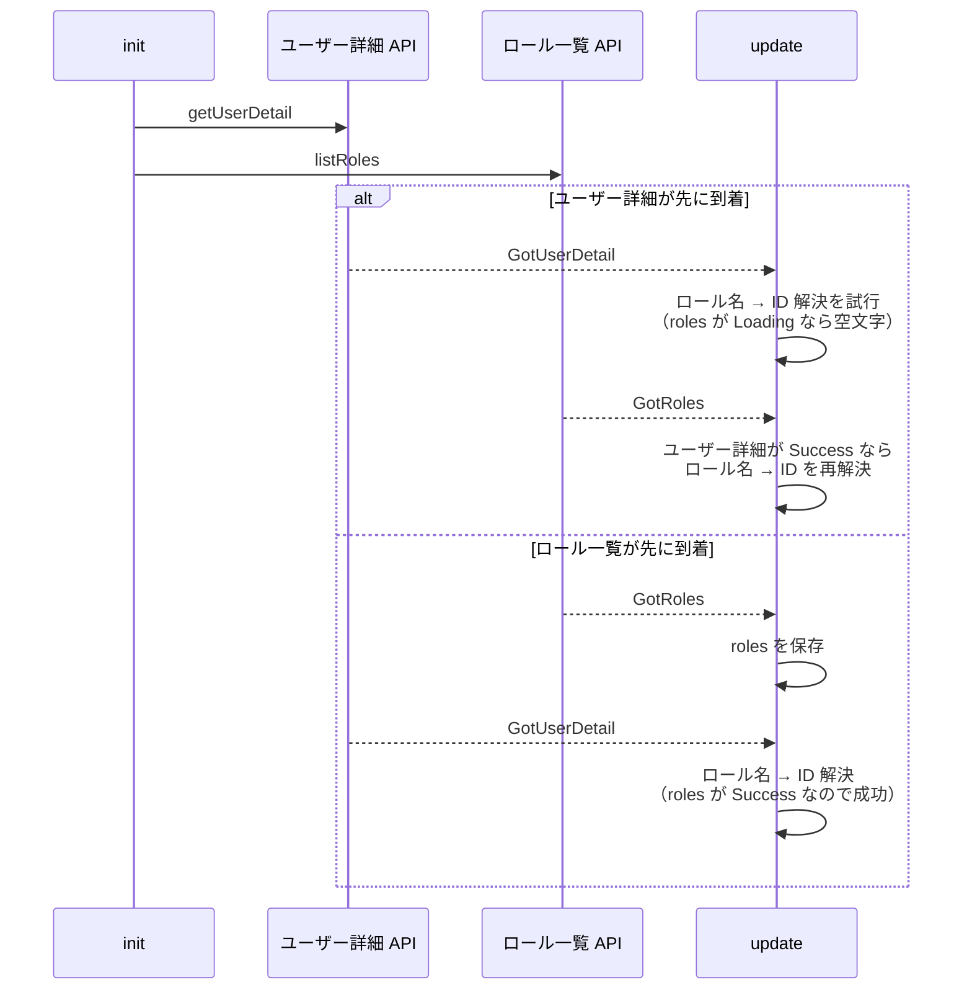

# フロントエンド管理画面 機能解説

対応 PR: #426
対応 Issue: #403 (Epic), #431 (Story)

## 概要

ユーザー管理・ロール管理・監査ログ閲覧のフロントエンド画面（Elm）を実装した。TEA（The Elm Architecture）のネストパターンを採用し、ページモジュールの独立性を保ちながら 15 個の新規ファイルを追加した。

## 背景

### 解決する課題

Phase 2-2 のバックエンド API（Story #428-430）に対応する管理 UI が必要。テナント管理者がブラウザから操作できる画面を、Elm の型安全性とアーキテクチャの恩恵を受けつつ構築する。

### 構成

5 Phase に分けて段階的に構築:



| Phase | 画面 | 主要パターン |
|-------|------|-------------|
| 1 | Route, Data, Api, Shared, サイドバー | 基盤モジュール |
| 2 | ユーザー一覧・詳細 | RemoteData, ConfirmDialog |
| 3 | ユーザー作成・編集 | フォーム, dirty tracking, 並行取得 |
| 4 | ロール管理 | PermissionMatrix コンポーネント |
| 5 | 監査ログ一覧 | カーソルページネーション, アコーディオン |

## 用語・概念

| 用語 | 定義 |
|------|------|
| TEA | The Elm Architecture。Model-Update-View のサイクル |
| RemoteData | `NotAsked \| Loading \| Failure e \| Success a`。非同期データの4状態 |
| ConfirmDialog | 確認ダイアログ。`pendingAction` → Ports → confirm/cancel |
| dirty tracking | フォームの未保存変更を追跡し、ページ離脱時に警告 |
| PermissionMatrix | リソース × アクションのチェックボックスグリッド |

## アーキテクチャ

### ページモジュール構造



### 各ページモジュールの TEA インターフェース

```
module Page.X.Y exposing (Model, Msg, init, update, updateShared, view)
```

| 関数 | 責務 |
|------|------|
| `init` | 初期 Model と初期 Cmd（API 呼び出し等）を返す |
| `update` | Msg → Model 変換 + 副作用（Cmd） |
| `updateShared` | Shared（グローバル状態）の変更を反映 |
| `view` | Model → Html Msg |

`isDirty` はフォームを持つページ（New, Edit）のみ公開。

## データフロー

### 非同期データの状態管理

```mermaid
statediagram-v2
    [*] --> NotAsked
    NotAsked --> Loading: API 呼び出し開始
    Loading --> Success: API 成功
    Loading --> Failure: API 失敗
    Failure --> Loading: 再試行
    Success --> Loading: リフレッシュ
```

すべてのページで `RemoteData ApiError a` を使って非同期データを管理。4 状態を型で表現することにより、以下のバグを型レベルで防止:

- Loading 中にデータを表示する
- エラー時にスピナーが残る
- 初期状態と Loading を混同する

### ConfirmDialog パターン



### 並行 API 取得とレース条件

ユーザー編集画面では、ユーザー詳細とロール一覧を並行取得する:



どちらが先に到着しても正しく動作するよう、両方の `update` ハンドラでロール名 → ID の解決を試行する。

## 設計判断

### 1. PermissionMatrix を独立コンポーネントにする

| 案 | メリット | デメリット | 判断 |
|----|---------|-----------|------|
| 独立コンポーネント（採用） | Role/New と Role/Edit で再利用 | ファイルが1つ増える |  |
| 各ページにインライン | コンポーネント間の契約が不要 | コード重複 |  |

PermissionMatrix は Role/New と Role/Edit の両方で使用されるため、DRY 原則に従いコンポーネントとして分離した。Config レコード型で設定を注入するパターン。

### 2. dirty tracking の実装方式

| 案 | メリット | デメリット | 判断 |
|----|---------|-----------|------|
| `isDirty_` フラグ + Ports（採用） | シンプル、最初の変更のみ Port 呼び出し | 各フォームで実装が必要 |  |
| グローバル state で管理 | 一元管理 | Shared が肥大化、関心の漏洩 |  |

`markDirty` 関数で初回のみ `Ports.setBeforeUnloadEnabled True` を呼び出し、保存成功時に `clearDirty` で解除。Elm の純粋関数と JavaScript の `beforeunload` イベントを Port で橋渡しする。

### 3. サイドバーの権限制御

管理セクションは `Shared.isAdmin` で条件表示。管理者以外にはメニュー自体を表示しない。

理由: 操作できないメニューを表示しても混乱するだけ。バックエンドの RBAC と組み合わせた多層防御（UI でも非表示、API でも拒否）。

### 4. 監査ログのアコーディオン展開

| 案 | メリット | デメリット | 判断 |
|----|---------|-----------|------|
| アコーディオン（採用） | 一覧と詳細を1画面で確認 | 展開時のレイアウトシフト |  |
| 詳細ページ遷移 | レイアウトが安定 | 画面遷移のオーバーヘッド |  |
| モーダル | ページ構造に影響なし | モーダルのアクセシビリティ対応 |  |

監査ログは「ざっと一覧して気になるものだけ詳細を見る」ユースケースが主。アコーディオンが最も操作効率が高い。

## 関連ドキュメント

- [ナレッジベース: Elm アーキテクチャ](../../80_ナレッジベース/)
- [RBAC 認可ミドルウェア 機能解説](01_RBAC認可ミドルウェア_機能解説.md)
- [ユーザー・ロール管理 API 機能解説](02_ユーザー・ロール管理API_機能解説.md)
