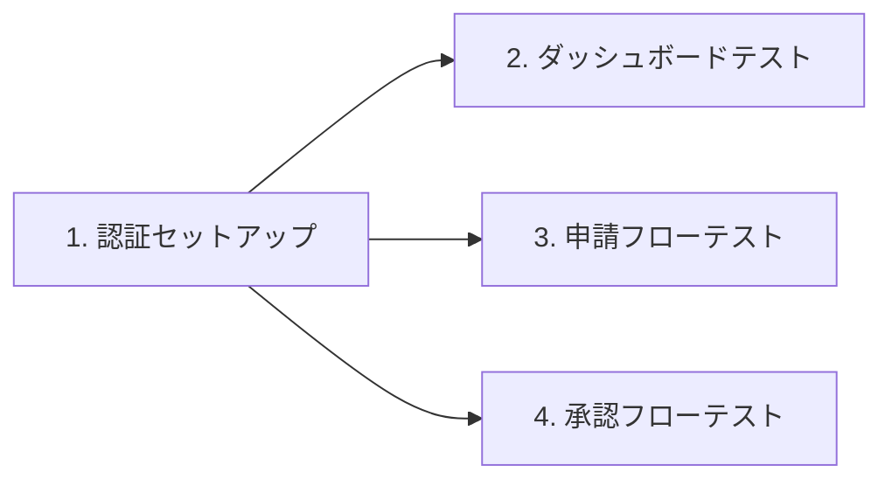
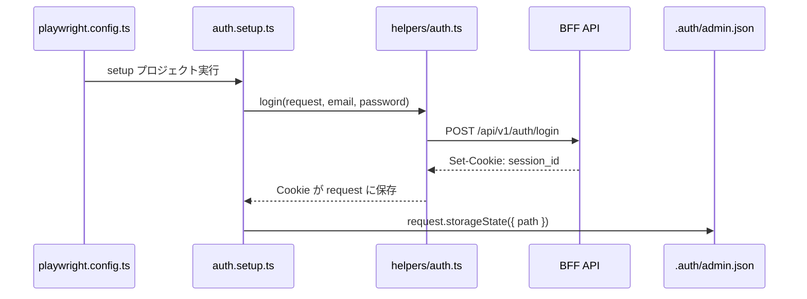
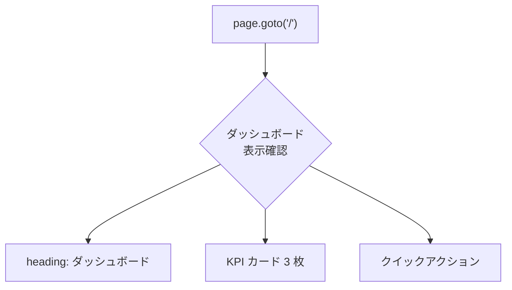
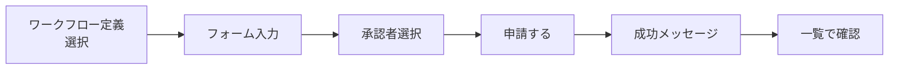
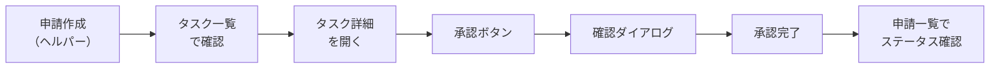
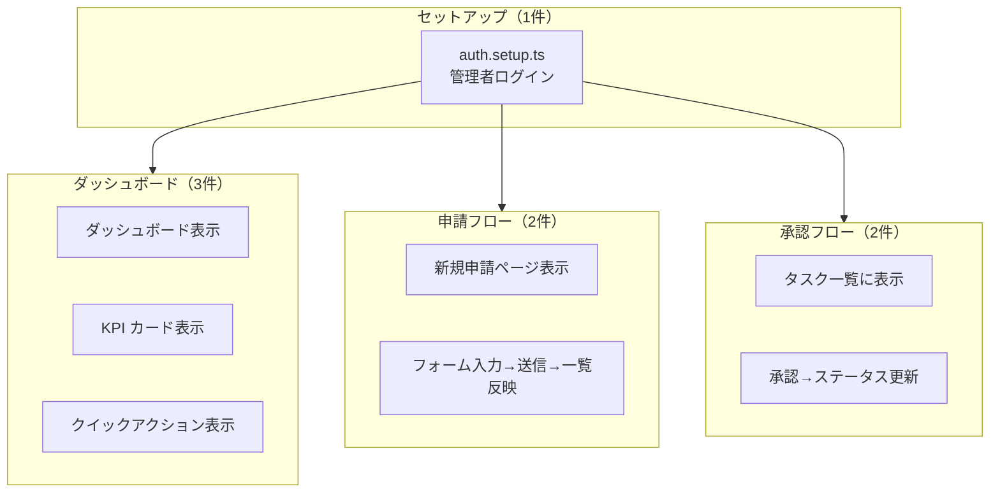

# Playwright E2E テスト - コード解説

対応 PR: #434
対応 Issue: #128

## 主要な型・関数

| 型/関数 | ファイル | 責務 |
|--------|---------|------|
| `login()` | [`tests/e2e/helpers/auth.ts:18`](../../../tests/e2e/helpers/auth.ts) | API 経由でログインし、Cookie を取得する |
| `ADMIN_USER` | [`tests/e2e/helpers/test-data.ts:11`](../../../tests/e2e/helpers/test-data.ts) | 管理者ユーザーのテストデータ定数 |
| `REGULAR_USER` | [`tests/e2e/helpers/test-data.ts:19`](../../../tests/e2e/helpers/test-data.ts) | 一般ユーザーのテストデータ定数 |
| `createAndSubmitWorkflow()` | [`tests/e2e/tests/approval.spec.ts:17`](../../../tests/e2e/tests/approval.spec.ts) | 申請作成ヘルパー（承認テスト用） |

## コードフロー

コードをライフサイクル順に追う。Playwright のテスト実行は「セットアップ → テスト実行」の 2 フェーズで動作する。



### 1. 認証セットアップ（テスト実行前に 1 回）

Playwright の `setup` プロジェクトとして定義され、`chromium` プロジェクトの `dependencies` で依存指定されている。全テスト実行前に 1 回だけ実行される。



```typescript
// tests/e2e/tests/auth.setup.ts:17-20
setup("管理者ユーザーでログインする", async ({ request }) => {
  await login(request, ADMIN_USER.email, ADMIN_USER.password);  // ① API ログイン
  await request.storageState({ path: authFile });                // ② Cookie をファイルに永続化
});
```

注目ポイント:

- ① `login()` は BFF の `/api/v1/auth/login` を呼び出し、レスポンスの `Set-Cookie` が `request` オブジェクトに自動保存される
- ② `storageState()` で Cookie 状態をファイルに保存。`playwright.config.ts` の `storageState: "tests/.auth/admin.json"` で他テストから参照される

```typescript
// tests/e2e/helpers/auth.ts:18-34
export async function login(
  request: APIRequestContext,
  email: string,
  password: string,
): Promise<void> {
  const response = await request.post("/api/v1/auth/login", {
    headers: {
      "X-Tenant-ID": TENANT_ID,  // ① マルチテナントヘッダー
    },
    data: { email, password },
  });

  if (!response.ok()) {
    throw new Error(                // ② ログイン失敗時に明示的なエラー
      `Login failed: ${response.status()} ${await response.text()}`,
    );
  }
}
```

注目ポイント:

- ① マルチテナントアプリケーションのため `X-Tenant-ID` ヘッダーが必須
- ② Playwright の `request.post` はステータスコードでの自動エラーを出さないため、明示的にチェックする

### 2. ダッシュボードテスト（スモークテスト）

認証済み状態での基本的な画面表示を検証する。



```typescript
// tests/e2e/tests/dashboard.spec.ts:27-36
test("クイックアクションが表示される", async ({ page }) => {
  await page.goto("/");

  // メインコンテンツ内のクイックアクションリンクが表示される
  // サイドバーにも同名リンクがあるため、メインコンテンツにスコープする
  const main = page.locator("#main-content");  // ① スコープ限定
  await expect(main.getByRole("link", { name: "申請一覧" })).toBeVisible();
  await expect(main.getByRole("link", { name: "新規申請" })).toBeVisible();
  await expect(main.getByRole("link", { name: "タスク一覧" })).toBeVisible();
});
```

注目ポイント:

- ① サイドバーとメインコンテンツに同名のリンクが存在するため、`#main-content` でスコープを絞っている

### 3. 申請フローテスト

新規申請の作成と一覧での確認を検証する。



```typescript
// tests/e2e/tests/workflow.spec.ts:20-57
test("申請フォームに入力して送信すると申請一覧に反映される", async ({ page }) => {
  const uniqueTitle = `E2E テスト申請 ${Date.now()}`;  // ① テスト間の衝突回避

  await page.goto("/workflows/new");
  await page.getByText("汎用申請").click();

  // ② placeholder で特定（id="title" が動的フォームと重複するため）
  await page.getByPlaceholder("申請のタイトルを入力").fill(uniqueTitle);

  // ③ 動的フォームフィールドをコンテナでスコープ
  const dynamicForm = page.locator(".bg-secondary-50");
  await dynamicForm.locator("input[name='title']").fill("E2E テスト件名");
  await dynamicForm.getByLabel("内容").fill("E2E テスト内容です");

  // ④ 承認者のインクリメンタル検索 + 選択
  await page.locator("#approver-search").fill("一般");
  await page.locator("li").filter({ hasText: "一般ユーザー" }).click();

  await page.getByRole("button", { name: "申請する" }).click();
  await expect(page.getByText("申請が完了しました")).toBeVisible();

  // ⑤ 送信後ページ遷移なし → 明示的に一覧へ
  await page.goto("/workflows");
  await expect(page.getByText(uniqueTitle)).toBeVisible();
});
```

注目ポイント:

- ① `Date.now()` でユニークなタイトルを生成し、テスト間のデータ衝突を防止
- ② メインの申請タイトル入力と動的フォームの「件名」フィールドが同じ `id="title"` を持つため、`getByPlaceholder` で区別
- ③ 動的フォームフィールドは `.bg-secondary-50` コンテナ内にスコープして、`input[name='title']` で特定
- ④ 承認者セレクターはインクリメンタル検索方式。テキスト入力後、ドロップダウンから候補を選択
- ⑤ 申請送信後はページ遷移せず、成功メッセージが同一ページに表示される。一覧確認には明示的な遷移が必要

### 4. 承認フローテスト

申請の作成から承認、ステータス更新までの一連のフローを検証する。



```typescript
// tests/e2e/tests/approval.spec.ts:53-76
test("タスク詳細から承認するとステータスが更新される", async ({ page }) => {
  const uniqueTitle = `承認完了テスト ${Date.now()}`;
  await createAndSubmitWorkflow(page, uniqueTitle);  // ① 申請作成ヘルパー

  await page.goto("/tasks");
  const taskRow = page.locator("tr").filter({ hasText: uniqueTitle });
  await taskRow.getByRole("link").first().click();  // ② テーブル行内のリンクで詳細へ

  // ③ exact: true で「承認」と「承認する」を区別
  await page.getByRole("button", { name: "承認", exact: true }).click();

  // ④ ConfirmDialog の確認ボタン
  await page.getByRole("button", { name: "承認する" }).click();

  await expect(page.getByText("承認しました")).toBeVisible();

  // ⑤ 申請一覧でステータスが更新されたことを確認
  await page.goto("/workflows");
  const workflowRow = page.locator("tr").filter({ hasText: uniqueTitle });
  await expect(workflowRow.getByText("承認済み")).toBeVisible();
});
```

注目ポイント:

- ① `createAndSubmitWorkflow()` ヘルパーで申請作成を共通化。管理者自身を承認者に指定し、単一セッションで申請→承認を完結
- ② テーブルの行から最初のリンクをクリックしてタスク詳細に遷移
- ③ タスク詳細の「承認」ボタンと確認ダイアログの「承認する」ボタンが類似テキストのため、`exact: true` で完全一致指定
- ④ `<dialog>` 要素の `showModal()` で表示される確認ダイアログ
- ⑤ 承認操作の結果を申請一覧のステータス列で確認（端到端の検証）

## テスト

各テストがカバーする範囲を示す。



| テスト | ファイル | 検証内容 |
|-------|---------|---------|
| `管理者ユーザーでログインする` | auth.setup.ts | API ログイン + storageState 保存 |
| `認証済みユーザーがダッシュボードを表示できる` | dashboard.spec.ts | ダッシュボード見出し表示 |
| `KPI 統計カードが表示される` | dashboard.spec.ts | 3 つの KPI カード表示 |
| `クイックアクションが表示される` | dashboard.spec.ts | メインコンテンツ内のナビゲーションリンク |
| `新規申請ページにアクセスできる` | workflow.spec.ts | 新規申請見出し表示 |
| `申請フォームに入力して送信すると申請一覧に反映される` | workflow.spec.ts | フォーム入力→送信→一覧確認 |
| `申請を作成すると承認者のタスク一覧に表示される` | approval.spec.ts | 申請作成→タスク一覧確認 |
| `タスク詳細から承認するとステータスが更新される` | approval.spec.ts | 承認操作→ステータス更新確認 |

### 実行方法

```bash
# ローカル（開発サーバー起動済みの場合）
cd tests/e2e && E2E_BASE_URL=http://localhost:15173 npx playwright test

# ローカル（worktree の場合、ポートを指定）
cd tests/e2e && E2E_BASE_URL=http://localhost:15373 npx playwright test

# justfile 経由（環境構築 + テスト実行を一括）
just test-e2e
```

## 依存関係

| パッケージ | バージョン | 追加理由 |
|-----------|-----------|---------|
| `@playwright/test` | `^1.50.1` | E2E テストフレームワーク |

## 設計解説

コード実装レベルの判断を記載する。機能・仕組みレベルの判断は[機能解説](./01_Playwright_E2Eテスト_機能解説.md#設計判断)を参照。

### 1. 重複 id の回避パターン

場所: `tests/e2e/tests/workflow.spec.ts:33-38`

```typescript
// メインタイトル: placeholder で特定
await page.getByPlaceholder("申請のタイトルを入力").fill(uniqueTitle);

// 動的フォーム「件名」: コンテナスコープ + name 属性で特定
const dynamicForm = page.locator(".bg-secondary-50");
await dynamicForm.locator("input[name='title']").fill("E2E テスト件名");
```

なぜこの実装か:
メインの申請タイトル入力と動的フォームの「件名」フィールドが同じ `id="title"` を持つ。`#title` セレクターでは曖昧になるため、異なる属性で特定する。

代替案:

| 案 | メリット | デメリット | 判断 |
|----|---------|-----------|------|
| **placeholder + コンテナスコープ（採用）** | 既存 HTML を変更不要 | CSS クラス依存 | 採用 |
| フロントエンドで id を修正 | セマンティックに正しい | 別 Issue のスコープ | 見送り |
| `nth` セレクター | 位置で特定 | DOM 変更に脆弱 | 見送り |

### 2. 自己承認パターン（テスト戦略）

場所: `tests/e2e/tests/approval.spec.ts:17-35`

```typescript
async function createAndSubmitWorkflow(page: Page, title: string): Promise<void> {
  // ...
  // ログインユーザー（管理者）自身を承認者に選択
  await page.locator("#approver-search").fill("管理者");
  await page.locator("li").filter({ hasText: "管理者" }).click();
  // ...
}
```

なぜこの実装か:
管理者が自分自身を承認者に指定することで、申請→承認の一連のフローを単一の認証セッションで完結できる。

代替案:

| 案 | メリット | デメリット | 判断 |
|----|---------|-----------|------|
| **自己承認（採用）** | シンプル、セッション切替不要 | 現実の運用とは異なる | 採用 |
| 複数ユーザーセッション | 現実に近い | storageState 切替が複雑 | 見送り（将来検討） |

### 3. exact マッチングによるボタン区別

場所: `tests/e2e/tests/approval.spec.ts:64`

```typescript
// 「承認」ボタン → 確認ダイアログを開く
await page.getByRole("button", { name: "承認", exact: true }).click();

// 確認ダイアログの「承認する」ボタン → 承認を実行
await page.getByRole("button", { name: "承認する" }).click();
```

なぜこの実装か:
タスク詳細画面に「承認」ボタンがあり、クリックすると確認ダイアログに「承認する」ボタンが表示される。`exact: true` なしでは「承認」が「承認する」にも部分一致してしまう。

## 関連ドキュメント

- [機能解説](./01_Playwright_E2Eテスト_機能解説.md)
- [Playwright 公式: Authentication](https://playwright.dev/docs/auth)
- [計画ファイル](../../../prompts/plans/128_playwright-e2e.md)
