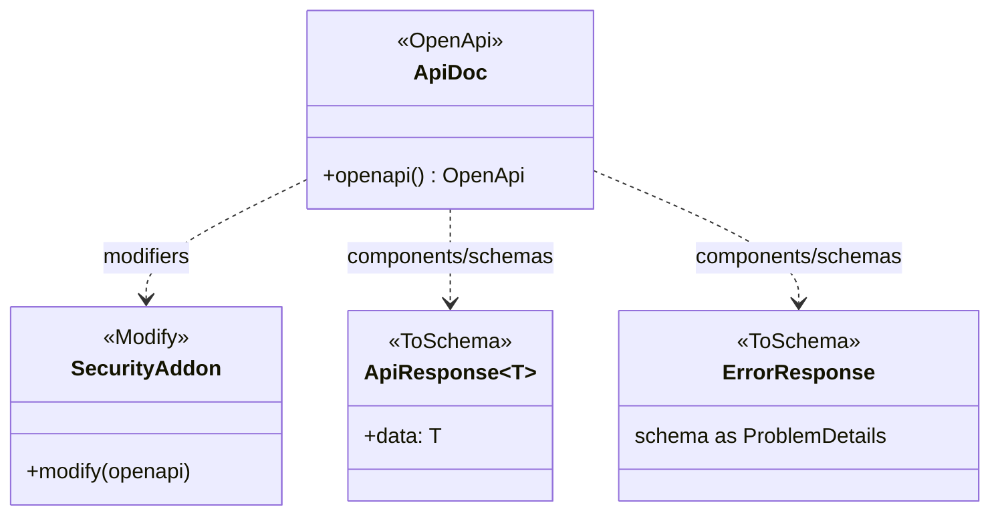
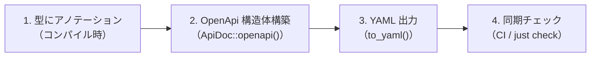
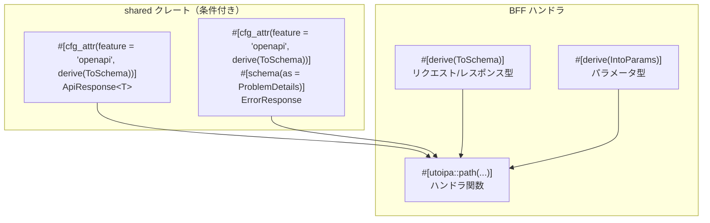
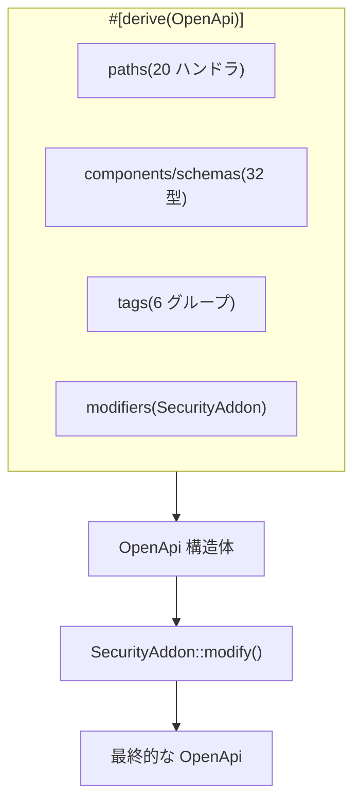
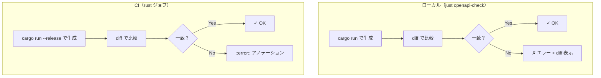
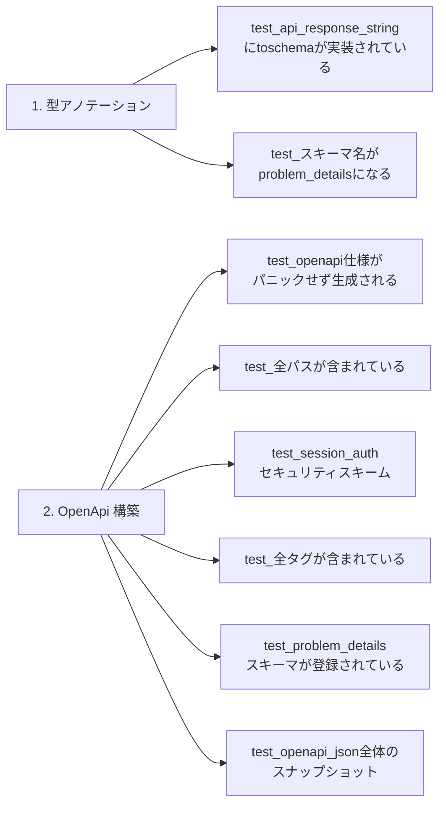

# OpenAPI Code First（utoipa 導入）- コード解説

対応 PR: #444
対応 Issue: #137（Phase 2 タスク 1, 2）

## 主要な型・関数

| 型/関数 | ファイル | 責務 |
|--------|---------|------|
| `ApiDoc` | [`bff/src/openapi.rs:108`](../../../backend/apps/bff/src/openapi.rs) | OpenAPI ルート定義。全パス・スキーマ・タグを集約 |
| `SecurityAddon` | [`bff/src/openapi.rs:113`](../../../backend/apps/bff/src/openapi.rs) | `Modify` トレイト実装。Cookie 認証スキームを追加 |
| `ApiResponse<T>` | [`shared/src/api_response.rs:24`](../../../backend/crates/shared/src/api_response.rs) | 共通レスポンスラッパー。条件付き `ToSchema` |
| `ErrorResponse` | [`shared/src/error_response.rs:22`](../../../backend/crates/shared/src/error_response.rs) | エラーレスポンス。`schema(as = ProblemDetails)` |
| `generate-openapi` | [`bff/src/bin/generate_openapi.rs`](../../../backend/apps/bff/src/bin/generate_openapi.rs) | YAML 生成バイナリ |

### 型の関係



## コードフロー

コードをライフサイクル順に追う。utoipa のマクロ展開はコンパイル時に行われるため、ランタイムのフローは YAML 生成のみ。



### 1. 型にアノテーション（コンパイル時）

utoipa の derive マクロにより、Rust の型情報が OpenAPI スキーマに変換される。



```rust
// backend/crates/shared/src/api_response.rs:23-26
#[derive(Debug, Clone, PartialEq, Eq, Serialize, Deserialize)]
#[cfg_attr(feature = "openapi", derive(utoipa::ToSchema))]  // ① 条件付き derive
pub struct ApiResponse<T> {
   pub data: T,  // ② T: ToSchema が自動的に要求される
}
```

注目ポイント:

- ① `cfg_attr` により `openapi` feature が有効な場合のみ `ToSchema` が derive される
- ② ジェネリック型パラメータ `T` には `ToSchema` bound が自動付与される

```rust
// backend/crates/shared/src/error_response.rs:21-24
#[derive(Debug, Clone, PartialEq, Eq, Serialize, Deserialize)]
#[cfg_attr(feature = "openapi", derive(utoipa::ToSchema))]
#[cfg_attr(feature = "openapi", schema(as = ProblemDetails))]  // ① スキーマ名変更
pub struct ErrorResponse {
```

注目ポイント:

- ① `schema(as = ProblemDetails)` により、OpenAPI 上のスキーマ名が `ErrorResponse` ではなく `ProblemDetails`（RFC 9457）になる

```rust
// backend/apps/bff/src/handler/auth.rs（抜粋）
#[utoipa::path(
   post,
   path = "/api/v1/auth/login",
   tag = "auth",                                    // ① タグでグルーピング
   request_body = LoginRequest,                     // ② リクエストボディ型
   responses(
      (status = 200, description = "ログイン成功",
       body = ApiResponse<LoginResponseData>),       // ③ レスポンス型
      (status = 401, description = "認証失敗",
       body = ErrorResponse),                        // ④ Rust 型名で参照
   )
)]
pub async fn login(...) -> impl IntoResponse { ... }
```

注目ポイント:

- ① tag はハンドラをグループ化し、Swagger UI での表示を整理する
- ② `request_body` は `ToSchema` を derive した型を指定
- ③ ジェネリック型 `ApiResponse<LoginResponseData>` がそのまま使える
- ④ `body = ErrorResponse` と Rust 型名で参照する（`ProblemDetails` ではない）

### 2. OpenApi 構造体構築（`ApiDoc::openapi()`）

全ハンドラ・スキーマ・タグ・セキュリティを `ApiDoc` に集約する。



```rust
// backend/apps/bff/src/openapi.rs:14-108
#[derive(OpenApi)]
#[openapi(
   info(title = "RingiFlow API", version = "0.1.0", ...),
   paths(
      health::health_check,
      auth::login, auth::logout, auth::me, auth::csrf,
      // ... 全 20 ハンドラ
   ),
   components(schemas(
      ringiflow_shared::ApiResponse<auth::LoginResponseData>,  // ① 具体型を指定
      ringiflow_shared::ErrorResponse,                         // ② ProblemDetails として登録
      // ... 全 32 スキーマ
   )),
   tags(
      (name = "health", description = "ヘルスチェック"),
      // ... 全 6 タグ
   ),
   modifiers(&SecurityAddon)  // ③ セキュリティスキーム追加
)]
pub struct ApiDoc;
```

注目ポイント:

- ① `ApiResponse<auth::LoginResponseData>` のようにジェネリクスの具体型で登録。`ApiResponse_LoginResponseData` というスキーマ名が生成される
- ② `ErrorResponse` は `schema(as = ProblemDetails)` により `ProblemDetails` として登録される
- ③ `modifiers` で `SecurityAddon` を指定し、OpenApi 構築後にセキュリティスキームを追加

```rust
// backend/apps/bff/src/openapi.rs:115-123
impl Modify for SecurityAddon {
   fn modify(&self, openapi: &mut utoipa::openapi::OpenApi) {
      let components = openapi.components.get_or_insert_default();
      components.add_security_scheme(
         "session_auth",
         SecurityScheme::ApiKey(ApiKey::Cookie(ApiKeyValue::new("session_id"))),  // ① Cookie 認証
      );
   }
}
```

注目ポイント:

- ① `ApiKey::Cookie` で Cookie ベースのセッション認証を表現。Bearer トークンではなく `session_id` Cookie を使うプロジェクトの認証方式に対応

### 3. YAML 出力（`to_yaml()`）

```rust
// backend/apps/bff/src/bin/generate_openapi.rs:14-19
fn main() {
   let yaml = ApiDoc::openapi()  // ① OpenApi 構造体を構築
      .to_yaml()                  // ② YAML に変換
      .expect("OpenAPI YAML 生成に失敗しました");
   print!("{yaml}");              // ③ 標準出力に出力
}
```

注目ポイント:

- ① `ApiDoc::openapi()` で全ハンドラ・スキーマ・セキュリティが組み立てられる
- ② `to_yaml()` は `yaml` feature で有効化。`preserve_order` feature でフィールド順序を保持
- ③ 標準出力に出力し、justfile でファイルリダイレクト（`> openapi/openapi.yaml`）

### 4. 同期チェック（CI / `just check`）



justfile のチェックコマンド:

```bash
# justfile（openapi-check）
temp=$(mktemp)
trap 'rm -f "$temp"' EXIT
cd backend && cargo run --bin generate-openapi -p ringiflow-bff > "$temp" 2>/dev/null
cd ..
if ! diff -q openapi/openapi.yaml "$temp" > /dev/null 2>&1; then
    echo "ERROR: openapi/openapi.yaml が utoipa の定義と同期していません"
    exit 1
fi
```

## テスト

各テストがライフサイクルのどのステップを検証しているかを示す。



| テスト | ファイル | 検証対象 | 検証内容 |
|-------|---------|---------|---------|
| `test_api_response_stringにtoschemaが実装されている` | `shared/src/api_response.rs` | ステップ 1 | `ApiResponse<String>` のスキーマに `data` プロパティが存在 |
| `test_スキーマ名がproblem_detailsになる` | `shared/src/error_response.rs` | ステップ 1 | `ErrorResponse::name()` が `"ProblemDetails"` を返す |
| `test_openapi仕様がパニックせず生成される` | `tests/openapi_spec.rs` | ステップ 2 | `ApiDoc::openapi().to_yaml()` が成功する |
| `test_全パスが含まれている` | `tests/openapi_spec.rs` | ステップ 2 | 18 パスがすべて存在する |
| `test_session_authセキュリティスキームが含まれている` | `tests/openapi_spec.rs` | ステップ 2 | `session_auth` スキームが登録されている |
| `test_全タグが含まれている` | `tests/openapi_spec.rs` | ステップ 2 | 6 タグがすべて存在する |
| `test_problem_detailsスキーマが登録されている` | `tests/openapi_spec.rs` | ステップ 2 | `ProblemDetails` スキーマが components に存在 |
| `test_openapi_json全体のスナップショット` | `tests/openapi_spec.rs` | ステップ 2 | OpenAPI JSON 全体が既知のスナップショットと一致 |

### 実行方法

```bash
# shared クレートのテスト（openapi feature 有効）
cd backend && cargo test -p ringiflow-shared --features openapi

# BFF のテスト（スナップショットテスト含む）
cd backend && cargo test -p ringiflow-bff --test openapi_spec
```

## 依存関係

| クレート | バージョン | 追加理由 |
|---------|-----------|---------|
| `utoipa` | 5 | OpenAPI Code First 生成。features: `chrono`, `uuid`, `yaml`, `preserve_order` |
| `insta` | (dev) | OpenAPI JSON のスナップショットテスト |

## 設計解説

コード実装レベルの判断を記載する。機能・仕組みレベルの判断は[機能解説](./01_utoipa導入_機能解説.md#設計判断)を参照。

### 1. `schema(as = ProblemDetails)` と `body = ErrorResponse` の使い分け

場所: `shared/src/error_response.rs:23`、各ハンドラの `#[utoipa::path]`

```rust
// スキーマ定義: as = ProblemDetails で名前を変更
#[cfg_attr(feature = "openapi", schema(as = ProblemDetails))]
pub struct ErrorResponse { ... }

// ハンドラ: body = ErrorResponse（Rust 型名）で参照
responses((status = 401, body = ErrorResponse))
```

なぜこの実装か:
utoipa のマクロは `body =` の参照を Rust の型名で解決する。`schema(as = ...)` はスキーマの公開名のみを変更するため、マクロ内では常に Rust 型名を使う必要がある。

代替案:

| 案 | メリット | デメリット | 判断 |
|----|---------|-----------|------|
| `body = ErrorResponse`（Rust 型名） | マクロが型を解決できる | OpenAPI 上の名前と不一致 | 採用 |
| `body = ProblemDetails`（スキーマ名） | 直感的 | コンパイルエラー（型が見つからない） | 不可 |

### 2. ジェネリクスのスキーマ登録方式

場所: `bff/src/openapi.rs:52-65`

```rust
components(schemas(
   ringiflow_shared::ApiResponse<auth::LoginResponseData>,
   ringiflow_shared::ApiResponse<auth::MeResponseData>,
   // ... 具体型ごとに登録
))
```

なぜこの実装か:
utoipa は `ApiResponse<T>` のようなジェネリック型を自動で全パターン登録できない。レスポンスで使用する各具体型（`ApiResponse<LoginResponseData>` 等）を明示的に `components(schemas(...))` に列挙する必要がある。

代替案:

| 案 | メリット | デメリット | 判断 |
|----|---------|-----------|------|
| 具体型を明示的に列挙 | 確実、utoipa の設計に沿う | 型追加時に列挙も更新が必要 | 採用 |
| マクロで自動収集 | 手動列挙不要 | utoipa が未対応 | 不可 |

### 3. CI での生成コマンドの配置

場所: `.github/workflows/ci.yaml:125-135`

```yaml
- name: Check OpenAPI spec sync
  run: |
    generated=$(cargo run --release --bin generate-openapi ...)
    if ! diff -q <(echo "$generated") ../openapi/openapi.yaml > /dev/null 2>&1; then
      echo "::error::..."
      exit 1
    fi
  working-directory: backend
```

なぜこの実装か:
`rust` ジョブ内に配置することで、既存の Cargo キャッシュとビルド成果物を再利用できる。`--release` は前後のステップ（テスト、本番ビルド）と同じプロファイルでキャッシュが共有されるため追加ビルドコストが小さい。

代替案:

| 案 | メリット | デメリット | 判断 |
|----|---------|-----------|------|
| `rust` ジョブ内 | キャッシュ共有、追加コスト小 | `rust` ジョブが少し長くなる | 採用 |
| 独立ジョブ | 並列実行可能 | Cargo キャッシュの重複、ビルド時間増 | 見送り |
| `openapi` ジョブに追加 | OpenAPI 関連を集約 | Rust ツールチェインの追加セットアップが必要 | 見送り |

## 関連ドキュメント

- [機能解説](./01_utoipa導入_機能解説.md)
- [ナレッジベース: utoipa](../../80_ナレッジベース/rust/utoipa.md)
