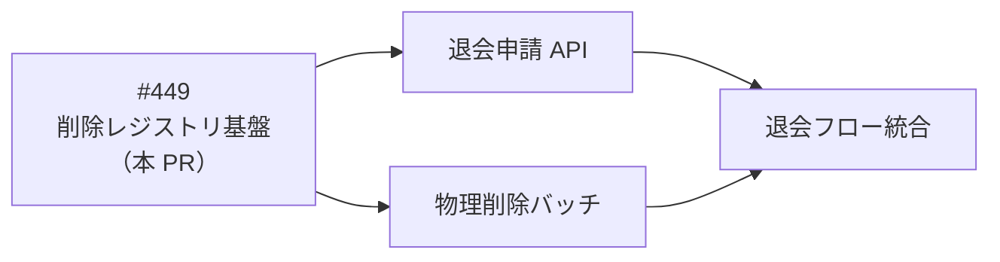
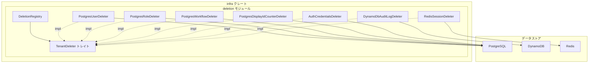

# 削除レジストリ基盤 - 機能解説

対応 PR: #466
対応 Issue: #449

## 概要

テナント退会時のデータ削除を一元管理する基盤を実装した。`TenantDeleter` トレイトで各データストアの削除操作を統一的に抽象化し、`DeletionRegistry` で全 Deleter を集約して一括削除・件数取得を提供する。全7データストア（PostgreSQL x4、Auth、DynamoDB、Redis）の Deleter を実装し、登録漏れを検出するテスト基盤も整備した。

## 背景

### テナント退会時データ削除の必要性

マルチテナント SaaS では、テナント退会時にそのテナントのデータを完全に削除する必要がある。ADR-007 で「テナント単位での物理削除」を採用し、すべてのデータストアで `tenant_id` による削除が可能な設計を必須としている。

### 多層防御による漏れ防止

[詳細設計書](../../40_詳細設計書/06_テナント退会時データ削除設計.md)では、データ削除漏れを防ぐために6層の防御を定義している。本 PR はそのうち Layer 2（削除レジストリ）と Layer 3（統合テスト）を実装する。

| Layer | 手段 | 本 PR の対応 |
|-------|------|-------------|
| 1 | 型システム（コンパイル時） | — |
| 2 | 削除レジストリ（実行時） | `DeletionRegistry` + 全 Deleter |
| 3 | 統合テスト（CI） | 登録漏れ検出テスト + PostgreSQL 統合テスト |
| 4 | 静的解析（CI） | — |
| 5 | Claude Code ルール（開発時） | `data-store.md` パス更新 |
| 6 | 本番監査バッチ（定期実行） | — |

### Epic 全体の中での位置づけ

本 PR は削除レジストリの「基盤」であり、実際のテナント退会フロー（退会申請 → 猶予期間 → 物理削除バッチ）は後続の Issue で実装する。



## 用語・概念

| 用語 | 説明 | 関連コード |
|------|------|-----------|
| TenantDeleter | 各データストアのテナントデータ削除を抽象化するトレイト | `deletion::TenantDeleter` |
| DeletionRegistry | 全 Deleter を集約し、一括操作を提供するレジストリ | `deletion::DeletionRegistry` |
| DeletionResult | 削除操作の結果（削除件数）を表す構造体 | `deletion::DeletionResult` |
| 登録漏れ検出 | 期待リストと実際の登録リストを突合するテスト手法 | `DeletionRegistry::expected_deleter_names()` |

## フロー

本 PR は新規機能のため Before はない。

### 一括削除フロー

```mermaid
sequenceDiagram
    participant Caller as 呼び出し元
    participant Registry as DeletionRegistry
    participant PG as PostgreSQL Deleters
    participant Auth as Auth Deleter
    participant DDB as DynamoDB Deleter
    participant Redis as Redis Deleter

    Caller->>Registry: delete_all(tenant_id)
    Registry->>PG: delete(tenant_id) x4
    PG-->>Registry: DeletionResult
    Registry->>Auth: delete(tenant_id)
    Auth-->>Registry: DeletionResult
    Registry->>DDB: delete(tenant_id)
    DDB-->>Registry: DeletionResult
    Registry->>Redis: delete(tenant_id)
    Redis-->>Registry: DeletionResult
    Registry-->>Caller: HashMap&lt;name, DeletionResult&gt;
```

### 削除対象データストア

| Deleter | 対象テーブル/キー | 削除方式 |
|---------|-----------------|---------|
| PostgresUserDeleter | `users`（+ `user_roles` CASCADE） | `DELETE WHERE tenant_id` |
| PostgresRoleDeleter | `roles` | `DELETE WHERE tenant_id` |
| PostgresWorkflowDeleter | `workflow_steps` → `workflow_instances` → `workflow_definitions` | FK 順序で段階削除 |
| PostgresDisplayIdCounterDeleter | `display_id_counters` | `DELETE WHERE tenant_id` |
| AuthCredentialsDeleter | `auth.credentials` | `DELETE WHERE tenant_id` |
| DynamoDbAuditLogDeleter | `audit_logs` テーブル | Query + BatchWriteItem（25件/バッチ） |
| RedisSessionDeleter | `session:{tenant_id}:*`, `csrf:{tenant_id}:*` | SCAN + DEL |

## アーキテクチャ



## 設計判断

機能・仕組みレベルの判断を記載する。コード実装レベルの判断は[コード解説](./02_削除レジストリ基盤_コード解説.md#設計解説)を参照。

### 1. DynamoDB の削除方式をどうするか

DynamoDB にはテーブル内の条件削除 API がないため、削除方式の選択が必要。

| 案 | 実装の簡潔さ | テナント分離 | パフォーマンス |
|----|------------|------------|--------------|
| **Query + BatchWriteItem（採用）** | 中（ページネーション実装要） | 安全 | バッチ処理で効率的 |
| DeleteTable + 再作成 | 高 | 不可（他テナント巻き込み） | — |
| Query + 個別 DeleteItem | 低（N 回の API コール） | 安全 | 低（大量データで問題） |

**採用理由**: マルチテナントでテーブルを共有しているため DeleteTable は不可。BatchWriteItem は 25件/バッチで効率的に削除でき、ページネーションで大量データにも対応できる。

### 2. Redis の削除方式をどうするか

Redis にはパターン指定の一括削除コマンドがないため、キー探索 + 個別削除の組み合わせが必要。

| 案 | 本番安全性 | 実装の簡潔さ | パフォーマンス |
|----|----------|------------|--------------|
| **SCAN + DEL（採用）** | 高（ノンブロッキング） | 中 | カーソルベースで安定 |
| KEYS + DEL | 低（ブロッキング） | 高 | 全キー走査でブロック |

**採用理由**: KEYS コマンドは全キーを走査するためブロッキングが発生し、本番環境でのリスクが高い。SCAN はカーソルベースの段階的な走査でノンブロッキング。

### 3. ワークフローの削除順序をどうするか

ワークフロー関連テーブルは FK 制約で連鎖している: `workflow_steps → workflow_instances → workflow_definitions`。

| 案 | 削除件数の正確性 | FK 安全性 | 実装の簡潔さ |
|----|----------------|----------|------------|
| **子→親の順で明示的に削除（採用）** | 正確（各テーブルの件数を把握） | 安全 | 中（3クエリ） |
| CASCADE に任せる | 不正確（定義のみの件数） | 安全 | 高（1クエリ） |

**採用理由**: `DeletionResult` で削除件数を正確に報告するため、各テーブルの `rows_affected()` を合算する方式を採用。CASCADE では子テーブルの削除件数を取得できない。

### 4. 登録漏れをどう検出するか

新しいデータストアを追加した際に、削除レジストリへの登録を忘れるリスクがある。

| 案 | DB 接続不要 | 網羅性 | 保守性 |
|----|-----------|--------|--------|
| **期待リスト定数 + テスト（採用）** | 可 | 高（定数リストで管理） | 中（手動更新要） |
| マクロで自動登録 | — | 高 | 高 | 高（自動化）だが複雑 |
| コードレビューのみ | — | 低（人的ミス） | — |

**採用理由**: `expected_deleter_names()` を定数関数として定義し、DB 接続なしでテスト可能にした。`.claude/rules/data-store.md` ルールとの多層防御で漏れを防ぐ。

## 関連ドキュメント

- [コード解説](./02_削除レジストリ基盤_コード解説.md)
- [詳細設計書: テナント退会時データ削除設計](../../40_詳細設計書/06_テナント退会時データ削除設計.md)
- [ADR-007: テナント退会時のデータ削除方針](../../70_ADR/007_テナント退会時のデータ削除方針.md)
- [data-store.md ルール](../../../.claude/rules/data-store.md)
