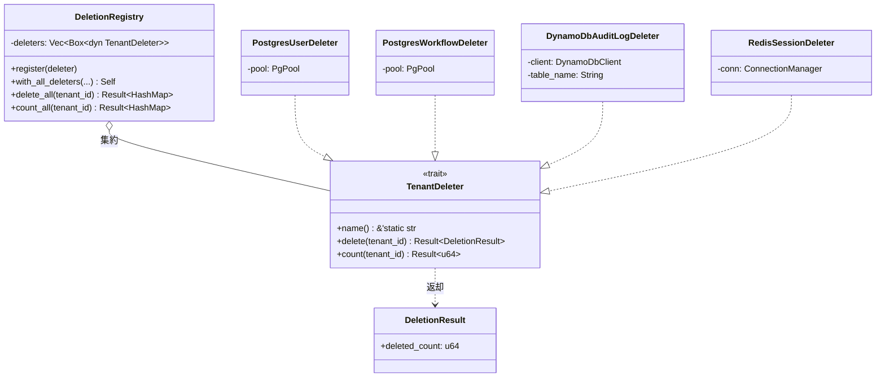
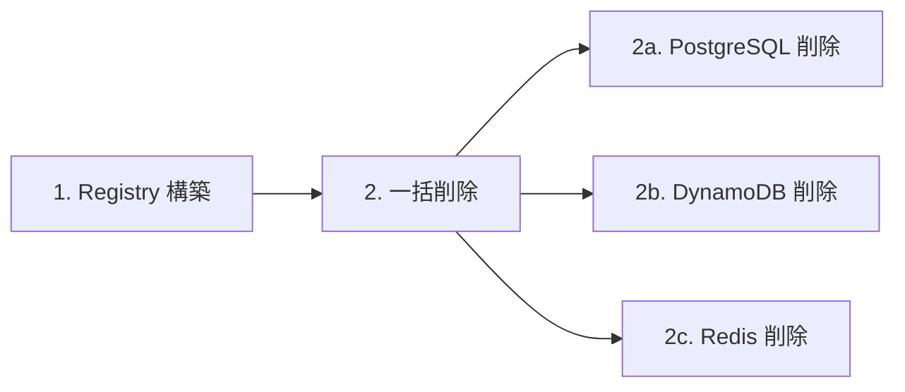
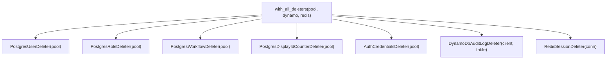
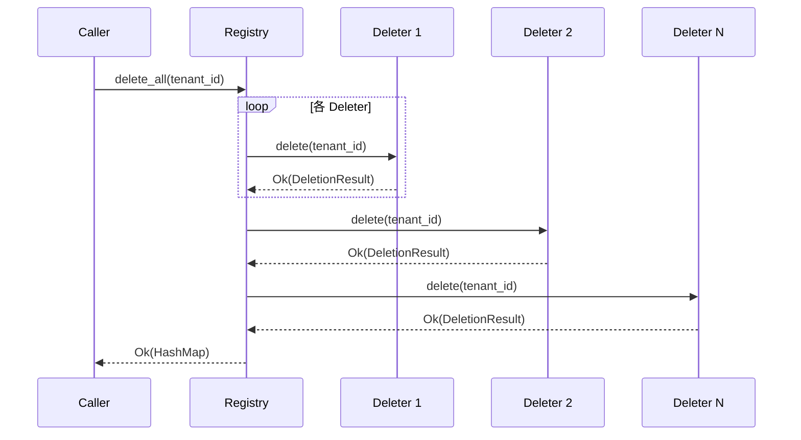
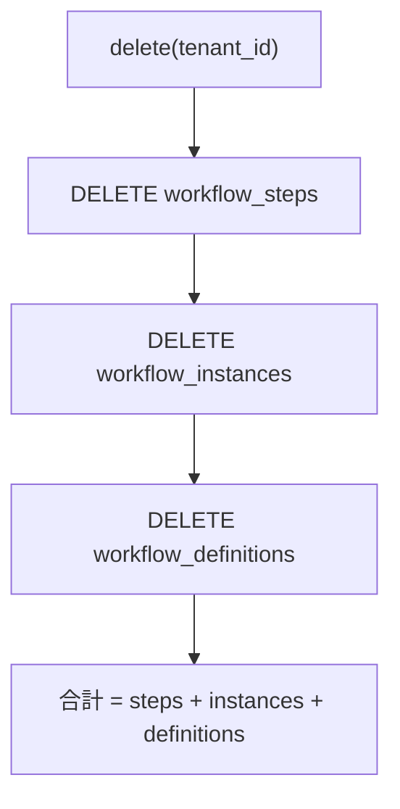
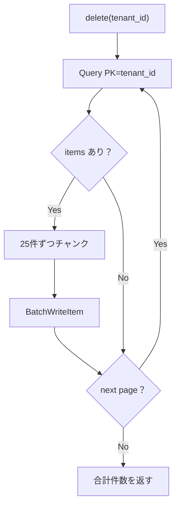
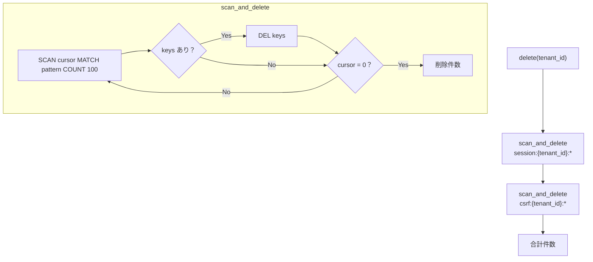
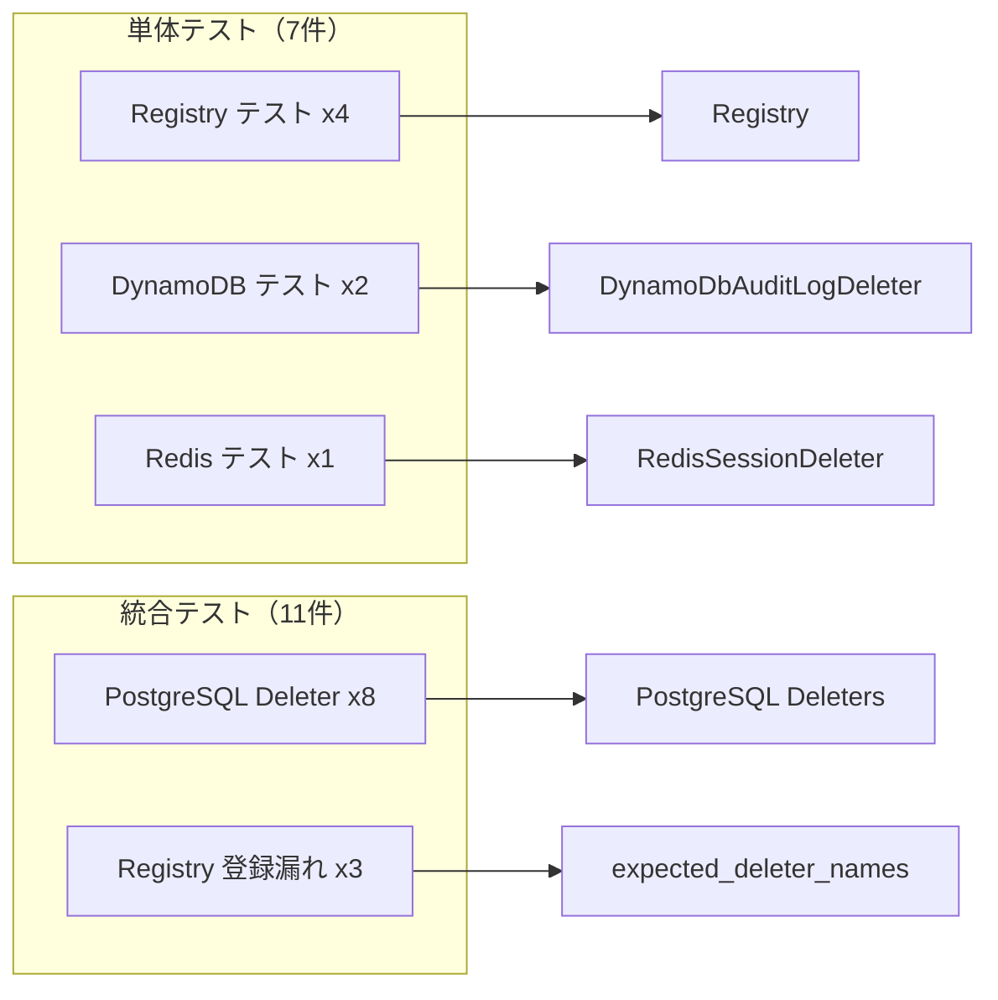

# 削除レジストリ基盤 - コード解説

対応 PR: #466
対応 Issue: #449

## 主要な型・関数

| 型/関数 | ファイル | 責務 |
|--------|---------|------|
| `TenantDeleter` | [`deletion/mod.rs:18-31`](../../../backend/crates/infra/src/deletion/mod.rs) | テナントデータ削除の統一インターフェース |
| `DeletionResult` | [`deletion/mod.rs:33-37`](../../../backend/crates/infra/src/deletion/mod.rs) | 削除操作の結果（削除件数） |
| `DeletionRegistry` | [`deletion/registry.rs:28-30`](../../../backend/crates/infra/src/deletion/registry.rs) | 全 Deleter の集約と一括操作 |
| `PostgresUserDeleter` | [`deletion/postgres_simple.rs`](../../../backend/crates/infra/src/deletion/postgres_simple.rs) | users テーブル削除 |
| `PostgresRoleDeleter` | [`deletion/postgres_simple.rs`](../../../backend/crates/infra/src/deletion/postgres_simple.rs) | roles テーブル削除 |
| `PostgresWorkflowDeleter` | [`deletion/postgres_workflow.rs`](../../../backend/crates/infra/src/deletion/postgres_workflow.rs) | ワークフロー関連3テーブル削除 |
| `PostgresDisplayIdCounterDeleter` | [`deletion/postgres_simple.rs`](../../../backend/crates/infra/src/deletion/postgres_simple.rs) | display_id_counters テーブル削除 |
| `AuthCredentialsDeleter` | [`deletion/auth_credentials.rs`](../../../backend/crates/infra/src/deletion/auth_credentials.rs) | auth.credentials テーブル削除 |
| `DynamoDbAuditLogDeleter` | [`deletion/dynamodb_audit_log.rs`](../../../backend/crates/infra/src/deletion/dynamodb_audit_log.rs) | DynamoDB audit_logs 削除 |
| `RedisSessionDeleter` | [`deletion/redis_session.rs`](../../../backend/crates/infra/src/deletion/redis_session.rs) | Redis セッション/CSRF キー削除 |

### 型の関係



## コードフロー

コードをライフサイクル順に追う。各ステップの構造を図で示した後、対応するコードを解説する。



### 1. Registry 構築（初期化時）

`with_all_deleters()` ファクトリで全 Deleter を登録する。各 Deleter はデータストアへの接続情報を保持する。



```rust
// deletion/registry.rs:52-72
pub fn with_all_deleters(
    pg_pool: PgPool,
    dynamodb_client: DynamoDbClient,
    dynamodb_table_name: String,
    redis_conn: ConnectionManager,
) -> Self {
    let mut registry = Self::new();
    registry.register(Box::new(PostgresUserDeleter::new(pg_pool.clone())));   // ①
    registry.register(Box::new(PostgresRoleDeleter::new(pg_pool.clone())));
    registry.register(Box::new(PostgresWorkflowDeleter::new(pg_pool.clone())));
    registry.register(Box::new(PostgresDisplayIdCounterDeleter::new(pg_pool.clone())));
    registry.register(Box::new(AuthCredentialsDeleter::new(pg_pool)));        // ② 最後は clone 不要
    registry.register(Box::new(DynamoDbAuditLogDeleter::new(dynamodb_client, dynamodb_table_name)));
    registry.register(Box::new(RedisSessionDeleter::new(redis_conn)));
    registry
}
```

注目ポイント:

- ① `PgPool` は内部的に `Arc` なので `clone()` は軽量（参照カウントのインクリメントのみ）
- ② 最後の使用箇所では `clone()` せず所有権を move する

### 2. 一括削除（delete_all 呼び出し時）

全 Deleter を順次実行し、結果を `HashMap` で返す。



```rust
// deletion/registry.rs:96-106
pub async fn delete_all(
    &self,
    tenant_id: &TenantId,
) -> Result<HashMap<&'static str, DeletionResult>, InfraError> {
    let mut results = HashMap::new();
    for deleter in &self.deleters {
        let result = deleter.delete(tenant_id).await?;  // ① エラー時は即座に中断
        results.insert(deleter.name(), result);          // ② name() をキーに使用
    }
    Ok(results)
}
```

注目ポイント:

- ① `?` で早期リターン。1つの Deleter がエラーを返した場合、後続の Deleter は実行されない
- ② `name()` が `&'static str` なので HashMap のキーとして効率的

### 2a. PostgreSQL 削除（ワークフローの例）

ワークフロー Deleter は FK 制約に従い、子テーブルから順に削除する。



```rust
// deletion/postgres_workflow.rs:27-56
async fn delete(&self, tenant_id: &TenantId) -> Result<DeletionResult, InfraError> {
    // FK 制約: steps → instances → definitions の順で削除
    let steps = sqlx::query!(
        "DELETE FROM workflow_steps WHERE tenant_id = $1",
        tenant_id.as_uuid()
    )
    .execute(&self.pool)
    .await?;

    let instances = sqlx::query!(
        "DELETE FROM workflow_instances WHERE tenant_id = $1",
        tenant_id.as_uuid()
    )
    .execute(&self.pool)
    .await?;

    let definitions = sqlx::query!(
        "DELETE FROM workflow_definitions WHERE tenant_id = $1",
        tenant_id.as_uuid()
    )
    .execute(&self.pool)
    .await?;

    let total = steps.rows_affected()           // ①
        + instances.rows_affected()
        + definitions.rows_affected();

    Ok(DeletionResult {
        deleted_count: total,
    })
}
```

注目ポイント:

- ① 各テーブルの `rows_affected()` を合算し、正確な削除件数を報告する

### 2b. DynamoDB 削除

Query でキーを取得し、BatchWriteItem で 25件ずつ削除する。



```rust
// deletion/dynamodb_audit_log.rs:39-95
async fn delete(&self, tenant_id: &TenantId) -> Result<DeletionResult, InfraError> {
    let mut deleted_count: u64 = 0;
    let mut exclusive_start_key = None;

    loop {
        let mut query = self.client
            .query()
            .table_name(&self.table_name)
            .key_condition_expression("tenant_id = :tid")                    // ①
            .expression_attribute_values(":tid", /* tenant_id */)
            .projection_expression("tenant_id, sk");                         // ②

        if let Some(start_key) = exclusive_start_key {
            query = query.set_exclusive_start_key(Some(start_key));   // ③
        }

        let output = query.send().await?;
        let items = output.items();

        for chunk in items.chunks(25) {                               // ④
            // BatchWriteItem で 25件ずつ削除
            let delete_requests = chunk.iter().map(|item| { /* ... */ }).collect();
            self.client.batch_write_item()
                .request_items(&self.table_name, delete_requests)
                .send().await?;
        }

        deleted_count += items.len() as u64;
        exclusive_start_key = output.last_evaluated_key().cloned();

        if exclusive_start_key.is_none() { break; }                   // ⑤
    }

    Ok(DeletionResult { deleted_count })
}
```

注目ポイント:

- ① パーティションキー `tenant_id` を指定して Query
- ② `projection_expression` でキー属性のみ取得（データ転送量を最小化）
- ③ ページネーション: 前回の最終キーから続行
- ④ AWS の BatchWriteItem は 25件/リクエスト上限
- ⑤ `last_evaluated_key` が `None` なら全ページ処理完了

### 2c. Redis 削除

SCAN でキーパターンを探索し、DEL で削除する。



```rust
// deletion/redis_session.rs:41-67
async fn delete(&self, tenant_id: &TenantId) -> Result<DeletionResult, InfraError> {
    let session_pattern = format!("session:{}:*", tenant_id.as_uuid());  // ①
    let csrf_pattern = format!("csrf:{}:*", tenant_id.as_uuid());

    let session_deleted = self.scan_and_delete(&session_pattern).await?;
    let csrf_deleted = self.scan_and_delete(&csrf_pattern).await?;

    Ok(DeletionResult {
        deleted_count: session_deleted + csrf_deleted,
    })
}
```

```rust
// deletion/redis_session.rs:88-122
async fn scan_and_delete(&self, pattern: &str) -> Result<u64, InfraError> {
    let mut conn = self.conn.clone();
    let mut cursor: u64 = 0;
    let mut deleted_count: u64 = 0;

    loop {
        let (next_cursor, keys): (u64, Vec<String>) =
            redis::cmd("SCAN")
                .arg(cursor)
                .arg("MATCH").arg(pattern)
                .arg("COUNT").arg(100)        // ②
                .query_async(&mut conn).await?;

        if !keys.is_empty() {
            redis::cmd("DEL")
                .arg(&keys)                   // ③
                .query_async::<u64>(&mut conn).await?;
            deleted_count += keys.len() as u64;
        }

        cursor = next_cursor;
        if cursor == 0 { break; }             // ④
    }

    Ok(deleted_count)
}
```

注目ポイント:

- ① セッションと CSRF の2パターンを別々に処理
- ② `COUNT 100` で1回のスキャンで最大100件を返すヒント
- ③ `DEL` コマンドに複数キーをまとめて渡す（バッチ削除）
- ④ カーソルが 0 に戻ったら全キーを走査済み

## テスト



| テスト | 検証対象 | 検証内容 |
|-------|---------|---------|
| `test_空のレジストリのregistered_namesは空vecを返す` | Registry | 初期状態 |
| `test_deleterを登録するとregistered_namesで名前を取得できる` | Registry | 登録と名前取得 |
| `test_delete_allが全deleterのdeleteを呼び結果を返す` | Registry | 一括削除の結果集約 |
| `test_count_allが全deleterのcountを呼び結果を返す` | Registry | 一括カウントの結果集約 |
| `test_nameがdynamodb_audit_logsを返す` | DynamoDB | 識別名 |
| `test_send_syncを満たす` | DynamoDB | `Send + Sync` コンパイル時検証 |
| `test_nameがredis_sessionsを返す` | Redis | 識別名 |
| `test_user_deleter_*` (x3) | PostgresUserDeleter | count / delete / 他テナント非影響 |
| `test_role_deleter_*` | PostgresRoleDeleter | count + delete |
| `test_workflow_deleter_*` | PostgresWorkflowDeleter | FK 順序削除 + 件数合算 |
| `test_display_id_counter_deleter_*` | PostgresDisplayIdCounterDeleter | count + delete |
| `test_auth_credentials_deleter_*` (x2) | AuthCredentialsDeleter | count + delete / 他テナント非影響 |
| `test_期待リストと*` (x3) | 登録漏れ検出 | 重複なし / カテゴリカバー / 完全一致 |

### 実行方法

```bash
# 単体テスト
cd backend && cargo test -p ringiflow-infra --lib -- deletion

# PostgreSQL 統合テスト（DB 接続必要）
just dev-deps
cd backend && cargo test -p ringiflow-infra --test postgres_deleter_test

# 登録漏れ検出テスト（DB 不要）
cd backend && cargo test -p ringiflow-infra --test deletion_registry_test
```

## 設計解説

コード実装レベルの判断を記載する。機能・仕組みレベルの判断は[機能解説](./01_削除レジストリ基盤_機能解説.md#設計判断)を参照。

### 1. TenantDeleter の `Send + Sync` 境界

場所: `deletion/mod.rs:19`

```rust
#[async_trait]
pub trait TenantDeleter: Send + Sync {
```

なぜこの実装か:
`DeletionRegistry` は `Vec<Box<dyn TenantDeleter>>` で Deleter を保持する。将来的に並行削除（`tokio::join!`）に移行する可能性を考慮し、`Send + Sync` を要求する。また `async_trait` のデフォルトが `Send` を要求するため、整合性のために明示した。

### 2. `name()` の戻り値を `&'static str` にした理由

場所: `deletion/mod.rs:20`

```rust
fn name(&self) -> &'static str;
```

なぜこの実装か:
Deleter の名前はコンパイル時に確定する定数。`String` にすると不要なアロケーションが発生し、`HashMap` のキーとして使う際にも `&str` のほうが効率的。`expected_deleter_names()` との突合テストでも `&'static str` 同士の比較で簡潔に書ける。

### 3. DynamoDB count での `Select::Count` 使用

場所: `deletion/dynamodb_audit_log.rs:97-123`

```rust
async fn count(&self, tenant_id: &TenantId) -> Result<u64, InfraError> {
    let mut total: u64 = 0;
    let mut exclusive_start_key = None;
    loop {
        let mut query = self.client.query()
            .table_name(&self.table_name)
            .key_condition_expression("tenant_id = :tid")
            .select(Select::Count);  // データを転送せずカウントのみ
        // ...
    }
}
```

なぜこの実装か:
`Select::Count` は DynamoDB にカウントのみを要求し、アイテムデータを転送しない。大量データがあるテナントでもネットワーク転送量を最小限に抑えられる。

代替案:

| 案 | メリット | デメリット | 判断 |
|----|---------|-----------|------|
| `Select::Count` | データ転送なし | ページネーション必要 | 採用 |
| 全件取得して `len()` | 実装が簡潔 | 大量データで非効率 | 見送り |

### 4. Redis の `ConnectionManager` clone パターン

場所: `deletion/redis_session.rs:89`

```rust
let mut conn = self.conn.clone();
```

なぜこの実装か:
`ConnectionManager` は内部的に接続プールを管理しており、`clone()` は軽量（`Arc` のクローン）。`&mut self` を必要とせず、`&self` のメソッドから複数の Redis コマンドを発行できる。既存の `session.rs` と同じパターンに従っている。

## 関連ドキュメント

- [機能解説](./01_削除レジストリ基盤_機能解説.md)
- [詳細設計書: テナント退会時データ削除設計](../../40_詳細設計書/06_テナント退会時データ削除設計.md)
- [ADR-007: テナント退会時のデータ削除方針](../../70_ADR/007_テナント退会時のデータ削除方針.md)
