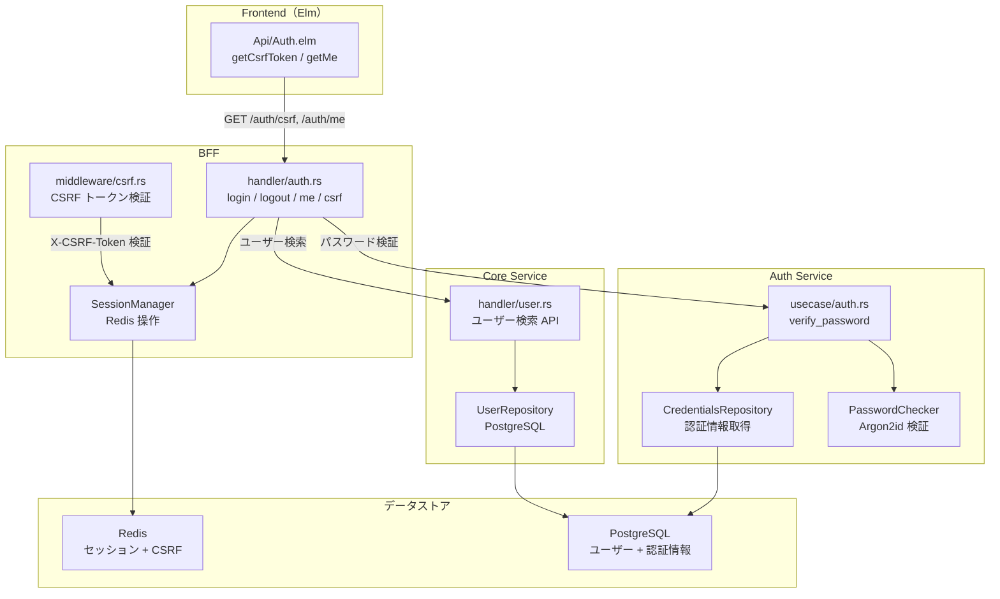
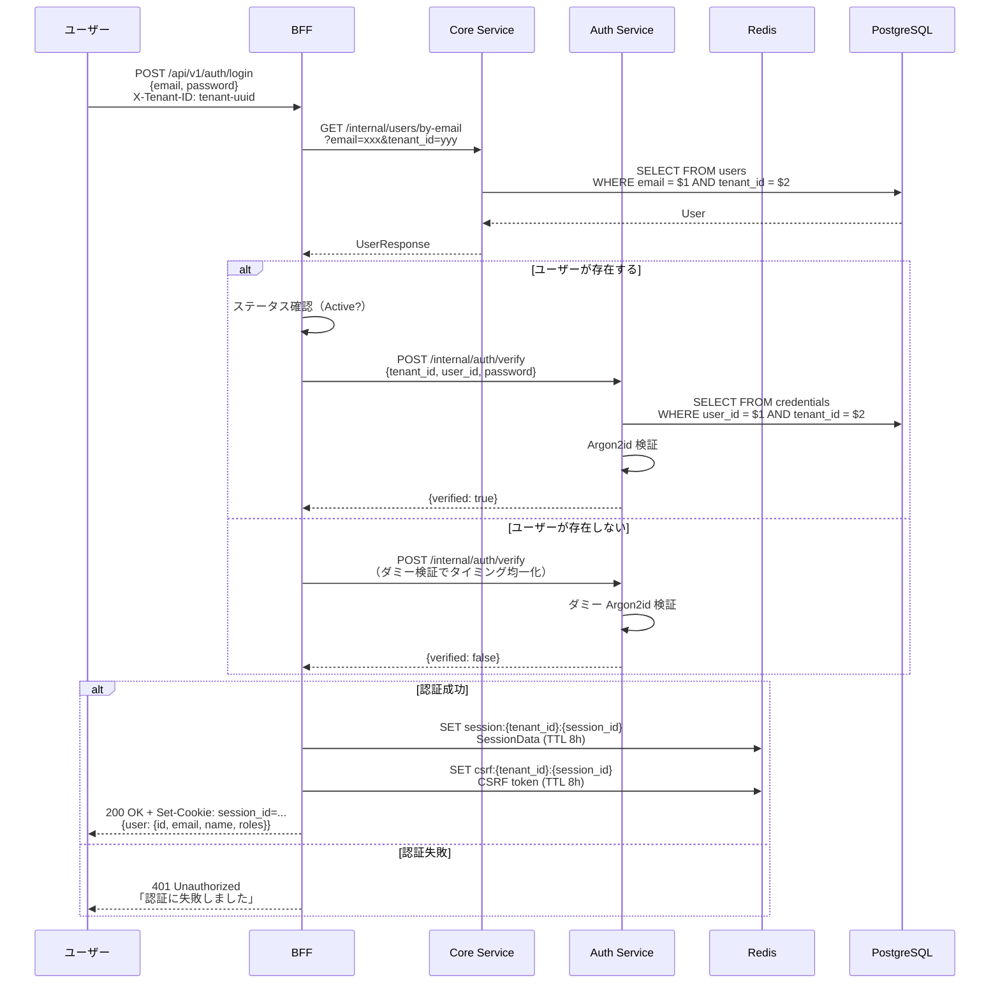
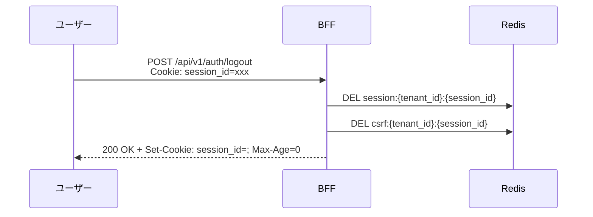
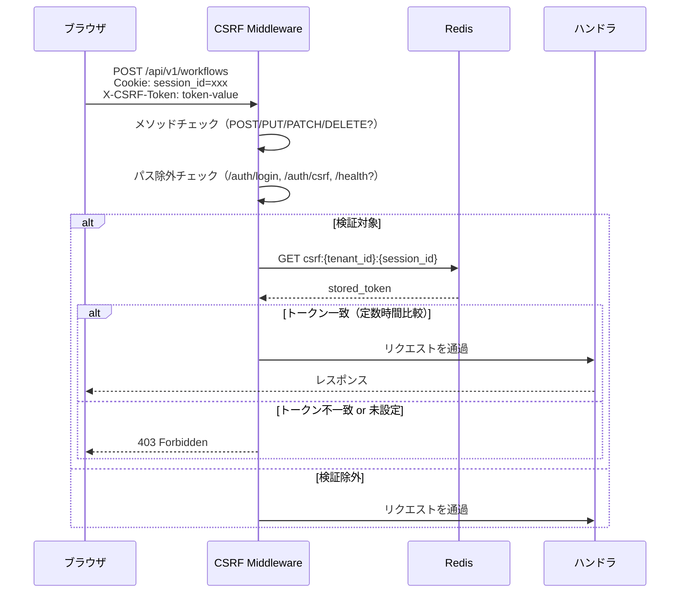
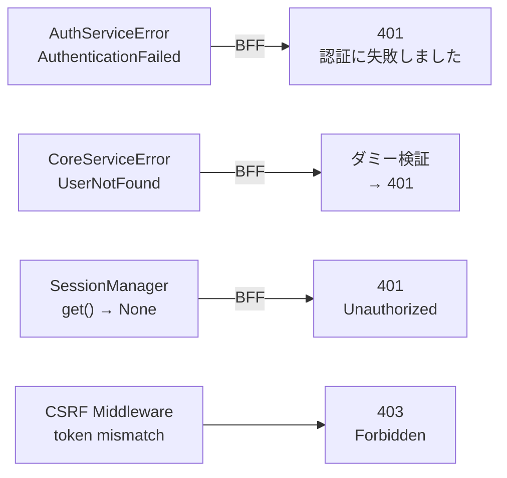

# 認証機能 - 機能解説

対応 PR: #46
対応 Issue: #34

## 概要

メールアドレスとパスワードによるユーザー認証機能。セッション管理（Redis）、CSRF 防御（Double Submit Cookie パターン）、タイミング攻撃対策を備えたフルスタック実装。

MVP では開発認証（`DevAuth`）でログイン UI を代替し、バックエンドの認証基盤を先行して構築している。

> ⚠️ PR #46 実装時点では認証ロジック（パスワード検証）は Core API（現 Core Service）に含まれていた。後続の PR #93/#97 で Auth Service として分離された。本ドキュメントは PR #46 の設計意図を基準に記述し、現在のコード配置を併記する。

## 背景

### セキュリティ要件

RingiFlow はマルチテナント環境で承認フロー・機密情報を扱う SaaS。要件定義書で定められた以下のセキュリティ要件を充足する必要がある。

| 要件 ID | 内容 |
|---------|------|
| AUTH-001 | パスワードは Argon2id でハッシュ化 |
| AUTH-002 | セッション Cookie に HttpOnly, Secure, SameSite 属性を設定 |
| AUTH-003 | CSRF 対策を実装 |
| AUTH-009 | アカウント無効化（退職/異動時の即時アクセス停止） |

### 設計書との対応

| 項目 | 内容 |
|------|------|
| 詳細設計書 | [`docs/40_詳細設計書/07_認証機能設計.md`](../../40_詳細設計書/07_認証機能設計.md) |
| OpenAPI 仕様書 | [`openapi/openapi.yaml`](../../../openapi/openapi.yaml) |

## 用語・概念

| 用語 | 説明 | 関連コード |
|------|------|-----------|
| Argon2id | OWASP 推奨のパスワードハッシュアルゴリズム（RFC 9106）。GPU 攻撃対策（Argon2d）とサイドチャネル攻撃対策（Argon2i）のハイブリッド | `Argon2PasswordChecker` |
| Double Submit Cookie | CSRF 対策パターン。サーバーが生成したトークンを Redis に保存し、クライアントは HTTP ヘッダーで送信。サーバーで一致を検証する | `csrf_middleware` |
| タイミング攻撃 | 処理時間の差異からシステムの内部状態（ユーザーの存在等）を推測する攻撃 | `dummy_verification()`, `ConstantTimeEq` |
| Newtype パターン | プリミティブ型を専用の型で包み、コンパイル時に型の取り違えを防止するパターン | `UserId`, `Email`, `PlainPassword` |
| Make Illegal States Unrepresentable | 不正な状態を型レベルで表現不可能にする設計原則 | `Email`, `PasswordVerifyResult` |

## フロー

PR #46 以前は認証基盤が未実装で、ハードコードされた開発用ユーザーで動作していた。本 PR でパスワード検証・セッション管理・CSRF 防御の認証基盤が構築された。

## アーキテクチャ

認証リクエストが全レイヤーを通過するフロー:

> 注: PR #46 時点では Auth Service は存在せず、パスワード検証は Core API 内の `AuthUseCase` が担当していた。PR #93/#97 で Auth Service に分離され、現在の構成になった。

## データフロー

### フロー 1: ログイン

#### 処理ステップ

| # | レイヤー | ファイル | 処理内容 |
|---|---------|---------|---------|
| 1 | BFF | `bff/handler/auth.rs:144` | `X-Tenant-ID` ヘッダーからテナント ID 抽出 |
| 2 | Core Service | ユーザー検索 API | メールアドレスでユーザー検索（テナント分離） |
| 3 | BFF | `bff/handler/auth.rs:144` | ステータス確認 + Auth Service にパスワード検証を委任 |
| 4 | Auth Service | `auth-service/usecase/auth.rs:54` | Argon2id によるパスワード検証 + タイミング攻撃対策 |
| 5 | BFF | `bff/handler/auth.rs:144` | Redis にセッション + CSRF トークン作成 |
| 6 | BFF | `bff/handler/auth.rs:412` | HttpOnly, SameSite=Lax の Cookie を設定して返却 |

### フロー 2: ログアウト

### フロー 3: CSRF 防御

## エラーハンドリング

### 認証エラーの単一化

セキュリティの観点から、認証失敗の詳細な理由は外部に公開しない。

| 内部的な原因 | 外部レスポンス | 内部ログ |
|-------------|--------------|---------|
| ユーザーが存在しない | 401「認証に失敗しました」 | `Authentication failed: user not found` |
| パスワード不一致 | 401「認証に失敗しました」 | `Authentication failed: invalid password` |
| アカウント無効 | 401「認証に失敗しました」 | `Authentication failed: user inactive` |
| セッション切れ | 401 Unauthorized | — |
| CSRF トークン不一致 | 403 Forbidden | `CSRF token mismatch` |

### エラー変換チェーン

## 設計判断

機能・仕組みレベルの判断を記載する。コード実装レベルの判断は[コード解説](./02_認証機能_コード解説.md#設計解説)を参照。

### 1. パスワードハッシュアルゴリズムをどうするか

パスワードの安全な保管方式の選定。

| 案 | セキュリティ | OWASP 推奨 | 耐攻撃性 |
|----|------------|-----------|---------|
| **Argon2id（採用）** | 最高 | 第一推奨 | GPU + サイドチャネル |
| bcrypt | 高 | 第二推奨 | GPU（サイドチャネルに弱い） |
| scrypt | 高 | 第三推奨 | GPU |
| PBKDF2 | 中 | レガシー | GPU に弱い |

採用理由: OWASP が第一推奨するアルゴリズム（RFC 9106）。Argon2d（GPU 攻撃対策）と Argon2i（サイドチャネル攻撃対策）のハイブリッドで、最も幅広い攻撃に対策できる。パラメータは OWASP 推奨値（Memory: 64MB, Iterations: 1, Parallelism: 1）を採用。

### 2. セッション管理をどのレイヤーで行うか

セッション管理の責務配置。

| 案 | 責務の明確さ | スケーラビリティ | セキュリティ |
|----|------------|----------------|------------|
| **BFF（採用）** | クライアント対向の関心事を集約 | Redis で水平拡張可能 | Cookie は BFF で完結 |
| Core Service | ビジネスロジックに認証関心が混在 | 同上 | Cookie 管理が複雑化 |
| 共有ミドルウェア | 責務が不明確 | 同上 | 設定が分散 |

採用理由: BFF パターンの責務分離原則に従い、クライアント対向の関心事（Cookie、セッション、CSRF）は BFF に集約。Core Service はビジネスロジックに専念する。

### 3. CSRF 対策パターンをどうするか

CSRF 防御の実装方式の選定。

| 案 | セキュリティ | 実装複雑度 | SPA 適合性 |
|----|------------|-----------|-----------|
| **Double Submit Cookie + サーバーサイド保存（採用）** | 最高（サーバーで検証） | 中 | 高（ヘッダー送信） |
| Double Submit Cookie（Cookie のみ） | 中（Cookie 改竄リスク） | 低 | 高 |
| Synchronizer Token（フォーム埋め込み） | 高 | 中 | 低（フォームベース） |
| SameSite Cookie のみ | 中（古いブラウザ未対応） | 最低 | — |

採用理由: トークンを Redis に保存してサーバーサイドで検証するため、Cookie 改竄攻撃に強い。SPA（Elm）では HTTP ヘッダー（`X-CSRF-Token`）でトークンを送信する方が自然。SameSite=Lax は補助対策として併用。

### 4. タイミング攻撃にどう対策するか

認証処理での時間差攻撃への対策方針。2箇所でそれぞれ異なる手法を適用。

| 対策箇所 | 攻撃シナリオ | 対策手法 |
|---------|------------|---------|
| **ユーザー存在確認** | 処理時間の差でユーザーの存在を推測 | ユーザー不在時にダミーの Argon2id 検証を実行して処理時間を均一化 |
| **CSRF トークン比較** | 比較時間の差でトークンの正しいプレフィックスを推測 | `subtle::ConstantTimeEq` による定数時間比較 |

ユーザー存在確認の対策が特に重要: Argon2id の検証は意図的に遅い（約 64ms）ため、ユーザーが存在しない場合にスキップすると顕著な時間差が生じる。

### 5. 認証失敗のエラーレスポンスをどう設計するか

認証エラーの粒度と外部への情報公開。

| 案 | セキュリティ | デバッグ性 |
|----|------------|----------|
| **単一エラー + 内部ログ（採用）** | 高（攻撃者に手がかりを与えない） | 内部ログで詳細を確認可能 |
| 詳細エラー（原因別メッセージ） | 低（メール列挙攻撃のリスク） | 高 |
| エラーコード（原因コード返却） | 中（コードから推測可能） | 中 |

採用理由: 「メールアドレスが存在しません」「パスワードが間違っています」といった詳細なエラーは、攻撃者にメール列挙（email enumeration）の手がかりを与える。外部には一律「認証に失敗しました」を返し、デバッグ情報は内部ログに記録する。

### 6. セッション ID の生成方式をどうするか

セッション ID に使用する UUID のバージョン選定。

| 案 | 推測困難性 | 時系列ソート |
|----|----------|------------|
| **UUID v4（採用）** | 高（完全ランダム） | 不可 |
| UUID v7 | 中（タイムスタンプ含む） | 可能 |

採用理由: セッション ID は Cookie を通じて外部に露出する値のため、推測困難性を最優先。UUID v7 はタイムスタンプから生成時刻が推測でき、攻撃者にヒントを与えうる。エンティティ ID（ソート必要 → UUID v7）とセッション ID（セキュリティ優先 → UUID v4）で使い分ける。

## 関連ドキュメント

- [コード解説](./02_認証機能_コード解説.md)
- [詳細設計書: 認証機能設計](../../40_詳細設計書/07_認証機能設計.md)
- [ナレッジベース: パスワードハッシュ](../../80_ナレッジベース/security/パスワードハッシュ.md)
- [ナレッジベース: CSRF](../../80_ナレッジベース/security/CSRF.md)
- [ナレッジベース: Redis](../../80_ナレッジベース/infra/Redis.md)
- [ナレッジベース: BFF パターン](../../80_ナレッジベース/architecture/BFFパターン.md)
