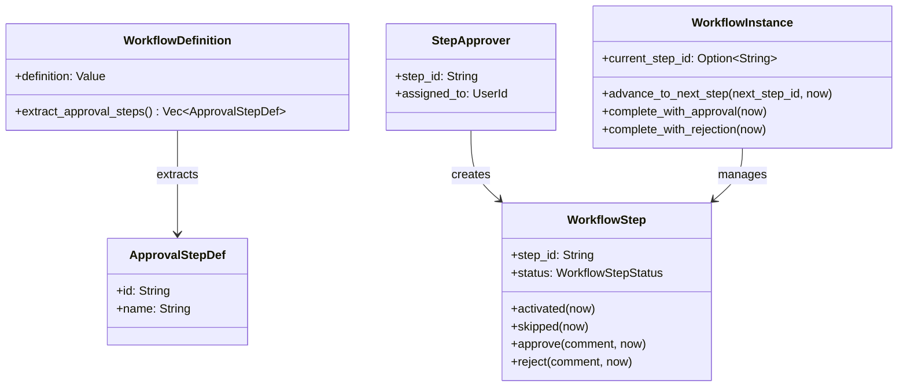
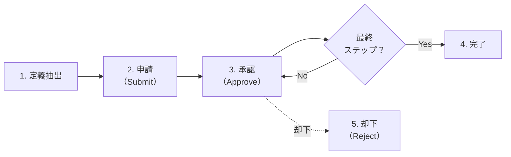
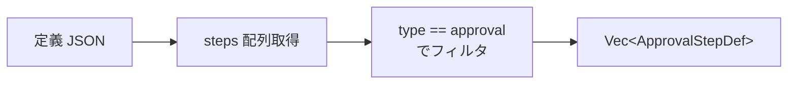
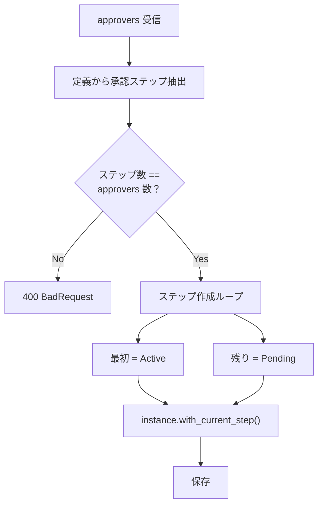
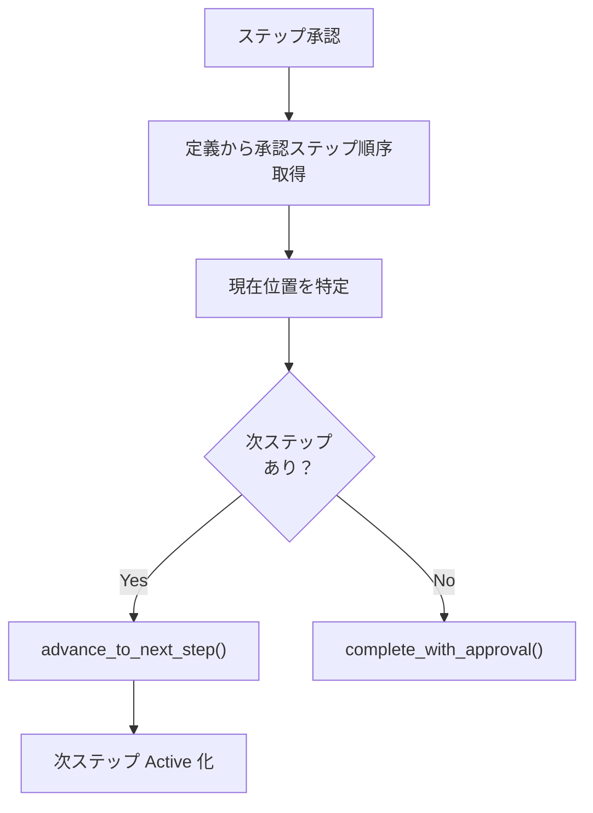
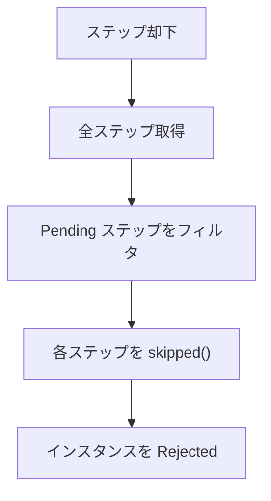
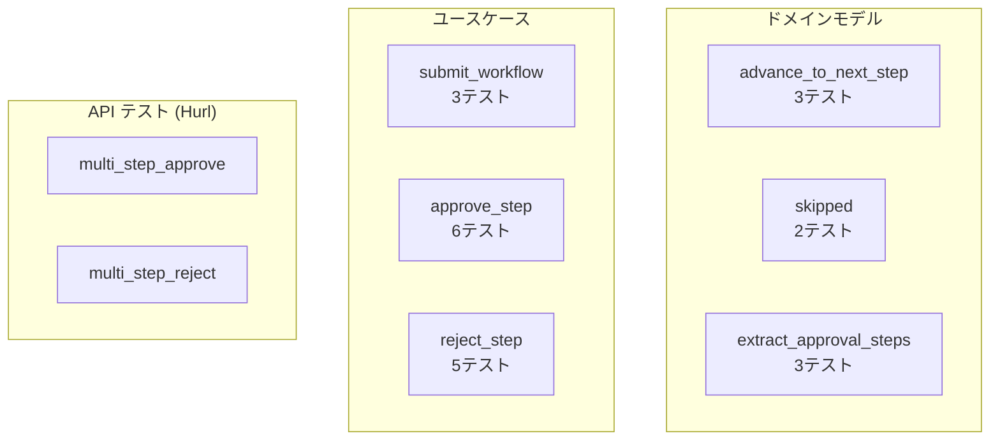

# 多段階承認 - コード解説

対応 PR: #479
対応 Issue: #475

## 主要な型・関数

| 型/関数 | ファイル | 責務 |
|--------|---------|------|
| `ApprovalStepDef` | `domain/workflow/definition.rs:235` | 定義 JSON から抽出した承認ステップ情報 |
| `extract_approval_steps()` | `domain/workflow/definition.rs:253` | 定義 JSON から承認ステップを順序付きで抽出 |
| `advance_to_next_step()` | `domain/workflow/instance.rs:343` | current_step_id を次ステップに更新 |
| `skipped()` | `domain/workflow/step.rs:317` | Pending → Skipped 遷移 |
| `StepApprover` | `usecase/workflow.rs:50` | 申請時のステップ-承認者ペア |
| `SubmitWorkflowInput` | `usecase/workflow.rs:59` | Submit ユースケースの入力（approvers 配列） |
| `submit_workflow()` | `usecase/workflow/command.rs:115` | 複数ステップ作成とインスタンス遷移 |
| `approve_step()` | `usecase/workflow/command.rs:250` | 承認 + 次ステップ遷移 or 完了 |
| `reject_step()` | `usecase/workflow/command.rs:411` | 却下 + 残ステップスキップ |

### 型の関係



## コードフロー

コードをライフサイクル順に追う。各ステップの構造を図で示した後、対応するコードを解説する。



### 1. 定義 JSON からの承認ステップ抽出（定義登録時に使用）

定義 JSON の `steps` 配列から `type == "approval"` のステップを配列順で抽出する。



```rust
// domain/workflow/definition.rs:253-286
fn extract_approval_steps(definition: &serde_json::Value) -> Result<Vec<ApprovalStepDef>, DomainError> {
    let steps = definition
        .get("steps")                                    // ① steps 配列を取得
        .and_then(|v| v.as_array())
        .ok_or_else(|| DomainError::InvalidState(/* ... */))?;

    let approval_steps: Vec<ApprovalStepDef> = steps
        .iter()
        .filter(|step| {                                 // ② type == "approval" でフィルタ
            step.get("type")
                .and_then(|v| v.as_str())
                .is_some_and(|t| t == "approval")
        })
        .map(|step| {                                    // ③ id と name を抽出
            let id = step.get("id").and_then(|v| v.as_str()).unwrap_or("").to_string();
            let name = step.get("name").and_then(|v| v.as_str()).unwrap_or("").to_string();
            ApprovalStepDef { id, name }
        })
        .collect();

    if approval_steps.is_empty() {                       // ④ 承認ステップなしはエラー
        return Err(DomainError::InvalidState(/* ... */));
    }
    Ok(approval_steps)
}
```

注目ポイント:

- ① `serde_json::Value` から `get("steps")` でアクセス。型安全ではないが、定義 JSON は外部入力なので柔軟に扱う
- ② `is_some_and` で Option チェーンを簡潔に記述（Rust 1.70+ のイディオム）
- ③ 配列の順序がそのまま承認順序になる。`transitions` は使用しない
- ④ 承認ステップが0件は定義のバリデーションエラー

### 2. 申請（Submit）— 複数ステップ作成

申請時に定義から承認ステップを抽出し、各ステップに承認者を割り当ててインスタンスを遷移する。



```rust
// usecase/workflow/command.rs:151-194
// approvers と定義ステップの一致検証
if input.approvers.len() != approval_step_defs.len() {
    return Err(CoreError::BadRequest(format!(                // ① 数の不一致はエラー
        "承認ステップ数が一致しません: 定義={}, 指定={}",
        approval_step_defs.len(),
        input.approvers.len()
    )));
}
for (approver, def) in input.approvers.iter().zip(approval_step_defs.iter()) {
    if approver.step_id != def.id {                          // ② step_id の順序も検証
        return Err(CoreError::BadRequest(format!(/* ... */)));
    }
}

// ステップ作成
let mut new_steps = Vec::new();
for (i, (approver, def)) in input.approvers.iter().zip(approval_step_defs.iter()).enumerate() {
    let status = if i == 0 {
        WorkflowStepStatus::Active                           // ③ 最初のステップは Active
    } else {
        WorkflowStepStatus::Pending                          // ④ 残りは Pending
    };
    // ... NewWorkflowStep 構築
}
```

注目ポイント:

- ① approvers のサイズと定義のステップ数が一致しない場合は 400 エラー
- ② `zip` で順序付きで対応を検証。step_id が定義順と一致しない場合もエラー
- ③ 最初のステップのみ Active で作成。これが承認待ちの状態
- ④ 2番目以降は Pending。前のステップが承認されるまで処理されない

### 3. 承認（Approve）— 次ステップ遷移の分岐

承認処理の核心は「次ステップがあるか」の分岐。定義から承認ステップ順序を取得し、現在位置から次を特定する。



```rust
// usecase/workflow/command.rs:305-329
let approval_step_defs = definition
    .extract_approval_steps()                                // ① 定義から承認ステップ抽出
    .map_err(|e| CoreError::Internal(e.to_string()))?;

let current_pos = approval_step_defs
    .iter()
    .position(|d| d.id == step.step_id())                    // ② 現在のステップの位置を特定
    .ok_or_else(|| CoreError::Internal(/* ... */))?;

let next_step_def = approval_step_defs.get(current_pos + 1); // ③ 次のステップを取得

let (updated_instance, next_step_to_activate) = if let Some(next_def) = next_step_def {
    let advanced = instance
        .advance_to_next_step(next_def.id.clone(), now)      // ④ 中間: current_step_id 更新
        .map_err(|e| CoreError::BadRequest(e.to_string()))?;
    (advanced, Some(next_def.id.clone()))
} else {
    let completed = instance
        .complete_with_approval(now)                          // ⑤ 最終: Approved に遷移
        .map_err(|e| CoreError::BadRequest(e.to_string()))?;
    (completed, None)
};
```

注目ポイント:

- ① 承認のたびに定義を取得して順序を再計算。キャッシュは不要（DB 読み取りコストは許容範囲）
- ② `position()` で Vec 内の現在位置を O(n) で検索。承認ステップ数は少数（2〜3）なので問題なし
- ③ `get(current_pos + 1)` で次ステップを安全に取得。範囲外なら `None`（最終ステップ）
- ④ 中間ステップ: `advance_to_next_step` で `current_step_id` と `version` を更新
- ⑤ 最終ステップ: `complete_with_approval` で Approved + `completed_at` 設定

次ステップの Active 化:

```rust
// usecase/workflow/command.rs:343-366
if let Some(next_step_id) = &next_step_to_activate {
    let next_steps = self.step_repo
        .find_by_instance(instance_id, &tenant_id).await?;
    let next_step = next_steps
        .into_iter()
        .find(|s| s.step_id() == next_step_id)               // ① step_id で次ステップを検索
        .ok_or_else(|| CoreError::Internal(/* ... */))?;
    let activated_step = next_step
        .activated(now)                                       // ② Pending → Active
        .map_err(|e| CoreError::Internal(e.to_string()))?;
    self.step_repo
        .save_with_version_check(&activated_step, &tenant_id) // ③ 楽観的ロックで保存
        .await
        .map_err(/* ... */)?;
}
```

### 4. 却下（Reject）— 残ステップスキップ

却下時は現在のステップを Rejected にした後、残りの Pending ステップを全て Skipped に遷移する。



```rust
// usecase/workflow/command.rs:459-484
let all_steps = self
    .step_repo
    .find_by_instance(instance_id, &tenant_id)
    .await
    .map_err(/* ... */)?;

// 残りの Pending ステップを Skipped に遷移
let pending_steps: Vec<_> = all_steps
    .into_iter()
    .filter(|s| s.status() == &WorkflowStepStatus::Pending)  // ① Pending のみフィルタ
    .collect();

for pending_step in pending_steps {
    let skipped_step = pending_step
        .skipped(now)                                         // ② Pending → Skipped
        .map_err(|e| CoreError::Internal(e.to_string()))?;
    self.step_repo
        .save_with_version_check(&skipped_step, &tenant_id)  // ③ 各ステップを保存
        .await
        .map_err(/* ... */)?;
}
```

注目ポイント:

- ① 却下されたステップは既に Completed（reject 済み）なのでフィルタで除外される
- ② `skipped()` は Pending 以外の状態で呼ぶとエラー。ドメインモデルのガードが安全性を保証
- ③ 各ステップを個別に `save_with_version_check` で保存。トランザクション管理はリポジトリ層

### 5. ドメインモデルの状態遷移メソッド

#### advance_to_next_step

```rust
// domain/workflow/instance.rs:343-361
pub fn advance_to_next_step(
    self,
    next_step_id: String,
    now: DateTime<Utc>,
) -> Result<Self, DomainError> {
    if self.status != WorkflowInstanceStatus::InProgress {     // ① 状態ガード
        return Err(DomainError::InvalidState(/* ... */));
    }
    Ok(Self {
        current_step_id: Some(next_step_id),                   // ② current_step_id を更新
        version: self.version.increment(),                     // ③ 楽観的ロック用バージョンアップ
        updated_at: now,
        ..self
    })
}
```

#### skipped

```rust
// domain/workflow/step.rs:317-330
pub fn skipped(self, now: DateTime<Utc>) -> Result<Self, DomainError> {
    if self.status != WorkflowStepStatus::Pending {            // ① Pending 以外はエラー
        return Err(DomainError::InvalidState(/* ... */));
    }
    Ok(Self {
        status: WorkflowStepStatus::Skipped,                   // ② Skipped に遷移
        updated_at: now,
        ..self
    })
}
```

## テスト

各テストがライフサイクルのどのステップを検証しているかを示す。



| テスト | 検証対象 | 検証内容 |
|-------|---------|---------|
| `test_extract_approval_steps_承認ステップを順序付きで抽出` | 定義抽出 | approval タイプのみ順序通り抽出 |
| `test_extract_approval_steps_承認ステップなしでエラー` | 定義抽出 | 空の場合にエラー |
| `test_advance_to_next_step_正常系` | インスタンス遷移 | current_step_id 更新 + version インクリメント |
| `test_skipped_pending状態からskippedに遷移` | ステップ遷移 | Pending → Skipped |
| `test_submit_workflow_2段階承認の正常系` | Submit | 2ステップ作成（Active + Pending） |
| `test_approve_step_中間ステップ_次のステップがactiveになる` | Approve (中間) | 次ステップ Active 化、InProgress 維持 |
| `test_approve_step_最終ステップ_インスタンスがapprovedになる` | Approve (最終) | Approved 遷移 |
| `test_reject_step_中間ステップ_残りのpendingステップがskippedになる` | Reject (中間) | 残ステップ Skipped |
| `multi_step_approve.hurl` | E2E | 作成→申請→ステップ1承認→ステップ2承認→Approved |
| `multi_step_reject.hurl` | E2E | 作成→申請→ステップ1承認→ステップ2却下→Rejected |

### 実行方法

```bash
# ドメインモデルのテスト
cd backend && cargo test --package ringiflow-domain extract_approval_steps
cd backend && cargo test --package ringiflow-domain advance_to_next_step
cd backend && cargo test --package ringiflow-domain test_skipped

# ユースケースのテスト
cd backend && cargo test --package ringiflow-core-service 中間ステップ
cd backend && cargo test --package ringiflow-core-service 最終ステップ

# API テスト（サーバー起動が必要）
just test-api
```

## マイグレーション

### 2段階承認ワークフロー定義のシードデータ

ファイル: `backend/migrations/20260212000001_seed_multi_step_workflow_definition.sql`

```sql
INSERT INTO workflow_definitions (id, tenant_id, name, description, version, definition, status, created_by)
VALUES ('00000000-0000-0000-0000-000000000002', ...);
```

定義 JSON の構造:

```json
{
  "steps": [
    {"id": "start", "type": "start", "name": "開始"},
    {"id": "manager_approval", "type": "approval", "name": "上長承認"},
    {"id": "finance_approval", "type": "approval", "name": "経理承認"},
    {"id": "end_approved", "type": "end", "name": "承認完了"},
    {"id": "end_rejected", "type": "end", "name": "却下"}
  ],
  "transitions": [...]
}
```

`extract_approval_steps()` により `manager_approval` → `finance_approval` の順で抽出される。

## 設計解説

コード実装レベルの判断を記載する。機能・仕組みレベルの判断は[機能解説](./01_多段階承認_機能解説.md#設計判断)を参照。

### 1. 承認時の定義再取得

場所: `usecase/workflow/command.rs:297`

```rust
let definition = self.definition_repo.find_by_id(/* ... */).await?;
let approval_step_defs = definition.extract_approval_steps()?;
```

なぜこの実装か:
承認のたびに定義から承認ステップ順序を再計算する。インスタンスに順序情報を永続化するのではなく、定義を信頼する設計。

代替案:

| 案 | メリット | デメリット | 判断 |
|----|---------|-----------|------|
| 定義を毎回取得して計算（採用） | Single Source of Truth | 毎回 DB 読み取り | 採用 |
| インスタンスに next_step_id を保存 | 読み取り不要 | 定義変更時の不整合リスク | 見送り |
| メモリキャッシュ | 高速 | キャッシュ無効化の複雑さ | 見送り |

承認ステップ数は少数（2〜3）であり、DB 読み取りコストは許容範囲。

### 2. エラーチェックの配置順序

場所: `usecase/workflow/command.rs:257-285`

```rust
// 1. ステップ取得 + assigned_to チェック（403）
// 2. バージョンチェック（409）
// 3. ステップ承認
// 4. 定義取得 + 次ステップ判定
```

なぜこの実装か:
定義取得（4）を承認処理（3）の後に配置している。これにより、権限チェック（403）やバージョンチェック（409）のエラーパステストが定義の Mock setup を不要にできる。

### 3. skipped() の version 非インクリメント

場所: `domain/workflow/step.rs:317-330`

```rust
pub fn skipped(self, now: DateTime<Utc>) -> Result<Self, DomainError> {
    // version は据え置き
    Ok(Self {
        status: WorkflowStepStatus::Skipped,
        updated_at: now,
        ..self
    })
}
```

なぜこの実装か:
`skipped()` はシステム内部の一括処理であり、楽観的ロックの対象外。ユーザー操作（approve, reject）のみ version をインクリメントする。

## 関連ドキュメント

- [機能解説](./01_多段階承認_機能解説.md)
- [機能仕様書: ワークフロー管理](../../../docs/20_機能仕様書/01_ワークフロー管理.md)
- [計画ファイル](../../../prompts/plans/475_multi-step-approval-backend.md)
