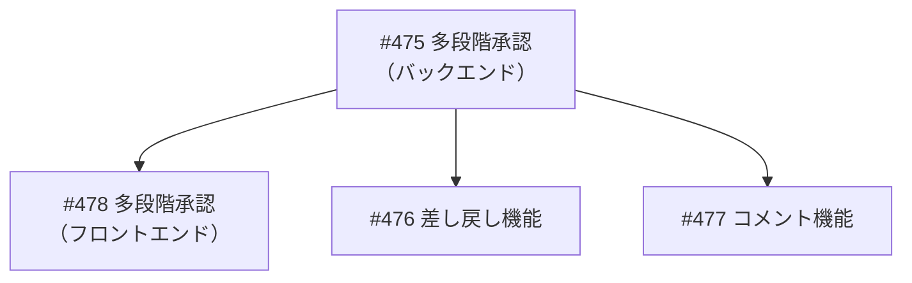
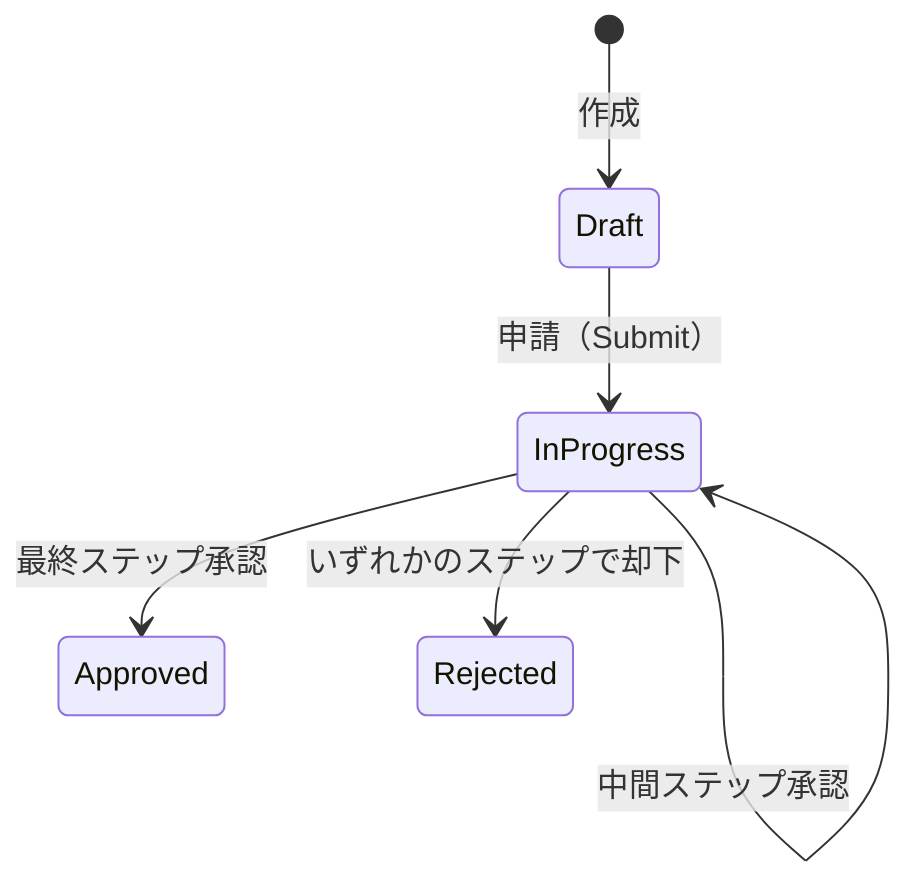
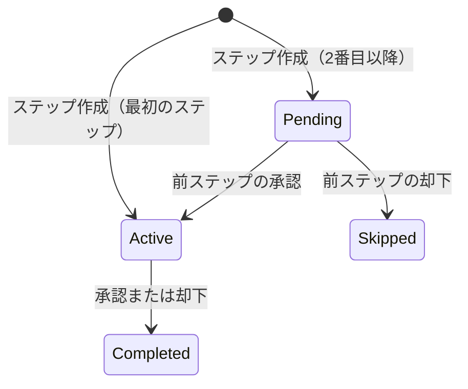
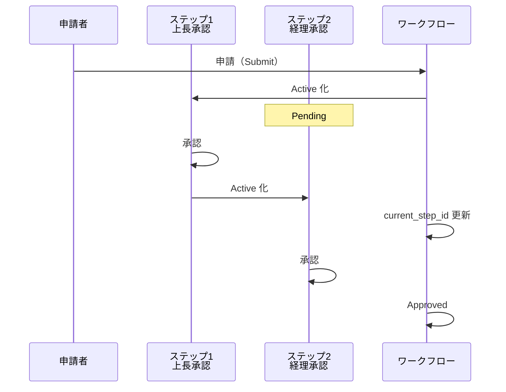
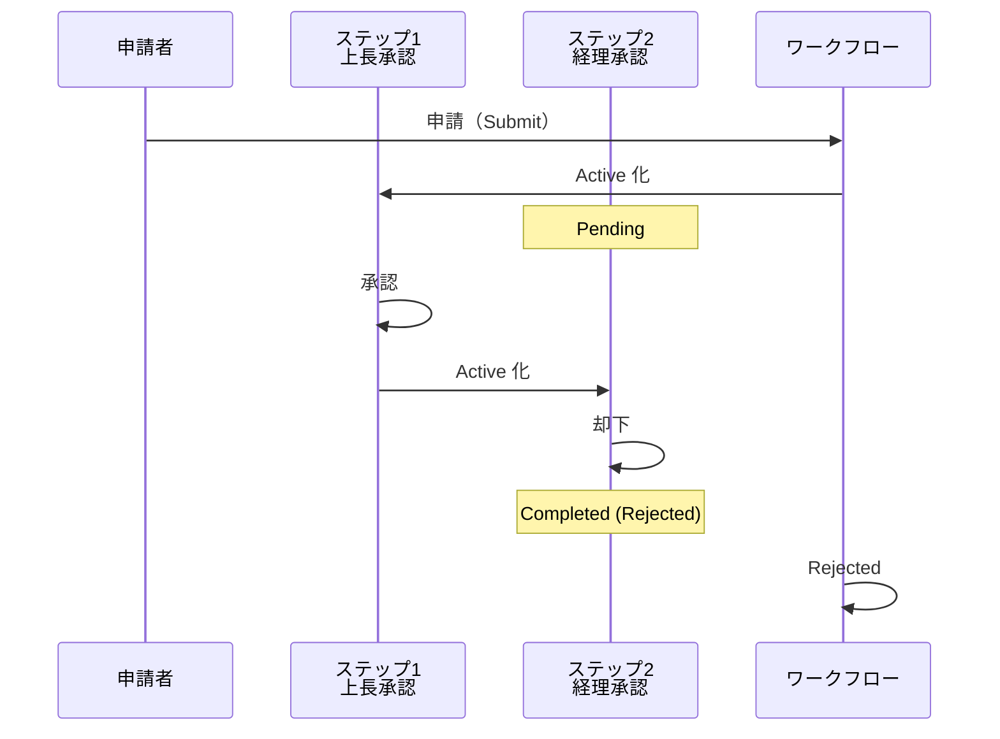
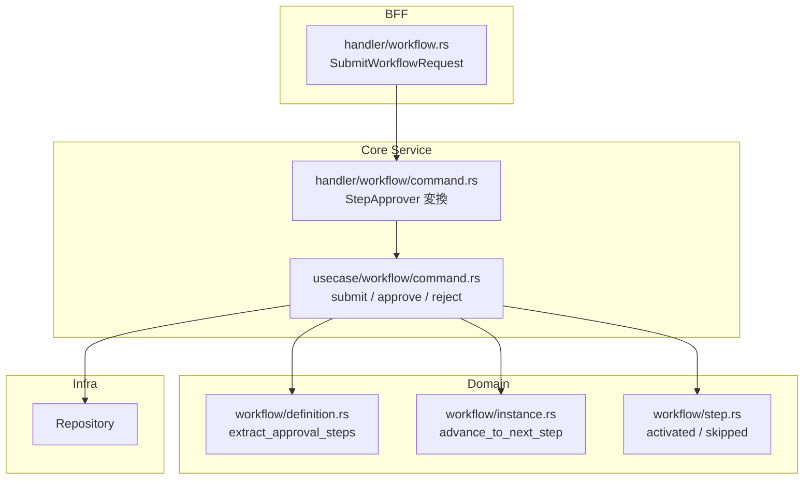
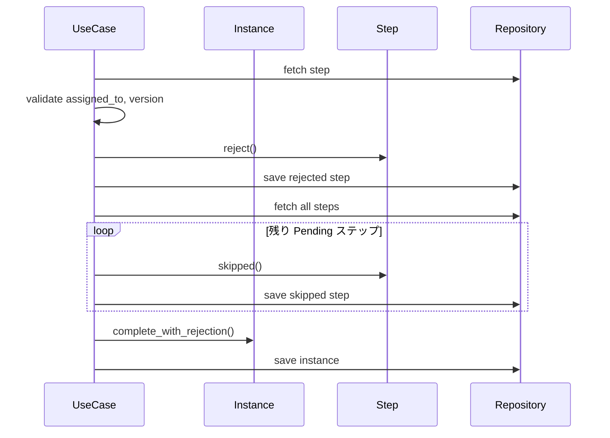

# 多段階承認 - 機能解説

対応 PR: #479
対応 Issue: #475

## 概要

ワークフローの承認を1段階から複数段階（2〜3段階）の順次承認に拡張した。定義 JSON に複数の承認ステップを持ち、各ステップが順番に Active 化されて承認・却下が行われる。

## 背景

### Phase 1 の1段階承認

Phase 1 では、ワークフローの承認は1ステップ固定で実装されていた。Submit 時に `assigned_to` で1人の承認者を指定し、その1人が承認または却下するとワークフロー全体が完了する仕組み。

### 多段階承認の必要性

実際の業務ワークフローでは「上長承認 → 経理承認」のように複数の承認者が順番に承認する運用が一般的。ワークフロー定義 JSON には既に複数の承認ステップを記述できる構造があったが、実行エンジンが1ステップ前提だった。

### Epic #404 の中での位置づけ



| Issue | 内容 | 状態 |
|-------|------|------|
| #475 | 多段階承認バックエンド | 本 PR |
| #478 | 多段階承認フロントエンド | 未着手 |
| #476 | 差し戻し機能 | 未着手 |
| #477 | コメント機能 | 未着手 |

## 用語・概念

| 用語 | 説明 | 関連コード |
|------|------|-----------|
| 承認ステップ (Approval Step) | 定義 JSON で `type: "approval"` のステップ。承認者が割り当てられ、承認/却下を行う | `ApprovalStepDef` |
| 中間ステップ | 最終ステップではない承認ステップ。承認後、次のステップが Active 化される | `approve_step` 内の分岐 |
| 最終ステップ | 承認ステップの最後。承認するとワークフロー全体が Approved になる | `complete_with_approval` |
| current_step_id | 現在アクティブなステップの定義 ID。承認のたびに次のステップ ID に更新される | `WorkflowInstance.current_step_id` |
| Skipped | 却下により処理されなかったステップの状態 | `WorkflowStepStatus::Skipped` |

## 状態遷移

### WorkflowInstance



### WorkflowStep



## フロー

### 2段階承認の全体フロー



### 2段階却下のフロー



中間ステップでの却下の場合は、残りの Pending ステップが全て Skipped に遷移する。

## アーキテクチャ



## データフロー

### フロー 1: 申請（Submit）

```mermaid
sequenceDiagram
    participant BFF as BFF
    participant Core as Core Handler
    participant UC as UseCase
    participant Def as Definition
    participant Repo as Repository

    BFF->>Core: POST /submit {approvers}
    Core->>UC: submit_workflow(input)
    UC->>Repo: fetch instance (Draft)
    UC->>Repo: fetch definition
    UC->>Def: extract_approval_steps()
    Def-->>UC: Vec&lt;ApprovalStepDef&gt;
    UC->>UC: validate approvers ↔ steps
    UC->>UC: create steps (Active + Pending)
    UC->>UC: instance.with_current_step()
    UC->>Repo: save instance + steps
    UC-->>Core: WorkflowInstance
```

#### 処理ステップ

| # | レイヤー | ファイル:関数 | 処理内容 |
|---|---------|-------------|---------|
| 1 | UseCase | `command.rs:121` | インスタンス取得、Draft 検証 |
| 2 | UseCase | `command.rs:138` | ワークフロー定義取得 |
| 3 | Domain | `definition.rs:253` | 定義 JSON から承認ステップ抽出 |
| 4 | UseCase | `command.rs:151` | approvers と定義ステップの一致検証 |
| 5 | UseCase | `command.rs:169` | ステップ作成（最初=Active, 残り=Pending） |
| 6 | Domain | `instance.rs:325` | `with_current_step` で InProgress 遷移 |
| 7 | Infra | `command.rs:207` | インスタンス・ステップ保存 |

### フロー 2: 承認（Approve）

```mermaid
sequenceDiagram
    participant UC as UseCase
    participant Def as Definition
    participant Inst as Instance
    participant Step as Step
    participant Repo as Repository

    UC->>Repo: fetch step
    UC->>UC: validate assigned_to, version
    UC->>Step: approve()
    UC->>Repo: fetch instance
    UC->>Repo: fetch definition
    UC->>Def: extract_approval_steps()
    Def-->>UC: Vec&lt;ApprovalStepDef&gt;
    UC->>UC: find current position
    alt 次ステップあり（中間）
        UC->>Inst: advance_to_next_step()
        UC->>Repo: fetch next step
        UC->>Step: activated()
        UC->>Repo: save next step
    else 次ステップなし（最終）
        UC->>Inst: complete_with_approval()
    end
    UC->>Repo: save step + instance
```

### フロー 3: 却下（Reject）



## 設計判断

機能・仕組みレベルの判断を記載する。コード実装レベルの判断は[コード解説](./01_多段階承認_コード解説.md#設計解説)を参照。

### 1. 承認ステップの順序をどう決定するか

定義 JSON には `steps` 配列と `transitions` オブジェクトの両方がある。どちらを順序決定に使うかの判断が必要だった。

| 案 | シンプルさ | 拡張性 | 実装コスト |
|----|----------|--------|-----------|
| **`steps` 配列の順序（採用）** | 高い | 順次承認のみ | 低い |
| `transitions` のグラフ走査 | 低い | 条件分岐・並列対応 | 高い |

**採用理由**: 順次承認では配列順で十分。条件分岐や並列承認は Phase 3 で `transitions` を活用する設計とし、YAGNI に従い現時点では配列順を採用。

### 2. Submit API の互換性をどう扱うか

旧 API（`assigned_to: Uuid`）から新 API（`approvers: Vec<StepApprover>`）への移行方式。

| 案 | 後方互換 | API の明確さ | 実装コスト |
|----|---------|-------------|-----------|
| **新形式のみ（採用）** | なし | 高い | 低い |
| 旧形式を新形式にフォールバック | あり | 低い | 中 |
| 両方受け付ける Union 型 | あり | 低い | 高い |

**採用理由**: フロントエンドは Story #478 で対応予定であり、後方互換のための複雑さを持ち込む必要がない。1段階承認も `approvers: [{ step_id: "approval", assigned_to: "..." }]` で表現可能。

### 3. 却下時に残りステップをどう扱うか

| 案 | データの明確さ | クエリの容易さ | 実装コスト |
|----|-------------|-------------|-----------|
| **Skipped に遷移（採用）** | 高い（明示的） | 容易 | 低い |
| 削除する | 中（データ消失） | — | 低い |
| Pending のまま放置 | 低い（曖昧） | 困難 | 最小 |

**採用理由**: Skipped 状態により「処理されなかったステップ」が明示的に記録される。監査ログや状態表示で有用。

## 関連ドキュメント

- [コード解説](./01_多段階承認_コード解説.md)
- [機能仕様書: ワークフロー管理](../../../docs/20_機能仕様書/01_ワークフロー管理.md)
- [計画ファイル](../../../prompts/plans/475_multi-step-approval-backend.md)
